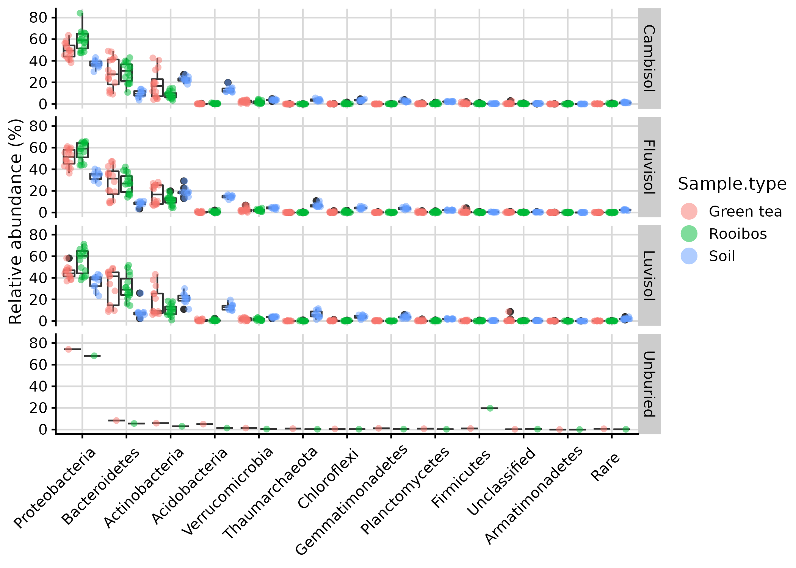

TeaTime4schools: joint analysis - bacteria
================
Roey Angel
2021-05-21

-   [Taxonomical analysis](#taxonomical-analysis)
    -   [Setting general parameters:](#setting-general-parameters)
    -   [Reading in raw data](#reading-in-raw-data)
    -   [Exploring Ps\_obj dataset
        features](#exploring-ps_obj-dataset-features)
        -   [Taxa-based filtering](#taxa-based-filtering)
    -   [General taxonomic features](#general-taxonomic-features)
        -   [Explore abundance distribution of specific
            taxa](#explore-abundance-distribution-of-specific-taxa)
    -   [Taxa violin plots](#taxa-violin-plots)
    -   [Taxa box-plot](#taxa-box-plot)
        -   [Make Krona plots](#make-krona-plots)
        -   [Save filtered phyloseq
            object](#save-filtered-phyloseq-object)
-   [References](#references)

[roey.angel@bc.cas.cz](mailto:%20roey.angel@bc.cas.cz)

## Taxonomical analysis

This analysis explores the taxonomical distribution patters in the
different samples, based on the DADA2-produced sequences. Large parts of
this script are based on [this
protocol](https://f1000research.com/articles/5-1492/v2) and the
accompanying publication by Callahan and colleagues
([2016](#ref-callahan_bioconductor_2016)).

### Setting general parameters:

``` r
set.seed(1000)
min_lib_size <- 5000
metadata_path <- "./"
data_path <- "./DADA2_pseudo/"
Metadata_table <- "TeaTime_joint_Bacteria_metadata.csv"
Seq_table <- "DADA2.seqtab_nochim.tsv"
Tax_table <- "DADA2.taxa_silva.tsv"
Proj_name <- "TeaTime4Schools"
```

### Reading in raw data

Read abundance table, taxonomic classification and metadata into a
phyloseq object. Also remove sequences detected as contaminants in
[03\_Decontamination.html](03_Decontamination.html).

``` r
# read OTU mat from data file
Raw_data <- read_tsv(paste0(data_path, Seq_table), 
                        trim_ws = TRUE)
contaminant_seqs <- read_csv(paste0(data_path, "decontam_contaminants.csv"), 
                        trim_ws = TRUE,
                        col_names = FALSE)

Raw_data %<>% # remove contaminant OTUs. 
  # .[, -grep("CTRL", colnames(.))] %>% # remove ext. cont. 
  .[!(Raw_data$`#OTU` %in% contaminant_seqs$X1), ] 

Raw_data[, 2:ncol(Raw_data)] %>% 
  t() %>% 
  as.data.frame() -> abundance_mat # convert to abundance matrix
colnames(abundance_mat) <- pull(Raw_data, "#OTU") # add sequence names

# Read metadata file
read_csv(paste0(metadata_path, Metadata_table),
         trim_ws = TRUE) %>%
  mutate_at(
    c(
      "Workshop",
      "Season",
      "Run",
      "Type",
      "Sample type",
      "Field",
      "Replicate",
      "Control",
      "Gene"
    ),
    ~factor(.)
  ) %>% 
  mutate_at(c("Extr. Date", "PCR products_16S_send for seq"), ~as.Date(., "%d.%m.%Y")) ->
  Metadata
Metadata$Season %<>% fct_relevel("Winter", "Spring", "Summer", "Autumn")
Metadata$Read1_file <- str_replace(Metadata$Read1_file, "(.*)_L001_R1_001.fastq.gz|\\.1\\.fastq.gz", "\\1")
Metadata <- Metadata[Metadata$Read1_file %in% rownames(abundance_mat), ] # remove metadata rows if the samples did not go through qual processing

# Order abundance_mat samples according to the metadata
sample_order <- match(rownames(abundance_mat), Metadata$Read1_file)
abundance_mat %<>% 
  rownames_to_column('sample_name') %>% 
  arrange(., sample_order) %>% 
  column_to_rownames('sample_name') # needed for phyloseq

Metadata$Library.size <- rowSums(abundance_mat)
Metadata <- data.frame(row.names = Metadata$Read1_file, Metadata)

# read taxonomy from data file
Raw_tax_data <- read_tsv(paste0(data_path, Tax_table), 
                        trim_ws = TRUE, col_names = TRUE)
Raw_tax_data %<>%
  .[!(Raw_tax_data$`Seq#` %in% contaminant_seqs$X1),] %>% # remove contaminant OTUs.
  mutate_all(funs(replace(., is.na(.), "Unclassified"))) # I think mutaute_all is unnecessary here because replace(., is.na(.), "Unclassified") alone should work

Raw_tax_data %>%
  select(.,
         Kingdom = V8,
         Phylum = V9,
         Class = V10,
         Order = V11,
         Family = V12,
         Genus = V13) %>%
  cbind(Name = colnames(abundance_mat),. ) ->
  Taxonomy.bs

Raw_tax_data %>%
  select(.,
         Kingdom,
         Phylum,
         Class,
         Order,
         Family,
         Genus)  %>% 
  # map_dfr(~str_remove_all(., "^.__")) %>% # remove "k__" prefixes 
  add_column(Seq = colnames(abundance_mat)) %>% 
  column_to_rownames("Seq") %>% 
  set_colnames(c("Domain", "Phylum", "Class", "Order", "Family", "Genus")) %>% 
  as.matrix() -> # because tax_table() needs a matrix for retaining row.names
  Taxonomy

# generate phyloseq object
Ps_obj <- phyloseq(otu_table(abundance_mat, taxa_are_rows = FALSE),
                        tax_table(Taxonomy),
                        sample_data(Metadata)
                        )
Ps_obj <- filter_taxa(Ps_obj, function(x) sum(x) > 0, TRUE) # remove 0 abundance taxa
Ps_obj <- subset_samples(Ps_obj, sample_sums(Ps_obj) > 0) # remove 0 abundance samples
# Remove mock and control samples
Ps_obj <- subset_samples(Ps_obj, Type != "Control" & Type != "Mock")

# Create a grouping variable for merging
sample_data(Ps_obj) %<>% 
  as(., "data.frame") %>% 
  # get_variable(., c("Sample.type", "Field", "Season", "Replicate")) %>% 
  unite(., "Description", c("Sample.type", "Field", "Season", "Replicate"), remove = FALSE)
sample_data(Ps_obj)$Description %<>% as_factor(.)

# merged_Ps_obj <- merge_samples(Ps_obj, "Description")
# merged_SD <- merge_samples(sample_data(Ps_obj), "Description")
Ps_obj_merged <- MergeSamples(Ps_obj, grouping_name = "Description")
```

### Exploring Ps\_obj dataset features

#### Taxa-based filtering

First, let’s look at the taxonomic distribution

``` r
table(tax_table(Ps_obj_merged)[, "Domain"], exclude = NULL)
```

    ## 
    ##      Archaea     Bacteria    Eukaryota Unclassified 
    ##           46        15652           45           71

``` r
table(tax_table(Ps_obj_merged)[, "Class"], exclude = NULL)
```

    ## 
    ##                   0319-7L14                        ABY1              Acidimicrobiia 
    ##                          32                           2                         469 
    ##              Acidobacteriia              Actinobacteria                    AKAU4049 
    ##                         111                         798                           2 
    ##         Alphaproteobacteria                Anaerolineae               Armatimonadia 
    ##                        2110                         313                           7 
    ##                    AT-s3-28                    Babeliae                     Bacilli 
    ##                           3                          23                         207 
    ##                 Bacteroidia    BD2-11_terrestrial_group                      BD7-11 
    ##                        2173                          43                           8 
    ## Blastocatellia_(Subgroup_4)                Calditrichia                  Chlamydiae 
    ##                         153                           2                          70 
    ##                Chloroflexia            Chthonomonadetes                  Clostridia 
    ##                         182                           8                          47 
    ##             Dehalococcoidia                  Deinococci         Deltaproteobacteria 
    ##                          44                           3                        1763 
    ##               Elusimicrobia              Entotheonellia               Fibrobacteria 
    ##                           3                          36                          37 
    ##              Fimbriimonadia               Fusobacteriia         Gammaproteobacteria 
    ##                          41                           1                        1782 
    ##            Gemmatimonadetes                 Gitt-GS-136             Gracilibacteria 
    ##                         340                          26                           8 
    ##                  Holophagae             Hydrogenedentia              Ignavibacteria 
    ##                          45                           1                          44 
    ##                JG30-KF-CM66                      KD4-96             Ktedonobacteria 
    ##                          13                          69                           4 
    ##             Latescibacteria                 Leptospirae                Limnochordia 
    ##                           9                           4                           2 
    ##                 Lineage_IIa                 Lineage_IIb               Longimicrobia 
    ##                          17                          28                          61 
    ##                   MB-A2-108             Melainabacteria              Microgenomatia 
    ##                          85                          35                           5 
    ##                  Mollicutes                        NC10               Negativicutes 
    ##                           8                          36                           4 
    ##             Nitriliruptoria             Nitrososphaeria                  Nitrospira 
    ##                           6                          33                          16 
    ##                       OLB14                       OM190                 Omnitrophia 
    ##                          11                         114                           5 
    ##            Oxyphotobacteria                      P2-11E               Parcubacteria 
    ##                          88                           4                          21 
    ##               Phycisphaerae                Pla3_lineage                Pla4_lineage 
    ##                         270                          20                          40 
    ##            Planctomycetacia                Rhodothermia               Rubrobacteria 
    ##                         870                           1                           5 
    ##     S0134_terrestrial_group             Saccharimonadia           Sericytochromatia 
    ##                          61                          38                          15 
    ##                Spirochaetia                 Subgroup_11                 Subgroup_15 
    ##                           3                           8                          11 
    ##                 Subgroup_17                 Subgroup_18                 Subgroup_20 
    ##                          43                           7                           1 
    ##                 Subgroup_22                 Subgroup_25                  Subgroup_5 
    ##                          88                          18                          21 
    ##                  Subgroup_6                  Subgroup_9                 Synergistia 
    ##                         442                           3                           1 
    ##         Thermoanaerobaculia             Thermoleophilia              Thermoplasmata 
    ##                          96                         599                          11 
    ##                        TK10                Unclassified                   vadinHA49 
    ##                          69                         604                          57 
    ##            Verrucomicrobiae               Woesearchaeia                        WWE3 
    ##                         793                           2                           2

``` r
# table(tax_table(Ps_obj_merged)[, "Family"], exclude = NULL)
```

Now let’s remove some taxa, which are obvious artefacts or those which
aren’t bacteria or archaea

``` r
domains2remove <- c("", "Eukaryota", "Unclassified")
orders2remove <- c("Chloroplast")
families2remove <- c("Mitochondria")

Ps_obj_filt <- subset_taxa(Ps_obj_merged, !is.na(Phylum) &
                        !Domain %in% domains2remove &
                      !Order %in% orders2remove &
                      !Family %in% families2remove)


Taxonomy.bs %<>% 
  filter(Taxonomy.bs$Name %in% row.names(Ps_obj_filt@tax_table))
sample_data(Ps_obj_filt)$Lib.size <- rowSums(otu_table(Ps_obj_filt))
```

Now let’s explore the prevalence of different taxa in the database.
Prevalence is the number of samples in which a taxa appears at least
once. So “Mean prevalence” refers to in how many samples does a sequence
belonging to the phylum appears on average, and “Sum prevalence” is the
sum of all samples where any sequence from the phylum appears,

``` r
prevdf <- apply(X = otu_table(Ps_obj_filt),
                 MARGIN = ifelse(taxa_are_rows(Ps_obj_filt), yes = 1, no = 2),
                 FUN = function(x){sum(x > 0)})
# Add taxonomy and total read counts to this data.frame
prevdf <- data.frame(Prevalence = prevdf,
                      TotalAbundance = taxa_sums(Ps_obj_filt),
                      tax_table(Ps_obj_filt))

prevdf %>%
  group_by(Phylum) %>%
  summarise(`Mean prevalence` = mean(Prevalence),
            `Sum prevalence` = sum(Prevalence)) ->
  Prevalence_phylum_summary

Prevalence_phylum_summary %>% 
  kable(., digits = c(0, 1, 0)) %>%
  kable_styling(bootstrap_options = c("striped", "hover", "condensed", "responsive"), full_width = F)
```

<table class="table table-striped table-hover table-condensed table-responsive" style="width: auto !important; margin-left: auto; margin-right: auto;">
<thead>
<tr>
<th style="text-align:left;">
Phylum
</th>
<th style="text-align:right;">
Mean prevalence
</th>
<th style="text-align:right;">
Sum prevalence
</th>
</tr>
</thead>
<tbody>
<tr>
<td style="text-align:left;">
Acidobacteria
</td>
<td style="text-align:right;">
12.9
</td>
<td style="text-align:right;">
13700
</td>
</tr>
<tr>
<td style="text-align:left;">
Actinobacteria
</td>
<td style="text-align:right;">
14.2
</td>
<td style="text-align:right;">
28380
</td>
</tr>
<tr>
<td style="text-align:left;">
Armatimonadetes
</td>
<td style="text-align:right;">
6.3
</td>
<td style="text-align:right;">
534
</td>
</tr>
<tr>
<td style="text-align:left;">
Bacteroidetes
</td>
<td style="text-align:right;">
13.1
</td>
<td style="text-align:right;">
29019
</td>
</tr>
<tr>
<td style="text-align:left;">
BRC1
</td>
<td style="text-align:right;">
6.8
</td>
<td style="text-align:right;">
75
</td>
</tr>
<tr>
<td style="text-align:left;">
Calditrichaeota
</td>
<td style="text-align:right;">
4.5
</td>
<td style="text-align:right;">
9
</td>
</tr>
<tr>
<td style="text-align:left;">
Chlamydiae
</td>
<td style="text-align:right;">
2.3
</td>
<td style="text-align:right;">
161
</td>
</tr>
<tr>
<td style="text-align:left;">
Chloroflexi
</td>
<td style="text-align:right;">
9.6
</td>
<td style="text-align:right;">
7138
</td>
</tr>
<tr>
<td style="text-align:left;">
Cyanobacteria
</td>
<td style="text-align:right;">
4.7
</td>
<td style="text-align:right;">
344
</td>
</tr>
<tr>
<td style="text-align:left;">
Deinococcus-Thermus
</td>
<td style="text-align:right;">
1.0
</td>
<td style="text-align:right;">
3
</td>
</tr>
<tr>
<td style="text-align:left;">
Dependentiae
</td>
<td style="text-align:right;">
2.2
</td>
<td style="text-align:right;">
51
</td>
</tr>
<tr>
<td style="text-align:left;">
Elusimicrobia
</td>
<td style="text-align:right;">
2.9
</td>
<td style="text-align:right;">
139
</td>
</tr>
<tr>
<td style="text-align:left;">
Entotheonellaeota
</td>
<td style="text-align:right;">
15.6
</td>
<td style="text-align:right;">
562
</td>
</tr>
<tr>
<td style="text-align:left;">
Euryarchaeota
</td>
<td style="text-align:right;">
4.5
</td>
<td style="text-align:right;">
49
</td>
</tr>
<tr>
<td style="text-align:left;">
FBP
</td>
<td style="text-align:right;">
8.4
</td>
<td style="text-align:right;">
126
</td>
</tr>
<tr>
<td style="text-align:left;">
FCPU426
</td>
<td style="text-align:right;">
6.0
</td>
<td style="text-align:right;">
6
</td>
</tr>
<tr>
<td style="text-align:left;">
Fibrobacteres
</td>
<td style="text-align:right;">
7.4
</td>
<td style="text-align:right;">
274
</td>
</tr>
<tr>
<td style="text-align:left;">
Firmicutes
</td>
<td style="text-align:right;">
5.9
</td>
<td style="text-align:right;">
1523
</td>
</tr>
<tr>
<td style="text-align:left;">
Fusobacteria
</td>
<td style="text-align:right;">
1.0
</td>
<td style="text-align:right;">
1
</td>
</tr>
<tr>
<td style="text-align:left;">
GAL15
</td>
<td style="text-align:right;">
1.0
</td>
<td style="text-align:right;">
1
</td>
</tr>
<tr>
<td style="text-align:left;">
Gemmatimonadetes
</td>
<td style="text-align:right;">
8.1
</td>
<td style="text-align:right;">
4128
</td>
</tr>
<tr>
<td style="text-align:left;">
Hydrogenedentes
</td>
<td style="text-align:right;">
19.0
</td>
<td style="text-align:right;">
19
</td>
</tr>
<tr>
<td style="text-align:left;">
Latescibacteria
</td>
<td style="text-align:right;">
9.6
</td>
<td style="text-align:right;">
799
</td>
</tr>
<tr>
<td style="text-align:left;">
Nanoarchaeaeota
</td>
<td style="text-align:right;">
1.0
</td>
<td style="text-align:right;">
2
</td>
</tr>
<tr>
<td style="text-align:left;">
Nitrospirae
</td>
<td style="text-align:right;">
15.8
</td>
<td style="text-align:right;">
252
</td>
</tr>
<tr>
<td style="text-align:left;">
Omnitrophicaeota
</td>
<td style="text-align:right;">
1.2
</td>
<td style="text-align:right;">
6
</td>
</tr>
<tr>
<td style="text-align:left;">
Patescibacteria
</td>
<td style="text-align:right;">
2.6
</td>
<td style="text-align:right;">
206
</td>
</tr>
<tr>
<td style="text-align:left;">
Planctomycetes
</td>
<td style="text-align:right;">
7.7
</td>
<td style="text-align:right;">
10630
</td>
</tr>
<tr>
<td style="text-align:left;">
Proteobacteria
</td>
<td style="text-align:right;">
12.9
</td>
<td style="text-align:right;">
72598
</td>
</tr>
<tr>
<td style="text-align:left;">
Rokubacteria
</td>
<td style="text-align:right;">
11.9
</td>
<td style="text-align:right;">
429
</td>
</tr>
<tr>
<td style="text-align:left;">
Spirochaetes
</td>
<td style="text-align:right;">
2.1
</td>
<td style="text-align:right;">
15
</td>
</tr>
<tr>
<td style="text-align:left;">
Synergistetes
</td>
<td style="text-align:right;">
1.0
</td>
<td style="text-align:right;">
1
</td>
</tr>
<tr>
<td style="text-align:left;">
Tenericutes
</td>
<td style="text-align:right;">
1.2
</td>
<td style="text-align:right;">
10
</td>
</tr>
<tr>
<td style="text-align:left;">
Thaumarchaeota
</td>
<td style="text-align:right;">
27.8
</td>
<td style="text-align:right;">
919
</td>
</tr>
<tr>
<td style="text-align:left;">
Unclassified
</td>
<td style="text-align:right;">
5.9
</td>
<td style="text-align:right;">
1602
</td>
</tr>
<tr>
<td style="text-align:left;">
Verrucomicrobia
</td>
<td style="text-align:right;">
12.6
</td>
<td style="text-align:right;">
9973
</td>
</tr>
<tr>
<td style="text-align:left;">
WPS-2
</td>
<td style="text-align:right;">
3.4
</td>
<td style="text-align:right;">
17
</td>
</tr>
<tr>
<td style="text-align:left;">
WS2
</td>
<td style="text-align:right;">
5.0
</td>
<td style="text-align:right;">
5
</td>
</tr>
</tbody>
</table>

``` r
prevdf %>%
  group_by(Order) %>%
  summarise(`Mean prevalence` = mean(Prevalence),
            `Sum prevalence` = sum(Prevalence)) ->
  Prevalence_order_summary

Prevalence_order_summary %>% 
  kable(., digits = c(0, 1, 0)) %>%
  kable_styling(bootstrap_options = c("striped", "hover", "condensed", "responsive"), full_width = F)
```

<table class="table table-striped table-hover table-condensed table-responsive" style="width: auto !important; margin-left: auto; margin-right: auto;">
<thead>
<tr>
<th style="text-align:left;">
Order
</th>
<th style="text-align:right;">
Mean prevalence
</th>
<th style="text-align:right;">
Sum prevalence
</th>
</tr>
</thead>
<tbody>
<tr>
<td style="text-align:left;">
11-24
</td>
<td style="text-align:right;">
9.9
</td>
<td style="text-align:right;">
597
</td>
</tr>
<tr>
<td style="text-align:left;">
211ds20
</td>
<td style="text-align:right;">
4.3
</td>
<td style="text-align:right;">
13
</td>
</tr>
<tr>
<td style="text-align:left;">
Absconditabacteriales\_(SR1)
</td>
<td style="text-align:right;">
4.3
</td>
<td style="text-align:right;">
13
</td>
</tr>
<tr>
<td style="text-align:left;">
Acetobacterales
</td>
<td style="text-align:right;">
12.2
</td>
<td style="text-align:right;">
854
</td>
</tr>
<tr>
<td style="text-align:left;">
Acidiferrobacterales
</td>
<td style="text-align:right;">
1.3
</td>
<td style="text-align:right;">
8
</td>
</tr>
<tr>
<td style="text-align:left;">
Acidobacteriales
</td>
<td style="text-align:right;">
6.2
</td>
<td style="text-align:right;">
112
</td>
</tr>
<tr>
<td style="text-align:left;">
Actinomarinales
</td>
<td style="text-align:right;">
18.0
</td>
<td style="text-align:right;">
395
</td>
</tr>
<tr>
<td style="text-align:left;">
Actinomycetales
</td>
<td style="text-align:right;">
1.0
</td>
<td style="text-align:right;">
1
</td>
</tr>
<tr>
<td style="text-align:left;">
Aeromonadales
</td>
<td style="text-align:right;">
41.0
</td>
<td style="text-align:right;">
41
</td>
</tr>
<tr>
<td style="text-align:left;">
Anaerolineales
</td>
<td style="text-align:right;">
6.1
</td>
<td style="text-align:right;">
245
</td>
</tr>
<tr>
<td style="text-align:left;">
Ardenticatenales
</td>
<td style="text-align:right;">
4.7
</td>
<td style="text-align:right;">
155
</td>
</tr>
<tr>
<td style="text-align:left;">
Armatimonadales
</td>
<td style="text-align:right;">
1.7
</td>
<td style="text-align:right;">
12
</td>
</tr>
<tr>
<td style="text-align:left;">
Azospirillales
</td>
<td style="text-align:right;">
22.0
</td>
<td style="text-align:right;">
922
</td>
</tr>
<tr>
<td style="text-align:left;">
Babeliales
</td>
<td style="text-align:right;">
2.2
</td>
<td style="text-align:right;">
51
</td>
</tr>
<tr>
<td style="text-align:left;">
Bacillales
</td>
<td style="text-align:right;">
6.3
</td>
<td style="text-align:right;">
1198
</td>
</tr>
<tr>
<td style="text-align:left;">
Bacteroidales
</td>
<td style="text-align:right;">
1.0
</td>
<td style="text-align:right;">
6
</td>
</tr>
<tr>
<td style="text-align:left;">
Bacteroidetes\_VC2.1\_Bac22
</td>
<td style="text-align:right;">
6.5
</td>
<td style="text-align:right;">
85
</td>
</tr>
<tr>
<td style="text-align:left;">
Bdellovibrionales
</td>
<td style="text-align:right;">
6.8
</td>
<td style="text-align:right;">
2518
</td>
</tr>
<tr>
<td style="text-align:left;">
Betaproteobacteriales
</td>
<td style="text-align:right;">
18.4
</td>
<td style="text-align:right;">
12335
</td>
</tr>
<tr>
<td style="text-align:left;">
Blastocatellales
</td>
<td style="text-align:right;">
13.9
</td>
<td style="text-align:right;">
682
</td>
</tr>
<tr>
<td style="text-align:left;">
C0119
</td>
<td style="text-align:right;">
9.2
</td>
<td style="text-align:right;">
37
</td>
</tr>
<tr>
<td style="text-align:left;">
Caedibacterales
</td>
<td style="text-align:right;">
5.8
</td>
<td style="text-align:right;">
35
</td>
</tr>
<tr>
<td style="text-align:left;">
Caldilineales
</td>
<td style="text-align:right;">
6.7
</td>
<td style="text-align:right;">
201
</td>
</tr>
<tr>
<td style="text-align:left;">
Calditrichales
</td>
<td style="text-align:right;">
4.5
</td>
<td style="text-align:right;">
9
</td>
</tr>
<tr>
<td style="text-align:left;">
Candidatus\_Amesbacteria
</td>
<td style="text-align:right;">
1.0
</td>
<td style="text-align:right;">
1
</td>
</tr>
<tr>
<td style="text-align:left;">
Candidatus\_Azambacteria
</td>
<td style="text-align:right;">
1.0
</td>
<td style="text-align:right;">
2
</td>
</tr>
<tr>
<td style="text-align:left;">
Candidatus\_Campbellbacteria
</td>
<td style="text-align:right;">
1.0
</td>
<td style="text-align:right;">
1
</td>
</tr>
<tr>
<td style="text-align:left;">
Candidatus\_Collierbacteria
</td>
<td style="text-align:right;">
1.0
</td>
<td style="text-align:right;">
2
</td>
</tr>
<tr>
<td style="text-align:left;">
Candidatus\_Jorgensenbacteria
</td>
<td style="text-align:right;">
1.0
</td>
<td style="text-align:right;">
2
</td>
</tr>
<tr>
<td style="text-align:left;">
Candidatus\_Liptonbacteria
</td>
<td style="text-align:right;">
1.0
</td>
<td style="text-align:right;">
1
</td>
</tr>
<tr>
<td style="text-align:left;">
Candidatus\_Magasanikbacteria
</td>
<td style="text-align:right;">
1.0
</td>
<td style="text-align:right;">
1
</td>
</tr>
<tr>
<td style="text-align:left;">
Candidatus\_Nomurabacteria
</td>
<td style="text-align:right;">
2.7
</td>
<td style="text-align:right;">
8
</td>
</tr>
<tr>
<td style="text-align:left;">
Candidatus\_Peribacteria
</td>
<td style="text-align:right;">
1.0
</td>
<td style="text-align:right;">
3
</td>
</tr>
<tr>
<td style="text-align:left;">
Candidatus\_Woesebacteria
</td>
<td style="text-align:right;">
1.0
</td>
<td style="text-align:right;">
1
</td>
</tr>
<tr>
<td style="text-align:left;">
Candidatus\_Yanofskybacteria
</td>
<td style="text-align:right;">
1.0
</td>
<td style="text-align:right;">
1
</td>
</tr>
<tr>
<td style="text-align:left;">
Candidatus\_Yonathbacteria
</td>
<td style="text-align:right;">
1.0
</td>
<td style="text-align:right;">
2
</td>
</tr>
<tr>
<td style="text-align:left;">
Caulobacterales
</td>
<td style="text-align:right;">
21.8
</td>
<td style="text-align:right;">
3442
</td>
</tr>
<tr>
<td style="text-align:left;">
CCD24
</td>
<td style="text-align:right;">
27.7
</td>
<td style="text-align:right;">
360
</td>
</tr>
<tr>
<td style="text-align:left;">
CCM11a
</td>
<td style="text-align:right;">
3.6
</td>
<td style="text-align:right;">
36
</td>
</tr>
<tr>
<td style="text-align:left;">
CCM19a
</td>
<td style="text-align:right;">
13.0
</td>
<td style="text-align:right;">
13
</td>
</tr>
<tr>
<td style="text-align:left;">
Cellvibrionales
</td>
<td style="text-align:right;">
15.5
</td>
<td style="text-align:right;">
557
</td>
</tr>
<tr>
<td style="text-align:left;">
Chitinophagales
</td>
<td style="text-align:right;">
12.1
</td>
<td style="text-align:right;">
9920
</td>
</tr>
<tr>
<td style="text-align:left;">
Chlamydiales
</td>
<td style="text-align:right;">
2.3
</td>
<td style="text-align:right;">
161
</td>
</tr>
<tr>
<td style="text-align:left;">
Chloroflexales
</td>
<td style="text-align:right;">
6.8
</td>
<td style="text-align:right;">
688
</td>
</tr>
<tr>
<td style="text-align:left;">
Chthoniobacterales
</td>
<td style="text-align:right;">
10.9
</td>
<td style="text-align:right;">
2797
</td>
</tr>
<tr>
<td style="text-align:left;">
Chthonomonadales
</td>
<td style="text-align:right;">
5.6
</td>
<td style="text-align:right;">
45
</td>
</tr>
<tr>
<td style="text-align:left;">
Clostridiales
</td>
<td style="text-align:right;">
3.4
</td>
<td style="text-align:right;">
160
</td>
</tr>
<tr>
<td style="text-align:left;">
Corynebacteriales
</td>
<td style="text-align:right;">
15.4
</td>
<td style="text-align:right;">
1143
</td>
</tr>
<tr>
<td style="text-align:left;">
Coxiellales
</td>
<td style="text-align:right;">
1.0
</td>
<td style="text-align:right;">
1
</td>
</tr>
<tr>
<td style="text-align:left;">
Cytophagales
</td>
<td style="text-align:right;">
14.4
</td>
<td style="text-align:right;">
6477
</td>
</tr>
<tr>
<td style="text-align:left;">
Deinococcales
</td>
<td style="text-align:right;">
1.0
</td>
<td style="text-align:right;">
3
</td>
</tr>
<tr>
<td style="text-align:left;">
Desulfarculales
</td>
<td style="text-align:right;">
8.1
</td>
<td style="text-align:right;">
331
</td>
</tr>
<tr>
<td style="text-align:left;">
Desulfuromonadales
</td>
<td style="text-align:right;">
9.8
</td>
<td style="text-align:right;">
39
</td>
</tr>
<tr>
<td style="text-align:left;">
Diplorickettsiales
</td>
<td style="text-align:right;">
2.1
</td>
<td style="text-align:right;">
196
</td>
</tr>
<tr>
<td style="text-align:left;">
Dongiales
</td>
<td style="text-align:right;">
38.2
</td>
<td style="text-align:right;">
687
</td>
</tr>
<tr>
<td style="text-align:left;">
DS-100
</td>
<td style="text-align:right;">
10.5
</td>
<td style="text-align:right;">
116
</td>
</tr>
<tr>
<td style="text-align:left;">
Elsterales
</td>
<td style="text-align:right;">
8.3
</td>
<td style="text-align:right;">
200
</td>
</tr>
<tr>
<td style="text-align:left;">
EMP-G18
</td>
<td style="text-align:right;">
1.0
</td>
<td style="text-align:right;">
2
</td>
</tr>
<tr>
<td style="text-align:left;">
Enterobacteriales
</td>
<td style="text-align:right;">
19.4
</td>
<td style="text-align:right;">
775
</td>
</tr>
<tr>
<td style="text-align:left;">
Entotheonellales
</td>
<td style="text-align:right;">
15.6
</td>
<td style="text-align:right;">
562
</td>
</tr>
<tr>
<td style="text-align:left;">
EPR3968-O8a-Bc78
</td>
<td style="text-align:right;">
1.0
</td>
<td style="text-align:right;">
1
</td>
</tr>
<tr>
<td style="text-align:left;">
Euzebyales
</td>
<td style="text-align:right;">
9.5
</td>
<td style="text-align:right;">
57
</td>
</tr>
<tr>
<td style="text-align:left;">
EV818SWSAP88
</td>
<td style="text-align:right;">
1.0
</td>
<td style="text-align:right;">
1
</td>
</tr>
<tr>
<td style="text-align:left;">
Fibrobacterales
</td>
<td style="text-align:right;">
7.4
</td>
<td style="text-align:right;">
274
</td>
</tr>
<tr>
<td style="text-align:left;">
Fimbriimonadales
</td>
<td style="text-align:right;">
8.1
</td>
<td style="text-align:right;">
334
</td>
</tr>
<tr>
<td style="text-align:left;">
Flavobacteriales
</td>
<td style="text-align:right;">
12.9
</td>
<td style="text-align:right;">
5003
</td>
</tr>
<tr>
<td style="text-align:left;">
Frankiales
</td>
<td style="text-align:right;">
18.3
</td>
<td style="text-align:right;">
1337
</td>
</tr>
<tr>
<td style="text-align:left;">
Fusobacteriales
</td>
<td style="text-align:right;">
1.0
</td>
<td style="text-align:right;">
1
</td>
</tr>
<tr>
<td style="text-align:left;">
Gaiellales
</td>
<td style="text-align:right;">
13.6
</td>
<td style="text-align:right;">
3144
</td>
</tr>
<tr>
<td style="text-align:left;">
Gammaproteobacteria\_Incertae\_Sedis
</td>
<td style="text-align:right;">
14.0
</td>
<td style="text-align:right;">
896
</td>
</tr>
<tr>
<td style="text-align:left;">
Gemmatales
</td>
<td style="text-align:right;">
6.1
</td>
<td style="text-align:right;">
2924
</td>
</tr>
<tr>
<td style="text-align:left;">
Gemmatimonadales
</td>
<td style="text-align:right;">
8.6
</td>
<td style="text-align:right;">
2922
</td>
</tr>
<tr>
<td style="text-align:left;">
Glycomycetales
</td>
<td style="text-align:right;">
22.0
</td>
<td style="text-align:right;">
44
</td>
</tr>
<tr>
<td style="text-align:left;">
Holosporales
</td>
<td style="text-align:right;">
1.5
</td>
<td style="text-align:right;">
6
</td>
</tr>
<tr>
<td style="text-align:left;">
Hydrogenedentiales
</td>
<td style="text-align:right;">
19.0
</td>
<td style="text-align:right;">
19
</td>
</tr>
<tr>
<td style="text-align:left;">
Ignavibacteriales
</td>
<td style="text-align:right;">
1.0
</td>
<td style="text-align:right;">
2
</td>
</tr>
<tr>
<td style="text-align:left;">
IMCC26256
</td>
<td style="text-align:right;">
7.0
</td>
<td style="text-align:right;">
640
</td>
</tr>
<tr>
<td style="text-align:left;">
Isosphaerales
</td>
<td style="text-align:right;">
9.2
</td>
<td style="text-align:right;">
333
</td>
</tr>
<tr>
<td style="text-align:left;">
Kallotenuales
</td>
<td style="text-align:right;">
3.8
</td>
<td style="text-align:right;">
87
</td>
</tr>
<tr>
<td style="text-align:left;">
KF-JG30-C25
</td>
<td style="text-align:right;">
10.0
</td>
<td style="text-align:right;">
10
</td>
</tr>
<tr>
<td style="text-align:left;">
KI89A\_clade
</td>
<td style="text-align:right;">
22.0
</td>
<td style="text-align:right;">
44
</td>
</tr>
<tr>
<td style="text-align:left;">
Kineosporiales
</td>
<td style="text-align:right;">
26.1
</td>
<td style="text-align:right;">
365
</td>
</tr>
<tr>
<td style="text-align:left;">
Kryptoniales
</td>
<td style="text-align:right;">
5.8
</td>
<td style="text-align:right;">
35
</td>
</tr>
<tr>
<td style="text-align:left;">
Lactobacillales
</td>
<td style="text-align:right;">
7.0
</td>
<td style="text-align:right;">
112
</td>
</tr>
<tr>
<td style="text-align:left;">
Latescibacterales
</td>
<td style="text-align:right;">
8.7
</td>
<td style="text-align:right;">
78
</td>
</tr>
<tr>
<td style="text-align:left;">
Legionellales
</td>
<td style="text-align:right;">
2.0
</td>
<td style="text-align:right;">
123
</td>
</tr>
<tr>
<td style="text-align:left;">
Leptospirales
</td>
<td style="text-align:right;">
2.2
</td>
<td style="text-align:right;">
9
</td>
</tr>
<tr>
<td style="text-align:left;">
Limnochordales
</td>
<td style="text-align:right;">
1.0
</td>
<td style="text-align:right;">
2
</td>
</tr>
<tr>
<td style="text-align:left;">
Longimicrobiales
</td>
<td style="text-align:right;">
4.2
</td>
<td style="text-align:right;">
257
</td>
</tr>
<tr>
<td style="text-align:left;">
MBNT15
</td>
<td style="text-align:right;">
8.9
</td>
<td style="text-align:right;">
89
</td>
</tr>
<tr>
<td style="text-align:left;">
Methylacidiphilales
</td>
<td style="text-align:right;">
7.9
</td>
<td style="text-align:right;">
174
</td>
</tr>
<tr>
<td style="text-align:left;">
Methylococcales
</td>
<td style="text-align:right;">
16.0
</td>
<td style="text-align:right;">
32
</td>
</tr>
<tr>
<td style="text-align:left;">
Micavibrionales
</td>
<td style="text-align:right;">
4.3
</td>
<td style="text-align:right;">
608
</td>
</tr>
<tr>
<td style="text-align:left;">
Micrococcales
</td>
<td style="text-align:right;">
24.2
</td>
<td style="text-align:right;">
4481
</td>
</tr>
<tr>
<td style="text-align:left;">
Micromonosporales
</td>
<td style="text-align:right;">
21.1
</td>
<td style="text-align:right;">
2614
</td>
</tr>
<tr>
<td style="text-align:left;">
Micropepsales
</td>
<td style="text-align:right;">
20.4
</td>
<td style="text-align:right;">
306
</td>
</tr>
<tr>
<td style="text-align:left;">
Microtrichales
</td>
<td style="text-align:right;">
9.8
</td>
<td style="text-align:right;">
2840
</td>
</tr>
<tr>
<td style="text-align:left;">
mle1-8
</td>
<td style="text-align:right;">
16.8
</td>
<td style="text-align:right;">
67
</td>
</tr>
<tr>
<td style="text-align:left;">
MVP-88
</td>
<td style="text-align:right;">
1.0
</td>
<td style="text-align:right;">
3
</td>
</tr>
<tr>
<td style="text-align:left;">
Mycoplasmatales
</td>
<td style="text-align:right;">
2.5
</td>
<td style="text-align:right;">
5
</td>
</tr>
<tr>
<td style="text-align:left;">
Myxococcales
</td>
<td style="text-align:right;">
10.2
</td>
<td style="text-align:right;">
11013
</td>
</tr>
<tr>
<td style="text-align:left;">
NB1-j
</td>
<td style="text-align:right;">
9.9
</td>
<td style="text-align:right;">
582
</td>
</tr>
<tr>
<td style="text-align:left;">
Nitrosococcales
</td>
<td style="text-align:right;">
8.3
</td>
<td style="text-align:right;">
25
</td>
</tr>
<tr>
<td style="text-align:left;">
Nitrososphaerales
</td>
<td style="text-align:right;">
27.8
</td>
<td style="text-align:right;">
919
</td>
</tr>
<tr>
<td style="text-align:left;">
Nitrospirales
</td>
<td style="text-align:right;">
15.8
</td>
<td style="text-align:right;">
252
</td>
</tr>
<tr>
<td style="text-align:left;">
NKB5
</td>
<td style="text-align:right;">
1.0
</td>
<td style="text-align:right;">
1
</td>
</tr>
<tr>
<td style="text-align:left;">
Nostocales
</td>
<td style="text-align:right;">
4.5
</td>
<td style="text-align:right;">
77
</td>
</tr>
<tr>
<td style="text-align:left;">
Obscuribacterales
</td>
<td style="text-align:right;">
5.4
</td>
<td style="text-align:right;">
86
</td>
</tr>
<tr>
<td style="text-align:left;">
Oceanospirillales
</td>
<td style="text-align:right;">
15.7
</td>
<td style="text-align:right;">
470
</td>
</tr>
<tr>
<td style="text-align:left;">
Oligoflexales
</td>
<td style="text-align:right;">
4.1
</td>
<td style="text-align:right;">
565
</td>
</tr>
<tr>
<td style="text-align:left;">
Omnitrophales
</td>
<td style="text-align:right;">
1.2
</td>
<td style="text-align:right;">
6
</td>
</tr>
<tr>
<td style="text-align:left;">
OPB56
</td>
<td style="text-align:right;">
7.8
</td>
<td style="text-align:right;">
163
</td>
</tr>
<tr>
<td style="text-align:left;">
Opitutales
</td>
<td style="text-align:right;">
16.5
</td>
<td style="text-align:right;">
2420
</td>
</tr>
<tr>
<td style="text-align:left;">
Oxyphotobacteria\_Incertae\_Sedis
</td>
<td style="text-align:right;">
1.0
</td>
<td style="text-align:right;">
3
</td>
</tr>
<tr>
<td style="text-align:left;">
Paracaedibacterales
</td>
<td style="text-align:right;">
6.4
</td>
<td style="text-align:right;">
115
</td>
</tr>
<tr>
<td style="text-align:left;">
Parvibaculales
</td>
<td style="text-align:right;">
2.0
</td>
<td style="text-align:right;">
4
</td>
</tr>
<tr>
<td style="text-align:left;">
PB19
</td>
<td style="text-align:right;">
14.5
</td>
<td style="text-align:right;">
58
</td>
</tr>
<tr>
<td style="text-align:left;">
Pedosphaerales
</td>
<td style="text-align:right;">
10.1
</td>
<td style="text-align:right;">
1713
</td>
</tr>
<tr>
<td style="text-align:left;">
PeM15
</td>
<td style="text-align:right;">
1.0
</td>
<td style="text-align:right;">
2
</td>
</tr>
<tr>
<td style="text-align:left;">
Phormidesmiales
</td>
<td style="text-align:right;">
1.0
</td>
<td style="text-align:right;">
3
</td>
</tr>
<tr>
<td style="text-align:left;">
Phycisphaerales
</td>
<td style="text-align:right;">
5.6
</td>
<td style="text-align:right;">
611
</td>
</tr>
<tr>
<td style="text-align:left;">
Pirellulales
</td>
<td style="text-align:right;">
10.0
</td>
<td style="text-align:right;">
2517
</td>
</tr>
<tr>
<td style="text-align:left;">
Piscirickettsiales
</td>
<td style="text-align:right;">
1.0
</td>
<td style="text-align:right;">
1
</td>
</tr>
<tr>
<td style="text-align:left;">
Pla1\_lineage
</td>
<td style="text-align:right;">
1.7
</td>
<td style="text-align:right;">
5
</td>
</tr>
<tr>
<td style="text-align:left;">
Planctomycetales
</td>
<td style="text-align:right;">
8.9
</td>
<td style="text-align:right;">
841
</td>
</tr>
<tr>
<td style="text-align:left;">
PLTA13
</td>
<td style="text-align:right;">
13.2
</td>
<td style="text-align:right;">
661
</td>
</tr>
<tr>
<td style="text-align:left;">
Propionibacteriales
</td>
<td style="text-align:right;">
17.1
</td>
<td style="text-align:right;">
2348
</td>
</tr>
<tr>
<td style="text-align:left;">
Pseudomonadales
</td>
<td style="text-align:right;">
17.9
</td>
<td style="text-align:right;">
1751
</td>
</tr>
<tr>
<td style="text-align:left;">
Pseudonocardiales
</td>
<td style="text-align:right;">
17.7
</td>
<td style="text-align:right;">
1202
</td>
</tr>
<tr>
<td style="text-align:left;">
Puniceispirillales
</td>
<td style="text-align:right;">
8.2
</td>
<td style="text-align:right;">
66
</td>
</tr>
<tr>
<td style="text-align:left;">
Pyrinomonadales
</td>
<td style="text-align:right;">
20.2
</td>
<td style="text-align:right;">
666
</td>
</tr>
<tr>
<td style="text-align:left;">
R7C24
</td>
<td style="text-align:right;">
9.5
</td>
<td style="text-align:right;">
971
</td>
</tr>
<tr>
<td style="text-align:left;">
RBG-13-54-9
</td>
<td style="text-align:right;">
8.6
</td>
<td style="text-align:right;">
138
</td>
</tr>
<tr>
<td style="text-align:left;">
RCP2-54
</td>
<td style="text-align:right;">
15.0
</td>
<td style="text-align:right;">
270
</td>
</tr>
<tr>
<td style="text-align:left;">
Reyranellales
</td>
<td style="text-align:right;">
18.8
</td>
<td style="text-align:right;">
675
</td>
</tr>
<tr>
<td style="text-align:left;">
Rhizobiales
</td>
<td style="text-align:right;">
19.6
</td>
<td style="text-align:right;">
13223
</td>
</tr>
<tr>
<td style="text-align:left;">
Rhodobacterales
</td>
<td style="text-align:right;">
10.4
</td>
<td style="text-align:right;">
510
</td>
</tr>
<tr>
<td style="text-align:left;">
Rhodospirillales
</td>
<td style="text-align:right;">
7.6
</td>
<td style="text-align:right;">
426
</td>
</tr>
<tr>
<td style="text-align:left;">
Rhodothermales
</td>
<td style="text-align:right;">
2.0
</td>
<td style="text-align:right;">
2
</td>
</tr>
<tr>
<td style="text-align:left;">
Rhodovibrionales
</td>
<td style="text-align:right;">
1.0
</td>
<td style="text-align:right;">
1
</td>
</tr>
<tr>
<td style="text-align:left;">
Rickettsiales
</td>
<td style="text-align:right;">
4.1
</td>
<td style="text-align:right;">
509
</td>
</tr>
<tr>
<td style="text-align:left;">
Rokubacteriales
</td>
<td style="text-align:right;">
11.9
</td>
<td style="text-align:right;">
429
</td>
</tr>
<tr>
<td style="text-align:left;">
Rubrobacterales
</td>
<td style="text-align:right;">
40.8
</td>
<td style="text-align:right;">
204
</td>
</tr>
<tr>
<td style="text-align:left;">
S-70
</td>
<td style="text-align:right;">
1.0
</td>
<td style="text-align:right;">
1
</td>
</tr>
<tr>
<td style="text-align:left;">
S-BQ2-57\_soil\_group
</td>
<td style="text-align:right;">
1.0
</td>
<td style="text-align:right;">
2
</td>
</tr>
<tr>
<td style="text-align:left;">
S085
</td>
<td style="text-align:right;">
12.8
</td>
<td style="text-align:right;">
513
</td>
</tr>
<tr>
<td style="text-align:left;">
Saccharimonadales
</td>
<td style="text-align:right;">
3.8
</td>
<td style="text-align:right;">
145
</td>
</tr>
<tr>
<td style="text-align:left;">
Salinisphaerales
</td>
<td style="text-align:right;">
7.5
</td>
<td style="text-align:right;">
383
</td>
</tr>
<tr>
<td style="text-align:left;">
SAR202\_clade
</td>
<td style="text-align:right;">
8.5
</td>
<td style="text-align:right;">
17
</td>
</tr>
<tr>
<td style="text-align:left;">
SAR324\_clade(Marine\_group\_B)
</td>
<td style="text-align:right;">
4.7
</td>
<td style="text-align:right;">
14
</td>
</tr>
<tr>
<td style="text-align:left;">
SBR1031
</td>
<td style="text-align:right;">
9.4
</td>
<td style="text-align:right;">
1806
</td>
</tr>
<tr>
<td style="text-align:left;">
sediment-surface35
</td>
<td style="text-align:right;">
1.0
</td>
<td style="text-align:right;">
1
</td>
</tr>
<tr>
<td style="text-align:left;">
Selenomonadales
</td>
<td style="text-align:right;">
11.8
</td>
<td style="text-align:right;">
47
</td>
</tr>
<tr>
<td style="text-align:left;">
SJA-28
</td>
<td style="text-align:right;">
7.6
</td>
<td style="text-align:right;">
99
</td>
</tr>
<tr>
<td style="text-align:left;">
SM1A07
</td>
<td style="text-align:right;">
10.5
</td>
<td style="text-align:right;">
42
</td>
</tr>
<tr>
<td style="text-align:left;">
Sneathiellales
</td>
<td style="text-align:right;">
11.5
</td>
<td style="text-align:right;">
69
</td>
</tr>
<tr>
<td style="text-align:left;">
Solibacterales
</td>
<td style="text-align:right;">
10.4
</td>
<td style="text-align:right;">
898
</td>
</tr>
<tr>
<td style="text-align:left;">
Solirubrobacterales
</td>
<td style="text-align:right;">
11.7
</td>
<td style="text-align:right;">
4118
</td>
</tr>
<tr>
<td style="text-align:left;">
Sphingobacteriales
</td>
<td style="text-align:right;">
14.8
</td>
<td style="text-align:right;">
6945
</td>
</tr>
<tr>
<td style="text-align:left;">
Sphingomonadales
</td>
<td style="text-align:right;">
18.5
</td>
<td style="text-align:right;">
7650
</td>
</tr>
<tr>
<td style="text-align:left;">
Spirochaetales
</td>
<td style="text-align:right;">
2.0
</td>
<td style="text-align:right;">
6
</td>
</tr>
<tr>
<td style="text-align:left;">
Steroidobacterales
</td>
<td style="text-align:right;">
13.9
</td>
<td style="text-align:right;">
1471
</td>
</tr>
<tr>
<td style="text-align:left;">
Streptomycetales
</td>
<td style="text-align:right;">
18.2
</td>
<td style="text-align:right;">
911
</td>
</tr>
<tr>
<td style="text-align:left;">
Streptosporangiales
</td>
<td style="text-align:right;">
7.6
</td>
<td style="text-align:right;">
434
</td>
</tr>
<tr>
<td style="text-align:left;">
Subgroup\_13
</td>
<td style="text-align:right;">
1.0
</td>
<td style="text-align:right;">
1
</td>
</tr>
<tr>
<td style="text-align:left;">
Subgroup\_2
</td>
<td style="text-align:right;">
5.5
</td>
<td style="text-align:right;">
33
</td>
</tr>
<tr>
<td style="text-align:left;">
Subgroup\_7
</td>
<td style="text-align:right;">
12.3
</td>
<td style="text-align:right;">
555
</td>
</tr>
<tr>
<td style="text-align:left;">
Synergistales
</td>
<td style="text-align:right;">
1.0
</td>
<td style="text-align:right;">
1
</td>
</tr>
<tr>
<td style="text-align:left;">
Syntrophobacterales
</td>
<td style="text-align:right;">
1.6
</td>
<td style="text-align:right;">
11
</td>
</tr>
<tr>
<td style="text-align:left;">
Tepidisphaerales
</td>
<td style="text-align:right;">
9.8
</td>
<td style="text-align:right;">
1379
</td>
</tr>
<tr>
<td style="text-align:left;">
Thermoanaerobaculales
</td>
<td style="text-align:right;">
8.1
</td>
<td style="text-align:right;">
780
</td>
</tr>
<tr>
<td style="text-align:left;">
Thermomicrobiales
</td>
<td style="text-align:right;">
10.4
</td>
<td style="text-align:right;">
595
</td>
</tr>
<tr>
<td style="text-align:left;">
Tistrellales
</td>
<td style="text-align:right;">
13.1
</td>
<td style="text-align:right;">
692
</td>
</tr>
<tr>
<td style="text-align:left;">
UA11
</td>
<td style="text-align:right;">
4.1
</td>
<td style="text-align:right;">
53
</td>
</tr>
<tr>
<td style="text-align:left;">
Unclassified
</td>
<td style="text-align:right;">
9.3
</td>
<td style="text-align:right;">
21034
</td>
</tr>
<tr>
<td style="text-align:left;">
Unknown\_Order
</td>
<td style="text-align:right;">
17.8
</td>
<td style="text-align:right;">
446
</td>
</tr>
<tr>
<td style="text-align:left;">
Vampirovibrionales
</td>
<td style="text-align:right;">
6.0
</td>
<td style="text-align:right;">
114
</td>
</tr>
<tr>
<td style="text-align:left;">
Verrucomicrobiales
</td>
<td style="text-align:right;">
16.2
</td>
<td style="text-align:right;">
2741
</td>
</tr>
<tr>
<td style="text-align:left;">
Xanthomonadales
</td>
<td style="text-align:right;">
14.3
</td>
<td style="text-align:right;">
3655
</td>
</tr>
</tbody>
</table>

Based on that I’ll remove all phyla with a prevalence of under 10

``` r
Prevalence_phylum_summary %>% 
  filter(`Sum prevalence` < 10) %>% 
  select(Phylum) %>% 
  map(as.character) %>% 
  unlist() ->
  filterPhyla

Ps_obj_filt2 <- subset_taxa(Ps_obj_filt, !Phylum %in% filterPhyla)
Taxonomy.bs %<>% 
  filter(Taxonomy.bs$Name %in% row.names(Ps_obj_filt2@tax_table))
sample_data(Ps_obj_filt2)$Lib.size <- rowSums(otu_table(Ps_obj_filt2))
print(Ps_obj_filt)
```

    ## phyloseq-class experiment-level object
    ## otu_table()   OTU Table:         [ 15568 taxa and 124 samples ]
    ## sample_data() Sample Data:       [ 124 samples by 26 sample variables ]
    ## tax_table()   Taxonomy Table:    [ 15568 taxa by 6 taxonomic ranks ]

``` r
print(Ps_obj_filt2)
```

    ## phyloseq-class experiment-level object
    ## otu_table()   OTU Table:         [ 15551 taxa and 124 samples ]
    ## sample_data() Sample Data:       [ 124 samples by 26 sample variables ]
    ## tax_table()   Taxonomy Table:    [ 15551 taxa by 6 taxonomic ranks ]

Plot general prevalence features of the phyla

``` r
# Subset to the remaining phyla
prevdf_phylum_filt <- subset(prevdf, Phylum %in% get_taxa_unique(Ps_obj_filt2, "Phylum"))
ggplot(prevdf_phylum_filt,
       aes(TotalAbundance, Prevalence / nsamples(Ps_obj_filt2), color = Phylum)) +
  # Include a guess for parameter
  geom_hline(yintercept = 0.05,
             alpha = 0.5,
             linetype = 2) + geom_point(size = 2, alpha = 0.7) +
  scale_x_log10() +  xlab("Total Abundance") + ylab("Prevalence [Frac. Samples]") +
  facet_wrap( ~ Phylum) + theme(legend.position = "none")
```

<!-- -->

Plot general prevalence features of the top 20 orders

``` r
# Subset to the remaining phyla
prevdf_order_filt <- subset(prevdf, Order %in% get_taxa_unique(Ps_obj_filt2, "Order"))

# grab the top 30 most abundant orders
prevdf_order_filt %>% 
  group_by(Order) %>%
  summarise(Combined.abundance = sum(TotalAbundance)) %>% 
  arrange(desc(Combined.abundance)) %>% 
  .[1:30, "Order"]  ->
  Orders2plot

prevdf_order_filt2 <- subset(prevdf, Order %in% Orders2plot$Order)

ggplot(prevdf_order_filt2,
       aes(TotalAbundance, Prevalence / nsamples(Ps_obj_filt2), color = Order)) +
  # Include a guess for parameter
  geom_hline(yintercept = 0.05,
             alpha = 0.5,
             linetype = 2) + geom_point(size = 2, alpha = 0.7) +
  scale_x_log10() +  xlab("Total Abundance") + ylab("Prevalence [Frac. Samples]") +
  facet_wrap( ~ Order) + theme(legend.position = "none")
```

<!-- -->

Plot general prevalence features of the phyla excluding soil samples

``` r
Ps_obj_filt_Teas <- subset_samples(Ps_obj_filt2, Type != "Soil")
prevdf_teas <- apply(X = otu_table(Ps_obj_filt_Teas),
                 MARGIN = ifelse(taxa_are_rows(Ps_obj_filt_Teas), yes = 1, no = 2),
                 FUN = function(x){sum(x > 0)})
# Add taxonomy and total read counts to this data.frame
prevdf_teas <- data.frame(Prevalence = prevdf_teas,
                      TotalAbundance = taxa_sums(Ps_obj_filt_Teas),
                      tax_table(Ps_obj_filt_Teas))

# Subset to the remaining phyla
prevdf_phylum_filt <- subset(prevdf_teas, Phylum %in% get_taxa_unique(Ps_obj_filt_Teas, "Phylum"))
ggplot(prevdf_phylum_filt,
       aes(TotalAbundance, Prevalence / nsamples(Ps_obj_filt_Teas), color = Phylum)) +
  # Include a guess for parameter
  geom_hline(yintercept = 0.05,
             alpha = 0.5,
             linetype = 2) + geom_point(size = 2, alpha = 0.7) +
  scale_x_log10() +  xlab("Total Abundance") + ylab("Prevalence [Frac. Samples]") +
  facet_wrap( ~ Phylum) + theme(legend.position = "none")
```

<!-- -->

Plot general prevalence features of the top 20 orders (teabag samples
only)

``` r
# Subset to the remaining phyla
prevdf_order_filt <- subset(prevdf_teas, Order %in% get_taxa_unique(Ps_obj_filt_Teas, "Order"))

# grab the top 30 most abundant orders
prevdf_order_filt %>% 
  group_by(Order) %>%
  summarise(Combined.abundance = sum(TotalAbundance)) %>% 
  arrange(desc(Combined.abundance)) %>% 
  .[1:30, "Order"]  ->
  Orders2plot

prevdf_order_filt2 <- subset(prevdf, Order %in% Orders2plot$Order)

ggplot(prevdf_order_filt2,
       aes(TotalAbundance, Prevalence / nsamples(Ps_obj_filt_Teas), color = Order)) +
  # Include a guess for parameter
  geom_hline(yintercept = 0.05,
             alpha = 0.5,
             linetype = 2) + geom_point(size = 2, alpha = 0.7) +
  scale_x_log10() +  xlab("Total Abundance") + ylab("Prevalence [Frac. Samples]") +
  facet_wrap( ~ Order) + theme(legend.position = "none")
```

<!-- -->
\#\#\#\# Unsupervised filtering by prevalence I’ll remove all sequences
which appear in less than 5% of the samples

``` r
# Define prevalence threshold as 5% of total samples
prevalenceThreshold <- 0.05 * nsamples(Ps_obj_filt)
prevalenceThreshold
```

    ## [1] 6.2

``` r
# Execute prevalence filter, using `prune_taxa()` function
keepTaxa <-
  row.names(prevdf_phylum_filt)[(prevdf_phylum_filt$Prevalence >= prevalenceThreshold)]
Ps_obj_filt3 <- prune_taxa(keepTaxa, Ps_obj_filt2)
Taxonomy.bs %<>% 
  filter(Taxonomy.bs$Name %in% row.names(Ps_obj_filt3@tax_table))
sample_data(Ps_obj_filt3)$Lib.size <- rowSums(otu_table(Ps_obj_filt3))
print(Ps_obj_filt2)
```

    ## phyloseq-class experiment-level object
    ## otu_table()   OTU Table:         [ 15551 taxa and 124 samples ]
    ## sample_data() Sample Data:       [ 124 samples by 26 sample variables ]
    ## tax_table()   Taxonomy Table:    [ 15551 taxa by 6 taxonomic ranks ]

``` r
print(Ps_obj_filt3)
```

    ## phyloseq-class experiment-level object
    ## otu_table()   OTU Table:         [ 4217 taxa and 124 samples ]
    ## sample_data() Sample Data:       [ 124 samples by 26 sample variables ]
    ## tax_table()   Taxonomy Table:    [ 4217 taxa by 6 taxonomic ranks ]

This removed 11334 or 73% of the ESVs!.

However all these removed ESVs accounted for only:

``` r
prevdf_phylum_filt %>% 
  arrange(., Prevalence) %>%  
  group_by(Prevalence > prevalenceThreshold) %>% 
  summarise(Abundance = sum(TotalAbundance)) %>%
  mutate(`Rel. Ab.` = percent(Abundance / sum(Abundance))) %>% 
  kable(., digits = c(0, 1, 0)) %>%
  kable_styling(bootstrap_options = c("striped", "hover", "condensed", "responsive"), full_width = F)
```

<table class="table table-striped table-hover table-condensed table-responsive" style="width: auto !important; margin-left: auto; margin-right: auto;">
<thead>
<tr>
<th style="text-align:left;">
Prevalence &gt; prevalenceThreshold
</th>
<th style="text-align:right;">
Abundance
</th>
<th style="text-align:left;">
Rel. Ab.
</th>
</tr>
</thead>
<tbody>
<tr>
<td style="text-align:left;">
FALSE
</td>
<td style="text-align:right;">
99783
</td>
<td style="text-align:left;">
2%
</td>
</tr>
<tr>
<td style="text-align:left;">
TRUE
</td>
<td style="text-align:right;">
4207003
</td>
<td style="text-align:left;">
98%
</td>
</tr>
</tbody>
</table>

So it’s fine to remove them.

Let’s make a fasta file after filtering the sequences:

``` r
Seq_file <- "DADA2.Seqs.fa"
readDNAStringSet(paste0(data_path, Seq_file)) %>% 
  .[taxa_names(Ps_obj_filt3)] %>%  
  writeXStringSet(., filepath = paste0(data_path, str_remove(Seq_file, ".fa*"), "_filtered.fa"), format = "fasta", width = 1000)
```

Plot general prevalence features of the phyla after filtering

``` r
# Subset to the remaining phyla
prevdf_phylum_filt <- subset(prevdf, Phylum %in% get_taxa_unique(Ps_obj_filt3, "Phylum"))
ggplot(prevdf_phylum_filt,
       aes(TotalAbundance, Prevalence / nsamples(Ps_obj_filt3), color = Phylum)) +
  # Include a guess for parameter
  geom_hline(yintercept = 0.05,
             alpha = 0.5,
             linetype = 2) + geom_point(size = 2, alpha = 0.7) +
  scale_x_log10() +  xlab("Total Abundance") + ylab("Prevalence [Frac. Samples]") +
  facet_wrap( ~ Phylum) + theme(legend.position = "none")
```

<!-- -->

Plot general prevalence features of the top 20 orders

``` r
# Subset to the remaining phyla
prevdf_order_filt <- subset(prevdf, Order %in% get_taxa_unique(Ps_obj_filt3, "Order"))

# grab the top 30 most abundant orders
prevdf_order_filt %>% 
  group_by(Order) %>%
  summarise(Combined.abundance = sum(TotalAbundance)) %>% 
  arrange(desc(Combined.abundance)) %>% 
  .[1:30, "Order"]  ->
  Orders2plot

prevdf_order_filt2 <- subset(prevdf, Order %in% Orders2plot$Order)

ggplot(prevdf_order_filt2,
       aes(TotalAbundance, Prevalence / nsamples(Ps_obj_filt3), color = Order)) +
  # Include a guess for parameter
  geom_hline(yintercept = 0.05,
             alpha = 0.5,
             linetype = 2) + geom_point(size = 2, alpha = 0.7) +
  scale_x_log10() +  xlab("Total Abundance") + ylab("Prevalence [Frac. Samples]") +
  facet_wrap( ~ Order) + theme(legend.position = "none")
```

<!-- -->

Plot general prevalence features of the phyla excluding soil samples

``` r
# Subset to the remaining phyla
prevdf_phylum_filt_teas <- subset(prevdf_teas, Phylum %in%  get_taxa_unique(Ps_obj_filt_Teas, "Phylum"))
ggplot(prevdf_phylum_filt,
       aes(TotalAbundance, Prevalence / nsamples(Ps_obj_filt_Teas), color = Phylum)) +
  # Include a guess for parameter
  geom_hline(yintercept = 0.05,
             alpha = 0.5,
             linetype = 2) + geom_point(size = 2, alpha = 0.7) +
  scale_x_log10() +  xlab("Total Abundance") + ylab("Prevalence [Frac. Samples]") +
  facet_wrap( ~ Phylum) + theme(legend.position = "none")
```

<!-- -->

Plot general prevalence features of the top 20 orders

``` r
# Subset to the remaining phyla
prevdf_order_filt <- subset(prevdf_teas, Order %in% get_taxa_unique(Ps_obj_filt_Teas, "Order"))

# grab the top 30 most abundant orders
prevdf_order_filt %>% 
  group_by(Order) %>%
  summarise(Combined.abundance = sum(TotalAbundance)) %>% 
  arrange(desc(Combined.abundance)) %>% 
  .[1:30, "Order"]  ->
  Orders2plot

prevdf_order_filt2 <- subset(prevdf, Order %in% Orders2plot$Order)

ggplot(prevdf_order_filt2,
       aes(TotalAbundance, Prevalence / nsamples(Ps_obj_filt_Teas), color = Order)) +
  # Include a guess for parameter
  geom_hline(yintercept = 0.05,
             alpha = 0.5,
             linetype = 2) + geom_point(size = 2, alpha = 0.7) +
  scale_x_log10() +  xlab("Total Abundance") + ylab("Prevalence [Frac. Samples]") +
  facet_wrap( ~ Order) + theme(legend.position = "none")
```

<!-- -->

### General taxonomic features

``` r
# remove samples with reads < min_lib_size
Ps_obj_filt3 %>%
  subset_samples(., sample_sums(Ps_obj_filt3) > min_lib_size) %>%
  filter_taxa(., function(x)
    sum(x) > 0, TRUE) ->
  # transform_sample_counts(., function(x)
    # x / sum(x) * 100) ->
  Ps_obj_filt3_subset

Ps_obj_filt3_subset %>% 
  get_variable() %>% 
  mutate_at(., "Sample.type", 
            ~fct_relevel(., levels = c("Soil", "Green tea", "Rooibos"))) %>% 
    mutate_at(., "Season", 
            ~fct_relevel(., levels = c("Winter", "Spring", "Summer", "Autumn"))) %>% 
  arrange(Field, Sample.type, Season, Replicate) %>% 
  pull(Description) %>% 
  as.character() ->
  Sample.order

Ps_obj_filt3_subset_ra <- transform_sample_counts(Ps_obj_filt3_subset, function(x){x / sum(x)} * 100)

# grabthe top 100 most abundant OTUs
Ps_obj_filt3_subset_100 <-
  prune_taxa(names(sort(taxa_sums(Ps_obj_filt3_subset_ra), TRUE)[1:100]), Ps_obj_filt3_subset_ra)
plot_heatmap(
  Ps_obj_filt3_subset_100,
  method = NULL,
  distance = NULL,
  sample.label = "Description",
  taxa.label = "Order",
  sample.order = Sample.order,
  low = "#000033",
  high = "#FF3300"
)
```

<!-- -->

``` r
Ps_obj_filt3_subset_ra %>% 
  subset_taxa(., Phylum == "Proteobacteria") %>% 
  transform_sample_counts(., function(x) x / sum(x) * 100) ->
  Ps_obj_filt3_subset_proteo
plot_heatmap(
  Ps_obj_filt3_subset_proteo,
  method = NULL,
  distance = NULL,
  sample.label = "Description",
  sample.order = Sample.order,
  taxa.label = "Order",
  low = "#000033",
  high = "#FF3300"
)
```

<!-- -->

``` r
Ps_obj_filt3_subset_ra %>% 
  subset_taxa(., Phylum == "Actinobacteria") %>% 
  transform_sample_counts(., function(x) x / sum(x) * 100) ->
  Ps_obj_filt3_subset_actino
plot_heatmap(
  Ps_obj_filt3_subset_actino,
  method = NULL,
  distance = NULL,
  sample.label = "Description",
  sample.order = Sample.order,
  taxa.label = "Order",
  low = "#000033",
  high = "#FF3300"
)
```

<!-- -->

``` r
Ps_obj_filt3_subset_ra %>% 
  subset_taxa(., Phylum == "Bacteroidetes") %>% 
  transform_sample_counts(., function(x) x / sum(x) * 100) ->
  Ps_obj_filt3_subset_bacter
plot_heatmap(
  Ps_obj_filt3_subset_bacter,
  method = NULL,
  distance = NULL,
  sample.label = "Description",
  sample.order = Sample.order,
  taxa.label = "Order",
  low = "#000033",
  high = "#FF3300"
) 
```

<!-- -->

``` r
Ps_obj_filt3_subset_ra %>% 
  subset_taxa(., Phylum == "Acidobacteria") %>% 
  transform_sample_counts(., function(x) x / sum(x) * 100) ->
  Ps_obj_filt3_subset_acido

plot_heatmap(
  Ps_obj_filt3_subset_acido,
  method = NULL,
  distance = NULL,
  sample.label = "Description",
  sample.order = Sample.order,
  taxa.label = "Phylum",
  low = "#000033",
  high = "#FF3300"
)
```

<!-- -->

``` r
Ps_obj_filt3_subset_ra %>% 
  subset_taxa(., Order == "Chitinophagales") %>% 
  transform_sample_counts(., function(x) x / sum(x) * 100) ->
  Ps_obj_filt3_subset_chitino
plot_heatmap(
  Ps_obj_filt3_subset_chitino,
  method = NULL,
  distance = NULL,
  sample.label = "Description",
  sample.order = Sample.order,
  taxa.label = "Order",
  low = "#000033",
  high = "#FF3300"
)
```

<!-- -->

``` r
Ps_obj_filt3_subset_ra %>% 
  subset_taxa(., Order == "Rhizobiales") %>% 
  transform_sample_counts(., function(x) x / sum(x) * 100) ->
  Ps_obj_filt3_subset_rhizo
plot_heatmap(
  Ps_obj_filt3_subset_rhizo,
  method = NULL,
  distance = NULL,
  sample.label = "Description",
  sample.order = Sample.order,
  taxa.label = "Order",
  low = "#000033",
  high = "#FF3300"
)
```

<!-- -->

``` r
Ps_obj_filt3_subset_ra %>% 
  subset_taxa(., Order == "Betaproteobacteriales") %>% 
  transform_sample_counts(., function(x) x / sum(x) * 100) ->
  Ps_obj_filt3_subset_beta
plot_heatmap(
  Ps_obj_filt3_subset_beta,
  method = NULL,
  distance = NULL,
  sample.label = "Description",
  sample.order = Sample.order,
  taxa.label = "Order",
  low = "#000033",
  high = "#FF3300"
)
```

<!-- -->

``` r
Ps_obj_filt3_subset_ra %>% 
  subset_taxa(., Order == "Myxococcales") %>% 
  transform_sample_counts(., function(x) x / sum(x) * 100) ->
  Ps_obj_filt3_subset_myxo
plot_heatmap(
  Ps_obj_filt3_subset_myxo,
  method = NULL,
  distance = NULL,
  sample.label = "Description",
  sample.order = Sample.order,
  taxa.label = "Order",
  low = "#000033",
  high = "#FF3300"
)
```

<!-- --> Let’s look
at the agglomerated taxa

``` r
Ps_obj_filt3_subset_ra %>% 
  tax_glom(., "Phylum", NArm = TRUE) ->
  Ps_obj_filt_glom

plot_heatmap(
  Ps_obj_filt_glom,
  # method = "NMDS",
  # distance = "bray",
  sample.order = Sample.order,
  sample.label = "Description",
  taxa.label = "Phylum",
  taxa.order = "Phylum",
  low = "#000033",
  high = "#FF3300"
) + theme_bw(base_size = 20) + theme(axis.text.x = element_text(hjust = 1.0, angle = 90.0))
```

<!-- -->

#### Explore abundance distribution of specific taxa

``` r
PlotAbundance(Ps_obj_filt3_subset_ra, phylum2plot = "Bacteroidetes")
```

<!-- -->

``` r
# plotBefore <- PlotAbundance(Ps_obj_filt3_subset, taxa = "Proteobacteria")
# plotAfter <- PlotAbundance(Ps_obj_filt3_subset_ra, taxa = "Proteobacteria")
# Combine each plot into one graphic.
# grid.arrange(nrow = 2, plotBefore, plotAfter)
```

``` r
Ps_obj_filt3_subset_ra_taxa <- subset_taxa(Ps_obj_filt3_subset_ra, Order == "Flavobacteriales")
PlotAbundance(Ps_obj_filt3_subset_ra_taxa, phylum2plot = "Bacteroidetes", Facet = "Genus")
```

<!-- -->

### Taxa violin plots

``` r
Ps_obj_filt3_subset_df <- psmelt(Ps_obj_filt3_subset)

# Ps_obj_filt3_subset_df %>% 
#   filter(Species == "Epibolus pulchripes") ->
#   Ps_obj_filt3_subset_df_EP 
# PlotViolin(Ps_obj_filt3_subset_df_EP)

PlotViolin(Ps_obj_filt3_subset_df)
```

<!-- -->

### Taxa box-plot

``` r
Ps_obj_filt3_glom <- tax_glom(Ps_obj_filt3_subset_ra, 
                             "Phylum", 
                             NArm = TRUE)
Ps_obj_filt3_glom_DF <- psmelt(Ps_obj_filt3_glom)
Ps_obj_filt3_glom_DF$Phylum %<>% as.character()

# group dataframe by Phylum, calculate median rel. abundance
Ps_obj_filt3_glom_DF %>%
  group_by(Phylum) %>%
  summarise(median = median(Abundance)) ->
  medians

# find Phyla whose rel. abund. is less than 0.5%
Rare_phyla <- medians[medians$median <= 0.005, ]$Phylum

# change their name to "Rare"
Ps_obj_filt3_glom_DF[Ps_obj_filt3_glom_DF$Phylum %in% Rare_phyla, ]$Phylum <- 'Rare'
# re-group
Ps_obj_filt3_glom_DF %>%
  group_by(Sample, Sample.name, Phylum, Sample.type, Field) %>%
  summarise(Abundance = sum(Abundance)) ->
  Ps_obj_filt3_glom_DF_2plot

# ab.taxonomy$Freq <- sqrt(ab.taxonomy$Freq)
# Ps_obj_filt3_glom_rel_DF$Phylum %<>% sub("unclassified", "Unclassified", .)
# Ps_obj_filt3_glom_rel_DF$Phylum %<>% sub("uncultured", "Unclassified", .)

Ps_obj_filt3_glom_DF_2plot %>% 
  group_by(Sample) %>% 
  filter(Phylum == "Rare") %>% 
  summarise(`Rares (%)` = sum(Abundance * 100)) -> 
  Rares
# Percentage of reads classified as rare 
Rares %>%
  kable(., digits = c(2), caption = "Percentage of reads per sample classified as rare:") %>%
  kable_styling(bootstrap_options = c("striped", "hover", "condensed", "responsive"), full_width = F)
```

<table class="table table-striped table-hover table-condensed table-responsive" style="width: auto !important; margin-left: auto; margin-right: auto;">
<caption>
Percentage of reads per sample classified as rare:
</caption>
<thead>
<tr>
<th style="text-align:left;">
Sample
</th>
<th style="text-align:right;">
Rares (%)
</th>
</tr>
</thead>
<tbody>
<tr>
<td style="text-align:left;">
Green\_tea\_Cambisol\_Autumn\_1
</td>
<td style="text-align:right;">
1.91
</td>
</tr>
<tr>
<td style="text-align:left;">
Green\_tea\_Cambisol\_Autumn\_2
</td>
<td style="text-align:right;">
1.76
</td>
</tr>
<tr>
<td style="text-align:left;">
Green\_tea\_Cambisol\_Autumn\_3
</td>
<td style="text-align:right;">
1.49
</td>
</tr>
<tr>
<td style="text-align:left;">
Green\_tea\_Cambisol\_Autumn\_4
</td>
<td style="text-align:right;">
2.26
</td>
</tr>
<tr>
<td style="text-align:left;">
Green\_tea\_Cambisol\_Spring\_1
</td>
<td style="text-align:right;">
22.50
</td>
</tr>
<tr>
<td style="text-align:left;">
Green\_tea\_Cambisol\_Spring\_2
</td>
<td style="text-align:right;">
0.91
</td>
</tr>
<tr>
<td style="text-align:left;">
Green\_tea\_Cambisol\_Spring\_3
</td>
<td style="text-align:right;">
23.93
</td>
</tr>
<tr>
<td style="text-align:left;">
Green\_tea\_Cambisol\_Spring\_4
</td>
<td style="text-align:right;">
6.89
</td>
</tr>
<tr>
<td style="text-align:left;">
Green\_tea\_Cambisol\_Summer\_1
</td>
<td style="text-align:right;">
10.15
</td>
</tr>
<tr>
<td style="text-align:left;">
Green\_tea\_Cambisol\_Summer\_2
</td>
<td style="text-align:right;">
10.32
</td>
</tr>
<tr>
<td style="text-align:left;">
Green\_tea\_Cambisol\_Summer\_3
</td>
<td style="text-align:right;">
22.58
</td>
</tr>
<tr>
<td style="text-align:left;">
Green\_tea\_Cambisol\_Summer\_4
</td>
<td style="text-align:right;">
5.29
</td>
</tr>
<tr>
<td style="text-align:left;">
Green\_tea\_Cambisol\_Winter\_1
</td>
<td style="text-align:right;">
12.78
</td>
</tr>
<tr>
<td style="text-align:left;">
Green\_tea\_Cambisol\_Winter\_2
</td>
<td style="text-align:right;">
6.25
</td>
</tr>
<tr>
<td style="text-align:left;">
Green\_tea\_Cambisol\_Winter\_3
</td>
<td style="text-align:right;">
6.32
</td>
</tr>
<tr>
<td style="text-align:left;">
Green\_tea\_Cambisol\_Winter\_4
</td>
<td style="text-align:right;">
8.15
</td>
</tr>
<tr>
<td style="text-align:left;">
Green\_tea\_Fluvisol\_Autumn\_1
</td>
<td style="text-align:right;">
2.95
</td>
</tr>
<tr>
<td style="text-align:left;">
Green\_tea\_Fluvisol\_Autumn\_2
</td>
<td style="text-align:right;">
1.10
</td>
</tr>
<tr>
<td style="text-align:left;">
Green\_tea\_Fluvisol\_Autumn\_3
</td>
<td style="text-align:right;">
4.85
</td>
</tr>
<tr>
<td style="text-align:left;">
Green\_tea\_Fluvisol\_Autumn\_4
</td>
<td style="text-align:right;">
0.99
</td>
</tr>
<tr>
<td style="text-align:left;">
Green\_tea\_Fluvisol\_Spring\_1
</td>
<td style="text-align:right;">
2.42
</td>
</tr>
<tr>
<td style="text-align:left;">
Green\_tea\_Fluvisol\_Spring\_2
</td>
<td style="text-align:right;">
7.07
</td>
</tr>
<tr>
<td style="text-align:left;">
Green\_tea\_Fluvisol\_Spring\_3
</td>
<td style="text-align:right;">
10.12
</td>
</tr>
<tr>
<td style="text-align:left;">
Green\_tea\_Fluvisol\_Spring\_4
</td>
<td style="text-align:right;">
0.00
</td>
</tr>
<tr>
<td style="text-align:left;">
Green\_tea\_Fluvisol\_Summer\_1
</td>
<td style="text-align:right;">
21.22
</td>
</tr>
<tr>
<td style="text-align:left;">
Green\_tea\_Fluvisol\_Summer\_2
</td>
<td style="text-align:right;">
9.25
</td>
</tr>
<tr>
<td style="text-align:left;">
Green\_tea\_Fluvisol\_Summer\_3
</td>
<td style="text-align:right;">
7.97
</td>
</tr>
<tr>
<td style="text-align:left;">
Green\_tea\_Fluvisol\_Summer\_4
</td>
<td style="text-align:right;">
15.90
</td>
</tr>
<tr>
<td style="text-align:left;">
Green\_tea\_Fluvisol\_Winter\_1
</td>
<td style="text-align:right;">
2.80
</td>
</tr>
<tr>
<td style="text-align:left;">
Green\_tea\_Fluvisol\_Winter\_2
</td>
<td style="text-align:right;">
10.17
</td>
</tr>
<tr>
<td style="text-align:left;">
Green\_tea\_Fluvisol\_Winter\_3
</td>
<td style="text-align:right;">
5.18
</td>
</tr>
<tr>
<td style="text-align:left;">
Green\_tea\_Fluvisol\_Winter\_4
</td>
<td style="text-align:right;">
2.75
</td>
</tr>
<tr>
<td style="text-align:left;">
Green\_tea\_Luvisol\_Autumn\_1
</td>
<td style="text-align:right;">
0.35
</td>
</tr>
<tr>
<td style="text-align:left;">
Green\_tea\_Luvisol\_Autumn\_2
</td>
<td style="text-align:right;">
1.03
</td>
</tr>
<tr>
<td style="text-align:left;">
Green\_tea\_Luvisol\_Autumn\_3
</td>
<td style="text-align:right;">
0.70
</td>
</tr>
<tr>
<td style="text-align:left;">
Green\_tea\_Luvisol\_Autumn\_4
</td>
<td style="text-align:right;">
17.77
</td>
</tr>
<tr>
<td style="text-align:left;">
Green\_tea\_Luvisol\_Spring\_1
</td>
<td style="text-align:right;">
0.00
</td>
</tr>
<tr>
<td style="text-align:left;">
Green\_tea\_Luvisol\_Spring\_3
</td>
<td style="text-align:right;">
0.00
</td>
</tr>
<tr>
<td style="text-align:left;">
Green\_tea\_Luvisol\_Spring\_4
</td>
<td style="text-align:right;">
1.27
</td>
</tr>
<tr>
<td style="text-align:left;">
Green\_tea\_Luvisol\_Summer\_2
</td>
<td style="text-align:right;">
16.18
</td>
</tr>
<tr>
<td style="text-align:left;">
Green\_tea\_Luvisol\_Summer\_3
</td>
<td style="text-align:right;">
8.81
</td>
</tr>
<tr>
<td style="text-align:left;">
Green\_tea\_Luvisol\_Winter\_1
</td>
<td style="text-align:right;">
30.26
</td>
</tr>
<tr>
<td style="text-align:left;">
Green\_tea\_Luvisol\_Winter\_2
</td>
<td style="text-align:right;">
28.45
</td>
</tr>
<tr>
<td style="text-align:left;">
Green\_tea\_Luvisol\_Winter\_3
</td>
<td style="text-align:right;">
11.62
</td>
</tr>
<tr>
<td style="text-align:left;">
Green\_tea\_Luvisol\_Winter\_4
</td>
<td style="text-align:right;">
13.95
</td>
</tr>
<tr>
<td style="text-align:left;">
Green\_tea\_Unburied\_Winter\_1
</td>
<td style="text-align:right;">
73.37
</td>
</tr>
<tr>
<td style="text-align:left;">
Rooibos\_Cambisol\_Autumn\_1
</td>
<td style="text-align:right;">
2.68
</td>
</tr>
<tr>
<td style="text-align:left;">
Rooibos\_Cambisol\_Autumn\_2
</td>
<td style="text-align:right;">
0.80
</td>
</tr>
<tr>
<td style="text-align:left;">
Rooibos\_Cambisol\_Autumn\_3
</td>
<td style="text-align:right;">
4.50
</td>
</tr>
<tr>
<td style="text-align:left;">
Rooibos\_Cambisol\_Autumn\_4
</td>
<td style="text-align:right;">
0.36
</td>
</tr>
<tr>
<td style="text-align:left;">
Rooibos\_Cambisol\_Spring\_1
</td>
<td style="text-align:right;">
0.73
</td>
</tr>
<tr>
<td style="text-align:left;">
Rooibos\_Cambisol\_Spring\_2
</td>
<td style="text-align:right;">
8.71
</td>
</tr>
<tr>
<td style="text-align:left;">
Rooibos\_Cambisol\_Spring\_3
</td>
<td style="text-align:right;">
0.00
</td>
</tr>
<tr>
<td style="text-align:left;">
Rooibos\_Cambisol\_Spring\_4
</td>
<td style="text-align:right;">
0.79
</td>
</tr>
<tr>
<td style="text-align:left;">
Rooibos\_Cambisol\_Summer\_1
</td>
<td style="text-align:right;">
69.14
</td>
</tr>
<tr>
<td style="text-align:left;">
Rooibos\_Cambisol\_Summer\_2
</td>
<td style="text-align:right;">
83.05
</td>
</tr>
<tr>
<td style="text-align:left;">
Rooibos\_Cambisol\_Summer\_3
</td>
<td style="text-align:right;">
10.11
</td>
</tr>
<tr>
<td style="text-align:left;">
Rooibos\_Cambisol\_Summer\_4
</td>
<td style="text-align:right;">
32.78
</td>
</tr>
<tr>
<td style="text-align:left;">
Rooibos\_Cambisol\_Winter\_1
</td>
<td style="text-align:right;">
4.12
</td>
</tr>
<tr>
<td style="text-align:left;">
Rooibos\_Cambisol\_Winter\_2
</td>
<td style="text-align:right;">
10.99
</td>
</tr>
<tr>
<td style="text-align:left;">
Rooibos\_Cambisol\_Winter\_3
</td>
<td style="text-align:right;">
10.41
</td>
</tr>
<tr>
<td style="text-align:left;">
Rooibos\_Cambisol\_Winter\_4
</td>
<td style="text-align:right;">
18.00
</td>
</tr>
<tr>
<td style="text-align:left;">
Rooibos\_Fluvisol\_Autumn\_1
</td>
<td style="text-align:right;">
2.27
</td>
</tr>
<tr>
<td style="text-align:left;">
Rooibos\_Fluvisol\_Autumn\_2
</td>
<td style="text-align:right;">
1.86
</td>
</tr>
<tr>
<td style="text-align:left;">
Rooibos\_Fluvisol\_Autumn\_3
</td>
<td style="text-align:right;">
6.46
</td>
</tr>
<tr>
<td style="text-align:left;">
Rooibos\_Fluvisol\_Autumn\_4
</td>
<td style="text-align:right;">
8.59
</td>
</tr>
<tr>
<td style="text-align:left;">
Rooibos\_Fluvisol\_Spring\_1
</td>
<td style="text-align:right;">
0.93
</td>
</tr>
<tr>
<td style="text-align:left;">
Rooibos\_Fluvisol\_Spring\_2
</td>
<td style="text-align:right;">
14.71
</td>
</tr>
<tr>
<td style="text-align:left;">
Rooibos\_Fluvisol\_Spring\_3
</td>
<td style="text-align:right;">
1.62
</td>
</tr>
<tr>
<td style="text-align:left;">
Rooibos\_Fluvisol\_Spring\_4
</td>
<td style="text-align:right;">
0.00
</td>
</tr>
<tr>
<td style="text-align:left;">
Rooibos\_Fluvisol\_Summer\_1
</td>
<td style="text-align:right;">
27.02
</td>
</tr>
<tr>
<td style="text-align:left;">
Rooibos\_Fluvisol\_Summer\_2
</td>
<td style="text-align:right;">
24.94
</td>
</tr>
<tr>
<td style="text-align:left;">
Rooibos\_Fluvisol\_Summer\_3
</td>
<td style="text-align:right;">
18.05
</td>
</tr>
<tr>
<td style="text-align:left;">
Rooibos\_Fluvisol\_Summer\_4
</td>
<td style="text-align:right;">
19.01
</td>
</tr>
<tr>
<td style="text-align:left;">
Rooibos\_Fluvisol\_Winter\_1
</td>
<td style="text-align:right;">
9.39
</td>
</tr>
<tr>
<td style="text-align:left;">
Rooibos\_Fluvisol\_Winter\_2
</td>
<td style="text-align:right;">
31.21
</td>
</tr>
<tr>
<td style="text-align:left;">
Rooibos\_Fluvisol\_Winter\_3
</td>
<td style="text-align:right;">
10.02
</td>
</tr>
<tr>
<td style="text-align:left;">
Rooibos\_Fluvisol\_Winter\_4
</td>
<td style="text-align:right;">
18.90
</td>
</tr>
<tr>
<td style="text-align:left;">
Rooibos\_Luvisol\_Autumn\_1
</td>
<td style="text-align:right;">
0.00
</td>
</tr>
<tr>
<td style="text-align:left;">
Rooibos\_Luvisol\_Autumn\_2
</td>
<td style="text-align:right;">
28.30
</td>
</tr>
<tr>
<td style="text-align:left;">
Rooibos\_Luvisol\_Autumn\_3
</td>
<td style="text-align:right;">
6.80
</td>
</tr>
<tr>
<td style="text-align:left;">
Rooibos\_Luvisol\_Autumn\_4
</td>
<td style="text-align:right;">
1.80
</td>
</tr>
<tr>
<td style="text-align:left;">
Rooibos\_Luvisol\_Spring\_1
</td>
<td style="text-align:right;">
5.13
</td>
</tr>
<tr>
<td style="text-align:left;">
Rooibos\_Luvisol\_Spring\_2
</td>
<td style="text-align:right;">
11.37
</td>
</tr>
<tr>
<td style="text-align:left;">
Rooibos\_Luvisol\_Spring\_3
</td>
<td style="text-align:right;">
1.21
</td>
</tr>
<tr>
<td style="text-align:left;">
Rooibos\_Luvisol\_Spring\_4
</td>
<td style="text-align:right;">
9.93
</td>
</tr>
<tr>
<td style="text-align:left;">
Rooibos\_Luvisol\_Summer\_1
</td>
<td style="text-align:right;">
4.94
</td>
</tr>
<tr>
<td style="text-align:left;">
Rooibos\_Luvisol\_Summer\_2
</td>
<td style="text-align:right;">
13.41
</td>
</tr>
<tr>
<td style="text-align:left;">
Rooibos\_Luvisol\_Summer\_4
</td>
<td style="text-align:right;">
7.08
</td>
</tr>
<tr>
<td style="text-align:left;">
Rooibos\_Luvisol\_Winter\_1
</td>
<td style="text-align:right;">
7.42
</td>
</tr>
<tr>
<td style="text-align:left;">
Rooibos\_Luvisol\_Winter\_2
</td>
<td style="text-align:right;">
18.50
</td>
</tr>
<tr>
<td style="text-align:left;">
Rooibos\_Luvisol\_Winter\_3
</td>
<td style="text-align:right;">
4.64
</td>
</tr>
<tr>
<td style="text-align:left;">
Rooibos\_Luvisol\_Winter\_4
</td>
<td style="text-align:right;">
10.43
</td>
</tr>
<tr>
<td style="text-align:left;">
Rooibos\_Unburied\_Winter\_1
</td>
<td style="text-align:right;">
16.60
</td>
</tr>
<tr>
<td style="text-align:left;">
Soil\_Cambisol\_Autumn\_1
</td>
<td style="text-align:right;">
201.50
</td>
</tr>
<tr>
<td style="text-align:left;">
Soil\_Cambisol\_Autumn\_2
</td>
<td style="text-align:right;">
141.37
</td>
</tr>
<tr>
<td style="text-align:left;">
Soil\_Cambisol\_Autumn\_3
</td>
<td style="text-align:right;">
148.25
</td>
</tr>
<tr>
<td style="text-align:left;">
Soil\_Cambisol\_Spring\_1
</td>
<td style="text-align:right;">
84.01
</td>
</tr>
<tr>
<td style="text-align:left;">
Soil\_Cambisol\_Spring\_2
</td>
<td style="text-align:right;">
97.74
</td>
</tr>
<tr>
<td style="text-align:left;">
Soil\_Cambisol\_Summer\_1
</td>
<td style="text-align:right;">
161.58
</td>
</tr>
<tr>
<td style="text-align:left;">
Soil\_Cambisol\_Summer\_2
</td>
<td style="text-align:right;">
128.35
</td>
</tr>
<tr>
<td style="text-align:left;">
Soil\_Cambisol\_Summer\_3
</td>
<td style="text-align:right;">
138.61
</td>
</tr>
<tr>
<td style="text-align:left;">
Soil\_Cambisol\_Winter\_1
</td>
<td style="text-align:right;">
104.15
</td>
</tr>
<tr>
<td style="text-align:left;">
Soil\_Cambisol\_Winter\_2
</td>
<td style="text-align:right;">
102.26
</td>
</tr>
<tr>
<td style="text-align:left;">
Soil\_Fluvisol\_Autumn\_2
</td>
<td style="text-align:right;">
216.91
</td>
</tr>
<tr>
<td style="text-align:left;">
Soil\_Fluvisol\_Autumn\_3
</td>
<td style="text-align:right;">
245.48
</td>
</tr>
<tr>
<td style="text-align:left;">
Soil\_Fluvisol\_Spring\_1
</td>
<td style="text-align:right;">
185.35
</td>
</tr>
<tr>
<td style="text-align:left;">
Soil\_Fluvisol\_Spring\_2
</td>
<td style="text-align:right;">
239.95
</td>
</tr>
<tr>
<td style="text-align:left;">
Soil\_Fluvisol\_Summer\_1
</td>
<td style="text-align:right;">
274.82
</td>
</tr>
<tr>
<td style="text-align:left;">
Soil\_Fluvisol\_Summer\_2
</td>
<td style="text-align:right;">
227.69
</td>
</tr>
<tr>
<td style="text-align:left;">
Soil\_Fluvisol\_Summer\_3
</td>
<td style="text-align:right;">
261.46
</td>
</tr>
<tr>
<td style="text-align:left;">
Soil\_Fluvisol\_Winter\_1
</td>
<td style="text-align:right;">
266.89
</td>
</tr>
<tr>
<td style="text-align:left;">
Soil\_Fluvisol\_Winter\_2
</td>
<td style="text-align:right;">
166.05
</td>
</tr>
<tr>
<td style="text-align:left;">
Soil\_Luvisol\_Autumn\_1
</td>
<td style="text-align:right;">
208.92
</td>
</tr>
<tr>
<td style="text-align:left;">
Soil\_Luvisol\_Autumn\_2
</td>
<td style="text-align:right;">
184.14
</td>
</tr>
<tr>
<td style="text-align:left;">
Soil\_Luvisol\_Autumn\_3
</td>
<td style="text-align:right;">
395.29
</td>
</tr>
<tr>
<td style="text-align:left;">
Soil\_Luvisol\_Spring\_1
</td>
<td style="text-align:right;">
190.94
</td>
</tr>
<tr>
<td style="text-align:left;">
Soil\_Luvisol\_Spring\_2
</td>
<td style="text-align:right;">
156.35
</td>
</tr>
<tr>
<td style="text-align:left;">
Soil\_Luvisol\_Summer\_1
</td>
<td style="text-align:right;">
221.86
</td>
</tr>
<tr>
<td style="text-align:left;">
Soil\_Luvisol\_Summer\_2
</td>
<td style="text-align:right;">
182.94
</td>
</tr>
<tr>
<td style="text-align:left;">
Soil\_Luvisol\_Summer\_3
</td>
<td style="text-align:right;">
216.44
</td>
</tr>
<tr>
<td style="text-align:left;">
Soil\_Luvisol\_Winter\_1
</td>
<td style="text-align:right;">
102.42
</td>
</tr>
<tr>
<td style="text-align:left;">
Soil\_Luvisol\_Winter\_2
</td>
<td style="text-align:right;">
225.64
</td>
</tr>
</tbody>
</table>

``` r
sample_order <- match(Rares$Sample, row.names(sample_data(Ps_obj_filt3_glom)))
Rares %<>% arrange(., sample_order)

Rares %>% 
  cbind(., sample_data(Ps_obj_filt3_glom)) %>% 
  group_by(Sample.type) %>% 
  summarise(`Rares (%)` = mean(`Rares (%)`)) -> 
  Rares_merged

# Percentage of reads classified as rare 
Rares_merged %>%
  kable(., digits = c(2), caption = "Percentage of reads per sample classified as rare:") %>%
  kable_styling(bootstrap_options = c("striped", "hover", "condensed", "responsive"), full_width = F)
```

<table class="table table-striped table-hover table-condensed table-responsive" style="width: auto !important; margin-left: auto; margin-right: auto;">
<caption>
Percentage of reads per sample classified as rare:
</caption>
<thead>
<tr>
<th style="text-align:left;">
Sample.type
</th>
<th style="text-align:right;">
Rares (%)
</th>
</tr>
</thead>
<tbody>
<tr>
<td style="text-align:left;">
Green tea
</td>
<td style="text-align:right;">
9.83
</td>
</tr>
<tr>
<td style="text-align:left;">
Rooibos
</td>
<td style="text-align:right;">
12.49
</td>
</tr>
<tr>
<td style="text-align:left;">
Soil
</td>
<td style="text-align:right;">
188.88
</td>
</tr>
</tbody>
</table>

``` r
Ps_obj_filt3_glom_DF_2plot %>% 
  group_by(Phylum) %>% 
  summarise(sum.Taxa = sum(Abundance)) %>% 
  arrange(desc(sum.Taxa)) -> Taxa.rank
Ps_obj_filt3_glom_DF_2plot$Phylum %<>% 
  factor(., levels = Taxa.rank$Phylum) %>% 
  fct_relevel(., "Rare", after = Inf)
  
p_taxa_box <-
  ggplot(Ps_obj_filt3_glom_DF_2plot, aes(x = Phylum, y = (Abundance))) +
  geom_boxplot(aes(group = interaction(Phylum, Sample.type)), position = position_dodge(width = 0.9), fatten = 1) +
  geom_point(
    aes(colour = Sample.type),
    position = position_jitterdodge(dodge.width = 1),
    alpha = 1 / 2,
    stroke = 0,
    size = 2
  ) +
  # scale_colour_manual(values = pom4, name = "") +
  theme_cowplot(font_size = 11, font_family = f_name) +
  labs(x = NULL, y = "Relative abundance (%)") +
  guides(colour = guide_legend(override.aes = list(size = 5))) +
  facet_grid(Field ~ .) +
  background_grid(major = "xy",
                  minor = "none") +
  theme(axis.text.x = element_text(
    angle = 45,
    vjust = 0.9,
    hjust = 0.9
  ))
print(p_taxa_box)
```

<!-- -->

#### Make Krona plots

``` r
dir.create(paste0(data_path, "Krona/"))
for (i in seq(nsamples(Ps_obj_filt3_subset))) {
  sample_data <-
    data.frame(Abundance = get_taxa(Ps_obj_filt3_subset, i), as(tax_table(Ps_obj_filt3_subset), "matrix"))
  sample_data <- sample_data[sample_data[, 1] > 0, ]
  write_tsv(sample_data, paste0(data_path, "Krona/", sample_names(Ps_obj_filt3_subset)[i], ".tsv"))
}

sample_data(Ps_obj_filt3_subset)$Sample.type %<>% fct_recode(., Green_tea = "Green tea")

sample_data(Ps_obj_filt3_subset)$Sample.type_field_season <- paste0(
  get_variable(Ps_obj_filt3_subset, "Sample.type"),
  "_",
  get_variable(Ps_obj_filt3_subset, "Field"),
  "_",
  get_variable(Ps_obj_filt3_subset, "Season")
)

Ps_obj_filt3_subset %>%
  phyloseq::merge_samples(., "Sample.type_field_season", fun = mean) ->
  merged.Ps_obj

for (i in seq(nsamples(merged.Ps_obj))) {
  sample_data <-
    data.frame(Abundance = get_taxa(merged.Ps_obj, i), as(tax_table(merged.Ps_obj), "matrix"))
  sample_data <- sample_data[sample_data[, 1] > 0, ]
  write_tsv(sample_data, paste0(data_path, "Krona/", sample_names(merged.Ps_obj)[i], ".tsv"))
}

list.files(paste0(data_path, "Krona/"), full.names = TRUE) %>%
  paste(., collapse = " ") %>%
  paste0("/usr/local/bin/ktImportText ", .,
         " -o ",
         data_path,
         "Krona/TeaTime_Krona.html") %>%
  system()
```

#### Save filtered phyloseq object

``` r
saveRDS(Ps_obj_filt, file = paste0(data_path, Proj_name, "16S_filt.RDS"))
saveRDS(Ps_obj_filt3, file = paste0(data_path, Proj_name, "16S_filt3.RDS"))
```

``` r
sessioninfo::session_info() %>%
  details::details(
    summary = 'Current session info',
    open    = TRUE
 )
```

<details open>
<summary>
<span title="Click to Expand"> Current session info </span>
</summary>

``` r
─ Session info ─────────────────────────────────────────────────────────────────────────
 setting  value                       
 version  R version 4.0.3 (2020-10-10)
 os       Ubuntu 18.04.5 LTS          
 system   x86_64, linux-gnu           
 ui       X11                         
 language (EN)                        
 collate  en_US.UTF-8                 
 ctype    en_US.UTF-8                 
 tz       Europe/Prague               
 date     2021-05-21                  

─ Packages ─────────────────────────────────────────────────────────────────────────────
 package      * version date       lib source        
 ade4           1.7-16  2020-10-28 [1] CRAN (R 4.0.2)
 ape            5.5     2021-04-25 [1] CRAN (R 4.0.3)
 assertthat     0.2.1   2019-03-21 [1] CRAN (R 4.0.2)
 backports      1.2.1   2020-12-09 [1] CRAN (R 4.0.2)
 Biobase        2.50.0  2020-10-27 [1] Bioconductor  
 BiocGenerics * 0.36.1  2021-04-16 [1] Bioconductor  
 biomformat     1.18.0  2020-10-27 [1] Bioconductor  
 Biostrings   * 2.58.0  2020-10-27 [1] Bioconductor  
 broom        * 0.7.6   2021-04-05 [1] CRAN (R 4.0.3)
 cellranger     1.1.0   2016-07-27 [1] CRAN (R 4.0.2)
 cli            2.5.0   2021-04-26 [1] CRAN (R 4.0.3)
 clipr          0.7.1   2020-10-08 [1] CRAN (R 4.0.2)
 cluster        2.1.2   2021-04-17 [1] CRAN (R 4.0.3)
 codetools      0.2-18  2020-11-04 [1] CRAN (R 4.0.2)
 colorspace     2.0-1   2021-05-04 [1] CRAN (R 4.0.3)
 cowplot      * 1.1.1   2020-12-30 [1] CRAN (R 4.0.2)
 crayon         1.4.1   2021-02-08 [1] CRAN (R 4.0.3)
 data.table     1.14.0  2021-02-21 [1] CRAN (R 4.0.3)
 DBI            1.1.1   2021-01-15 [1] CRAN (R 4.0.3)
 dbplyr         2.1.1   2021-04-06 [1] CRAN (R 4.0.3)
 desc           1.3.0   2021-03-05 [1] CRAN (R 4.0.3)
 details        0.2.1   2020-01-12 [1] CRAN (R 4.0.2)
 digest         0.6.27  2020-10-24 [1] CRAN (R 4.0.2)
 doParallel   * 1.0.16  2020-10-16 [1] CRAN (R 4.0.2)
 dplyr        * 1.0.6   2021-05-05 [1] CRAN (R 4.0.3)
 ellipsis       0.3.2   2021-04-29 [1] CRAN (R 4.0.3)
 evaluate       0.14    2019-05-28 [1] CRAN (R 4.0.2)
 extrafont    * 0.17    2014-12-08 [1] CRAN (R 4.0.2)
 extrafontdb    1.0     2012-06-11 [1] CRAN (R 4.0.2)
 fansi          0.4.2   2021-01-15 [1] CRAN (R 4.0.3)
 farver         2.1.0   2021-02-28 [1] CRAN (R 4.0.3)
 forcats      * 0.5.1   2021-01-27 [1] CRAN (R 4.0.3)
 foreach      * 1.5.1   2020-10-15 [1] CRAN (R 4.0.2)
 fs             1.5.0   2020-07-31 [1] CRAN (R 4.0.2)
 generics       0.1.0   2020-10-31 [1] CRAN (R 4.0.2)
 ggplot2      * 3.3.3   2020-12-30 [1] CRAN (R 4.0.2)
 glue           1.4.2   2020-08-27 [1] CRAN (R 4.0.2)
 gridExtra    * 2.3     2017-09-09 [1] CRAN (R 4.0.2)
 gtable         0.3.0   2019-03-25 [1] CRAN (R 4.0.2)
 haven          2.4.1   2021-04-23 [1] CRAN (R 4.0.3)
 highr          0.9     2021-04-16 [1] CRAN (R 4.0.3)
 hms            1.1.0   2021-05-17 [1] CRAN (R 4.0.3)
 htmltools      0.5.1.1 2021-01-22 [1] CRAN (R 4.0.3)
 httr           1.4.2   2020-07-20 [1] CRAN (R 4.0.2)
 igraph         1.2.6   2020-10-06 [1] CRAN (R 4.0.2)
 IRanges      * 2.24.1  2020-12-12 [1] Bioconductor  
 iterators    * 1.0.13  2020-10-15 [1] CRAN (R 4.0.2)
 jsonlite       1.7.2   2020-12-09 [1] CRAN (R 4.0.2)
 kableExtra   * 1.3.4   2021-02-20 [1] CRAN (R 4.0.3)
 knitr        * 1.33    2021-04-24 [1] CRAN (R 4.0.3)
 labeling       0.4.2   2020-10-20 [1] CRAN (R 4.0.2)
 lattice      * 0.20-44 2021-05-02 [1] CRAN (R 4.0.3)
 lifecycle      1.0.0   2021-02-15 [1] CRAN (R 4.0.3)
 lubridate      1.7.10  2021-02-26 [1] CRAN (R 4.0.3)
 magrittr     * 2.0.1   2020-11-17 [1] CRAN (R 4.0.2)
 MASS           7.3-54  2021-05-03 [1] CRAN (R 4.0.3)
 Matrix         1.3-3   2021-05-04 [1] CRAN (R 4.0.3)
 mgcv           1.8-35  2021-04-18 [1] CRAN (R 4.0.3)
 modelr         0.1.8   2020-05-19 [1] CRAN (R 4.0.2)
 multtest       2.46.0  2020-10-27 [1] Bioconductor  
 munsell        0.5.0   2018-06-12 [1] CRAN (R 4.0.2)
 my.tools     * 0.5     2020-09-30 [1] local         
 nlme           3.1-152 2021-02-04 [1] CRAN (R 4.0.3)
 permute      * 0.9-5   2019-03-12 [1] CRAN (R 4.0.2)
 phyloseq     * 1.34.0  2020-10-27 [1] Bioconductor  
 pillar         1.6.1   2021-05-16 [1] CRAN (R 4.0.3)
 pkgconfig      2.0.3   2019-09-22 [1] CRAN (R 4.0.2)
 plyr           1.8.6   2020-03-03 [1] CRAN (R 4.0.2)
 png            0.1-7   2013-12-03 [1] CRAN (R 4.0.2)
 prettyunits    1.1.1   2020-01-24 [1] CRAN (R 4.0.2)
 progress       1.2.2   2019-05-16 [1] CRAN (R 4.0.2)
 purrr        * 0.3.4   2020-04-17 [1] CRAN (R 4.0.2)
 R6             2.5.0   2020-10-28 [1] CRAN (R 4.0.2)
 ragg         * 1.1.2   2021-03-17 [1] CRAN (R 4.0.3)
 Rcpp           1.0.6   2021-01-15 [1] CRAN (R 4.0.3)
 readr        * 1.4.0   2020-10-05 [1] CRAN (R 4.0.2)
 readxl         1.3.1   2019-03-13 [1] CRAN (R 4.0.2)
 reprex         2.0.0   2021-04-02 [1] CRAN (R 4.0.3)
 reshape2       1.4.4   2020-04-09 [1] CRAN (R 4.0.2)
 rhdf5          2.34.0  2020-10-27 [1] Bioconductor  
 rhdf5filters   1.2.1   2021-05-03 [1] Bioconductor  
 Rhdf5lib       1.12.1  2021-01-26 [1] Bioconductor  
 rlang          0.4.11  2021-04-30 [1] CRAN (R 4.0.3)
 rmarkdown    * 2.8     2021-05-07 [1] CRAN (R 4.0.3)
 rprojroot      2.0.2   2020-11-15 [1] CRAN (R 4.0.2)
 rstudioapi     0.13    2020-11-12 [1] CRAN (R 4.0.2)
 Rttf2pt1       1.3.8   2020-01-10 [1] CRAN (R 4.0.2)
 rvest          1.0.0   2021-03-09 [1] CRAN (R 4.0.3)
 S4Vectors    * 0.28.1  2020-12-09 [1] Bioconductor  
 scales       * 1.1.1   2020-05-11 [1] CRAN (R 4.0.2)
 sessioninfo    1.1.1   2018-11-05 [1] CRAN (R 4.0.2)
 stringi        1.6.2   2021-05-17 [1] CRAN (R 4.0.3)
 stringr      * 1.4.0   2019-02-10 [1] CRAN (R 4.0.2)
 survival       3.2-11  2021-04-26 [1] CRAN (R 4.0.3)
 svglite      * 2.0.0   2021-02-20 [1] CRAN (R 4.0.3)
 systemfonts    1.0.2   2021-05-11 [1] CRAN (R 4.0.3)
 textshaping    0.3.4   2021-05-11 [1] CRAN (R 4.0.3)
 tibble       * 3.1.2   2021-05-16 [1] CRAN (R 4.0.3)
 tidyr        * 1.1.3   2021-03-03 [1] CRAN (R 4.0.3)
 tidyselect     1.1.1   2021-04-30 [1] CRAN (R 4.0.3)
 tidyverse    * 1.3.1   2021-04-15 [1] CRAN (R 4.0.3)
 utf8           1.2.1   2021-03-12 [1] CRAN (R 4.0.3)
 vctrs          0.3.8   2021-04-29 [1] CRAN (R 4.0.3)
 vegan        * 2.5-7   2020-11-28 [1] CRAN (R 4.0.3)
 viridisLite    0.4.0   2021-04-13 [1] CRAN (R 4.0.3)
 webshot        0.5.2   2019-11-22 [1] CRAN (R 4.0.2)
 withr          2.4.2   2021-04-18 [1] CRAN (R 4.0.3)
 xfun           0.23    2021-05-15 [1] CRAN (R 4.0.3)
 xml2           1.3.2   2020-04-23 [1] CRAN (R 4.0.2)
 XVector      * 0.30.0  2020-10-27 [1] Bioconductor  
 yaml           2.2.1   2020-02-01 [1] CRAN (R 4.0.2)
 zlibbioc       1.36.0  2020-10-27 [1] Bioconductor  

[1] /home/angel/R/library
[2] /usr/local/lib/R/site-library
[3] /usr/lib/R/site-library
[4] /usr/lib/R/library
```

</details>

<br>

## References

<div id="refs" class="references csl-bib-body hanging-indent">

<div id="ref-callahan_bioconductor_2016" class="csl-entry">

Callahan BJ, Sankaran K, Fukuyama JA *et al.* Bioconductor workflow for
microbiome data analysis: From raw reads to community analyses.
*F1000Research* 2016;**5**:1492.

</div>

</div>
