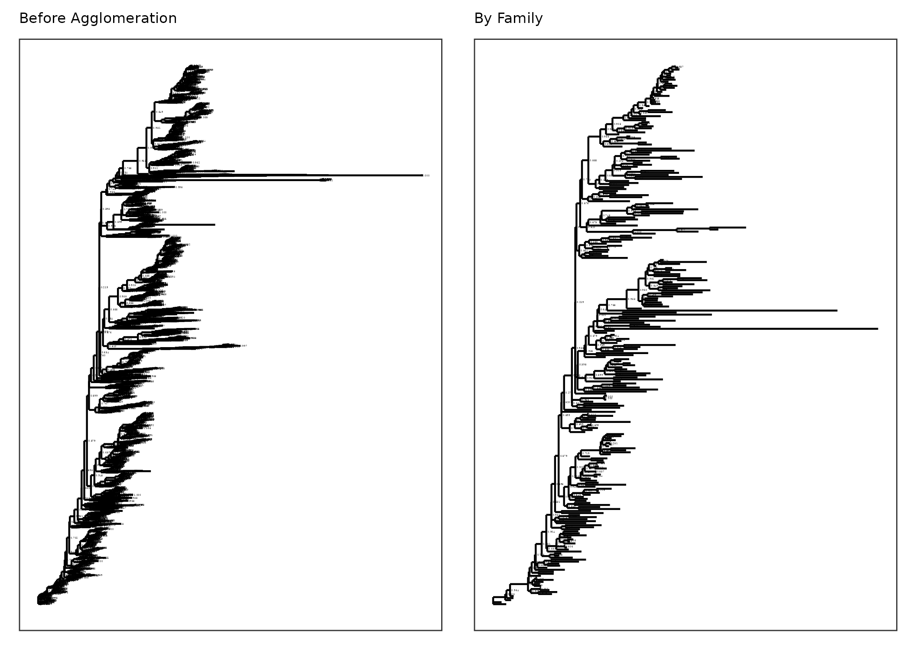

TeaTime4schools: Joint analysis - bacteria
================
Roey Angel
2021-05-21

-   [Phylogenetic analysis](#phylogenetic-analysis)
    -   [Setting general parameters:](#setting-general-parameters)
    -   [Reading in raw data](#reading-in-raw-data)
    -   [Exploring TeaTime dataset
        features](#exploring-teatime-dataset-features)
    -   [Plot phylogenetic trees](#plot-phylogenetic-trees)
        -   [Save filtered phyloseq
            object](#save-filtered-phyloseq-object)
-   [References](#references)

[roey.angel@bc.cas.cz](mailto:%20roey.angel@bc.cas.cz)

## Phylogenetic analysis

This analysis explores the phylogenetic ditribution patters in the
different samples, based on the DADA2-produced sequences. Large parts of
this script are based on [this
protocol](https://f1000research.com/articles/5-1492/v2) and the
accompanying publichation by Callahan and colleagues
([2016](#ref-callahan_bioconductor_2016)).

### Setting general parameters:

``` r
set.seed(1000)
subsamples <- 1000
min_lib_size <- 5000
metadata_path <- "./"
data_path <- "./DADA2_pseudo/"
Ps_file <- "TeaTime4Schools_16S_filt3.RDS"
Tree_file <- "FastTree/DADA2.Seqs_filtered.tree"
Proj_name <- "TeaTime4Schools"
```

### Reading in raw data

Read abundance table, taxonomic classification and metadata into a
phyloseq object. Also remove sequences detected as contaminanants in
[03\_Decontamination.html](03_Decontamination.html).

``` r
# read phyloseq object from data file
Ps_obj_filt3 <- readRDS(paste0(data_path, Ps_file))

# Load phylogenetic tree
Tree <- read_tree(paste0(data_path, Tree_file))

# generate phyloseq object
Ps_obj_filt3 <- merge_phyloseq(Ps_obj_filt3,
                        phy_tree(Tree)
                        )

Ps_obj_filt3 %>%
  subset_samples(., sample_sums(Ps_obj_filt3) > min_lib_size) %>% # drop samples below min_lib_size
  subset_samples(., Field != "Unburied") %>% # drop unburied samples
  filter_taxa(., function(x)
    sum(x) > 0, TRUE) -> # remove taxa with 0 abundance
  Ps_obj_filt3_subset
```

### Exploring TeaTime dataset features

### Plot phylogenetic trees

Now let’s try to simplify the phylogenetic tree by agglomerating genera

``` r
# How many genera would be present after filtering?
length(get_taxa_unique(Ps_obj_filt3_subset, taxonomic.rank = "Family"))
```

    ## [1] 181

``` r
TeaTime_filt_glom <- tax_glom(Ps_obj_filt3_subset, 
                             "Family", 
                             NArm = TRUE)

multiPlotTitleTextSize = 8
p2tree <- plot_tree(Ps_obj_filt3_subset, method = "treeonly",
                     ladderize = "left",
                     title = "Before Agglomeration") +
  theme(plot.title = element_text(size = multiPlotTitleTextSize))
p3tree <- plot_tree(TeaTime_filt_glom, method = "treeonly",
                     ladderize = "left", title = "By Family") +
  theme(plot.title = element_text(size = multiPlotTitleTextSize))

# group plots together
grid.arrange(nrow = 1, p2tree, p3tree)
```

<!-- -->

#### Save filtered phyloseq object

``` r
saveRDS(Ps_obj_filt3,
        file = paste0(data_path, Proj_name, "16S_filt3_wTree.Rds"))
```

``` r
sessioninfo::session_info() %>%
  details::details(
    summary = 'Current session info',
    open    = TRUE
 )
```

<details open>
<summary>
<span title="Click to Expand"> Current session info </span>
</summary>

``` r
─ Session info ─────────────────────────────────────────────────────────────────────────
 setting  value                       
 version  R version 4.0.3 (2020-10-10)
 os       Ubuntu 18.04.5 LTS          
 system   x86_64, linux-gnu           
 ui       X11                         
 language (EN)                        
 collate  en_US.UTF-8                 
 ctype    en_US.UTF-8                 
 tz       Europe/Prague               
 date     2021-05-21                  

─ Packages ─────────────────────────────────────────────────────────────────────────────
 package      * version date       lib source        
 ade4           1.7-16  2020-10-28 [1] CRAN (R 4.0.2)
 ape            5.5     2021-04-25 [1] CRAN (R 4.0.3)
 assertthat     0.2.1   2019-03-21 [1] CRAN (R 4.0.2)
 backports      1.2.1   2020-12-09 [1] CRAN (R 4.0.2)
 Biobase        2.50.0  2020-10-27 [1] Bioconductor  
 BiocGenerics   0.36.1  2021-04-16 [1] Bioconductor  
 biomformat     1.18.0  2020-10-27 [1] Bioconductor  
 Biostrings     2.58.0  2020-10-27 [1] Bioconductor  
 broom        * 0.7.6   2021-04-05 [1] CRAN (R 4.0.3)
 cellranger     1.1.0   2016-07-27 [1] CRAN (R 4.0.2)
 cli            2.5.0   2021-04-26 [1] CRAN (R 4.0.3)
 clipr          0.7.1   2020-10-08 [1] CRAN (R 4.0.2)
 cluster        2.1.2   2021-04-17 [1] CRAN (R 4.0.3)
 codetools      0.2-18  2020-11-04 [1] CRAN (R 4.0.2)
 colorspace     2.0-1   2021-05-04 [1] CRAN (R 4.0.3)
 cowplot      * 1.1.1   2020-12-30 [1] CRAN (R 4.0.2)
 crayon         1.4.1   2021-02-08 [1] CRAN (R 4.0.3)
 data.table     1.14.0  2021-02-21 [1] CRAN (R 4.0.3)
 DBI            1.1.1   2021-01-15 [1] CRAN (R 4.0.3)
 dbplyr         2.1.1   2021-04-06 [1] CRAN (R 4.0.3)
 desc           1.3.0   2021-03-05 [1] CRAN (R 4.0.3)
 details        0.2.1   2020-01-12 [1] CRAN (R 4.0.2)
 digest         0.6.27  2020-10-24 [1] CRAN (R 4.0.2)
 doParallel   * 1.0.16  2020-10-16 [1] CRAN (R 4.0.2)
 dplyr        * 1.0.6   2021-05-05 [1] CRAN (R 4.0.3)
 ellipsis       0.3.2   2021-04-29 [1] CRAN (R 4.0.3)
 evaluate       0.14    2019-05-28 [1] CRAN (R 4.0.2)
 extrafont    * 0.17    2014-12-08 [1] CRAN (R 4.0.2)
 extrafontdb    1.0     2012-06-11 [1] CRAN (R 4.0.2)
 fansi          0.4.2   2021-01-15 [1] CRAN (R 4.0.3)
 farver         2.1.0   2021-02-28 [1] CRAN (R 4.0.3)
 forcats      * 0.5.1   2021-01-27 [1] CRAN (R 4.0.3)
 foreach      * 1.5.1   2020-10-15 [1] CRAN (R 4.0.2)
 fs             1.5.0   2020-07-31 [1] CRAN (R 4.0.2)
 generics       0.1.0   2020-10-31 [1] CRAN (R 4.0.2)
 ggplot2      * 3.3.3   2020-12-30 [1] CRAN (R 4.0.2)
 glue           1.4.2   2020-08-27 [1] CRAN (R 4.0.2)
 gridExtra    * 2.3     2017-09-09 [1] CRAN (R 4.0.2)
 gtable         0.3.0   2019-03-25 [1] CRAN (R 4.0.2)
 haven          2.4.1   2021-04-23 [1] CRAN (R 4.0.3)
 highr          0.9     2021-04-16 [1] CRAN (R 4.0.3)
 hms            1.1.0   2021-05-17 [1] CRAN (R 4.0.3)
 htmltools      0.5.1.1 2021-01-22 [1] CRAN (R 4.0.3)
 httr           1.4.2   2020-07-20 [1] CRAN (R 4.0.2)
 igraph         1.2.6   2020-10-06 [1] CRAN (R 4.0.2)
 IRanges        2.24.1  2020-12-12 [1] Bioconductor  
 iterators    * 1.0.13  2020-10-15 [1] CRAN (R 4.0.2)
 jsonlite       1.7.2   2020-12-09 [1] CRAN (R 4.0.2)
 kableExtra   * 1.3.4   2021-02-20 [1] CRAN (R 4.0.3)
 knitr        * 1.33    2021-04-24 [1] CRAN (R 4.0.3)
 labeling       0.4.2   2020-10-20 [1] CRAN (R 4.0.2)
 lattice      * 0.20-44 2021-05-02 [1] CRAN (R 4.0.3)
 lifecycle      1.0.0   2021-02-15 [1] CRAN (R 4.0.3)
 lubridate      1.7.10  2021-02-26 [1] CRAN (R 4.0.3)
 magrittr     * 2.0.1   2020-11-17 [1] CRAN (R 4.0.2)
 MASS           7.3-54  2021-05-03 [1] CRAN (R 4.0.3)
 Matrix         1.3-3   2021-05-04 [1] CRAN (R 4.0.3)
 mgcv           1.8-35  2021-04-18 [1] CRAN (R 4.0.3)
 modelr         0.1.8   2020-05-19 [1] CRAN (R 4.0.2)
 multtest       2.46.0  2020-10-27 [1] Bioconductor  
 munsell        0.5.0   2018-06-12 [1] CRAN (R 4.0.2)
 nlme           3.1-152 2021-02-04 [1] CRAN (R 4.0.3)
 permute      * 0.9-5   2019-03-12 [1] CRAN (R 4.0.2)
 phyloseq     * 1.34.0  2020-10-27 [1] Bioconductor  
 pillar         1.6.1   2021-05-16 [1] CRAN (R 4.0.3)
 pkgconfig      2.0.3   2019-09-22 [1] CRAN (R 4.0.2)
 plyr           1.8.6   2020-03-03 [1] CRAN (R 4.0.2)
 png            0.1-7   2013-12-03 [1] CRAN (R 4.0.2)
 prettyunits    1.1.1   2020-01-24 [1] CRAN (R 4.0.2)
 progress       1.2.2   2019-05-16 [1] CRAN (R 4.0.2)
 purrr        * 0.3.4   2020-04-17 [1] CRAN (R 4.0.2)
 R6             2.5.0   2020-10-28 [1] CRAN (R 4.0.2)
 ragg         * 1.1.2   2021-03-17 [1] CRAN (R 4.0.3)
 Rcpp           1.0.6   2021-01-15 [1] CRAN (R 4.0.3)
 readr        * 1.4.0   2020-10-05 [1] CRAN (R 4.0.2)
 readxl         1.3.1   2019-03-13 [1] CRAN (R 4.0.2)
 reprex         2.0.0   2021-04-02 [1] CRAN (R 4.0.3)
 reshape2       1.4.4   2020-04-09 [1] CRAN (R 4.0.2)
 rhdf5          2.34.0  2020-10-27 [1] Bioconductor  
 rhdf5filters   1.2.1   2021-05-03 [1] Bioconductor  
 Rhdf5lib       1.12.1  2021-01-26 [1] Bioconductor  
 rlang          0.4.11  2021-04-30 [1] CRAN (R 4.0.3)
 rmarkdown    * 2.8     2021-05-07 [1] CRAN (R 4.0.3)
 rprojroot      2.0.2   2020-11-15 [1] CRAN (R 4.0.2)
 rstudioapi     0.13    2020-11-12 [1] CRAN (R 4.0.2)
 Rttf2pt1       1.3.8   2020-01-10 [1] CRAN (R 4.0.2)
 rvest          1.0.0   2021-03-09 [1] CRAN (R 4.0.3)
 S4Vectors      0.28.1  2020-12-09 [1] Bioconductor  
 scales       * 1.1.1   2020-05-11 [1] CRAN (R 4.0.2)
 sessioninfo    1.1.1   2018-11-05 [1] CRAN (R 4.0.2)
 stringi        1.6.2   2021-05-17 [1] CRAN (R 4.0.3)
 stringr      * 1.4.0   2019-02-10 [1] CRAN (R 4.0.2)
 survival       3.2-11  2021-04-26 [1] CRAN (R 4.0.3)
 svglite      * 2.0.0   2021-02-20 [1] CRAN (R 4.0.3)
 systemfonts    1.0.2   2021-05-11 [1] CRAN (R 4.0.3)
 textshaping    0.3.4   2021-05-11 [1] CRAN (R 4.0.3)
 tibble       * 3.1.2   2021-05-16 [1] CRAN (R 4.0.3)
 tidyr        * 1.1.3   2021-03-03 [1] CRAN (R 4.0.3)
 tidyselect     1.1.1   2021-04-30 [1] CRAN (R 4.0.3)
 tidyverse    * 1.3.1   2021-04-15 [1] CRAN (R 4.0.3)
 utf8           1.2.1   2021-03-12 [1] CRAN (R 4.0.3)
 vctrs          0.3.8   2021-04-29 [1] CRAN (R 4.0.3)
 vegan        * 2.5-7   2020-11-28 [1] CRAN (R 4.0.3)
 viridisLite    0.4.0   2021-04-13 [1] CRAN (R 4.0.3)
 webshot        0.5.2   2019-11-22 [1] CRAN (R 4.0.2)
 withr          2.4.2   2021-04-18 [1] CRAN (R 4.0.3)
 xfun           0.23    2021-05-15 [1] CRAN (R 4.0.3)
 xml2           1.3.2   2020-04-23 [1] CRAN (R 4.0.2)
 XVector        0.30.0  2020-10-27 [1] Bioconductor  
 yaml           2.2.1   2020-02-01 [1] CRAN (R 4.0.2)
 zlibbioc       1.36.0  2020-10-27 [1] Bioconductor  

[1] /home/angel/R/library
[2] /usr/local/lib/R/site-library
[3] /usr/lib/R/site-library
[4] /usr/lib/R/library
```

</details>

<br>

## References

<div id="refs" class="references csl-bib-body hanging-indent">

<div id="ref-callahan_bioconductor_2016" class="csl-entry">

Callahan BJ, Sankaran K, Fukuyama JA *et al.* Bioconductor workflow for
microbiome data analysis: From raw reads to community analyses.
*F1000Research* 2016;**5**:1492.

</div>

</div>
