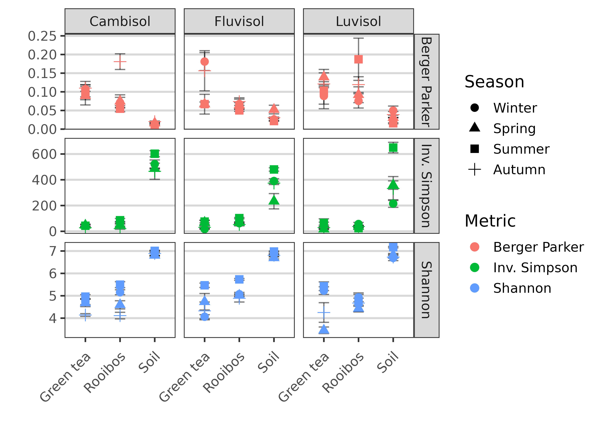
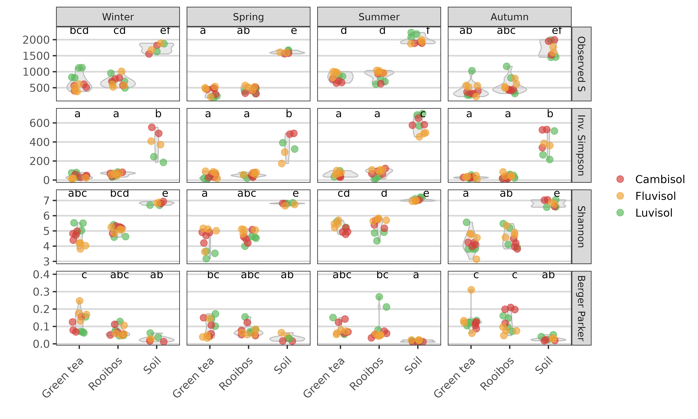
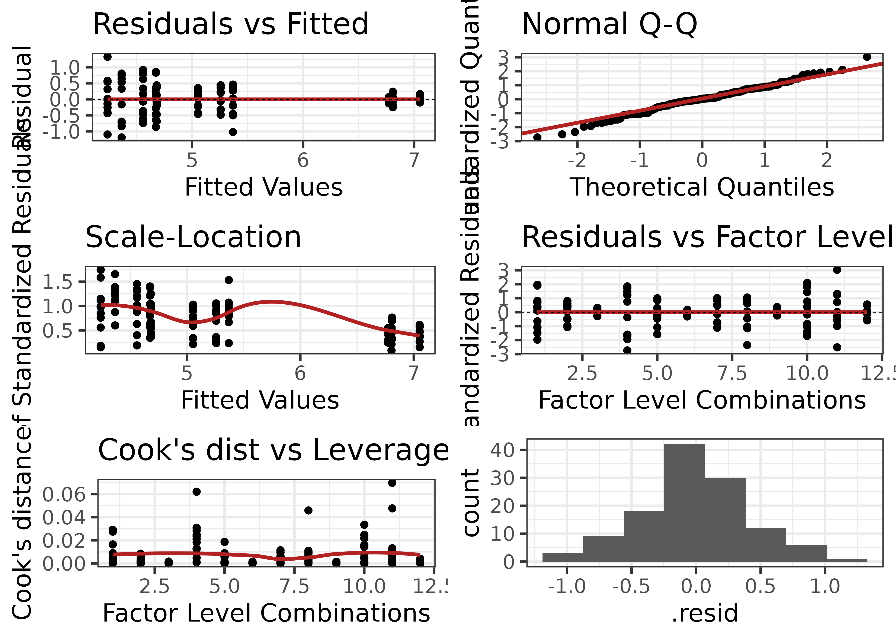

[roey.angel@bc.cas.cz](mailto: roey.angel@bc.cas.cz)  

## Alpha diversity analysis
This analysis explores the alpha-diversity ditribution patters in the different samples, based on the DADA2-produced sequences. 

### Setting general parameters:

```r
set.seed(1000)
subsamples <- 1000
min_lib_size <- 5000
metadata_path <- "./"
data_path <- "./DADA2_pseudo/"
Ps_file <- "TeaTime4Schools_16S_filt.RDS"
Proj_name <- "TeaTime4Schools"
```

### Load phyloseq object
This phyloseq object was created in [05_Taxonomical_analysis.html](05_Taxonomical_analysis.html). 
The Ps_obj_filt object excludes contaminants and all sequences classified as eukaryota, chloroplast, mitochondria or unknown but still includes taxa with low prevalence 

```r
Ps_obj_filt <- readRDS(file = paste0(data_path, Ps_file))
Ps_obj_filt %>%
  subset_samples(., sample_sums(Ps_obj_filt) > min_lib_size) %>% # drop samples below min_lib_size
  subset_samples(., Field != "Unburied") %>% # drop unburied samples
  filter_taxa(., function(x)
    sum(x) > 0, TRUE) -> # remove taxa with 0 abundance
  Ps_obj_filt_subset

Ps_obj_filt_subset %>% 
  sample_data() %>% 
  mutate_at(., "Sample.type", 
            ~fct_relevel(., levels = c("Soil", "Green tea", "Rooibos"))) %>% 
  mutate_at(., "Season", 
            ~fct_relevel(., levels = c("Winter", "Spring", "Summer", "Autumn"))) %>% 
  arrange(Field, Sample.type, Season, Replicate) %>% 
  pull(Description) %>% 
  as.character() ->
  Sample.order
```

### Richness

```r
# tic()
abundance_mat <- as(otu_table(Ps_obj_filt_subset), "matrix") # use Ps_obj_filt_subset - no contaminants, no euk, chloro, mito, unknowns
## Original data
Original <-
  data.frame(Reads = rowSums(abundance_mat),
             S = apply(abundance_mat, 1, function(x)
               sum(x > 0)))

# Assign rarefaction mat  
rarefaction_mat <- 
  matrix(0, nrow = nrow(abundance_mat), ncol = subsamples)
rownames(rarefaction_mat) <- rownames(abundance_mat)

# Declare richness est table
rich.ests <-
  list(
  S.obs = rarefaction_mat,
  S.chao1 = rarefaction_mat,
  se.chao1 = rarefaction_mat,
  S.ACE = rarefaction_mat,
  se.ACE = rarefaction_mat
  )

# Rarefy abundance_mat and calc estimates
for (i in seq(subsamples)) {
  sub.OTUmat <-
    rrarefy(abundance_mat, min(rowSums(abundance_mat)))
    # rrarefy(abundance_mat, quantile(rowSums(abundance_mat), probs = seq(0, 1, rare2quant))[2])
  for (j in seq(length(rich.ests))) {
    rich.ests[[j]][, i] <- t(estimateR(sub.OTUmat))[, j]
  }
}

# Calculate means and SEM of subsamples
Richness <- data.frame(row.names = row.names(rich.ests[[1]]))
for (i in c(1, seq(2, length(rich.ests), 2))) {
  S <- apply(rich.ests[[i]], 1, mean)
  if (i == 1) {
    se <-
      apply(rich.ests[[i]], 1, function(x)
        (mean(x) / sqrt(length(x))))
  } else
    se <- apply(rich.ests[[i + 1]], 1, mean)
  Richness <- cbind(Richness, S, se)
}
colnames(Richness) <-
  c("S.obs.Estimate",
    "S.obs.SE",
    "S.chao1.Estimate",
    "S.chao1.SE",
    "S.ACE.Estimate",
    "S.ACE.SE")

## Parametric richness estimates
## DOESN'T WORK WITH DADA2 SINCE SINGLETONS ARE REMOVED
# # convert to list
# abundance_mat_freqs <- apply(abundance_mat, 1, table)
# # declare results table
# parametric <-
#   data.frame(matrix(0, nrow = nrow(abundance_mat), ncol = 4),
#              row.names = rownames(abundance_mat))
# colnames(parametric) <-
#   c("bway.est", "bway.se", "bway_nof1.est", "bway_nof1.se")
# # calc parametric estimates
# for (i in seq(length(abundance_mat_freqs))) {
#   possibleError <-
#     tryCatch(
#       breakaway.mod <-
#         breakaway(
#           data.frame(abundance_mat_freqs[[i]])[-1, ],
#           print = FALSE,
#           plot = FALSE,
#           answers = TRUE
#         ),
#       error = function(e)
#         e
#     )
#   if (is.null(breakaway.mod)) {
#     parametric[i, 1] <- 0
#     parametric[i, 2] <- 0
#   } else {
#     parametric[i, 1] <- breakaway.mod$est
#     parametric[i, 2] <- breakaway.mod$seest
#   }
#   
#   possibleError <-
#     tryCatch(
#       breakaway_nof1.mod <-
#         breakaway_nof1(
#           data.frame(abundance_mat_freqs[[i]])[-c(1, 2), ],
#           print = FALSE,
#           plot = FALSE,
#           answers = TRUE
#         ),
#       error = function(e)
#         e
#     )
#   if (is.null(breakaway_nof1.mod)) {
#     parametric[i, 3] <- 0
#     parametric[i, 4] <- 0
#   } else {
#     parametric[i, 3] <- breakaway_nof1.mod$est
#     parametric[i, 4] <- breakaway_nof1.mod$seest
#   }
# }
```

Merge tables and save

```r
# Richness.Table <- cbind(Richness, parametric)
# Richness.Table <- Richness # only
saveRDS(cbind(Original, Richness),
        file = paste0(Proj_name, "_Richness.RDS"))
write.csv(cbind(Original, Richness),
        file = paste0(Proj_name, "_Richness.csv"))
```

#### Plot richness estimates

```r
Richness %>% 
  rownames_to_column(var = "Sample") %>% # get sample names
  mutate_at(., "Sample", ~str_replace_all(., "Green_tea", "Green tea")) %>% #
  mutate_at(., "Sample", as.factor)  %>% 
  mutate_at(., "Sample", ~fct_relevel(., levels = Sample.order)) %>% 
  bind_cols(., get_variable(Ps_obj_filt_subset, 
                            c("Lib.size", "Field", "Sample.type", "Season", "Replicate"))) %>% # add metadata
  pivot_longer(cols = c(-"Sample", -"Lib.size", -"Field", -"Sample.type", -"Season", -"Replicate"), 
               names_to = c("Metric", ".value"), 
               values_to = c("Estimate", "SE"), 
               names_pattern = "(.*\\..*)\\.(.*)") %>% # gather all metrices to one column
  mutate_at(., "Metric", ~fct_recode(., `Observed S` = "S.obs", Chao1 = "S.chao1", ACE = "S.ACE")) %>% 
  mutate(Estimate, herr = Estimate + SE, lerr = Estimate - SE) ->
  Richness_long

PlotSummarySingle_overlay(Richness_long)
```

<!-- -->

```r
fit <- lm(Estimate ~ Lib.size, 
                        data = Richness_long[Richness_long$Metric == "Observed S", ])
fit$model$Sample <- str_replace(Richness_long[Richness_long$Metric == "Observed S", ]$Sample, "(.*)_[0-9]$", "\\1")

ggplot(fit$model, aes_string(x = names(fit$model)[2], y = names(fit$model)[1])) + 
  geom_point(aes(colour = fit$model$Sample)) +
  stat_smooth(method = "lm", col = "red") +
  labs(title = paste("Adj R2 = ",signif(summary(fit)$adj.r.squared, 5),
                     "; Intercept =",signif(fit$coef[[1]], 5),
                     "; Slope =",signif(fit$coef[[2]], 5),
                     "; P =",signif(summary(fit)$coef[2,4], 5))) +
  theme(plot.title = element_text(size = 8)) + 
  theme(legend.position = "none")
```

<!-- -->

```r
PlotSummarySingle_overlay(x = "Season", Richness_long) + 
  facet_grid(Field ~ Sample.type) 
```

<!-- -->

Combine replicates

```r
Richness_long %>%
  group_by(Field, Season, Sample.type, Metric) %>%
  summarise(
    Mean = mean(Estimate),
    lerr = Mean - (sd(Estimate)) / sqrt(length(Estimate)),
    herr = Mean + (sd(Estimate)) / sqrt(length(Estimate))
  ) ->
  Combined_Richness_long

# plot
PlotSummarySingle_overlay(x = "Season", y = "Mean", Combined_Richness_long) + 
  facet_grid(Field ~ Sample.type) 
```

<!-- -->

### Diversity

```r
# calculate diversity indices
# declare diversity indices table
diversity.inds <-
  list(Shannon = rarefaction_mat,
       inv.simpson = rarefaction_mat,
       BP = rarefaction_mat)
# rarefy abundance_mat and calc estimates
for (i in seq(subsamples)) {
  sub.OTUmat <-
    rrarefy(abundance_mat, min(rowSums(abundance_mat)))
    # rrarefy(abundance_mat, quantile(rowSums(abundance_mat), probs = seq(0, 1, rare2quant))[2])
  diversity.inds$Shannon[, i] <-
    diversityresult(sub.OTUmat,
                    index = 'Shannon' ,
                    method = 'each site',
                    digits = 3)[, 1]
  diversity.inds$inv.simpson[, i] <-
    diversityresult(sub.OTUmat,
                    index = 'inverseSimpson' ,
                    method = 'each site',
                    digits = 3)[, 1]
  diversity.inds$BP[, i] <-
    diversityresult(sub.OTUmat,
                    index = 'Berger' ,
                    method = 'each site',
                    digits = 3)[, 1]
}
# calculate means and SEM of subsamples
Diversity <-
  data.frame(row.names = row.names(diversity.inds[[1]]))
for (i in seq(length(diversity.inds))) {
  S <- apply(diversity.inds[[i]], 1, mean)
  se <-
    apply(diversity.inds[[i]], 1, function(x)
      (mean(x) / sqrt(length(x))))
  Diversity <- cbind(Diversity, S, se)
}
colnames(Diversity) <-
  c("Shannon.Estimate",
    "Shannon.SE",
    "InvSimpson.Estimate",
    "InvSimpson.SE",
    "BP.Estimate",
    "BP.SE")
```

Merge tables and save

```r
saveRDS(Diversity, file = "Ps_obj_Diversity.Rds")
write.csv(Diversity, file = "Ps_obj_Diversity.csv")
```

Plot diversity indices

```r
Diversity %>% 
  rownames_to_column(var = "Sample") %>% # get sample names
  mutate_at(., "Sample", ~str_replace_all(., "Green_tea", "Green tea")) %>% #
  mutate_at(., "Sample", as.factor)  %>% 
  mutate_at(., "Sample", ~fct_relevel(., levels = Sample.order)) %>% 
  bind_cols(., get_variable(Ps_obj_filt_subset, 
                            c("Lib.size", "Field", "Sample.type", "Season", "Replicate"))) %>% # add metadata
  pivot_longer(cols = c(-"Sample", -"Lib.size", -"Field", -"Sample.type", -"Season", -"Replicate"), 
               names_to = c("Metric", ".value"), 
               values_to = c("Estimate", "SE"), 
               names_pattern = "(.*)\\.(.*)") %>% # gather all metrices to one column
  mutate_at(., "Metric", ~fct_recode(., "Inv. Simpson" = "InvSimpson", "Berger Parker" = "BP")) %>% 
  mutate(Estimate, herr = Estimate + SE, lerr = Estimate - SE) ->
  Diversity_long

PlotSummarySingle(Diversity_long, y = "Estimate", colour = "Metric") + 
  background_grid(major = "y", minor = "none", size.major = 0.8) 
```

<!-- -->

```r
PlotSummarySingle(Diversity_long, x = "Season", y = "Estimate", colour = "Metric") + 
  facet_grid(Metric ~ Sample.type, scale = "free") + 
  background_grid(major = "y", minor = "none", size.major = 0.8)
```

<!-- -->

Combine replicates

```r
Diversity_long %>%
  group_by(Field, Season, Sample.type, Metric) %>%
  summarise(
    Mean = mean(Estimate),
    lerr = Mean - (sd(Estimate)) / sqrt(length(Estimate)),
    herr = Mean + (sd(Estimate)) / sqrt(length(Estimate))
  ) ->
  Combined_Diversity_long

# plot
p <- PlotSummarySingle(Combined_Diversity_long, x = "Sample.type", y = "Mean", colour = "Metric") 
p$layers[[1]] <- NULL
p +
  geom_point(aes_string(colour = "Metric", shape = "Season"), size = 3) +
  facet_grid(Metric ~ Field, scales = "free") + 
  background_grid(major = "y", minor = "none", size.major = 0.8) 
```

<!-- -->


<!-- -->


```r
TestAlphaV2 <-
  # added SRH test if leven's is significant
  # TODO: generalise for different number factors
  function(data2test = Richness_Diversity_long_sub,
           response_name = "Estimate",
           factor_names = c("Sample.type", "Season", "Field"),
           boxcox.trans = FALSE) {
    if (leveneTest(as.formula(paste(
      response_name,
      paste(factor_names[1], factor_names[2], factor_names[3], sep = " * "),
      sep = " ~ "
    )), data2test) %>% .$`Pr(>F)` %>% .[1] < 0.05) {
      mod_SRH <- scheirerRayHare(as.formula(paste(
        response_name,
        paste(factor_names[1], factor_names[2], factor_names[3], sep = " * "),
        sep = " ~ "
      )), data2test)
      print(mod_SRH)
    } else {
      mod <-
        aov(as.formula(paste(
          response_name,
          paste(factor_names[1], factor_names[2], factor_names[3], sep = " * "),
          sep = " ~ "
        )), data2test)
    }
    
    if (boxcox.trans) {
      # employ boxcox transformation then recalculate model
      print("Performing Box-Cox transformation of the data")
      lambdas <- boxcox(as.formula(paste(
        response_name,
        paste(factor_names[1], factor_names[2], sep = " * "),
        sep = " ~ "
      )),
      data = data2test,
      lambda = seq(0, 1.0, 0.01))
      print(range(lambdas$x[lambdas$y > max(lambdas$y) - qchisq(0.95, 1) /
                              2]))
      print(l.max <- lambdas$x[which.max(lambdas$y)])
      if (l.max == 0)
        l.max <- 1
      data2test$Estimate.box <-
        (data2test$Estimate ^ l.max - 1) / l.max
      mod <-
        aov(as.formula(paste(
          "Estimate.box",
          paste(factor_names[1], factor_names[2], sep = " * "),
          sep = " ~ "
        )), data2test)
    }
    
    if (exists("mod")) {
      print(mod)
      mod_df <- fortify(mod)
      factor.combinations <-
        as.numeric(factor(paste(mod_df[, factor_names[1]], mod_df[, factor_names[2]], mod_df[, factor_names[3]]),
                          levels = unique(as.character(
                            paste(mod_df[, factor_names[1]], mod_df[, factor_names[2]], mod_df[, factor_names[3]])
                          )))) # needed for "residuals vs leverage
      mod_df <-
        cbind(mod_df,
              rows = 1:nrow(mod_df),
              factors = factor.combinations)
      PlotLmResid(mod_df)
      if ((data2test %>% group_by(Sample.type, Season, Field) %>% count() %>% pull(n) %>% n_distinct() == 1)) {
        print("Equal group sizes - showing SS type I")
        print(summary(mod_data)) # display Type I ANOVA table
        } else {
          print("Unequal group sizes - showing SS type III")
          options(contrasts = c("contr.sum", "contr.poly"))
          print(Anova(mod, type = "III")) # type III SS
          }
      print(model.tables(mod, "means"), digits = 3) # Show the means
      return(mod)
    }
  }

Richness_Diversity_long_sub <- Richness_Diversity_long[Richness_Diversity_long$Metric == "Observed S", ] 
TestAlphaV2(Richness_Diversity_long_sub)
```

```
## Call:
##    aov(formula = as.formula(paste(response_name, paste(factor_names[1], 
##     factor_names[2], factor_names[3], sep = " * "), sep = " ~ ")), 
##     data = data2test)
## 
## Terms:
##                 Sample.type   Season    Field Sample.type:Season Sample.type:Field
## Sum of Squares     31062979  3123026   145046             119482            120638
## Deg. of Freedom           2        3        2                  6                 4
##                 Season:Field Sample.type:Season:Field Residuals
## Sum of Squares        308510                   787260   2200385
## Deg. of Freedom            6                       12        85
## 
## Residual standard error: 161
## Estimated effects may be unbalanced
```

<!-- -->

```
## [1] "Unequal group sizes - showing SS type III"
## Anova Table (Type III tests)
## 
## Response: Estimate
##                           Sum Sq Df F value  Pr(>F)    
## (Intercept)               880106  1   34.00 9.7e-08 ***
## Sample.type              2146157  2   41.45 2.7e-13 ***
## Season                    716467  3    9.23 2.4e-05 ***
## Field                      39592  2    0.76 0.46864    
## Sample.type:Season         91120  6    0.59 0.74008    
## Sample.type:Field         174872  4    1.69 0.16008    
## Season:Field              680001  6    4.38 0.00067 ***
## Sample.type:Season:Field  787260 12    2.53 0.00661 ** 
## Residuals                2200385 85                    
## ---
## Signif. codes:  0 '***' 0.001 '**' 0.01 '*' 0.05 '.' 0.1 ' ' 1
## Tables of means
## Grand mean
##     
## 887 
## 
##  Sample.type 
##     Green tea Rooibos Soil
##           564     640 1787
## rep        45      47   29
## 
##  Season 
##     Autumn Spring Summer Winter
##        792    694   1122    938
## rep     32     29     30     30
## 
##  Field 
##     Auboden Braunerde Kolluvisol
##         907       840        917
## rep      41        42         38
## 
##  Sample.type:Season 
##            Season
## Sample.type Autumn Spring Summer Winter
##   Green tea  427    371    832    656  
##   rep         12     11     10     12  
##   Rooibos    570    439    869    699  
##   rep         12     12     11     12  
##   Soil      1720   1611   1995   1742  
##   rep          8      6      9      6  
## 
##  Sample.type:Field 
##            Field
## Sample.type Auboden Braunerde Kolluvisol
##   Green tea  573     491       644      
##   rep         16      16        13      
##   Rooibos    694     599       625      
##   rep         16      16        15      
##   Soil      1767    1771      1822      
##   rep          9      10        10      
## 
##  Season:Field 
##         Field
## Season   Auboden Braunerde Kolluvisol
##   Autumn  819     743       818      
##   rep      10      11        11      
##   Spring  742     690       644      
##   rep      10      10         9      
##   Summer 1195    1047      1125      
##   rep      11      11         8      
##   Winter  867     881      1066      
##   rep      10      10        10      
## 
##  Sample.type:Season:Field 
## , , Field = Auboden
## 
##            Season
## Sample.type Autumn Spring Summer Winter
##   Green tea  469    428    946    480  
##   rep          4      4      4      4  
##   Rooibos    608    511    999    678  
##   rep          4      4      4      4  
##   Soil      1686   1604   1932   1786  
##   rep          2      2      3      2  
## 
## , , Field = Braunerde
## 
##            Season
## Sample.type Autumn Spring Summer Winter
##   Green tea  347    425    697    521  
##   rep          4      4      4      4  
##   Rooibos    435    394    873    713  
##   rep          4      4      4      4  
##   Soil      1825   1568   1900   1688  
##   rep          3      2      3      2  
## 
## , , Field = Kolluvisol
## 
##            Season
## Sample.type Autumn Spring Summer Winter
##   Green tea  469    220    864    971  
##   rep          4      3      2      4  
##   Rooibos    669    413    691    705  
##   rep          4      4      3      4  
##   Soil      1631   1662   2159   1751  
##   rep          3      2      3      2
```

```
## Call:
##    aov(formula = as.formula(paste(response_name, paste(factor_names[1], 
##     factor_names[2], factor_names[3], sep = " * "), sep = " ~ ")), 
##     data = data2test)
## 
## Terms:
##                 Sample.type   Season    Field Sample.type:Season Sample.type:Field
## Sum of Squares     31062979  3123026   145046             119482            120638
## Deg. of Freedom           2        3        2                  6                 4
##                 Season:Field Sample.type:Season:Field Residuals
## Sum of Squares        308510                   787260   2200385
## Deg. of Freedom            6                       12        85
## 
## Residual standard error: 161
## Estimated effects may be unbalanced
```

```r
Richness_Diversity_long_sub <- Richness_Diversity_long[Richness_Diversity_long$Metric == "Shannon", ] 
TestAlphaV2(Richness_Diversity_long_sub)
```

```
## Call:
##    aov(formula = as.formula(paste(response_name, paste(factor_names[1], 
##     factor_names[2], factor_names[3], sep = " * "), sep = " ~ ")), 
##     data = data2test)
## 
## Terms:
##                 Sample.type Season Field Sample.type:Season Sample.type:Field
## Sum of Squares        100.5    9.8   0.7                1.8               1.1
## Deg. of Freedom           2      3     2                  6                 4
##                 Season:Field Sample.type:Season:Field Residuals
## Sum of Squares           3.6                      5.5      11.8
## Deg. of Freedom            6                       12        85
## 
## Residual standard error: 0.372
## Estimated effects may be unbalanced
```

<!-- -->

```
## [1] "Unequal group sizes - showing SS type III"
## Anova Table (Type III tests)
## 
## Response: Estimate
##                          Sum Sq Df  F value  Pr(>F)    
## (Intercept)                3337  1 24079.83 < 2e-16 ***
## Sample.type                  95  2   342.23 < 2e-16 ***
## Season                        8  3    20.21 5.6e-10 ***
## Field                         1  2     2.03 0.13812    
## Sample.type:Season            2  6     2.39 0.03494 *  
## Sample.type:Field             1  4     2.00 0.10184    
## Season:Field                  2  6     2.87 0.01350 *  
## Sample.type:Season:Field      6 12     3.32 0.00057 ***
## Residuals                    12 85                     
## ---
## Signif. codes:  0 '***' 0.001 '**' 0.01 '*' 0.05 '.' 0.1 ' ' 1
## Tables of means
## Grand mean
##      
## 5.27 
## 
##  Sample.type 
##     Green tea Rooibos  Soil
##          4.61    4.91  6.88
## rep     45.00   47.00 29.00
## 
##  Season 
##     Autumn Spring Summer Winter
##       4.98   5.06   5.71   5.34
## rep  32.00  29.00  30.00  30.00
## 
##  Field 
##     Auboden Braunerde Kolluvisol
##        5.37      5.25       5.18
## rep   41.00     42.00      38.00
## 
##  Sample.type:Season 
##            Season
## Sample.type Autumn Spring Summer Winter
##   Green tea  4.24   4.36   5.25   4.68 
##   rep       12.00  11.00  10.00  12.00 
##   Rooibos    4.56   4.68   5.37   5.05 
##   rep       12.00  12.00  11.00  12.00 
##   Soil       6.81   6.77   7.06   6.80 
##   rep        8.00   6.00   9.00   6.00 
## 
##  Sample.type:Field 
##            Field
## Sample.type Auboden Braunerde Kolluvisol
##   Green tea  4.62    4.61      4.60     
##   rep       16.00   16.00     13.00     
##   Rooibos    5.17    4.84      4.70     
##   rep       16.00   16.00     15.00     
##   Soil       6.84    6.91      6.87     
##   rep        9.00   10.00     10.00     
## 
##  Season:Field 
##         Field
## Season   Auboden Braunerde Kolluvisol
##   Autumn  5.15    4.81      5.00     
##   rep    10.00   11.00     11.00     
##   Spring  5.32    5.16      4.66     
##   rep    10.00   10.00      9.00     
##   Summer  5.90    5.64      5.53     
##   rep    11.00   11.00      8.00     
##   Winter  5.11    5.42      5.49     
##   rep    10.00   10.00     10.00     
## 
##  Sample.type:Season:Field 
## , , Field = Auboden
## 
##            Season
## Sample.type Autumn Spring Summer Winter
##   Green tea 4.32   4.73   5.47   4.06  
##   rep       4.00   4.00   4.00   4.00  
##   Rooibos   4.89   5.02   5.73   5.07  
##   rep       4.00   4.00   4.00   4.00  
##   Soil      6.81   6.69   6.98   6.85  
##   rep       2.00   2.00   3.00   2.00  
## 
## , , Field = Braunerde
## 
##            Season
## Sample.type Autumn Spring Summer Winter
##   Green tea 4.14   4.68   4.96   4.73  
##   rep       4.00   4.00   4.00   4.00  
##   Rooibos   4.11   4.60   5.50   5.16  
##   rep       4.00   4.00   4.00   4.00  
##   Soil      6.89   6.80   7.01   6.87  
##   rep       3.00   2.00   3.00   2.00  
## 
## , , Field = Kolluvisol
## 
##            Season
## Sample.type Autumn Spring Summer Winter
##   Green tea 4.25   3.46   5.43   5.23  
##   rep       4.00   3.00   2.00   4.00  
##   Rooibos   4.67   4.43   4.71   4.93  
##   rep       4.00   4.00   3.00   4.00  
##   Soil      6.73   6.82   7.17   6.69  
##   rep       3.00   2.00   3.00   2.00
```

```
## Call:
##    aov(formula = as.formula(paste(response_name, paste(factor_names[1], 
##     factor_names[2], factor_names[3], sep = " * "), sep = " ~ ")), 
##     data = data2test)
## 
## Terms:
##                 Sample.type Season Field Sample.type:Season Sample.type:Field
## Sum of Squares        100.5    9.8   0.7                1.8               1.1
## Deg. of Freedom           2      3     2                  6                 4
##                 Season:Field Sample.type:Season:Field Residuals
## Sum of Squares           3.6                      5.5      11.8
## Deg. of Freedom            6                       12        85
## 
## Residual standard error: 0.372
## Estimated effects may be unbalanced
```

```r
Richness_Diversity_long_sub <- Richness_Diversity_long[Richness_Diversity_long$Metric == "Inv. Simpson", ] 
TestAlphaV2(Richness_Diversity_long_sub)
```

```
## Call:
##    aov(formula = as.formula(paste(response_name, paste(factor_names[1], 
##     factor_names[2], factor_names[3], sep = " * "), sep = " ~ ")), 
##     data = data2test)
## 
## Terms:
##                 Sample.type  Season   Field Sample.type:Season Sample.type:Field
## Sum of Squares      3354940  119377   19968             149041             98048
## Deg. of Freedom           2       3       2                  6                 4
##                 Season:Field Sample.type:Season:Field Residuals
## Sum of Squares         16333                   120873    127342
## Deg. of Freedom            6                       12        85
## 
## Residual standard error: 38.7
## Estimated effects may be unbalanced
```

<!-- -->

```
## [1] "Unequal group sizes - showing SS type III"
## Anova Table (Type III tests)
## 
## Response: Estimate
##                           Sum Sq Df F value  Pr(>F)    
## (Intercept)              3425097  1 2286.22 < 2e-16 ***
## Sample.type              3012235  2 1005.32 < 2e-16 ***
## Season                    144473  3   32.14 5.5e-14 ***
## Field                      52204  2   17.42 4.6e-07 ***
## Sample.type:Season        147043  6   16.36 2.0e-12 ***
## Sample.type:Field         104745  4   17.48 1.7e-10 ***
## Season:Field               31567  6    3.51  0.0038 ** 
## Sample.type:Season:Field  120873 12    6.72 2.4e-08 ***
## Residuals                 127342 85                    
## ---
## Signif. codes:  0 '***' 0.001 '**' 0.01 '*' 0.05 '.' 0.1 ' ' 1
## Tables of means
## Grand mean
##     
## 143 
## 
##  Sample.type 
##     Green tea Rooibos Soil
##          43.2    56.2  440
## rep      45.0    47.0   29
## 
##  Season 
##     Autumn Spring Summer Winter
##        119    126    197    131
## rep     32     29     30     30
## 
##  Field 
##     Auboden Braunerde Kolluvisol
##         137       161        131
## rep      41        42         38
## 
##  Sample.type:Season 
##            Season
## Sample.type Autumn Spring Summer Winter
##   Green tea  30     46     60     40   
##   rep        12     11     10     12   
##   Rooibos    37     53     75     61   
##   rep        12     12     11     12   
##   Soil      392    360    578    375   
##   rep         8      6      9      6   
## 
##  Sample.type:Field 
##            Field
## Sample.type Auboden Braunerde Kolluvisol
##   Green tea  47      39        44       
##   rep        16      16        13       
##   Rooibos    71      54        42       
##   rep        16      16        15       
##   Soil      378     523       412       
##   rep         9      10        10       
## 
##  Season:Field 
##         Field
## Season   Auboden Braunerde Kolluvisol
##   Autumn 122     130       105       
##   rep     10      11        11       
##   Spring 114     153       110       
##   rep     10      10         9       
##   Summer 189     197       209       
##   rep     11      11         8       
##   Winter 124     166       105       
##   rep     10      10        10       
## 
##  Sample.type:Season:Field 
## , , Field = Auboden
## 
##            Season
## Sample.type Autumn Spring Summer Winter
##   Green tea  31     69     75     18   
##   rep         4      4      4      4   
##   Rooibos    53     69    102     63   
##   rep         4      4      4      4   
##   Soil      374    233    480    390   
##   rep         2      2      3      2   
## 
## , , Field = Braunerde
## 
##            Season
## Sample.type Autumn Spring Summer Winter
##   Green tea  28     47     43     43   
##   rep         4      4      4      4   
##   Rooibos    20     51     86     66   
##   rep         4      4      4      4   
##   Soil      466    486    602    522   
##   rep         3      2      3      2   
## 
## , , Field = Kolluvisol
## 
##            Season
## Sample.type Autumn Spring Summer Winter
##   Green tea  28     17     65     59   
##   rep         4      3      2      4   
##   Rooibos    37     38     24     56   
##   rep         4      4      3      4   
##   Soil      332    359    650    215   
##   rep         3      2      3      2
```

```
## Call:
##    aov(formula = as.formula(paste(response_name, paste(factor_names[1], 
##     factor_names[2], factor_names[3], sep = " * "), sep = " ~ ")), 
##     data = data2test)
## 
## Terms:
##                 Sample.type  Season   Field Sample.type:Season Sample.type:Field
## Sum of Squares      3354940  119377   19968             149041             98048
## Deg. of Freedom           2       3       2                  6                 4
##                 Season:Field Sample.type:Season:Field Residuals
## Sum of Squares         16333                   120873    127342
## Deg. of Freedom            6                       12        85
## 
## Residual standard error: 38.7
## Estimated effects may be unbalanced
```

```r
Richness_Diversity_long_sub <- Richness_Diversity_long[Richness_Diversity_long$Metric == "Berger Parker", ] 
TestAlphaV2(Richness_Diversity_long_sub)
```

```
## Call:
##    aov(formula = as.formula(paste(response_name, paste(factor_names[1], 
##     factor_names[2], factor_names[3], sep = " * "), sep = " ~ ")), 
##     data = data2test)
## 
## Terms:
##                 Sample.type Season  Field Sample.type:Season Sample.type:Field
## Sum of Squares       0.1301 0.0205 0.0064             0.0165            0.0178
## Deg. of Freedom           2      3      2                  6                 4
##                 Season:Field Sample.type:Season:Field Residuals
## Sum of Squares        0.0266                   0.0528    0.1333
## Deg. of Freedom            6                       12        85
## 
## Residual standard error: 0.0396
## Estimated effects may be unbalanced
```

<!-- -->

```
## [1] "Unequal group sizes - showing SS type III"
## Anova Table (Type III tests)
## 
## Response: Estimate
##                          Sum Sq Df F value  Pr(>F)    
## (Intercept)               0.661  1  421.78 < 2e-16 ***
## Sample.type               0.124  2   39.59 7.1e-13 ***
## Season                    0.013  3    2.83  0.0434 *  
## Field                     0.007  2    2.35  0.1016    
## Sample.type:Season        0.017  6    1.85  0.0986 .  
## Sample.type:Field         0.018  4    2.87  0.0278 *  
## Season:Field              0.018  6    1.96  0.0811 .  
## Sample.type:Season:Field  0.053 12    2.81  0.0028 ** 
## Residuals                 0.133 85                    
## ---
## Signif. codes:  0 '***' 0.001 '**' 0.01 '*' 0.05 '.' 0.1 ' ' 1
## Tables of means
## Grand mean
##        
## 0.0826 
## 
##  Sample.type 
##     Green tea Rooibos    Soil
##          0.11  0.0906  0.0263
## rep     45.00 47.0000 29.0000
## 
##  Season 
##     Autumn  Spring  Summer  Winter
##      0.103  0.0725  0.0712  0.0817
## rep 32.000 29.0000 30.0000 30.0000
## 
##  Field 
##     Auboden Braunerde Kolluvisol
##      0.0769    0.0785     0.0932
## rep 41.0000   42.0000    38.0000
## 
##  Sample.type:Season 
##            Season
## Sample.type Autumn Spring Summer Winter
##   Green tea  0.13   0.10   0.09   0.13 
##   rep       12.00  11.00  10.00  12.00 
##   Rooibos    0.12   0.08   0.09   0.07 
##   rep       12.00  12.00  11.00  12.00 
##   Soil       0.03   0.03   0.02   0.03 
##   rep        8.00   6.00   9.00   6.00 
## 
##  Sample.type:Field 
##            Field
## Sample.type Auboden Braunerde Kolluvisol
##   Green tea  0.12    0.10      0.11     
##   rep       16.00   16.00     13.00     
##   Rooibos    0.06    0.10      0.11     
##   rep       16.00   16.00     15.00     
##   Soil       0.03    0.01      0.03     
##   rep        9.00   10.00     10.00     
## 
##  Season:Field 
##         Field
## Season   Auboden Braunerde Kolluvisol
##   Autumn  0.09    0.11      0.10     
##   rep    10.00   11.00     11.00     
##   Spring  0.06    0.07      0.09     
##   rep    10.00   10.00      9.00     
##   Summer  0.05    0.06      0.11     
##   rep    11.00   11.00      8.00     
##   Winter  0.10    0.07      0.07     
##   rep    10.00   10.00     10.00     
## 
##  Sample.type:Season:Field 
## , , Field = Auboden
## 
##            Season
## Sample.type Autumn Spring Summer Winter
##   Green tea 0.16   0.07   0.07   0.18  
##   rep       4.00   4.00   4.00   4.00  
##   Rooibos   0.07   0.06   0.05   0.07  
##   rep       4.00   4.00   4.00   4.00  
##   Soil      0.03   0.05   0.02   0.03  
##   rep       2.00   2.00   3.00   2.00  
## 
## , , Field = Braunerde
## 
##            Season
## Sample.type Autumn Spring Summer Winter
##   Green tea 0.11   0.09   0.10   0.11  
##   rep       4.00   4.00   4.00   4.00  
##   Rooibos   0.18   0.07   0.05   0.07  
##   rep       4.00   4.00   4.00   4.00  
##   Soil      0.02   0.02   0.01   0.01  
##   rep       3.00   2.00   3.00   2.00  
## 
## , , Field = Kolluvisol
## 
##            Season
## Sample.type Autumn Spring Summer Winter
##   Green tea 0.12   0.14   0.10   0.09  
##   rep       4.00   3.00   2.00   4.00  
##   Rooibos   0.12   0.09   0.19   0.08  
##   rep       4.00   4.00   3.00   4.00  
##   Soil      0.04   0.03   0.02   0.05  
##   rep       3.00   2.00   3.00   2.00
```

```
## Call:
##    aov(formula = as.formula(paste(response_name, paste(factor_names[1], 
##     factor_names[2], factor_names[3], sep = " * "), sep = " ~ ")), 
##     data = data2test)
## 
## Terms:
##                 Sample.type Season  Field Sample.type:Season Sample.type:Field
## Sum of Squares       0.1301 0.0205 0.0064             0.0165            0.0178
## Deg. of Freedom           2      3      2                  6                 4
##                 Season:Field Sample.type:Season:Field Residuals
## Sum of Squares        0.0266                   0.0528    0.1333
## Deg. of Freedom            6                       12        85
## 
## Residual standard error: 0.0396
## Estimated effects may be unbalanced
```
