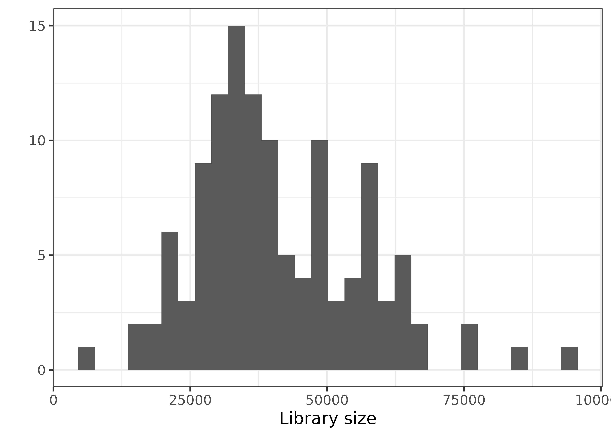
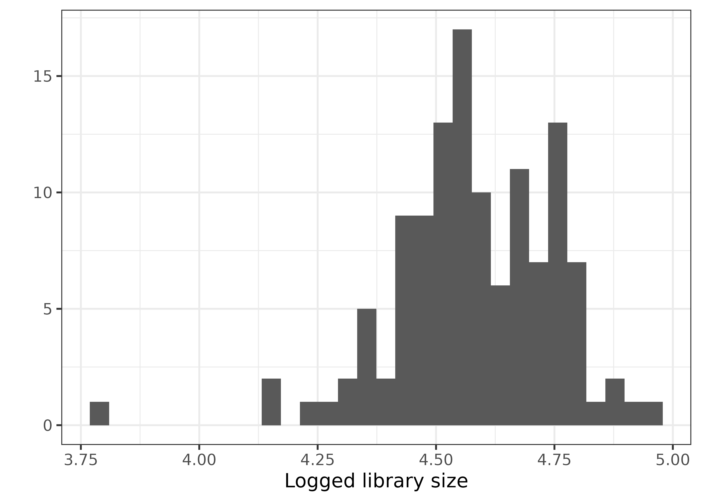
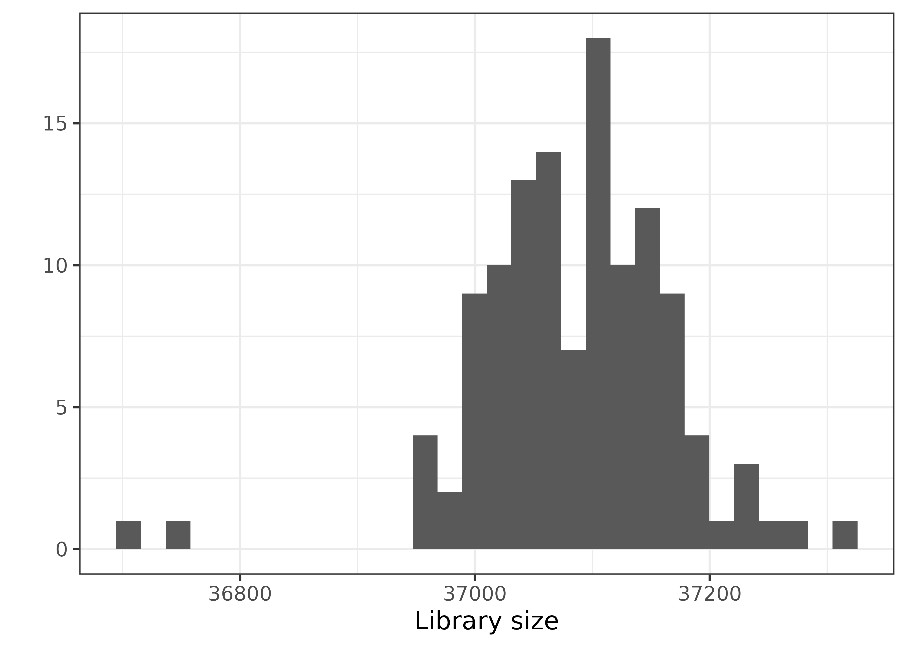
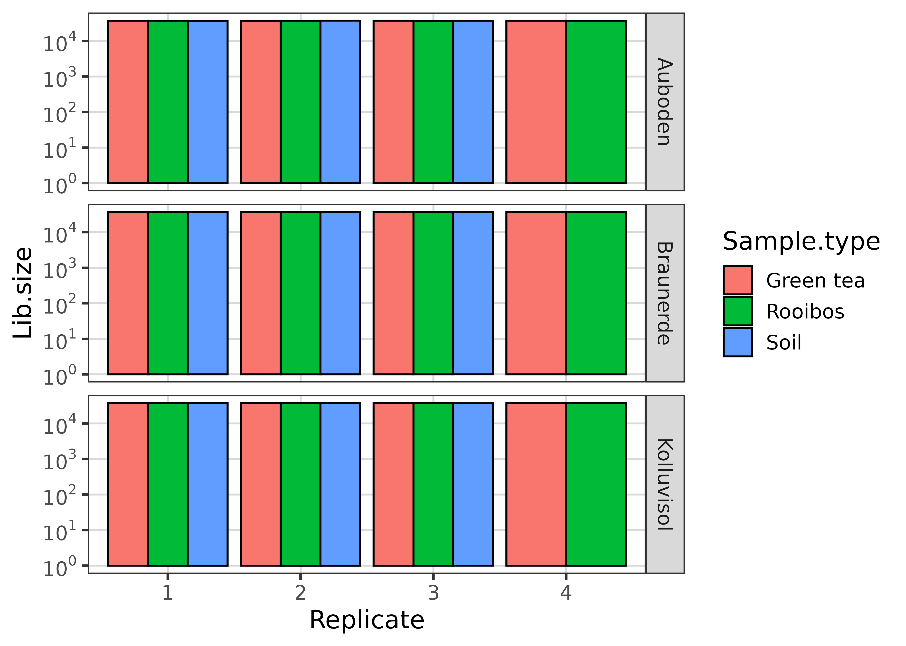
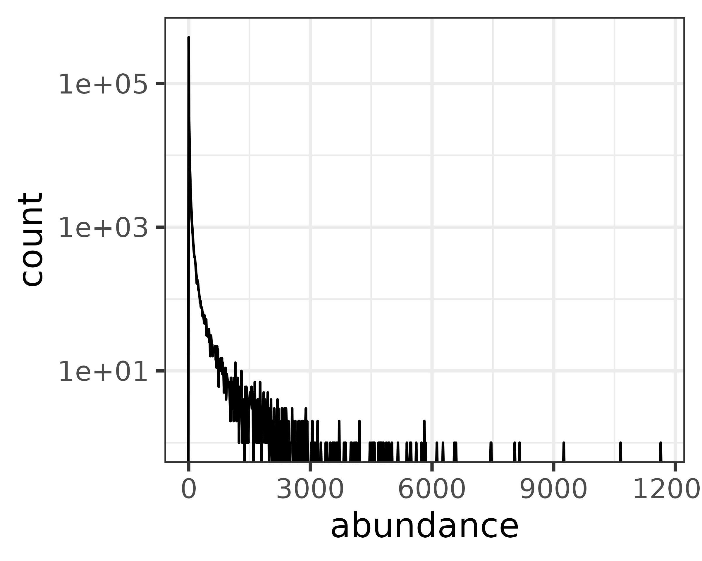
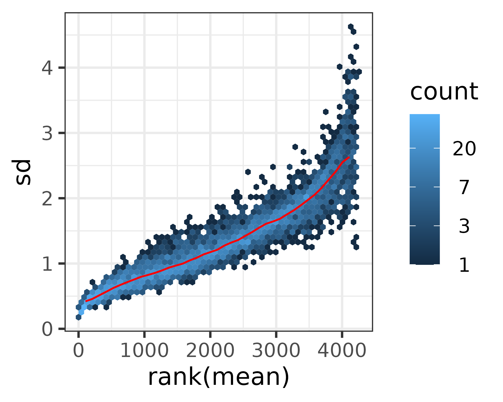

[roey.angel@bc.cas.cz](mailto: roey.angel@bc.cas.cz)  

## Beta diversity analysis
This analysis explores the alpha-diversity ditribution patters in the different samples, based on the DADA2-produced sequences. 

### Setting general parameters:

```r
set.seed(1000)
min_lib_size <- 5000
data_path <- "./DADA2_pseudo/"
Ps_file <- "TeaTime4Schools_filt3_wTree.Rds"
```

### Load phyloseq object
This phyloseq object was created in [06_Phylogentic_analysis.html](06_Phylogentic_analysis.html). 
The Ps_obj_filt object excludes contaminants and all sequences classified as eukaryota, chloroplast, mitochondria or unknown but still includes taxa with low prevalence 

```r
readRDS(file = paste0(data_path, Ps_file)) %>%
  subset_samples(., Field != "Unburied") %>% # drop unburied samples
  prune_samples(sample_sums(.) > min_lib_size, .) %>% # remove samples  < min_lib_size
  filter_taxa(., function(x) sum(x) > 0, TRUE) -> # drop taxa with 0 abundance
  Ps_obj_filt
```


```r
qplot(rowSums(otu_table(Ps_obj_filt)), geom = "histogram") + 
  xlab("Library size")
```

<!-- -->

```r
qplot(log10(rowSums(otu_table(Ps_obj_filt)))) +
  xlab("Logged library size")
```

<!-- -->

### Standardize abundances to the median sequencing depth (and convert to proportion)

```r
adonis(
  vegdist(otu_table(Ps_obj_filt), method = "bray") ~ Lib.size,
  data =
    as(sample_data(Ps_obj_filt), "data.frame"),
  permutations = 9999
)
```

```
## 
## Call:
## adonis(formula = vegdist(otu_table(Ps_obj_filt), method = "bray") ~      Lib.size, data = as(sample_data(Ps_obj_filt), "data.frame"),      permutations = 9999) 
## 
## Permutation: free
## Number of permutations: 9999
## 
## Terms added sequentially (first to last)
## 
##            Df SumsOfSqs MeanSqs F.Model      R2 Pr(>F)    
## Lib.size    1     5.148  5.1485  16.671 0.12198  1e-04 ***
## Residuals 120    37.060  0.3088         0.87802           
## Total     121    42.209                 1.00000           
## ---
## Signif. codes:  0 '***' 0.001 '**' 0.01 '*' 0.05 '.' 0.1 ' ' 1
```

```r
Ps_obj_filt %>%
  otu_table(.) %>%
  as(., "matrix") %>%
  rowSums() %>% 
  median() ->
  total
standf = function(x, t=total) round(t * (x / sum(x)))
Ps_obj_pruned_median <- transform_sample_counts(Ps_obj_filt, standf) # Standardize abundances to median sequencing depth
sample_data(Ps_obj_pruned_median)$Lib.size <- sample_sums(Ps_obj_pruned_median)

qplot(rowSums(otu_table(Ps_obj_pruned_median)), geom = "histogram") + 
  xlab("Library size")
```

<!-- -->

```r
PlotLibDist(Ps_obj_pruned_median)
```

<!-- -->


```r
PlotReadHist(as(otu_table(Ps_obj_pruned_median), "matrix"))
```

<!-- -->

```r
notAllZero <- (rowSums(t(otu_table(Ps_obj_pruned_median))) > 0)
meanSdPlot(as(log2(t(otu_table(Ps_obj_pruned_median))[notAllZero, ] + 1), "matrix"))
```

<!-- -->

### Variance partitioning models and ordinations
#### Partitioning the data using discrete distance

```r
adonis(
  vegdist(otu_table(Ps_obj_pruned_median), method = "bray") ~ Lib.size,
  data =
    as(sample_data(Ps_obj_pruned_median), "data.frame"),
  permutations = 9999
)
```

```
## 
## Call:
## adonis(formula = vegdist(otu_table(Ps_obj_pruned_median), method = "bray") ~      Lib.size, data = as(sample_data(Ps_obj_pruned_median), "data.frame"),      permutations = 9999) 
## 
## Permutation: free
## Number of permutations: 9999
## 
## Terms added sequentially (first to last)
## 
##            Df SumsOfSqs MeanSqs F.Model      R2 Pr(>F)
## Lib.size    1     0.267 0.26696  0.7777 0.00644 0.6277
## Residuals 120    41.193 0.34327         0.99356       
## Total     121    41.460                 1.00000
```

```r
adonis(
  vegdist(otu_table(Ps_obj_pruned_median), method = "bray") ~ Field + Sample.type * Season,
  data =
    as(sample_data(Ps_obj_pruned_median), "data.frame"),
  permutations = 999
)
```

```
## 
## Call:
## adonis(formula = vegdist(otu_table(Ps_obj_pruned_median), method = "bray") ~      Field + Sample.type * Season, data = as(sample_data(Ps_obj_pruned_median),      "data.frame"), permutations = 999) 
## 
## Permutation: free
## Number of permutations: 999
## 
## Terms added sequentially (first to last)
## 
##                     Df SumsOfSqs MeanSqs F.Model      R2 Pr(>F)    
## Field                2     1.049  0.5244   4.025 0.02530  0.001 ***
## Sample.type          2    13.611  6.8057  52.238 0.32830  0.001 ***
## Season               3     8.127  2.7091  20.794 0.19603  0.001 ***
## Sample.type:Season   6     4.602  0.7670   5.887 0.11100  0.001 ***
## Residuals          108    14.070  0.1303         0.33937           
## Total              121    41.460                 1.00000           
## ---
## Signif. codes:  0 '***' 0.001 '**' 0.01 '*' 0.05 '.' 0.1 ' ' 1
```

##### Calculate ordinations

```r
Ps_obj_ord1 <- ordinate(Ps_obj_pruned_median, "CAP", "bray", formula = Ps_obj_pruned_median ~  Field + Sample.type * Season)
evals <- eigenvals(Ps_obj_ord1) # /sum(eigenvals(Ps_obj_ord)) * 100

Ps_obj_pruned_median %>% 
  plot_ordination(., Ps_obj_ord1, type = "samples", shape = "Field", color = "Sample.type", justDF = TRUE) %>% 
  mutate_at(., "Season", ~fct_relevel(., "Winter", "Spring", "Summer", "Autumn")) %>% 
  mutate_at(., "Sample.type", ~fct_relevel(., "Soil", "Green tea", "Rooibos")) %>% 
  dplyr::rename(., `Sample type` = Sample.type) ->
  ord_df

# p_ord.file <- "PCoA_bray"
# svglite(paste0(p_ord.file, ".svg"),
#         width = 10, height = 7.2)

p_ord <- ggplot(ord_df,
             aes(
               x = CAP1,
               y = CAP2,
               shape = Field,
               color = `Sample type`
             )) +
  geom_point(size = 4, alpha = 2 / 3) +
  theme_bw(base_size = 14) +
  scale_colour_manual(values = pal_locuszoom("default")(3)[c(2, 3, 1)]) +
  stat_ellipse(
    aes(x = CAP1, y = CAP2, group = `Sample type`),
    alpha = 0.5,
    type = "norm",
    level = 0.95,
    linetype = 2,
    inherit.aes = FALSE
  ) +
  labs(x = sprintf("CAP1 [%s%%]", round(evals[1], 1)), 
       y = sprintf("CAP2 [%s%%]", round(evals[2], 1))) +
  coord_fixed(sqrt(evals[2] / evals[1])) +
  facet_wrap(~ Season)

# # Now add the environmental variables as arrows
# arrowmat <- scores(Ps_obj_ord1, display = "bp") # bipplot arrows
# # Add labels, make a data.frame
# arrowdf <- data.frame(labels = rownames(arrowmat), arrowmat)
# 
# arrowdf %<>%
#   mutate(labels = fct_recode(labels,
#     "Braunerde" = "FieldBraunerde",
#     "Kolluvisol" = "FieldKolluvisol",
#     "Rooibos" = "Sample.typeRooibos",
#     "Soil" = "Sample.typeSoil"
#   ))
# arrowdf %<>% dplyr::slice(., c(1:4))
# 
# # Define the arrow aesthetic mapping
# arrow_map = aes(xend = CAP1, yend = CAP2, x = 0, y = 0, shape = NULL, color = NULL, 
#     label = labels)
# label_map = aes(x = 1.2 * CAP1, y = 1.2 * CAP2, shape = NULL, color = NULL, 
#     label = labels)
# # Make a new graphic
# arrowhead = arrow(length = unit(0.05, "npc"))
# p_ord <- p_ord +
#   geom_segment(
#     arrow_map,
#     size = 0.5,
#     data = arrowdf,
#     color = "gray",
#     arrow = arrowhead
#   ) + 
#   geom_text(label_map, size = 2, data = arrowdf)
print(p_ord)
```


```r
# dev.off()

# ggsave(
#   paste0(p_ord.file, ".png"),
#   p_ord,
#   device = "png",
#   width = 10,
#   height = 6
# )
# gz(paste0(p_ord.file, ".svg"), paste0(p_ord.file, ".svgz"))
```

#### Partitioning the data using phylometric distance

```r
Unifrac_mat <- UniFrac(Ps_obj_pruned_median, 
                       weighted = TRUE, 
                       normalized = TRUE, 
                       parallel = TRUE, 
                       fast = TRUE)

adonis(
  Unifrac_mat ~ Lib.size,
  data =
    as(sample_data(Ps_obj_pruned_median), "data.frame"),
  permutations = 9999
)
```

```
## 
## Call:
## adonis(formula = Unifrac_mat ~ Lib.size, data = as(sample_data(Ps_obj_pruned_median),      "data.frame"), permutations = 9999) 
## 
## Permutation: free
## Number of permutations: 9999
## 
## Terms added sequentially (first to last)
## 
##            Df SumsOfSqs  MeanSqs F.Model      R2 Pr(>F)
## Lib.size    1    0.0505 0.050471  1.4474 0.01192 0.2019
## Residuals 120    4.1845 0.034871         0.98808       
## Total     121    4.2350                  1.00000
```

```r
adonis(
  Unifrac_mat ~ Field + Sample.type * Season,
  data =
    as(sample_data(Ps_obj_pruned_median), "data.frame"),
  permutations = 999
)
```

```
## 
## Call:
## adonis(formula = Unifrac_mat ~ Field + Sample.type * Season,      data = as(sample_data(Ps_obj_pruned_median), "data.frame"),      permutations = 999) 
## 
## Permutation: free
## Number of permutations: 999
## 
## Terms added sequentially (first to last)
## 
##                     Df SumsOfSqs MeanSqs F.Model      R2 Pr(>F)    
## Field                2    0.0522 0.02610   3.289 0.01233  0.006 ** 
## Sample.type          2    1.9419 0.97097 122.366 0.45855  0.001 ***
## Season               3    0.9409 0.31363  39.525 0.22217  0.001 ***
## Sample.type:Season   6    0.4430 0.07383   9.304 0.10460  0.001 ***
## Residuals          108    0.8570 0.00793         0.20236           
## Total              121    4.2350                 1.00000           
## ---
## Signif. codes:  0 '***' 0.001 '**' 0.01 '*' 0.05 '.' 0.1 ' ' 1
```

##### Calculate ordinations

```r
Ps_obj_ord2 <- ordinate(Ps_obj_pruned_median, "PCoA", "unifrac", weighted = TRUE, formula = Ps_obj_pruned_median ~ Field + Sample.type * Season)
evals <- Ps_obj_ord2$values$Eigenvalues[1:2] # /sum(eigenvals(Ps_obj_ord)) * 100

Ps_obj_pruned_median %>% 
  plot_ordination(., Ps_obj_ord2, type = "samples", shape = "Field", color = "Sample.type", justDF = TRUE) %>% 
  mutate_at(., "Season", ~fct_relevel(., "Winter", "Spring", "Summer", "Autumn")) %>% 
  mutate_at(., "Sample.type", ~fct_relevel(., "Soil", "Green tea", "Rooibos")) %>% 
  dplyr::rename(., `Sample type` = Sample.type) ->
  ord_df2

# p_ord2.file <- "PCoA_bray"
# svglite(paste0(p_ord2.file, ".svg"),
#         width = 10, height = 7.2)

p_ord2 <- ggplot(ord_df2,
             aes(
               x = Axis.1,
               y = Axis.2,
               shape = Field,
               color = `Sample type`
             )) +
  geom_point(size = 4, alpha = 2 / 3) +
  theme_bw(base_size = 14) +
  scale_colour_manual(values = pal_locuszoom("default")(3)[c(2, 3, 1)]) +
  stat_ellipse(
    aes(x = Axis.1, y = Axis.2, group = `Sample type`),
    alpha = 0.5,
    type = "norm",
    level = 0.95,
    linetype = 2,
    inherit.aes = FALSE
  ) +
  labs(x = sprintf("Axis1 [%s%%]", round(evals[1], 1)), 
       y = sprintf("Axis2 [%s%%]", round(evals[2], 1))) +
  coord_fixed(sqrt(evals[2] / evals[1])) +
  facet_wrap( ~ Season)

# plot_grid(p_ord,p_ord2)
print(p_ord2)
```


```r
# dev.off()

# ggsave(
#   paste0(p_ord2.file, ".png"),
#   p_ord2,
#   device = "png",
#   width = 10,
#   height = 6
# )
# gz(paste0(p_ord2.file, ".svg"), paste0(p_ord2.file, ".svgz"))
```

### Variance partitioning models and ordinations - soils excluded
#### Partitioning the data using discrete distance

```r
Ps_obj_pruned_median_tea <- subset_samples(Ps_obj_pruned_median, Sample.type != "Soil")

adonis(
  vegdist(otu_table(Ps_obj_pruned_median_tea), method = "bray") ~ Lib.size,
  data =
    as(sample_data(Ps_obj_pruned_median_tea), "data.frame"),
  permutations = 9999
)
```

```
## 
## Call:
## adonis(formula = vegdist(otu_table(Ps_obj_pruned_median_tea),      method = "bray") ~ Lib.size, data = as(sample_data(Ps_obj_pruned_median_tea),      "data.frame"), permutations = 9999) 
## 
## Permutation: free
## Number of permutations: 9999
## 
## Terms added sequentially (first to last)
## 
##           Df SumsOfSqs MeanSqs F.Model      R2 Pr(>F)
## Lib.size   1    0.3005 0.30053 0.97566 0.01072 0.4309
## Residuals 90   27.7228 0.30803         0.98928       
## Total     91   28.0233                 1.00000
```

```r
adonis(
  vegdist(otu_table(Ps_obj_pruned_median_tea), method = "bray") ~ Field + Sample.type * Season,
  data =
    as(sample_data(Ps_obj_pruned_median_tea), "data.frame"),
  permutations = 999
)
```

```
## 
## Call:
## adonis(formula = vegdist(otu_table(Ps_obj_pruned_median_tea),      method = "bray") ~ Field + Sample.type * Season, data = as(sample_data(Ps_obj_pruned_median_tea),      "data.frame"), permutations = 999) 
## 
## Permutation: free
## Number of permutations: 999
## 
## Terms added sequentially (first to last)
## 
##                    Df SumsOfSqs MeanSqs F.Model      R2 Pr(>F)    
## Field               2    1.2180  0.6090  4.2165 0.04346  0.001 ***
## Sample.type         1    2.7950  2.7950 19.3512 0.09974  0.001 ***
## Season              3    9.7996  3.2665 22.6158 0.34970  0.001 ***
## Sample.type:Season  3    2.3669  0.7890  5.4624 0.08446  0.001 ***
## Residuals          82   11.8438  0.1444         0.42264           
## Total              91   28.0233                 1.00000           
## ---
## Signif. codes:  0 '***' 0.001 '**' 0.01 '*' 0.05 '.' 0.1 ' ' 1
```

##### Calculate ordinations

```r
Ps_obj_ord3 <- ordinate(Ps_obj_pruned_median_tea, "CAP", "bray", formula = Ps_obj_pruned_median_tea ~  Field + Sample.type * Season)
evals <- eigenvals(Ps_obj_ord3) # /sum(eigenvals(Ps_obj_ord)) * 100

Ps_obj_pruned_median_tea %>% 
  plot_ordination(., Ps_obj_ord3, type = "samples", shape = "Field", color = "Sample.type", justDF = TRUE) %>% 
  mutate_at(., "Season", ~fct_relevel(., "Winter", "Spring", "Summer", "Autumn")) %>% 
  mutate_at(., "Sample.type", ~fct_relevel(., "Green tea", "Rooibos")) %>% 
  dplyr::rename(., `Sample type` = Sample.type) ->
  ord_df3

# p_ord.file <- "PCoA_bray"
# svglite(paste0(p_ord.file, ".svg"),
#         width = 10, height = 7.2)

p_ord3 <- ggplot(ord_df3,
             aes(
               x = CAP1,
               y = CAP2,
               shape = Field,
               color = `Sample type`
             )) +
  geom_point(size = 4, alpha = 2 / 3) +
  theme_bw(base_size = 14) +
  scale_colour_manual(values = pal_locuszoom("default")(3)[c(3, 1)]) +
  stat_ellipse(
    aes(x = CAP1, y = CAP2, group = `Sample type`),
    alpha = 0.5,
    type = "norm",
    level = 0.95,
    linetype = 2,
    inherit.aes = FALSE
  ) +
  labs(x = sprintf("Axis1 [%s%%]", round(evals[1], 1)), 
       y = sprintf("Axis2 [%s%%]", round(evals[2], 1))) +
  coord_fixed(sqrt(evals[2] / evals[1])) +
  facet_wrap(~ Season)

print(p_ord3)
```


```r
# dev.off()

# ggsave(
#   paste0(p_ord.file, ".png"),
#   p_ord,
#   device = "png",
#   width = 10,
#   height = 6
# )
# gz(paste0(p_ord.file, ".svg"), paste0(p_ord.file, ".svgz"))
```

#### Partitioning the data using phylometric distance

```r
Unifrac_mat <- UniFrac(Ps_obj_pruned_median_tea, 
                       weighted = TRUE, 
                       normalized = TRUE, 
                       parallel = TRUE, 
                       fast = TRUE)

adonis(
  Unifrac_mat ~ Lib.size,
  data =
    as(sample_data(Ps_obj_pruned_median_tea), "data.frame"),
  permutations = 9999
)
```

```
## 
## Call:
## adonis(formula = Unifrac_mat ~ Lib.size, data = as(sample_data(Ps_obj_pruned_median_tea),      "data.frame"), permutations = 9999) 
## 
## Permutation: free
## Number of permutations: 9999
## 
## Terms added sequentially (first to last)
## 
##           Df SumsOfSqs  MeanSqs F.Model      R2 Pr(>F)  
## Lib.size   1   0.06813 0.068132  2.2434 0.02432 0.0618 .
## Residuals 90   2.73334 0.030370         0.97568         
## Total     91   2.80147                  1.00000         
## ---
## Signif. codes:  0 '***' 0.001 '**' 0.01 '*' 0.05 '.' 0.1 ' ' 1
```

```r
adonis(
  Unifrac_mat ~ Field + Sample.type * Season,
  data =
    as(sample_data(Ps_obj_pruned_median_tea), "data.frame"),
  permutations = 999
)
```

```
## 
## Call:
## adonis(formula = Unifrac_mat ~ Field + Sample.type * Season,      data = as(sample_data(Ps_obj_pruned_median_tea), "data.frame"),      permutations = 999) 
## 
## Permutation: free
## Number of permutations: 999
## 
## Terms added sequentially (first to last)
## 
##                    Df SumsOfSqs MeanSqs F.Model      R2 Pr(>F)    
## Field               2   0.07304 0.03652   3.315 0.02607  0.003 ** 
## Sample.type         1   0.26495 0.26495  24.050 0.09457  0.001 ***
## Season              3   1.33699 0.44566  40.454 0.47725  0.001 ***
## Sample.type:Season  3   0.22314 0.07438   6.752 0.07965  0.001 ***
## Residuals          82   0.90335 0.01102         0.32246           
## Total              91   2.80147                 1.00000           
## ---
## Signif. codes:  0 '***' 0.001 '**' 0.01 '*' 0.05 '.' 0.1 ' ' 1
```

##### Calculate ordinations

```r
Ps_obj_ord4 <- ordinate(Ps_obj_pruned_median_tea, "PCoA", "unifrac", weighted = TRUE, formula = Ps_obj_pruned_median_tea ~ Field + Sample.type * Season)
evals <- Ps_obj_ord4$values$Eigenvalues[1:2] # /sum(eigenvals(Ps_obj_ord)) * 100

Ps_obj_pruned_median_tea %>% 
  plot_ordination(., Ps_obj_ord2, type = "samples", shape = "Field", color = "Sample.type", justDF = TRUE) %>% 
  mutate_at(., "Season", ~fct_relevel(., "Winter", "Spring", "Summer", "Autumn")) %>% 
  mutate_at(., "Sample.type", ~fct_relevel(., "Green tea", "Rooibos")) %>% 
  dplyr::rename(., `Sample type` = Sample.type) ->
  ord_df4

# p_ord.file <- "PCoA_bray"
# svglite(paste0(p_ord.file, ".svg"),
#         width = 10, height = 7.2)

p_ord4 <- ggplot(ord_df4,
             aes(
               x = Axis.1,
               y = Axis.2,
               shape = Field,
               color = `Sample type`
             )) +
  geom_point(size = 4, alpha = 2 / 3) +
  theme_bw(base_size = 14) +
  scale_colour_manual(values = pal_locuszoom("default")(3)[c(3, 1)]) +
  stat_ellipse(
    aes(x = Axis.1, y = Axis.2, group = `Sample type`),
    alpha = 0.5,
    type = "norm",
    level = 0.95,
    linetype = 2,
    inherit.aes = FALSE
  ) +
  labs(x = sprintf("Axis1 [%s%%]", round(evals[1], 1)), 
       y = sprintf("Axis2 [%s%%]", round(evals[2], 1))) +
  coord_fixed(sqrt(evals[2] / evals[1])) +
  facet_wrap( ~ Season)

# plot_grid(p_ord,p_ord)
print(p_ord4)
```


```r
# dev.off()

# ggsave(
#   paste0(p_ord.file, ".png"),
#   p_ord,
#   device = "png",
#   width = 10,
#   height = 6
# )
# gz(paste0(p_ord.file, ".svg"), paste0(p_ord.file, ".svgz"))
```
