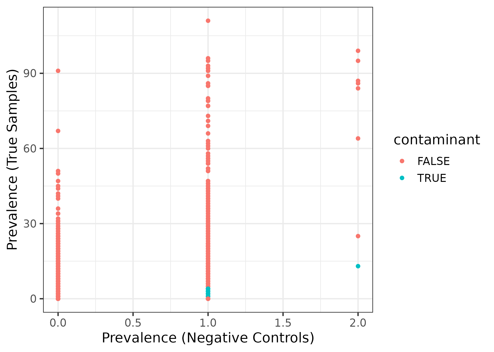

TeaTime4Schools joint analysis - fungi
================
Roey Angel
2021-05-21

-   [Preliminary analysis of MiSeq amplicon data for Evrona
    project](#preliminary-analysis-of-miseq-amplicon-data-for-evrona-project)
    -   [Setting general parameters:](#setting-general-parameters)
    -   [Reading in raw data and generate phyloseq
        object](#reading-in-raw-data-and-generate-phyloseq-object)
    -   [Inspect Library Sizes](#inspect-library-sizes)
    -   [Identify contaminants -
        Frequency](#identify-contaminants---frequency)
    -   [Identify contaminants -
        Prevalence](#identify-contaminants---prevalence)
    -   [Save contaminant sequence
        names](#save-contaminant-sequence-names)
-   [References](#references)

[roey.angel@bc.cas.cz](mailto:%20roey.angel@bc.cas.cz)

## Preliminary analysis of MiSeq amplicon data for Evrona project

Decontamination of sequence library based on [Introduction to
decontam](https://benjjneb.github.io/decontam/vignettes/decontam_intro.html)
and Davis and colleagues ([2017](#ref-davis_simple_2017)).
Decontamination is based on correlating sequence abundance frequencies
to initial DNA concentrations used for PCR and also on examining
sequence abundance prevalence patterns in the negative control samples.

### Setting general parameters:

``` r
set.seed(1000)
metadata_path <- "./"
data_path <- "./DADA2_pseudo/"
Metadata_table <- "TeaTime_joint_Fungi_metadata.csv"
Seq_table <- "DADA2.seqtab_nochim.tsv"
# Metadata_table <- ""
```

### Reading in raw data and generate phyloseq object

``` r
# read OTU mat from data file
Raw_data <- read_tsv(paste0(data_path, Seq_table), 
                        trim_ws = TRUE)

Raw_data[, 2:ncol(Raw_data)] %>% 
  t() %>% 
  as.data.frame() -> abundance_mat # convert to abundance matrix
colnames(abundance_mat) <- pull(Raw_data, "#OTU") # add sequence names

# get short names of samples
# abundance_mat %>% 
#   rownames() %>% 
#   str_remove("^Roey[0-9]{3,}-?") %>% 
#   str_split("_", simplify = T) %>% 
#   .[, 1] ->
#   short_names

# Read metadata file
Metadata <- read_csv(paste0(metadata_path, Metadata_table),
                        trim_ws = TRUE)
Metadata$Control %<>% fct_relevel("Biological", after = 1)

Metadata$Read1_file <- str_replace(Metadata$Read1_file, "(.*)_L001_R1_001.fastq.gz|\\.1\\.fastq.gz", "\\1")
Metadata <- Metadata[Metadata$Read1_file %in% rownames(abundance_mat), ] # remove metadata rows if the samples did not go through qual processing
Metadata %<>% mutate(`Conc. (ng/ul)` = replace(`Conc. (ng/ul)`, which(`Conc. (ng/ul)` == 0 | `Conc. (ng/ul)` < 0), 0.001)) # replace 0 conc. with 0.001

# Order abundance_mat samples according to the metadata
sample_order <- match(rownames(abundance_mat), Metadata$Read1_file)
abundance_mat %<>% arrange(., sample_order)
rownames(abundance_mat) <- Metadata$Read1_file # needed for pyhloseq

Metadata$LibrarySize <- rowSums(abundance_mat)
Metadata <- data.frame(row.names = Metadata$Read1_file, Metadata)

# generate phyloseq object
Ps_obj <- phyloseq(otu_table(abundance_mat, taxa_are_rows = FALSE),
                        sample_data(Metadata)
                        )
Ps_obj <- filter_taxa(Ps_obj, function(x) sum(x) > 0, TRUE) # remove 0 abundance taxa
Ps_obj <- subset_samples(Ps_obj, sample_sums(Ps_obj) > 0) # remove 0 abundance samples
```

### Inspect Library Sizes

``` r
Ps_obj_df <- get_variable(Ps_obj) # Put sample_data into a ggplot-friendly data.frame
Ps_obj_df <- Ps_obj_df[order(Ps_obj_df$LibrarySize), ]
Ps_obj_df$Index <- seq(nrow(Ps_obj_df))
ggplot(data = Ps_obj_df, 
       aes(x = Index, y = LibrarySize, color = Control)) + 
  geom_point() +
  scale_y_log10(breaks = c(
    min(Ps_obj_df$Lib.size),
    10,
    100,
    1000,
    5000,
    10000,
    ceiling(max(Ps_obj_df$Lib.size) / 10000) * 10000
    ))
```

<!-- -->

``` r
summary(sample_sums(Ps_obj))
```

    ##    Min. 1st Qu.  Median    Mean 3rd Qu.    Max. 
    ##       1   12692   17314   25410   37658  106614

``` r
summary(taxa_sums(Ps_obj))
```

    ##     Min.  1st Qu.   Median     Mean  3rd Qu.     Max. 
    ##      1.0      5.0     17.0    917.1    107.0 430201.0

No sample has 0 counts and only two controls have more sequences than
any true sample.

This is how many reads remained per control sample after DADA2 pipeline

``` r
Ps_obj %>% 
  subset_samples(., Control == "TRUE") %>% 
  sample_sums() %>% 
  sort() %>% 
  as_tibble(rownames = "Sample") %>% 
  rename(Reads = value) %>% 
  kable(.) %>%
  kable_styling(bootstrap_options = c("striped", "hover", "condensed", "responsive"), full_width = F)
```

<table class="table table-striped table-hover table-condensed table-responsive" style="width: auto !important; margin-left: auto; margin-right: auto;">
<thead>
<tr>
<th style="text-align:left;">
Sample
</th>
<th style="text-align:right;">
Reads
</th>
</tr>
</thead>
<tbody>
<tr>
<td style="text-align:left;">
Roey037-Extr-CTRL\_S182
</td>
<td style="text-align:right;">
2
</td>
</tr>
<tr>
<td style="text-align:left;">
Angel-ITS024-NTC\_S24
</td>
<td style="text-align:right;">
4
</td>
</tr>
<tr>
<td style="text-align:left;">
Roey038-CTRL\_S183
</td>
<td style="text-align:right;">
5
</td>
</tr>
<tr>
<td style="text-align:left;">
Petrova008-blank-extr\_S210
</td>
<td style="text-align:right;">
27
</td>
</tr>
<tr>
<td style="text-align:left;">
Eva24-NTC\_S36
</td>
<td style="text-align:right;">
23351
</td>
</tr>
</tbody>
</table>

Summary of all nono-control samples

``` r
# Ps_obj <-
  # subset_samples(Ps_obj, Sample.name != names(which(sample_sums(Ps_obj) == 0)))
Ps_obj %>% 
  subset_samples(., Control == "FALSE") %>% 
  sample_sums(.) %>% 
  summary()
```

    ##    Min. 1st Qu.  Median    Mean 3rd Qu.    Max. 
    ##       1   13059   17450   26230   38926  106614

### Identify contaminants - Frequency

Use the distribution of the frequency of each sequence feature as a
function of the input DNA concentration to identify contaminants.

``` r
contamdf.freq <-
  isContaminant(Ps_obj, method = "frequency", conc = "Conc...ng.ul.")
# print(contamdf.freq)
# How many contaminants are found?
table(contamdf.freq$contaminant)
```

    ## 
    ## FALSE  TRUE 
    ##  3669    16

``` r
# Which ones?
if (sum(contamdf.freq$contaminant) > 0) {
  contamdf.freq %>% 
    rownames_to_column(., var = "ESV") %>% 
    filter(contaminant == TRUE) %>% 
    kable(.) %>%
    kable_styling(bootstrap_options = c("striped", "hover", "condensed", "responsive"), full_width = F)
}
```

<table class="table table-striped table-hover table-condensed table-responsive" style="width: auto !important; margin-left: auto; margin-right: auto;">
<thead>
<tr>
<th style="text-align:left;">
ESV
</th>
<th style="text-align:right;">
freq
</th>
<th style="text-align:right;">
prev
</th>
<th style="text-align:right;">
p.freq
</th>
<th style="text-align:left;">
p.prev
</th>
<th style="text-align:right;">
p
</th>
<th style="text-align:left;">
contaminant
</th>
</tr>
</thead>
<tbody>
<tr>
<td style="text-align:left;">
Seq\_436
</td>
<td style="text-align:right;">
0.0001593
</td>
<td style="text-align:right;">
2
</td>
<td style="text-align:right;">
0.0305983
</td>
<td style="text-align:left;">
NA
</td>
<td style="text-align:right;">
0.0305983
</td>
<td style="text-align:left;">
TRUE
</td>
</tr>
<tr>
<td style="text-align:left;">
Seq\_466
</td>
<td style="text-align:right;">
0.0001387
</td>
<td style="text-align:right;">
12
</td>
<td style="text-align:right;">
0.0892144
</td>
<td style="text-align:left;">
NA
</td>
<td style="text-align:right;">
0.0892144
</td>
<td style="text-align:left;">
TRUE
</td>
</tr>
<tr>
<td style="text-align:left;">
Seq\_512
</td>
<td style="text-align:right;">
0.0001614
</td>
<td style="text-align:right;">
17
</td>
<td style="text-align:right;">
0.0416956
</td>
<td style="text-align:left;">
NA
</td>
<td style="text-align:right;">
0.0416956
</td>
<td style="text-align:left;">
TRUE
</td>
</tr>
<tr>
<td style="text-align:left;">
Seq\_652
</td>
<td style="text-align:right;">
0.0000515
</td>
<td style="text-align:right;">
4
</td>
<td style="text-align:right;">
0.0638644
</td>
<td style="text-align:left;">
NA
</td>
<td style="text-align:right;">
0.0638644
</td>
<td style="text-align:left;">
TRUE
</td>
</tr>
<tr>
<td style="text-align:left;">
Seq\_973
</td>
<td style="text-align:right;">
0.0000318
</td>
<td style="text-align:right;">
4
</td>
<td style="text-align:right;">
0.0010713
</td>
<td style="text-align:left;">
NA
</td>
<td style="text-align:right;">
0.0010713
</td>
<td style="text-align:left;">
TRUE
</td>
</tr>
<tr>
<td style="text-align:left;">
Seq\_1034
</td>
<td style="text-align:right;">
0.0000186
</td>
<td style="text-align:right;">
3
</td>
<td style="text-align:right;">
0.0352977
</td>
<td style="text-align:left;">
NA
</td>
<td style="text-align:right;">
0.0352977
</td>
<td style="text-align:left;">
TRUE
</td>
</tr>
<tr>
<td style="text-align:left;">
Seq\_1067
</td>
<td style="text-align:right;">
0.0000248
</td>
<td style="text-align:right;">
4
</td>
<td style="text-align:right;">
0.0817984
</td>
<td style="text-align:left;">
NA
</td>
<td style="text-align:right;">
0.0817984
</td>
<td style="text-align:left;">
TRUE
</td>
</tr>
<tr>
<td style="text-align:left;">
Seq\_1300
</td>
<td style="text-align:right;">
0.0000190
</td>
<td style="text-align:right;">
3
</td>
<td style="text-align:right;">
0.0935382
</td>
<td style="text-align:left;">
NA
</td>
<td style="text-align:right;">
0.0935382
</td>
<td style="text-align:left;">
TRUE
</td>
</tr>
<tr>
<td style="text-align:left;">
Seq\_1417
</td>
<td style="text-align:right;">
0.0000089
</td>
<td style="text-align:right;">
2
</td>
<td style="text-align:right;">
0.0683474
</td>
<td style="text-align:left;">
NA
</td>
<td style="text-align:right;">
0.0683474
</td>
<td style="text-align:left;">
TRUE
</td>
</tr>
<tr>
<td style="text-align:left;">
Seq\_1459
</td>
<td style="text-align:right;">
0.0075266
</td>
<td style="text-align:right;">
8
</td>
<td style="text-align:right;">
0.0029464
</td>
<td style="text-align:left;">
NA
</td>
<td style="text-align:right;">
0.0029464
</td>
<td style="text-align:left;">
TRUE
</td>
</tr>
<tr>
<td style="text-align:left;">
Seq\_1467
</td>
<td style="text-align:right;">
0.0000161
</td>
<td style="text-align:right;">
2
</td>
<td style="text-align:right;">
0.0360465
</td>
<td style="text-align:left;">
NA
</td>
<td style="text-align:right;">
0.0360465
</td>
<td style="text-align:left;">
TRUE
</td>
</tr>
<tr>
<td style="text-align:left;">
Seq\_1541
</td>
<td style="text-align:right;">
0.0000073
</td>
<td style="text-align:right;">
2
</td>
<td style="text-align:right;">
0.0335015
</td>
<td style="text-align:left;">
NA
</td>
<td style="text-align:right;">
0.0335015
</td>
<td style="text-align:left;">
TRUE
</td>
</tr>
<tr>
<td style="text-align:left;">
Seq\_1707
</td>
<td style="text-align:right;">
0.0000029
</td>
<td style="text-align:right;">
3
</td>
<td style="text-align:right;">
0.0514329
</td>
<td style="text-align:left;">
NA
</td>
<td style="text-align:right;">
0.0514329
</td>
<td style="text-align:left;">
TRUE
</td>
</tr>
<tr>
<td style="text-align:left;">
Seq\_1798
</td>
<td style="text-align:right;">
0.0000053
</td>
<td style="text-align:right;">
2
</td>
<td style="text-align:right;">
0.0020152
</td>
<td style="text-align:left;">
NA
</td>
<td style="text-align:right;">
0.0020152
</td>
<td style="text-align:left;">
TRUE
</td>
</tr>
<tr>
<td style="text-align:left;">
Seq\_1861
</td>
<td style="text-align:right;">
0.0000027
</td>
<td style="text-align:right;">
4
</td>
<td style="text-align:right;">
0.0953628
</td>
<td style="text-align:left;">
NA
</td>
<td style="text-align:right;">
0.0953628
</td>
<td style="text-align:left;">
TRUE
</td>
</tr>
<tr>
<td style="text-align:left;">
Seq\_1880
</td>
<td style="text-align:right;">
0.0000024
</td>
<td style="text-align:right;">
5
</td>
<td style="text-align:right;">
0.0839864
</td>
<td style="text-align:left;">
NA
</td>
<td style="text-align:right;">
0.0839864
</td>
<td style="text-align:left;">
TRUE
</td>
</tr>
</tbody>
</table>

Plot the frequency of the first 20 non-contaminant ESVs against the DNA
concentration, as an example.

``` r
plot_frequency(Ps_obj, taxa_names(Ps_obj)[which(!contamdf.freq$contaminant)[1:20]], conc = "Conc...ng.ul.")
```

<!-- -->

Plot the frequency of the the first 20 contaminant sequences against the
DNA concentration.

``` r
plot_frequency(Ps_obj, taxa_names(Ps_obj)[which(contamdf.freq$contaminant)[1:20]], conc = "Conc...ng.ul.")
```

<!-- -->

The frequency analysis detected 16 sequences as contaminants.

### Identify contaminants - Prevalence

Use the prevalence of sequences found in the control samples
(no-template controls) to identify contaminants.

``` r
Ps_obj_noBioControl <- subset_samples(Ps_obj, Control != "Biological") # remove "Biological control" samples
sample_data(Ps_obj_noBioControl)$Control <- sample_data(Ps_obj_noBioControl)$Control == "TRUE" # convert to logical
contamdf.prev <- isContaminant(Ps_obj_noBioControl, method = "prevalence", neg = "Control")
# How many contaminants are found?
table(contamdf.prev$contaminant)
```

    ## 
    ## FALSE  TRUE 
    ##  3636    49

``` r
# Which ones?
contamdf.prev %>% 
  rownames_to_column(., var = "ESV") %>% 
  filter(contaminant == TRUE) %>% 
  kable(.) %>%
  kable_styling(bootstrap_options = c("striped", "hover", "condensed", "responsive"), full_width = F)
```

<table class="table table-striped table-hover table-condensed table-responsive" style="width: auto !important; margin-left: auto; margin-right: auto;">
<thead>
<tr>
<th style="text-align:left;">
ESV
</th>
<th style="text-align:right;">
freq
</th>
<th style="text-align:right;">
prev
</th>
<th style="text-align:left;">
p.freq
</th>
<th style="text-align:right;">
p.prev
</th>
<th style="text-align:right;">
p
</th>
<th style="text-align:left;">
contaminant
</th>
</tr>
</thead>
<tbody>
<tr>
<td style="text-align:left;">
Seq\_372
</td>
<td style="text-align:right;">
0.0004424
</td>
<td style="text-align:right;">
15
</td>
<td style="text-align:left;">
NA
</td>
<td style="text-align:right;">
0.0554526
</td>
<td style="text-align:right;">
0.0554526
</td>
<td style="text-align:left;">
TRUE
</td>
</tr>
<tr>
<td style="text-align:left;">
Seq\_495
</td>
<td style="text-align:right;">
0.0000618
</td>
<td style="text-align:right;">
4
</td>
<td style="text-align:left;">
NA
</td>
<td style="text-align:right;">
0.0762817
</td>
<td style="text-align:right;">
0.0762817
</td>
<td style="text-align:left;">
TRUE
</td>
</tr>
<tr>
<td style="text-align:left;">
Seq\_507
</td>
<td style="text-align:right;">
0.0001194
</td>
<td style="text-align:right;">
5
</td>
<td style="text-align:left;">
NA
</td>
<td style="text-align:right;">
0.0952854
</td>
<td style="text-align:right;">
0.0952854
</td>
<td style="text-align:left;">
TRUE
</td>
</tr>
<tr>
<td style="text-align:left;">
Seq\_566
</td>
<td style="text-align:right;">
0.0000376
</td>
<td style="text-align:right;">
4
</td>
<td style="text-align:left;">
NA
</td>
<td style="text-align:right;">
0.0762817
</td>
<td style="text-align:right;">
0.0762817
</td>
<td style="text-align:left;">
TRUE
</td>
</tr>
<tr>
<td style="text-align:left;">
Seq\_608
</td>
<td style="text-align:right;">
0.0000349
</td>
<td style="text-align:right;">
3
</td>
<td style="text-align:left;">
NA
</td>
<td style="text-align:right;">
0.0572383
</td>
<td style="text-align:right;">
0.0572383
</td>
<td style="text-align:left;">
TRUE
</td>
</tr>
<tr>
<td style="text-align:left;">
Seq\_613
</td>
<td style="text-align:right;">
0.0000334
</td>
<td style="text-align:right;">
5
</td>
<td style="text-align:left;">
NA
</td>
<td style="text-align:right;">
0.0952854
</td>
<td style="text-align:right;">
0.0952854
</td>
<td style="text-align:left;">
TRUE
</td>
</tr>
<tr>
<td style="text-align:left;">
Seq\_671
</td>
<td style="text-align:right;">
0.0000267
</td>
<td style="text-align:right;">
3
</td>
<td style="text-align:left;">
NA
</td>
<td style="text-align:right;">
0.0572383
</td>
<td style="text-align:right;">
0.0572383
</td>
<td style="text-align:left;">
TRUE
</td>
</tr>
<tr>
<td style="text-align:left;">
Seq\_690
</td>
<td style="text-align:right;">
0.0000277
</td>
<td style="text-align:right;">
4
</td>
<td style="text-align:left;">
NA
</td>
<td style="text-align:right;">
0.0762817
</td>
<td style="text-align:right;">
0.0762817
</td>
<td style="text-align:left;">
TRUE
</td>
</tr>
<tr>
<td style="text-align:left;">
Seq\_884
</td>
<td style="text-align:right;">
0.0000147
</td>
<td style="text-align:right;">
4
</td>
<td style="text-align:left;">
NA
</td>
<td style="text-align:right;">
0.0762817
</td>
<td style="text-align:right;">
0.0762817
</td>
<td style="text-align:left;">
TRUE
</td>
</tr>
<tr>
<td style="text-align:left;">
Seq\_891
</td>
<td style="text-align:right;">
0.0000169
</td>
<td style="text-align:right;">
4
</td>
<td style="text-align:left;">
NA
</td>
<td style="text-align:right;">
0.0762817
</td>
<td style="text-align:right;">
0.0762817
</td>
<td style="text-align:left;">
TRUE
</td>
</tr>
<tr>
<td style="text-align:left;">
Seq\_920
</td>
<td style="text-align:right;">
0.0000261
</td>
<td style="text-align:right;">
5
</td>
<td style="text-align:left;">
NA
</td>
<td style="text-align:right;">
0.0952854
</td>
<td style="text-align:right;">
0.0952854
</td>
<td style="text-align:left;">
TRUE
</td>
</tr>
<tr>
<td style="text-align:left;">
Seq\_926
</td>
<td style="text-align:right;">
0.0000177
</td>
<td style="text-align:right;">
5
</td>
<td style="text-align:left;">
NA
</td>
<td style="text-align:right;">
0.0952854
</td>
<td style="text-align:right;">
0.0952854
</td>
<td style="text-align:left;">
TRUE
</td>
</tr>
<tr>
<td style="text-align:left;">
Seq\_949
</td>
<td style="text-align:right;">
0.0000183
</td>
<td style="text-align:right;">
5
</td>
<td style="text-align:left;">
NA
</td>
<td style="text-align:right;">
0.0952854
</td>
<td style="text-align:right;">
0.0952854
</td>
<td style="text-align:left;">
TRUE
</td>
</tr>
<tr>
<td style="text-align:left;">
Seq\_975
</td>
<td style="text-align:right;">
0.0000125
</td>
<td style="text-align:right;">
4
</td>
<td style="text-align:left;">
NA
</td>
<td style="text-align:right;">
0.0762817
</td>
<td style="text-align:right;">
0.0762817
</td>
<td style="text-align:left;">
TRUE
</td>
</tr>
<tr>
<td style="text-align:left;">
Seq\_982
</td>
<td style="text-align:right;">
0.0000230
</td>
<td style="text-align:right;">
4
</td>
<td style="text-align:left;">
NA
</td>
<td style="text-align:right;">
0.0762817
</td>
<td style="text-align:right;">
0.0762817
</td>
<td style="text-align:left;">
TRUE
</td>
</tr>
<tr>
<td style="text-align:left;">
Seq\_987
</td>
<td style="text-align:right;">
0.0000171
</td>
<td style="text-align:right;">
4
</td>
<td style="text-align:left;">
NA
</td>
<td style="text-align:right;">
0.0762817
</td>
<td style="text-align:right;">
0.0762817
</td>
<td style="text-align:left;">
TRUE
</td>
</tr>
<tr>
<td style="text-align:left;">
Seq\_989
</td>
<td style="text-align:right;">
0.0000181
</td>
<td style="text-align:right;">
4
</td>
<td style="text-align:left;">
NA
</td>
<td style="text-align:right;">
0.0762817
</td>
<td style="text-align:right;">
0.0762817
</td>
<td style="text-align:left;">
TRUE
</td>
</tr>
<tr>
<td style="text-align:left;">
Seq\_991
</td>
<td style="text-align:right;">
0.0000207
</td>
<td style="text-align:right;">
4
</td>
<td style="text-align:left;">
NA
</td>
<td style="text-align:right;">
0.0762817
</td>
<td style="text-align:right;">
0.0762817
</td>
<td style="text-align:left;">
TRUE
</td>
</tr>
<tr>
<td style="text-align:left;">
Seq\_1027
</td>
<td style="text-align:right;">
0.0000120
</td>
<td style="text-align:right;">
5
</td>
<td style="text-align:left;">
NA
</td>
<td style="text-align:right;">
0.0952854
</td>
<td style="text-align:right;">
0.0952854
</td>
<td style="text-align:left;">
TRUE
</td>
</tr>
<tr>
<td style="text-align:left;">
Seq\_1036
</td>
<td style="text-align:right;">
0.0000210
</td>
<td style="text-align:right;">
4
</td>
<td style="text-align:left;">
NA
</td>
<td style="text-align:right;">
0.0762817
</td>
<td style="text-align:right;">
0.0762817
</td>
<td style="text-align:left;">
TRUE
</td>
</tr>
<tr>
<td style="text-align:left;">
Seq\_1104
</td>
<td style="text-align:right;">
0.0000188
</td>
<td style="text-align:right;">
5
</td>
<td style="text-align:left;">
NA
</td>
<td style="text-align:right;">
0.0952854
</td>
<td style="text-align:right;">
0.0952854
</td>
<td style="text-align:left;">
TRUE
</td>
</tr>
<tr>
<td style="text-align:left;">
Seq\_1108
</td>
<td style="text-align:right;">
0.0000184
</td>
<td style="text-align:right;">
3
</td>
<td style="text-align:left;">
NA
</td>
<td style="text-align:right;">
0.0572383
</td>
<td style="text-align:right;">
0.0572383
</td>
<td style="text-align:left;">
TRUE
</td>
</tr>
<tr>
<td style="text-align:left;">
Seq\_1145
</td>
<td style="text-align:right;">
0.0000084
</td>
<td style="text-align:right;">
5
</td>
<td style="text-align:left;">
NA
</td>
<td style="text-align:right;">
0.0952854
</td>
<td style="text-align:right;">
0.0952854
</td>
<td style="text-align:left;">
TRUE
</td>
</tr>
<tr>
<td style="text-align:left;">
Seq\_1194
</td>
<td style="text-align:right;">
0.0000185
</td>
<td style="text-align:right;">
2
</td>
<td style="text-align:left;">
NA
</td>
<td style="text-align:right;">
0.0381679
</td>
<td style="text-align:right;">
0.0381679
</td>
<td style="text-align:left;">
TRUE
</td>
</tr>
<tr>
<td style="text-align:left;">
Seq\_1217
</td>
<td style="text-align:right;">
0.0000085
</td>
<td style="text-align:right;">
3
</td>
<td style="text-align:left;">
NA
</td>
<td style="text-align:right;">
0.0572383
</td>
<td style="text-align:right;">
0.0572383
</td>
<td style="text-align:left;">
TRUE
</td>
</tr>
<tr>
<td style="text-align:left;">
Seq\_1227
</td>
<td style="text-align:right;">
0.0000071
</td>
<td style="text-align:right;">
2
</td>
<td style="text-align:left;">
NA
</td>
<td style="text-align:right;">
0.0381679
</td>
<td style="text-align:right;">
0.0381679
</td>
<td style="text-align:left;">
TRUE
</td>
</tr>
<tr>
<td style="text-align:left;">
Seq\_1243
</td>
<td style="text-align:right;">
0.0000101
</td>
<td style="text-align:right;">
5
</td>
<td style="text-align:left;">
NA
</td>
<td style="text-align:right;">
0.0952854
</td>
<td style="text-align:right;">
0.0952854
</td>
<td style="text-align:left;">
TRUE
</td>
</tr>
<tr>
<td style="text-align:left;">
Seq\_1261
</td>
<td style="text-align:right;">
0.0000070
</td>
<td style="text-align:right;">
4
</td>
<td style="text-align:left;">
NA
</td>
<td style="text-align:right;">
0.0762817
</td>
<td style="text-align:right;">
0.0762817
</td>
<td style="text-align:left;">
TRUE
</td>
</tr>
<tr>
<td style="text-align:left;">
Seq\_1283
</td>
<td style="text-align:right;">
0.0000072
</td>
<td style="text-align:right;">
5
</td>
<td style="text-align:left;">
NA
</td>
<td style="text-align:right;">
0.0952854
</td>
<td style="text-align:right;">
0.0952854
</td>
<td style="text-align:left;">
TRUE
</td>
</tr>
<tr>
<td style="text-align:left;">
Seq\_1286
</td>
<td style="text-align:right;">
0.0000088
</td>
<td style="text-align:right;">
4
</td>
<td style="text-align:left;">
NA
</td>
<td style="text-align:right;">
0.0762817
</td>
<td style="text-align:right;">
0.0762817
</td>
<td style="text-align:left;">
TRUE
</td>
</tr>
<tr>
<td style="text-align:left;">
Seq\_1324
</td>
<td style="text-align:right;">
0.0000165
</td>
<td style="text-align:right;">
5
</td>
<td style="text-align:left;">
NA
</td>
<td style="text-align:right;">
0.0952854
</td>
<td style="text-align:right;">
0.0952854
</td>
<td style="text-align:left;">
TRUE
</td>
</tr>
<tr>
<td style="text-align:left;">
Seq\_1330
</td>
<td style="text-align:right;">
0.0000089
</td>
<td style="text-align:right;">
5
</td>
<td style="text-align:left;">
NA
</td>
<td style="text-align:right;">
0.0952854
</td>
<td style="text-align:right;">
0.0952854
</td>
<td style="text-align:left;">
TRUE
</td>
</tr>
<tr>
<td style="text-align:left;">
Seq\_1337
</td>
<td style="text-align:right;">
0.0000057
</td>
<td style="text-align:right;">
3
</td>
<td style="text-align:left;">
NA
</td>
<td style="text-align:right;">
0.0572383
</td>
<td style="text-align:right;">
0.0572383
</td>
<td style="text-align:left;">
TRUE
</td>
</tr>
<tr>
<td style="text-align:left;">
Seq\_1379
</td>
<td style="text-align:right;">
0.0000150
</td>
<td style="text-align:right;">
5
</td>
<td style="text-align:left;">
NA
</td>
<td style="text-align:right;">
0.0952854
</td>
<td style="text-align:right;">
0.0952854
</td>
<td style="text-align:left;">
TRUE
</td>
</tr>
<tr>
<td style="text-align:left;">
Seq\_1421
</td>
<td style="text-align:right;">
0.0000021
</td>
<td style="text-align:right;">
2
</td>
<td style="text-align:left;">
NA
</td>
<td style="text-align:right;">
0.0381679
</td>
<td style="text-align:right;">
0.0381679
</td>
<td style="text-align:left;">
TRUE
</td>
</tr>
<tr>
<td style="text-align:left;">
Seq\_1516
</td>
<td style="text-align:right;">
0.0000039
</td>
<td style="text-align:right;">
3
</td>
<td style="text-align:left;">
NA
</td>
<td style="text-align:right;">
0.0572383
</td>
<td style="text-align:right;">
0.0572383
</td>
<td style="text-align:left;">
TRUE
</td>
</tr>
<tr>
<td style="text-align:left;">
Seq\_1536
</td>
<td style="text-align:right;">
0.0000107
</td>
<td style="text-align:right;">
5
</td>
<td style="text-align:left;">
NA
</td>
<td style="text-align:right;">
0.0952854
</td>
<td style="text-align:right;">
0.0952854
</td>
<td style="text-align:left;">
TRUE
</td>
</tr>
<tr>
<td style="text-align:left;">
Seq\_1649
</td>
<td style="text-align:right;">
0.0000036
</td>
<td style="text-align:right;">
3
</td>
<td style="text-align:left;">
NA
</td>
<td style="text-align:right;">
0.0572383
</td>
<td style="text-align:right;">
0.0572383
</td>
<td style="text-align:left;">
TRUE
</td>
</tr>
<tr>
<td style="text-align:left;">
Seq\_1694
</td>
<td style="text-align:right;">
0.0000046
</td>
<td style="text-align:right;">
5
</td>
<td style="text-align:left;">
NA
</td>
<td style="text-align:right;">
0.0952854
</td>
<td style="text-align:right;">
0.0952854
</td>
<td style="text-align:left;">
TRUE
</td>
</tr>
<tr>
<td style="text-align:left;">
Seq\_1700
</td>
<td style="text-align:right;">
0.0000037
</td>
<td style="text-align:right;">
4
</td>
<td style="text-align:left;">
NA
</td>
<td style="text-align:right;">
0.0762817
</td>
<td style="text-align:right;">
0.0762817
</td>
<td style="text-align:left;">
TRUE
</td>
</tr>
<tr>
<td style="text-align:left;">
Seq\_1785
</td>
<td style="text-align:right;">
0.0000032
</td>
<td style="text-align:right;">
3
</td>
<td style="text-align:left;">
NA
</td>
<td style="text-align:right;">
0.0572383
</td>
<td style="text-align:right;">
0.0572383
</td>
<td style="text-align:left;">
TRUE
</td>
</tr>
<tr>
<td style="text-align:left;">
Seq\_1819
</td>
<td style="text-align:right;">
0.0000035
</td>
<td style="text-align:right;">
2
</td>
<td style="text-align:left;">
NA
</td>
<td style="text-align:right;">
0.0381679
</td>
<td style="text-align:right;">
0.0381679
</td>
<td style="text-align:left;">
TRUE
</td>
</tr>
<tr>
<td style="text-align:left;">
Seq\_1885
</td>
<td style="text-align:right;">
0.0000027
</td>
<td style="text-align:right;">
3
</td>
<td style="text-align:left;">
NA
</td>
<td style="text-align:right;">
0.0572383
</td>
<td style="text-align:right;">
0.0572383
</td>
<td style="text-align:left;">
TRUE
</td>
</tr>
<tr>
<td style="text-align:left;">
Seq\_1976
</td>
<td style="text-align:right;">
0.0000055
</td>
<td style="text-align:right;">
2
</td>
<td style="text-align:left;">
NA
</td>
<td style="text-align:right;">
0.0381679
</td>
<td style="text-align:right;">
0.0381679
</td>
<td style="text-align:left;">
TRUE
</td>
</tr>
<tr>
<td style="text-align:left;">
Seq\_2092
</td>
<td style="text-align:right;">
0.0000030
</td>
<td style="text-align:right;">
5
</td>
<td style="text-align:left;">
NA
</td>
<td style="text-align:right;">
0.0952854
</td>
<td style="text-align:right;">
0.0952854
</td>
<td style="text-align:left;">
TRUE
</td>
</tr>
<tr>
<td style="text-align:left;">
Seq\_2178
</td>
<td style="text-align:right;">
0.0000041
</td>
<td style="text-align:right;">
3
</td>
<td style="text-align:left;">
NA
</td>
<td style="text-align:right;">
0.0572383
</td>
<td style="text-align:right;">
0.0572383
</td>
<td style="text-align:left;">
TRUE
</td>
</tr>
<tr>
<td style="text-align:left;">
Seq\_2180
</td>
<td style="text-align:right;">
0.0000006
</td>
<td style="text-align:right;">
2
</td>
<td style="text-align:left;">
NA
</td>
<td style="text-align:right;">
0.0381679
</td>
<td style="text-align:right;">
0.0381679
</td>
<td style="text-align:left;">
TRUE
</td>
</tr>
<tr>
<td style="text-align:left;">
Seq\_2190
</td>
<td style="text-align:right;">
0.0000061
</td>
<td style="text-align:right;">
2
</td>
<td style="text-align:left;">
NA
</td>
<td style="text-align:right;">
0.0381679
</td>
<td style="text-align:right;">
0.0381679
</td>
<td style="text-align:left;">
TRUE
</td>
</tr>
<tr>
<td style="text-align:left;">
Seq\_2323
</td>
<td style="text-align:right;">
0.0000024
</td>
<td style="text-align:right;">
5
</td>
<td style="text-align:left;">
NA
</td>
<td style="text-align:right;">
0.0952854
</td>
<td style="text-align:right;">
0.0952854
</td>
<td style="text-align:left;">
TRUE
</td>
</tr>
</tbody>
</table>

``` r
# And using a more aggrssive threshold
contamdf.prev05 <- isContaminant(Ps_obj_noBioControl, method = "prevalence", neg = "Control", threshold = 0.5)
table(contamdf.prev05$contaminant)
```

    ## 
    ## FALSE  TRUE 
    ##  3421   264

``` r
# Make phyloseq object of presence-absence in negative controls
Ps_obj.pa <-
  transform_sample_counts(Ps_obj, function(abund)
    1 * (abund > 0))
Ps_obj.pa.neg <-
  prune_samples(sample_data(Ps_obj.pa)$Control == "TRUE", Ps_obj.pa)
Ps_obj.pa.pos <-
  prune_samples(sample_data(Ps_obj.pa)$Control == "FALSE", Ps_obj.pa)
# Make data.frame of prevalence in positive and negative samples
df.pa <-
  data.frame(
    pa.pos = taxa_sums(Ps_obj.pa.pos),
    pa.neg = taxa_sums(Ps_obj.pa.neg),
    contaminant = contamdf.prev$contaminant
  )
ggplot(data = df.pa, aes(x = pa.neg, y = pa.pos, color = contaminant)) + geom_point() +
  xlab("Prevalence (Negative Controls)") + ylab("Prevalence (True Samples)")
```

<!-- -->

The prevalence analysis detected 49 sequences as contaminants. In total
65 were detected as contaminants and will be removed.

### Save contaminant sequence names

``` r
c(taxa_names(Ps_obj)[which(contamdf.freq$contaminant)],
  taxa_names(Ps_obj)[which(contamdf.prev$contaminant)]) %>%
  data.frame() %>%
  write_csv(., 
            paste0(data_path, "decontam_contaminants.csv"), 
            col_names = FALSE)
```

``` r
sessioninfo::session_info() %>%
  details::details(
    summary = 'Current session info',
    open    = TRUE
 )
```

<details open>
<summary>
<span title="Click to Expand"> Current session info </span>
</summary>

``` r
─ Session info ─────────────────────────────────────────────────────────────────────────
 setting  value                       
 version  R version 4.0.3 (2020-10-10)
 os       Ubuntu 18.04.5 LTS          
 system   x86_64, linux-gnu           
 ui       X11                         
 language (EN)                        
 collate  en_US.UTF-8                 
 ctype    en_US.UTF-8                 
 tz       Europe/Prague               
 date     2021-05-21                  

─ Packages ─────────────────────────────────────────────────────────────────────────────
 package      * version date       lib source        
 ade4           1.7-16  2020-10-28 [1] CRAN (R 4.0.2)
 ape            5.5     2021-04-25 [1] CRAN (R 4.0.3)
 assertthat     0.2.1   2019-03-21 [1] CRAN (R 4.0.2)
 backports      1.2.1   2020-12-09 [1] CRAN (R 4.0.2)
 Biobase        2.50.0  2020-10-27 [1] Bioconductor  
 BiocGenerics   0.36.1  2021-04-16 [1] Bioconductor  
 biomformat     1.18.0  2020-10-27 [1] Bioconductor  
 Biostrings     2.58.0  2020-10-27 [1] Bioconductor  
 broom          0.7.6   2021-04-05 [1] CRAN (R 4.0.3)
 cellranger     1.1.0   2016-07-27 [1] CRAN (R 4.0.2)
 cli            2.5.0   2021-04-26 [1] CRAN (R 4.0.3)
 clipr          0.7.1   2020-10-08 [1] CRAN (R 4.0.2)
 cluster        2.1.2   2021-04-17 [1] CRAN (R 4.0.3)
 codetools      0.2-18  2020-11-04 [1] CRAN (R 4.0.2)
 colorspace     2.0-1   2021-05-04 [1] CRAN (R 4.0.3)
 cowplot      * 1.1.1   2020-12-30 [1] CRAN (R 4.0.2)
 crayon         1.4.1   2021-02-08 [1] CRAN (R 4.0.3)
 data.table     1.14.0  2021-02-21 [1] CRAN (R 4.0.3)
 DBI            1.1.1   2021-01-15 [1] CRAN (R 4.0.3)
 dbplyr         2.1.1   2021-04-06 [1] CRAN (R 4.0.3)
 decontam     * 1.10.0  2020-10-27 [1] Bioconductor  
 desc           1.3.0   2021-03-05 [1] CRAN (R 4.0.3)
 details        0.2.1   2020-01-12 [1] CRAN (R 4.0.2)
 digest         0.6.27  2020-10-24 [1] CRAN (R 4.0.2)
 dplyr        * 1.0.6   2021-05-05 [1] CRAN (R 4.0.3)
 ellipsis       0.3.2   2021-04-29 [1] CRAN (R 4.0.3)
 evaluate       0.14    2019-05-28 [1] CRAN (R 4.0.2)
 extrafont    * 0.17    2014-12-08 [1] CRAN (R 4.0.2)
 extrafontdb    1.0     2012-06-11 [1] CRAN (R 4.0.2)
 fansi          0.4.2   2021-01-15 [1] CRAN (R 4.0.3)
 farver         2.1.0   2021-02-28 [1] CRAN (R 4.0.3)
 forcats      * 0.5.1   2021-01-27 [1] CRAN (R 4.0.3)
 foreach        1.5.1   2020-10-15 [1] CRAN (R 4.0.2)
 fs             1.5.0   2020-07-31 [1] CRAN (R 4.0.2)
 generics       0.1.0   2020-10-31 [1] CRAN (R 4.0.2)
 ggplot2      * 3.3.3   2020-12-30 [1] CRAN (R 4.0.2)
 glue           1.4.2   2020-08-27 [1] CRAN (R 4.0.2)
 gtable         0.3.0   2019-03-25 [1] CRAN (R 4.0.2)
 haven          2.4.1   2021-04-23 [1] CRAN (R 4.0.3)
 highr          0.9     2021-04-16 [1] CRAN (R 4.0.3)
 hms            1.1.0   2021-05-17 [1] CRAN (R 4.0.3)
 htmltools      0.5.1.1 2021-01-22 [1] CRAN (R 4.0.3)
 httr           1.4.2   2020-07-20 [1] CRAN (R 4.0.2)
 igraph         1.2.6   2020-10-06 [1] CRAN (R 4.0.2)
 IRanges        2.24.1  2020-12-12 [1] Bioconductor  
 iterators      1.0.13  2020-10-15 [1] CRAN (R 4.0.2)
 jsonlite       1.7.2   2020-12-09 [1] CRAN (R 4.0.2)
 kableExtra   * 1.3.4   2021-02-20 [1] CRAN (R 4.0.3)
 knitr        * 1.33    2021-04-24 [1] CRAN (R 4.0.3)
 labeling       0.4.2   2020-10-20 [1] CRAN (R 4.0.2)
 lattice        0.20-44 2021-05-02 [1] CRAN (R 4.0.3)
 lifecycle      1.0.0   2021-02-15 [1] CRAN (R 4.0.3)
 lubridate      1.7.10  2021-02-26 [1] CRAN (R 4.0.3)
 magrittr     * 2.0.1   2020-11-17 [1] CRAN (R 4.0.2)
 MASS           7.3-54  2021-05-03 [1] CRAN (R 4.0.3)
 Matrix         1.3-3   2021-05-04 [1] CRAN (R 4.0.3)
 mgcv           1.8-35  2021-04-18 [1] CRAN (R 4.0.3)
 modelr         0.1.8   2020-05-19 [1] CRAN (R 4.0.2)
 multtest       2.46.0  2020-10-27 [1] Bioconductor  
 munsell        0.5.0   2018-06-12 [1] CRAN (R 4.0.2)
 nlme           3.1-152 2021-02-04 [1] CRAN (R 4.0.3)
 permute        0.9-5   2019-03-12 [1] CRAN (R 4.0.2)
 phyloseq     * 1.34.0  2020-10-27 [1] Bioconductor  
 pillar         1.6.1   2021-05-16 [1] CRAN (R 4.0.3)
 pkgconfig      2.0.3   2019-09-22 [1] CRAN (R 4.0.2)
 plyr           1.8.6   2020-03-03 [1] CRAN (R 4.0.2)
 png            0.1-7   2013-12-03 [1] CRAN (R 4.0.2)
 prettyunits    1.1.1   2020-01-24 [1] CRAN (R 4.0.2)
 progress       1.2.2   2019-05-16 [1] CRAN (R 4.0.2)
 purrr        * 0.3.4   2020-04-17 [1] CRAN (R 4.0.2)
 R6             2.5.0   2020-10-28 [1] CRAN (R 4.0.2)
 ragg         * 1.1.2   2021-03-17 [1] CRAN (R 4.0.3)
 Rcpp           1.0.6   2021-01-15 [1] CRAN (R 4.0.3)
 readr        * 1.4.0   2020-10-05 [1] CRAN (R 4.0.2)
 readxl         1.3.1   2019-03-13 [1] CRAN (R 4.0.2)
 reprex         2.0.0   2021-04-02 [1] CRAN (R 4.0.3)
 reshape2       1.4.4   2020-04-09 [1] CRAN (R 4.0.2)
 rhdf5          2.34.0  2020-10-27 [1] Bioconductor  
 rhdf5filters   1.2.1   2021-05-03 [1] Bioconductor  
 Rhdf5lib       1.12.1  2021-01-26 [1] Bioconductor  
 rlang          0.4.11  2021-04-30 [1] CRAN (R 4.0.3)
 rmarkdown    * 2.8     2021-05-07 [1] CRAN (R 4.0.3)
 rprojroot      2.0.2   2020-11-15 [1] CRAN (R 4.0.2)
 rstudioapi     0.13    2020-11-12 [1] CRAN (R 4.0.2)
 Rttf2pt1       1.3.8   2020-01-10 [1] CRAN (R 4.0.2)
 rvest          1.0.0   2021-03-09 [1] CRAN (R 4.0.3)
 S4Vectors      0.28.1  2020-12-09 [1] Bioconductor  
 scales       * 1.1.1   2020-05-11 [1] CRAN (R 4.0.2)
 sessioninfo    1.1.1   2018-11-05 [1] CRAN (R 4.0.2)
 stringi        1.6.2   2021-05-17 [1] CRAN (R 4.0.3)
 stringr      * 1.4.0   2019-02-10 [1] CRAN (R 4.0.2)
 survival       3.2-11  2021-04-26 [1] CRAN (R 4.0.3)
 svglite      * 2.0.0   2021-02-20 [1] CRAN (R 4.0.3)
 systemfonts    1.0.2   2021-05-11 [1] CRAN (R 4.0.3)
 textshaping    0.3.4   2021-05-11 [1] CRAN (R 4.0.3)
 tibble       * 3.1.2   2021-05-16 [1] CRAN (R 4.0.3)
 tidyr        * 1.1.3   2021-03-03 [1] CRAN (R 4.0.3)
 tidyselect     1.1.1   2021-04-30 [1] CRAN (R 4.0.3)
 tidyverse    * 1.3.1   2021-04-15 [1] CRAN (R 4.0.3)
 utf8           1.2.1   2021-03-12 [1] CRAN (R 4.0.3)
 vctrs          0.3.8   2021-04-29 [1] CRAN (R 4.0.3)
 vegan          2.5-7   2020-11-28 [1] CRAN (R 4.0.3)
 viridisLite    0.4.0   2021-04-13 [1] CRAN (R 4.0.3)
 webshot        0.5.2   2019-11-22 [1] CRAN (R 4.0.2)
 withr          2.4.2   2021-04-18 [1] CRAN (R 4.0.3)
 xfun           0.23    2021-05-15 [1] CRAN (R 4.0.3)
 xml2           1.3.2   2020-04-23 [1] CRAN (R 4.0.2)
 XVector        0.30.0  2020-10-27 [1] Bioconductor  
 yaml           2.2.1   2020-02-01 [1] CRAN (R 4.0.2)
 zlibbioc       1.36.0  2020-10-27 [1] Bioconductor  

[1] /home/angel/R/library
[2] /usr/local/lib/R/site-library
[3] /usr/lib/R/site-library
[4] /usr/lib/R/library
```

</details>

<br>

## References

<div id="refs" class="references csl-bib-body hanging-indent">

<div id="ref-davis_simple_2017" class="csl-entry">

Davis NM, Proctor D, Holmes SP *et al.* <span class="nocase">Simple
statistical identification and removal of contaminant sequences in
marker-gene and metagenomics data</span>. *bioRxiv* 2017:221499.

</div>

</div>
