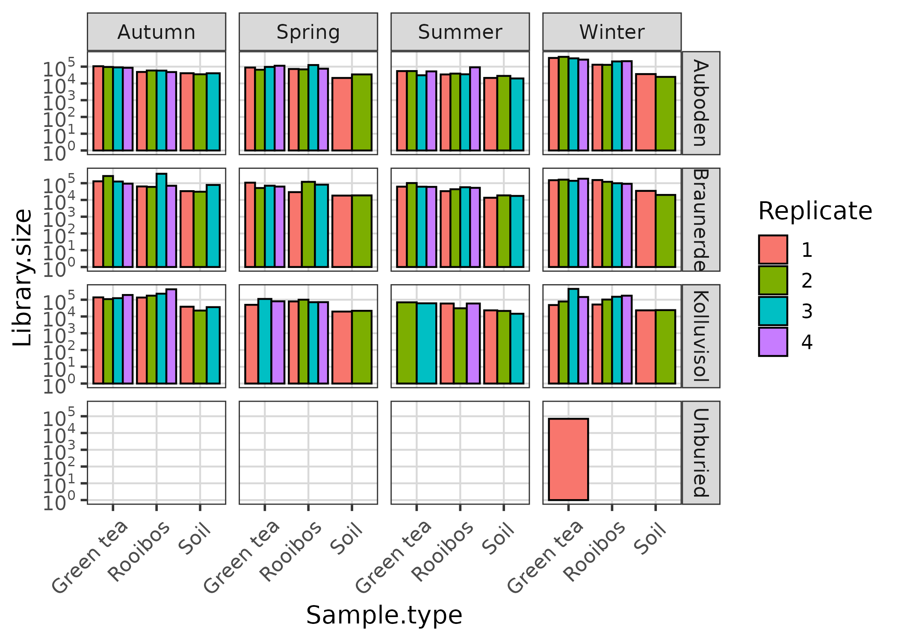

TeaTime4schools: joint analysis - fungi
================
Roey Angel
2021-05-21

-   [Read-depth distribution and
    normalisation](#read-depth-distribution-and-normalisation)
    -   [Setting general parameters:](#setting-general-parameters)
    -   [Reading in raw data and inspecting read-depth
        variations](#reading-in-raw-data-and-inspecting-read-depth-variations)
    -   [Exploring Ps\_obj dataset
        features](#exploring-ps_obj-dataset-features)
    -   [Try various normalisation
        methods](#try-various-normalisation-methods)
        -   [Rarefaction](#rarefaction)
        -   [GMPR (Chen and Chen 2017)](#gmpr-chen_gmpr_2017)
        -   [Cumulative sum scaling normalization (Paulson *et al.*
            2013)](#cumulative-sum-scaling-normalization-paulson_differential_2013)
        -   [Standardize abundances to the median sequencing depth (and
            convert to
            proportion)](#standardize-abundances-to-the-median-sequencing-depth-and-convert-to-proportion)
        -   [Standardize abundances using log transformation for
            variance
            stabilisation](#standardize-abundances-using-log-transformation-for-variance-stabilisation)
    -   [Standardize abundances using Centered-Log-Ratio transformation
        for variance stabilisation (Fernandes *et al.*
        2013)](#standardize-abundances-using-centered-log-ratio-transformation-for-variance-stabilisation-fernandes_anova-like_2013)
-   [References](#references)

[roey.angel@bc.cas.cz](mailto:%20roey.angel@bc.cas.cz)

## Read-depth distribution and normalisation

This analysis tests the effect of library read-depth distribution on the
community composition. It then performs various read-depth normalisation
methods on the DADA2 zOTU-based dataset, for determining the optimal
strategy to handle the bias of uneven read distribution.

### Setting general parameters:

``` r
set.seed(1000)
min_lib_size <- 5000
metadata_path <- "./"
data_path <- "./DADA2_pseudo/"
Metadata_table <- "TeaTime_joint_Fungi_metadata.csv"
Seq_table <- "DADA2.seqtab_nochim.tsv"
```

### Reading in raw data and inspecting read-depth variations

Read abundance table, taxonomic classification and metadata into a
phyloseq object. Also remove sequences detected as contaminanants in
[03\_Decontamination.html](03_Decontamination.html).

``` r
# read OTU mat from data file
Raw_data <- read_tsv(paste0(data_path, Seq_table), 
                        trim_ws = TRUE)
contaminant_seqs <- read_csv(paste0(data_path, "decontam_contaminants.csv"), 
                        trim_ws = TRUE,
                        col_names = FALSE)

Raw_data %<>% # remove contaminant OTUs. 
  # .[, -grep("CTRL", colnames(.))] %>% # remove ext. cont. 
  .[!(Raw_data$`#OTU` %in% contaminant_seqs$X1), ] 

Raw_data[, 2:ncol(Raw_data)] %>% 
  t() %>% 
  as.data.frame() -> abundance_mat # convert to abundance matrix
colnames(abundance_mat) <- pull(Raw_data, "#OTU") # add sequence names

# Read metadata file
read_csv(paste0(metadata_path, Metadata_table),
         trim_ws = TRUE) %>%
  mutate_at(
    c(
      "Workshop",
      "Season",
      "Run",
      "Type",
      "Sample type",
      "Field",
      "Replicate",
      "Control",
      "Gene"
    ),
    funs(factor(.))
  ) %>% 
  mutate_at(c("Extr. Date", "PCR products_ITS_send for seq"), funs(as.Date(., "%d.%m.%Y"))) ->
  Metadata
Metadata$Season %<>% fct_relevel("Winter", "Spring", "Summer", "Autumn")
Metadata$Read1_file <- str_replace(Metadata$Read1_file, "(.*)_L001_R1_001.fastq.gz|\\.1\\.fastq.gz", "\\1")
Metadata <- Metadata[Metadata$Read1_file %in% rownames(abundance_mat), ] # remove metadata rows if the samples did not go through qual processing

# Order abundance_mat samples according to the metadata
sample_order <- match(rownames(abundance_mat), Metadata$Read1_file)
abundance_mat %<>% 
  rownames_to_column('sample_name') %>% 
  arrange(., sample_order) %>% 
  column_to_rownames('sample_name') # needed for phyloseq

Metadata$Library.size <- rowSums(abundance_mat)
Metadata <- data.frame(row.names = Metadata$Read1_file, Metadata)

# generate phyloseq object
Ps_obj <- phyloseq(otu_table(abundance_mat, taxa_are_rows = FALSE),
                        sample_data(Metadata)
                        )
Ps_obj <- filter_taxa(Ps_obj, function(x) sum(x) > 0, TRUE) # remove 0 abundance taxa
Ps_obj <- subset_samples(Ps_obj, sample_sums(Ps_obj) > 0) # remove 0 abundance samples
# Remove mock and control samples
Ps_obj <- subset_samples(Ps_obj, Type != "Control" & Type != "Mock")

# Create a grouping variable for merging
sample_data(Ps_obj) %<>% 
  as(., "data.frame") %>% 
  # get_variable(., c("Sample.type", "Field", "Season", "Replicate")) %>% 
  unite(., "Description", c("Sample.type", "Field", "Season", "Replicate"), remove = FALSE)
sample_data(Ps_obj)$Description %<>% as_factor(.)

# merged_Ps_obj <- merge_samples(Ps_obj, "Description")
# merged_SD <- merge_samples(sample_data(Ps_obj), "Description")
Ps_obj_merged <- MergeSamples(Ps_obj, grouping_name = "Description")
```

### Exploring Ps\_obj dataset features

First let’s look at the count data distribution

``` r
PlotLibDist(Ps_obj)
```

<!-- -->

``` r
get_variable(Ps_obj) %>% 
  remove_rownames %>% 
  dplyr::select(Sample.name, Library.size) %>% 
  as(., "data.frame") %>% 
  format_engr() %>% 
  kable(., col.names = c("Sample name", "Library size")) %>%
  kable_styling(bootstrap_options = c("striped", "hover", "condensed", "responsive"), full_width = F)
```

<table class="table table-striped table-hover table-condensed table-responsive" style="width: auto !important; margin-left: auto; margin-right: auto;">
<thead>
<tr>
<th style="text-align:left;">
Sample name
</th>
<th style="text-align:left;">
Library size
</th>
</tr>
</thead>
<tbody>
<tr>
<td style="text-align:left;">
GK1
</td>
<td style="text-align:left;">
1.000
</td>
</tr>
<tr>
<td style="text-align:left;">
GK1
</td>
<td style="text-align:left;">
11.67 × 10<sup>3</sup>
</td>
</tr>
<tr>
<td style="text-align:left;">
GK2
</td>
<td style="text-align:left;">
20.05 × 10<sup>3</sup>
</td>
</tr>
<tr>
<td style="text-align:left;">
GK3
</td>
<td style="text-align:left;">
106.6 × 10<sup>3</sup>
</td>
</tr>
<tr>
<td style="text-align:left;">
GK4
</td>
<td style="text-align:left;">
43.48 × 10<sup>3</sup>
</td>
</tr>
<tr>
<td style="text-align:left;">
RK1
</td>
<td style="text-align:left;">
34.00
</td>
</tr>
<tr>
<td style="text-align:left;">
RK1
</td>
<td style="text-align:left;">
11.29 × 10<sup>3</sup>
</td>
</tr>
<tr>
<td style="text-align:left;">
RK2
</td>
<td style="text-align:left;">
54.28 × 10<sup>3</sup>
</td>
</tr>
<tr>
<td style="text-align:left;">
RK3
</td>
<td style="text-align:left;">
55.62 × 10<sup>3</sup>
</td>
</tr>
<tr>
<td style="text-align:left;">
RK4
</td>
<td style="text-align:left;">
55.37 × 10<sup>3</sup>
</td>
</tr>
<tr>
<td style="text-align:left;">
GB1
</td>
<td style="text-align:left;">
49.27 × 10<sup>3</sup>
</td>
</tr>
<tr>
<td style="text-align:left;">
GB2
</td>
<td style="text-align:left;">
62.46 × 10<sup>3</sup>
</td>
</tr>
<tr>
<td style="text-align:left;">
GB3
</td>
<td style="text-align:left;">
52.47 × 10<sup>3</sup>
</td>
</tr>
<tr>
<td style="text-align:left;">
GB4
</td>
<td style="text-align:left;">
46.56 × 10<sup>3</sup>
</td>
</tr>
<tr>
<td style="text-align:left;">
RB1
</td>
<td style="text-align:left;">
49.49 × 10<sup>3</sup>
</td>
</tr>
<tr>
<td style="text-align:left;">
RB2
</td>
<td style="text-align:left;">
53.02 × 10<sup>3</sup>
</td>
</tr>
<tr>
<td style="text-align:left;">
RB3
</td>
<td style="text-align:left;">
48.83 × 10<sup>3</sup>
</td>
</tr>
<tr>
<td style="text-align:left;">
RB4
</td>
<td style="text-align:left;">
39.35 × 10<sup>3</sup>
</td>
</tr>
<tr>
<td style="text-align:left;">
GA1
</td>
<td style="text-align:left;">
53.18 × 10<sup>3</sup>
</td>
</tr>
<tr>
<td style="text-align:left;">
GA2
</td>
<td style="text-align:left;">
55.46 × 10<sup>3</sup>
</td>
</tr>
<tr>
<td style="text-align:left;">
GA3
</td>
<td style="text-align:left;">
64.50 × 10<sup>3</sup>
</td>
</tr>
<tr>
<td style="text-align:left;">
GA4
</td>
<td style="text-align:left;">
56.81 × 10<sup>3</sup>
</td>
</tr>
<tr>
<td style="text-align:left;">
RA1
</td>
<td style="text-align:left;">
44.06 × 10<sup>3</sup>
</td>
</tr>
<tr>
<td style="text-align:left;">
RA2
</td>
<td style="text-align:left;">
50.26 × 10<sup>3</sup>
</td>
</tr>
<tr>
<td style="text-align:left;">
RA3
</td>
<td style="text-align:left;">
59.69 × 10<sup>3</sup>
</td>
</tr>
<tr>
<td style="text-align:left;">
RA4
</td>
<td style="text-align:left;">
57.62 × 10<sup>3</sup>
</td>
</tr>
<tr>
<td style="text-align:left;">
K1
</td>
<td style="text-align:left;">
1.000
</td>
</tr>
<tr>
<td style="text-align:left;">
K1
</td>
<td style="text-align:left;">
15.11 × 10<sup>3</sup>
</td>
</tr>
<tr>
<td style="text-align:left;">
B1
</td>
<td style="text-align:left;">
61.91 × 10<sup>3</sup>
</td>
</tr>
<tr>
<td style="text-align:left;">
A1
</td>
<td style="text-align:left;">
48.05 × 10<sup>3</sup>
</td>
</tr>
<tr>
<td style="text-align:left;">
A1-1-2
</td>
<td style="text-align:left;">
12.14 × 10<sup>3</sup>
</td>
</tr>
<tr>
<td style="text-align:left;">
B1-1-2
</td>
<td style="text-align:left;">
16.93 × 10<sup>3</sup>
</td>
</tr>
<tr>
<td style="text-align:left;">
K1-1-2
</td>
<td style="text-align:left;">
10.27 × 10<sup>3</sup>
</td>
</tr>
<tr>
<td style="text-align:left;">
GF
</td>
<td style="text-align:left;">
50.56 × 10<sup>3</sup>
</td>
</tr>
<tr>
<td style="text-align:left;">
GF
</td>
<td style="text-align:left;">
452.0
</td>
</tr>
<tr>
<td style="text-align:left;">
GK5
</td>
<td style="text-align:left;">
16.18 × 10<sup>3</sup>
</td>
</tr>
<tr>
<td style="text-align:left;">
GK7
</td>
<td style="text-align:left;">
13.58 × 10<sup>3</sup>
</td>
</tr>
<tr>
<td style="text-align:left;">
GK8
</td>
<td style="text-align:left;">
13.97 × 10<sup>3</sup>
</td>
</tr>
<tr>
<td style="text-align:left;">
RK5
</td>
<td style="text-align:left;">
15.01 × 10<sup>3</sup>
</td>
</tr>
<tr>
<td style="text-align:left;">
RK6
</td>
<td style="text-align:left;">
14.06 × 10<sup>3</sup>
</td>
</tr>
<tr>
<td style="text-align:left;">
RK7
</td>
<td style="text-align:left;">
12.61 × 10<sup>3</sup>
</td>
</tr>
<tr>
<td style="text-align:left;">
RK8
</td>
<td style="text-align:left;">
12.45 × 10<sup>3</sup>
</td>
</tr>
<tr>
<td style="text-align:left;">
GB5
</td>
<td style="text-align:left;">
10.84 × 10<sup>3</sup>
</td>
</tr>
<tr>
<td style="text-align:left;">
GB6
</td>
<td style="text-align:left;">
10.05 × 10<sup>3</sup>
</td>
</tr>
<tr>
<td style="text-align:left;">
GB7
</td>
<td style="text-align:left;">
11.75 × 10<sup>3</sup>
</td>
</tr>
<tr>
<td style="text-align:left;">
GB8
</td>
<td style="text-align:left;">
13.05 × 10<sup>3</sup>
</td>
</tr>
<tr>
<td style="text-align:left;">
RB5
</td>
<td style="text-align:left;">
9.411 × 10<sup>3</sup>
</td>
</tr>
<tr>
<td style="text-align:left;">
RB6
</td>
<td style="text-align:left;">
13.23 × 10<sup>3</sup>
</td>
</tr>
<tr>
<td style="text-align:left;">
RB7
</td>
<td style="text-align:left;">
11.02 × 10<sup>3</sup>
</td>
</tr>
<tr>
<td style="text-align:left;">
RB8
</td>
<td style="text-align:left;">
4.085 × 10<sup>3</sup>
</td>
</tr>
<tr>
<td style="text-align:left;">
GA5
</td>
<td style="text-align:left;">
13.39 × 10<sup>3</sup>
</td>
</tr>
<tr>
<td style="text-align:left;">
GA6
</td>
<td style="text-align:left;">
12.86 × 10<sup>3</sup>
</td>
</tr>
<tr>
<td style="text-align:left;">
GA7
</td>
<td style="text-align:left;">
12.65 × 10<sup>3</sup>
</td>
</tr>
<tr>
<td style="text-align:left;">
GA8
</td>
<td style="text-align:left;">
15.53 × 10<sup>3</sup>
</td>
</tr>
<tr>
<td style="text-align:left;">
RA5
</td>
<td style="text-align:left;">
10.50 × 10<sup>3</sup>
</td>
</tr>
<tr>
<td style="text-align:left;">
RA6
</td>
<td style="text-align:left;">
13.08 × 10<sup>3</sup>
</td>
</tr>
<tr>
<td style="text-align:left;">
RA7
</td>
<td style="text-align:left;">
16.76 × 10<sup>3</sup>
</td>
</tr>
<tr>
<td style="text-align:left;">
RA8
</td>
<td style="text-align:left;">
13.57 × 10<sup>3</sup>
</td>
</tr>
<tr>
<td style="text-align:left;">
K1-2-1
</td>
<td style="text-align:left;">
8.335 × 10<sup>3</sup>
</td>
</tr>
<tr>
<td style="text-align:left;">
B1-2-1
</td>
<td style="text-align:left;">
11.42 × 10<sup>3</sup>
</td>
</tr>
<tr>
<td style="text-align:left;">
A1-2-1
</td>
<td style="text-align:left;">
10.58 × 10<sup>3</sup>
</td>
</tr>
<tr>
<td style="text-align:left;">
K1-2-2
</td>
<td style="text-align:left;">
9.593 × 10<sup>3</sup>
</td>
</tr>
<tr>
<td style="text-align:left;">
B1-2-2
</td>
<td style="text-align:left;">
16.32 × 10<sup>3</sup>
</td>
</tr>
<tr>
<td style="text-align:left;">
A1-2-2
</td>
<td style="text-align:left;">
22.10 × 10<sup>3</sup>
</td>
</tr>
<tr>
<td style="text-align:left;">
GK10
</td>
<td style="text-align:left;">
13.90 × 10<sup>3</sup>
</td>
</tr>
<tr>
<td style="text-align:left;">
RK11 (GK11)
</td>
<td style="text-align:left;">
11.66 × 10<sup>3</sup>
</td>
</tr>
<tr>
<td style="text-align:left;">
RK9
</td>
<td style="text-align:left;">
11.50 × 10<sup>3</sup>
</td>
</tr>
<tr>
<td style="text-align:left;">
RK10
</td>
<td style="text-align:left;">
17.48 × 10<sup>3</sup>
</td>
</tr>
<tr>
<td style="text-align:left;">
RK12
</td>
<td style="text-align:left;">
19.09 × 10<sup>3</sup>
</td>
</tr>
<tr>
<td style="text-align:left;">
GB9
</td>
<td style="text-align:left;">
16.15 × 10<sup>3</sup>
</td>
</tr>
<tr>
<td style="text-align:left;">
GB10
</td>
<td style="text-align:left;">
13.35 × 10<sup>3</sup>
</td>
</tr>
<tr>
<td style="text-align:left;">
GB11
</td>
<td style="text-align:left;">
7.466 × 10<sup>3</sup>
</td>
</tr>
<tr>
<td style="text-align:left;">
GB12
</td>
<td style="text-align:left;">
12.33 × 10<sup>3</sup>
</td>
</tr>
<tr>
<td style="text-align:left;">
RB9
</td>
<td style="text-align:left;">
13.82 × 10<sup>3</sup>
</td>
</tr>
<tr>
<td style="text-align:left;">
RB10
</td>
<td style="text-align:left;">
15.35 × 10<sup>3</sup>
</td>
</tr>
<tr>
<td style="text-align:left;">
RB11
</td>
<td style="text-align:left;">
12.69 × 10<sup>3</sup>
</td>
</tr>
<tr>
<td style="text-align:left;">
RB12
</td>
<td style="text-align:left;">
11.41 × 10<sup>3</sup>
</td>
</tr>
<tr>
<td style="text-align:left;">
GA9
</td>
<td style="text-align:left;">
16.82 × 10<sup>3</sup>
</td>
</tr>
<tr>
<td style="text-align:left;">
GA10
</td>
<td style="text-align:left;">
12.60 × 10<sup>3</sup>
</td>
</tr>
<tr>
<td style="text-align:left;">
GA11
</td>
<td style="text-align:left;">
11.49 × 10<sup>3</sup>
</td>
</tr>
<tr>
<td style="text-align:left;">
GA12
</td>
<td style="text-align:left;">
10.33 × 10<sup>3</sup>
</td>
</tr>
<tr>
<td style="text-align:left;">
RA9
</td>
<td style="text-align:left;">
14.08 × 10<sup>3</sup>
</td>
</tr>
<tr>
<td style="text-align:left;">
RA10
</td>
<td style="text-align:left;">
14.53 × 10<sup>3</sup>
</td>
</tr>
<tr>
<td style="text-align:left;">
RA11
</td>
<td style="text-align:left;">
14.66 × 10<sup>3</sup>
</td>
</tr>
<tr>
<td style="text-align:left;">
RA12
</td>
<td style="text-align:left;">
33.49 × 10<sup>3</sup>
</td>
</tr>
<tr>
<td style="text-align:left;">
K1-3-1
</td>
<td style="text-align:left;">
23.42 × 10<sup>3</sup>
</td>
</tr>
<tr>
<td style="text-align:left;">
K1-3-2
</td>
<td style="text-align:left;">
15.36 × 10<sup>3</sup>
</td>
</tr>
<tr>
<td style="text-align:left;">
K1-3-3
</td>
<td style="text-align:left;">
16.45 × 10<sup>3</sup>
</td>
</tr>
<tr>
<td style="text-align:left;">
B1-3-1
</td>
<td style="text-align:left;">
16.03 × 10<sup>3</sup>
</td>
</tr>
<tr>
<td style="text-align:left;">
B1-3-2
</td>
<td style="text-align:left;">
17.03 × 10<sup>3</sup>
</td>
</tr>
<tr>
<td style="text-align:left;">
B1-3-3
</td>
<td style="text-align:left;">
16.50 × 10<sup>3</sup>
</td>
</tr>
<tr>
<td style="text-align:left;">
A1-3-1
</td>
<td style="text-align:left;">
17.27 × 10<sup>3</sup>
</td>
</tr>
<tr>
<td style="text-align:left;">
A1-3-2
</td>
<td style="text-align:left;">
20.85 × 10<sup>3</sup>
</td>
</tr>
<tr>
<td style="text-align:left;">
A1-3-3
</td>
<td style="text-align:left;">
17.25 × 10<sup>3</sup>
</td>
</tr>
<tr>
<td style="text-align:left;">
RK13
</td>
<td style="text-align:left;">
44.02 × 10<sup>3</sup>
</td>
</tr>
<tr>
<td style="text-align:left;">
RK14
</td>
<td style="text-align:left;">
40.04 × 10<sup>3</sup>
</td>
</tr>
<tr>
<td style="text-align:left;">
RK15
</td>
<td style="text-align:left;">
41.49 × 10<sup>3</sup>
</td>
</tr>
<tr>
<td style="text-align:left;">
RK16
</td>
<td style="text-align:left;">
47.68 × 10<sup>3</sup>
</td>
</tr>
<tr>
<td style="text-align:left;">
GK13
</td>
<td style="text-align:left;">
27.01 × 10<sup>3</sup>
</td>
</tr>
<tr>
<td style="text-align:left;">
GK14
</td>
<td style="text-align:left;">
22.53 × 10<sup>3</sup>
</td>
</tr>
<tr>
<td style="text-align:left;">
GK15
</td>
<td style="text-align:left;">
21.48 × 10<sup>3</sup>
</td>
</tr>
<tr>
<td style="text-align:left;">
GK16
</td>
<td style="text-align:left;">
20.87 × 10<sup>3</sup>
</td>
</tr>
<tr>
<td style="text-align:left;">
RB13
</td>
<td style="text-align:left;">
37.66 × 10<sup>3</sup>
</td>
</tr>
<tr>
<td style="text-align:left;">
RB14
</td>
<td style="text-align:left;">
33.11 × 10<sup>3</sup>
</td>
</tr>
<tr>
<td style="text-align:left;">
RB15
</td>
<td style="text-align:left;">
29.17 × 10<sup>3</sup>
</td>
</tr>
<tr>
<td style="text-align:left;">
RB16
</td>
<td style="text-align:left;">
30.71 × 10<sup>3</sup>
</td>
</tr>
<tr>
<td style="text-align:left;">
GB13
</td>
<td style="text-align:left;">
22.36 × 10<sup>3</sup>
</td>
</tr>
<tr>
<td style="text-align:left;">
GB14
</td>
<td style="text-align:left;">
25.17 × 10<sup>3</sup>
</td>
</tr>
<tr>
<td style="text-align:left;">
GB15
</td>
<td style="text-align:left;">
32.12 × 10<sup>3</sup>
</td>
</tr>
<tr>
<td style="text-align:left;">
GB16
</td>
<td style="text-align:left;">
29.38 × 10<sup>3</sup>
</td>
</tr>
<tr>
<td style="text-align:left;">
RA13
</td>
<td style="text-align:left;">
17.42 × 10<sup>3</sup>
</td>
</tr>
<tr>
<td style="text-align:left;">
RA14
</td>
<td style="text-align:left;">
40.01 × 10<sup>3</sup>
</td>
</tr>
<tr>
<td style="text-align:left;">
RA15
</td>
<td style="text-align:left;">
30.19 × 10<sup>3</sup>
</td>
</tr>
<tr>
<td style="text-align:left;">
RA16
</td>
<td style="text-align:left;">
27.13 × 10<sup>3</sup>
</td>
</tr>
<tr>
<td style="text-align:left;">
GA13
</td>
<td style="text-align:left;">
35.34 × 10<sup>3</sup>
</td>
</tr>
<tr>
<td style="text-align:left;">
GA14
</td>
<td style="text-align:left;">
40.33 × 10<sup>3</sup>
</td>
</tr>
<tr>
<td style="text-align:left;">
GA15
</td>
<td style="text-align:left;">
41.61 × 10<sup>3</sup>
</td>
</tr>
<tr>
<td style="text-align:left;">
GA16
</td>
<td style="text-align:left;">
23.40 × 10<sup>3</sup>
</td>
</tr>
<tr>
<td style="text-align:left;">
soil 6-1
</td>
<td style="text-align:left;">
28.26 × 10<sup>3</sup>
</td>
</tr>
<tr>
<td style="text-align:left;">
soil 6-2
</td>
<td style="text-align:left;">
21.66 × 10<sup>3</sup>
</td>
</tr>
<tr>
<td style="text-align:left;">
soil 6-3
</td>
<td style="text-align:left;">
33.95 × 10<sup>3</sup>
</td>
</tr>
<tr>
<td style="text-align:left;">
soil 5-1
</td>
<td style="text-align:left;">
35.86 × 10<sup>3</sup>
</td>
</tr>
<tr>
<td style="text-align:left;">
soil 5-2
</td>
<td style="text-align:left;">
29.39 × 10<sup>3</sup>
</td>
</tr>
<tr>
<td style="text-align:left;">
soil 5-3
</td>
<td style="text-align:left;">
41.97 × 10<sup>3</sup>
</td>
</tr>
<tr>
<td style="text-align:left;">
soil 4-1
</td>
<td style="text-align:left;">
34.01 × 10<sup>3</sup>
</td>
</tr>
<tr>
<td style="text-align:left;">
soil 4-2
</td>
<td style="text-align:left;">
28.03 × 10<sup>3</sup>
</td>
</tr>
<tr>
<td style="text-align:left;">
soil 4-3
</td>
<td style="text-align:left;">
35.86 × 10<sup>3</sup>
</td>
</tr>
</tbody>
</table>

The figure and table indicate only a small deviation in the number of
reads per samples.

``` r
(mod1 <- adonis(vegdist(otu_table(Ps_obj), method = "bray") ~ Library.size,
  data = get_variable(Ps_obj),
  permutations = 999
))
```

    ## 
    ## Call:
    ## adonis(formula = vegdist(otu_table(Ps_obj), method = "bray") ~      Library.size, data = get_variable(Ps_obj), permutations = 999) 
    ## 
    ## Permutation: free
    ## Number of permutations: 999
    ## 
    ## Terms added sequentially (first to last)
    ## 
    ##               Df SumsOfSqs MeanSqs F.Model      R2 Pr(>F)    
    ## Library.size   1     3.678  3.6779  9.6556 0.07171  0.001 ***
    ## Residuals    125    47.614  0.3809         0.92829           
    ## Total        126    51.292                 1.00000           
    ## ---
    ## Signif. codes:  0 '***' 0.001 '**' 0.01 '*' 0.05 '.' 0.1 ' ' 1

``` r
PlotReadHist(as(otu_table(Ps_obj), "matrix"))
```

<!-- -->

``` r
notAllZero <- (rowSums(t(otu_table(Ps_obj))) > 0)
meanSdPlot(as.matrix(log2(t(otu_table(Ps_obj))[notAllZero, ] + 1)))
```

<!-- -->
Nevertheless, modelling library size shows a significant effect of read
depth on the community structure (explaining only 7%). The reads
histogram shows as expected a highly sparse and skewed sequence matrix.
The mean vs SD also shows as expected large dependency of SD on the mean
reads of a sequence across all samples.

### Try various normalisation methods

``` r
# subsample libraries from 1000 to max(sample_sums(Ps_obj)) and test
for (i in seq(1000, max(sample_sums(Ps_obj)), 1000)) {
  min_seqs <<- i
  Ps_obj_pruned <- subset_samples(Ps_obj, sample_sums(Ps_obj) > i)
  mod <-
    adonis2(vegdist(otu_table(Ps_obj_pruned), method = "bray") ~ sample_sums(Ps_obj_pruned), # I use adonis2 because it gives a data.frame
      data = get_variable(Ps_obj_pruned),
      permutations = 999
    )
  Pval <- tidy(mod)$p.value[1]
  if (Pval > 0.05)
    break()
}
```

Only by subsetting the samples to a minimum library size of
4.1 × 10<sup>4</sup> sequences do we get independence from library size
but this forces us to drop 99 out of 127 samples.

Let’s see the effect of this

``` r
Ps_obj_pruned_harsh <- subset_samples(Ps_obj_merged, sample_sums(Ps_obj) > i)
adonis(
  vegdist(otu_table(Ps_obj_pruned_harsh), method = "bray") ~ Library.size,
  data =
    get_variable(Ps_obj_pruned_harsh),
  permutations = 999
)
```

    ## 
    ## Call:
    ## adonis(formula = vegdist(otu_table(Ps_obj_pruned_harsh), method = "bray") ~      Library.size, data = get_variable(Ps_obj_pruned_harsh), permutations = 999) 
    ## 
    ## Permutation: free
    ## Number of permutations: 999
    ## 
    ## Terms added sequentially (first to last)
    ## 
    ##              Df SumsOfSqs MeanSqs F.Model      R2 Pr(>F)    
    ## Library.size  1    1.7095 1.70949  6.3896 0.20356  0.001 ***
    ## Residuals    25    6.6885 0.26754         0.79644           
    ## Total        26    8.3980                 1.00000           
    ## ---
    ## Signif. codes:  0 '***' 0.001 '**' 0.01 '*' 0.05 '.' 0.1 ' ' 1

``` r
adonis(
  vegdist(otu_table(Ps_obj_pruned_harsh), method = "bray") ~ Field + Sample.type * Season,
  data =
    get_variable(Ps_obj_pruned_harsh),
  permutations = 999
)
```

    ## 
    ## Call:
    ## adonis(formula = vegdist(otu_table(Ps_obj_pruned_harsh), method = "bray") ~      Field + Sample.type * Season, data = get_variable(Ps_obj_pruned_harsh),      permutations = 999) 
    ## 
    ## Permutation: free
    ## Number of permutations: 999
    ## 
    ## Terms added sequentially (first to last)
    ## 
    ##                    Df SumsOfSqs MeanSqs F.Model      R2 Pr(>F)    
    ## Field               2    1.4977 0.74884  4.2842 0.17834  0.001 ***
    ## Sample.type         2    1.9713 0.98565  5.6390 0.23473  0.001 ***
    ## Season              2    1.0061 0.50305  2.8780 0.11980  0.002 ** 
    ## Sample.type:Season  1    0.6019 0.60189  3.4435 0.07167  0.001 ***
    ## Residuals          19    3.3210 0.17479         0.39546           
    ## Total              26    8.3980                 1.00000           
    ## ---
    ## Signif. codes:  0 '***' 0.001 '**' 0.01 '*' 0.05 '.' 0.1 ' ' 1

``` r
PlotReadHist(as(otu_table(Ps_obj_pruned_harsh), "matrix"))
```

<!-- -->

``` r
notAllZero <- (rowSums(t(otu_table(Ps_obj_pruned_harsh))) > 0)
meanSdPlot(as.matrix(log2(t(otu_table(Ps_obj_pruned_harsh))[notAllZero, ] + 1)))
```

<!-- -->

``` r
Pruned_ord <- ordinate(Ps_obj_pruned_harsh, "CAP", "bray", formula = Ps_obj_pruned_harsh ~ Field + Sample.type * Season)
plot_ordination(Ps_obj_pruned_harsh, Pruned_ord, type = "samples", color = "Sample.type", label = "Sample.name", shape = "Field") +
  facet_wrap(~ Season) #+
```

<!-- -->

``` r
  # geom_point(size = 5) +
  # geom_text(size = 5) 
```

Instead let’s drop all samples below 5000 reads and do try some
correction methods for library depths

``` r
Ps_obj_pruned_min <- subset_samples(Ps_obj_merged, sample_sums(Ps_obj_merged) > min_lib_size)
Ps_obj_pruned_min <- filter_taxa(Ps_obj_pruned_min, function(x) sum(x) > 0, TRUE)
```

#### Rarefaction

``` r
Ps_obj_pruned_rared <-
  rarefy_even_depth(
  Ps_obj_pruned_min,
  sample.size = min(sample_sums(Ps_obj_pruned_min)),
  rngseed = FALSE,
  replace = FALSE
  )
sample_data(Ps_obj_pruned_rared)$Library.size <- sample_sums(Ps_obj_pruned_rared)
# Ps_obj_pruned_rared <- Ps_obj_pruned_min
# Ps_obj_pruned_min %>%
#   otu_table() %>%
#   rowSums() %>%
#   min() %>%
#   rrarefy(otu_table(Ps_obj_pruned_min), .) ->
#   otu_table(Ps_obj_pruned_rared)

adonis(
  vegdist(otu_table(Ps_obj_pruned_rared), method = "bray") ~ Field + Sample.type * Season,
  data =
    get_variable(Ps_obj_pruned_rared),
  permutations = 999
)
```

    ## 
    ## Call:
    ## adonis(formula = vegdist(otu_table(Ps_obj_pruned_rared), method = "bray") ~      Field + Sample.type * Season, data = get_variable(Ps_obj_pruned_rared),      permutations = 999) 
    ## 
    ## Permutation: free
    ## Number of permutations: 999
    ## 
    ## Terms added sequentially (first to last)
    ## 
    ##                     Df SumsOfSqs MeanSqs F.Model      R2 Pr(>F)    
    ## Field                3     2.585  0.8616  4.0549 0.05492  0.001 ***
    ## Sample.type          2     7.128  3.5639 16.7722 0.15144  0.001 ***
    ## Season               3     8.713  2.9045 13.6688 0.18513  0.001 ***
    ## Sample.type:Season   6     5.905  0.9841  4.6313 0.12545  0.001 ***
    ## Residuals          107    22.736  0.2125         0.48306           
    ## Total              121    47.067                 1.00000           
    ## ---
    ## Signif. codes:  0 '***' 0.001 '**' 0.01 '*' 0.05 '.' 0.1 ' ' 1

``` r
PlotLibDist(Ps_obj_pruned_rared)
```

<!-- -->

``` r
PlotReadHist(as(otu_table(Ps_obj_pruned_rared), "matrix"))
```

<!-- -->

``` r
notAllZero <- (rowSums(t(otu_table(Ps_obj_pruned_rared))) > 0)
meanSdPlot(as.matrix(log2(t(otu_table(Ps_obj_pruned_rared))[notAllZero, ] + 1)))
```

<!-- -->

``` r
Rared_ord <- ordinate(Ps_obj_pruned_rared, "CAP", "bray", formula = Ps_obj_pruned_rared ~ Field + Sample.type * Season)
plot_ordination(Ps_obj_pruned_rared, Rared_ord, type = "samples", color = "Sample.type", label = "Sample.name", shape = "Field")  +
  facet_wrap(~ Season) #+
```

<!-- -->

``` r
  # geom_point(size = 5) 
```

#### GMPR ([Chen and Chen 2017](#ref-chen_gmpr:_2017))

``` r
Ps_obj_pruned_GMPR <- Ps_obj_pruned_min
Ps_obj_pruned_min %>%
  otu_table(.) %>%
  t() %>%
  as(., "matrix") %>%
  GMPR() ->
  GMPR_factors
```

    ## Begin GMPR size factor calculation ...
    ## 50 
    ## 100 
    ## Completed!
    ## Please watch for the samples with limited sharing with other samples based on NSS! They may be outliers!

``` r
Ps_obj_pruned_min %>%
  otu_table(.) %>%
  t() %*% diag(1 / GMPR_factors$gmpr) %>%
  t() %>%
  as.data.frame(., row.names = sample_names(Ps_obj_pruned_min)) %>%
  otu_table(., taxa_are_rows = FALSE) ->
  otu_table(Ps_obj_pruned_GMPR)
sample_data(Ps_obj_pruned_GMPR)$Library.size <- sample_sums(Ps_obj_pruned_GMPR)

adonis(
  vegdist(otu_table(Ps_obj_pruned_GMPR), method = "bray") ~ Library.size,
  data =
    get_variable(Ps_obj_pruned_GMPR),
  permutations = 999
)
```

    ## 
    ## Call:
    ## adonis(formula = vegdist(otu_table(Ps_obj_pruned_GMPR), method = "bray") ~      Library.size, data = get_variable(Ps_obj_pruned_GMPR), permutations = 999) 
    ## 
    ## Permutation: free
    ## Number of permutations: 999
    ## 
    ## Terms added sequentially (first to last)
    ## 
    ##               Df SumsOfSqs MeanSqs F.Model      R2 Pr(>F)    
    ## Library.size   1     1.555 1.55483  4.0262 0.03246  0.001 ***
    ## Residuals    120    46.341 0.38618         0.96754           
    ## Total        121    47.896                 1.00000           
    ## ---
    ## Signif. codes:  0 '***' 0.001 '**' 0.01 '*' 0.05 '.' 0.1 ' ' 1

``` r
adonis(
  vegdist(otu_table(Ps_obj_pruned_GMPR), method = "bray") ~ Field + Sample.type * Season,
  data =
    get_variable(Ps_obj_pruned_GMPR),
  permutations = 999
)
```

    ## 
    ## Call:
    ## adonis(formula = vegdist(otu_table(Ps_obj_pruned_GMPR), method = "bray") ~      Field + Sample.type * Season, data = get_variable(Ps_obj_pruned_GMPR),      permutations = 999) 
    ## 
    ## Permutation: free
    ## Number of permutations: 999
    ## 
    ## Terms added sequentially (first to last)
    ## 
    ##                     Df SumsOfSqs MeanSqs F.Model      R2 Pr(>F)    
    ## Field                3     2.509  0.8364  3.6631 0.05239  0.001 ***
    ## Sample.type          2     6.533  3.2663 14.3050 0.13639  0.001 ***
    ## Season               3     8.427  2.8090 12.3026 0.17595  0.001 ***
    ## Sample.type:Season   6     5.996  0.9993  4.3766 0.12519  0.001 ***
    ## Residuals          107    24.431  0.2283         0.51009           
    ## Total              121    47.896                 1.00000           
    ## ---
    ## Signif. codes:  0 '***' 0.001 '**' 0.01 '*' 0.05 '.' 0.1 ' ' 1

``` r
PlotLibDist(Ps_obj_pruned_GMPR)
```

<!-- -->

``` r
PlotReadHist(as(otu_table(Ps_obj_pruned_GMPR), "matrix"))
```

<!-- -->

``` r
notAllZero <- (rowSums(t(otu_table(Ps_obj_pruned_GMPR))) > 0)
meanSdPlot(as.matrix(log2(t(otu_table(Ps_obj_pruned_GMPR))[notAllZero, ] + 1)))
```

<!-- -->

``` r
GMPR_ord <- ordinate(Ps_obj_pruned_GMPR, "CAP", "bray", formula = Ps_obj_pruned_GMPR ~ Field + Sample.type * Season)
plot_ordination(Ps_obj_pruned_GMPR, GMPR_ord, type = "samples", color = "Sample.type", label = "Sample.name", shape = "Field") +
  facet_wrap(~ Season)
```

<!-- -->

#### Cumulative sum scaling normalization ([Paulson *et al.* 2013](#ref-paulson_differential_2013))

``` r
# Cumulative sum scaling normalization
Ps_obj_pruned_CSS <- Ps_obj_pruned_min

Ps_obj_pruned_CSS %>%
  otu_table(.) %>%
  t() %>%
  as(., "matrix") %>%
  newMRexperiment(.) ->
  mr_obj
p <- cumNormStatFast(mr_obj)
cumNormMat(mr_obj, p = p) %>% 
  otu_table(., taxa_are_rows = TRUE) ->
  otu_table(Ps_obj_pruned_CSS)

# Did any OTU produce Na?
Ps_obj_pruned_CSS %>% 
  otu_table() %>% 
  as(., "matrix") %>% 
  t(.) %>% 
  apply(., 2, function(x) !any(is.na(x))) %>% 
  unlist() ->
  OTUs2keep
Ps_obj_pruned_CSS <- prune_taxa(OTUs2keep, Ps_obj_pruned_CSS)
sample_data(Ps_obj_pruned_CSS)$Library.size <- sample_sums(Ps_obj_pruned_CSS)

# adonis(
#   vegdist(otu_table(Ps_obj_pruned_CS), method = "bray") ~ Library.size,
#   data =
#     as(sample_data(Ps_obj_pruned_CS), "data.frame"),
#   permutations = 999
# )
# adonis(
#   vegdist(otu_table(Ps_obj_pruned_CS), method = "bray") ~ Field + Sample.type * Season,
#   data =
#     as(sample_data(Ps_obj_pruned_CS), "data.frame"),
#   permutations = 999
# )

PlotLibDist(Ps_obj_pruned_CSS)
```

<!-- -->

``` r
PlotReadHist(as(otu_table(Ps_obj_pruned_CSS), "matrix"))
```

<!-- -->

``` r
notAllZero <- (rowSums(t(otu_table(Ps_obj_pruned_CSS))) > 0)
meanSdPlot(as(log2(t(otu_table(Ps_obj_pruned_CSS))[notAllZero, ] + 1), "matrix"))
```

<!-- -->

``` r
CSS_ord <- ordinate(Ps_obj_pruned_CSS, "CAP", "bray", formula = Ps_obj_pruned_CS ~ Field + Sample.type * Season)
plot_ordination(Ps_obj_pruned_CSS, CSS_ord, type = "samples", color = "Sample.type", label = "Sample.name", shape = "Field") +
  facet_wrap(~ Season)
```

<!-- -->

#### Standardize abundances to the median sequencing depth (and convert to proportion)

``` r
Ps_obj_pruned_min %>%
  otu_table(.) %>%
  as(., "matrix") %>%
  rowSums() %>% 
  median() ->
  total
standf = function(x, t=total) round(t * (x / sum(x)))
Ps_obj_pruned_median <- transform_sample_counts(Ps_obj_pruned_min, standf) # Standardize abundances to median sequencing depth
sample_data(Ps_obj_pruned_median)$Library.size <- sample_sums(Ps_obj_pruned_median)

adonis(
  vegdist(otu_table(Ps_obj_pruned_median), method = "bray") ~ Library.size,
  data =
    get_variable(Ps_obj_pruned_median),
  permutations = 999
)
```

    ## 
    ## Call:
    ## adonis(formula = vegdist(otu_table(Ps_obj_pruned_median), method = "bray") ~      Library.size, data = get_variable(Ps_obj_pruned_median),      permutations = 999) 
    ## 
    ## Permutation: free
    ## Number of permutations: 999
    ## 
    ## Terms added sequentially (first to last)
    ## 
    ##               Df SumsOfSqs MeanSqs F.Model      R2 Pr(>F)
    ## Library.size   1     0.364 0.36412 0.93626 0.00774  0.501
    ## Residuals    120    46.669 0.38890         0.99226       
    ## Total        121    47.033                 1.00000

``` r
adonis(
  vegdist(otu_table(Ps_obj_pruned_median), method = "bray") ~ Field + Sample.type * Season,
  data =
    get_variable(Ps_obj_pruned_median),
  permutations = 999
)
```

    ## 
    ## Call:
    ## adonis(formula = vegdist(otu_table(Ps_obj_pruned_median), method = "bray") ~      Field + Sample.type * Season, data = get_variable(Ps_obj_pruned_median),      permutations = 999) 
    ## 
    ## Permutation: free
    ## Number of permutations: 999
    ## 
    ## Terms added sequentially (first to last)
    ## 
    ##                     Df SumsOfSqs MeanSqs F.Model      R2 Pr(>F)    
    ## Field                3     2.599  0.8663  4.0950 0.05526  0.001 ***
    ## Sample.type          2     7.156  3.5780 16.9123 0.15215  0.001 ***
    ## Season               3     8.728  2.9092 13.7513 0.18557  0.001 ***
    ## Sample.type:Season   6     5.913  0.9855  4.6582 0.12572  0.001 ***
    ## Residuals          107    22.637  0.2116         0.48130           
    ## Total              121    47.033                 1.00000           
    ## ---
    ## Signif. codes:  0 '***' 0.001 '**' 0.01 '*' 0.05 '.' 0.1 ' ' 1

``` r
PlotLibDist(Ps_obj_pruned_median)
```

<!-- -->

``` r
PlotReadHist(as(otu_table(Ps_obj_pruned_median), "matrix"))
```

<!-- -->

``` r
notAllZero <- (rowSums(t(otu_table(Ps_obj_pruned_median))) > 0)
meanSdPlot(as(log2(t(otu_table(Ps_obj_pruned_median))[notAllZero, ] + 1), "matrix"))
```

<!-- -->

``` r
Median_ord <- ordinate(Ps_obj_pruned_median, "CAP", "bray", formula = Ps_obj_pruned_median ~ Field + Sample.type * Season)
plot_ordination(Ps_obj_pruned_median, Median_ord, type = "samples", color = "Sample.type", label = "Sample.name", shape = "Field") +
  facet_wrap(~ Season)
```

<!-- -->

#### Standardize abundances using log transformation for variance stabilisation

``` r
Ps_obj_pruned_log <- transform_sample_counts(Ps_obj_pruned_min, function(x) log(1 + x))

# Ps_obj_pruned_rlog <- Ps_obj_pruned_min
# Ps_obj_pruned_min %>%
#   transform_sample_counts(., function(x) (1 + x)) %>% # add pseudocount
#   phyloseq_to_deseq2(., ~ Spill) %>%
#   rlog(., blind = TRUE , fitType = "parametric") %>%
#   assay() %>%
#   otu_table(, taxa_are_rows = TRUE) ->
#   otu_table(Ps_obj_pruned_rlog)
sample_data(Ps_obj_pruned_log)$Library.size <- sample_sums(Ps_obj_pruned_log)

adonis(
  vegdist(otu_table(Ps_obj_pruned_log), method = "bray") ~ Library.size,
  data =
    get_variable(Ps_obj_pruned_log),
  permutations = 999
)
```

    ## 
    ## Call:
    ## adonis(formula = vegdist(otu_table(Ps_obj_pruned_log), method = "bray") ~      Library.size, data = get_variable(Ps_obj_pruned_log), permutations = 999) 
    ## 
    ## Permutation: free
    ## Number of permutations: 999
    ## 
    ## Terms added sequentially (first to last)
    ## 
    ##               Df SumsOfSqs MeanSqs F.Model      R2 Pr(>F)    
    ## Library.size   1     3.623  3.6229  11.969 0.09069  0.001 ***
    ## Residuals    120    36.325  0.3027         0.90931           
    ## Total        121    39.948                 1.00000           
    ## ---
    ## Signif. codes:  0 '***' 0.001 '**' 0.01 '*' 0.05 '.' 0.1 ' ' 1

``` r
adonis(
  vegdist(otu_table(Ps_obj_pruned_log), method = "bray") ~ Field + Sample.type * Season,
  data =
    get_variable(Ps_obj_pruned_log),
  permutations = 999
)
```

    ## 
    ## Call:
    ## adonis(formula = vegdist(otu_table(Ps_obj_pruned_log), method = "bray") ~      Field + Sample.type * Season, data = get_variable(Ps_obj_pruned_log),      permutations = 999) 
    ## 
    ## Permutation: free
    ## Number of permutations: 999
    ## 
    ## Terms added sequentially (first to last)
    ## 
    ##                     Df SumsOfSqs MeanSqs F.Model      R2 Pr(>F)    
    ## Field                3     2.606  0.8685  5.1782 0.06523  0.001 ***
    ## Sample.type          2     5.436  2.7182 16.2056 0.13609  0.001 ***
    ## Season               3     9.579  3.1930 19.0362 0.23979  0.001 ***
    ## Sample.type:Season   6     4.380  0.7299  4.3518 0.10963  0.001 ***
    ## Residuals          107    17.947  0.1677         0.44927           
    ## Total              121    39.948                 1.00000           
    ## ---
    ## Signif. codes:  0 '***' 0.001 '**' 0.01 '*' 0.05 '.' 0.1 ' ' 1

``` r
PlotLibDist(Ps_obj_pruned_log)
```

<!-- -->

``` r
PlotReadHist(as(otu_table(Ps_obj_pruned_log), "matrix"), b.width = 0.1)
```

<!-- -->

``` r
notAllZero <- (rowSums(t(otu_table(Ps_obj_pruned_log))) > 0)
meanSdPlot(as(log2(t(otu_table(Ps_obj_pruned_log))[notAllZero, ] + 1), "matrix"))
```

<!-- -->

``` r
Rlog_ord <- ordinate(Ps_obj_pruned_log, "CAP", "bray", formula = Ps_obj_pruned_log ~ Field + Sample.type * Season)
plot_ordination(Ps_obj_pruned_log, Rlog_ord, type = "samples", color = "Sample.type", label = "Sample.name", shape = "Field") +
  facet_wrap(~ Season)
```

<!-- -->

### Standardize abundances using Centered-Log-Ratio transformation for variance stabilisation ([Fernandes *et al.* 2013](#ref-fernandes_anova-like_2013))

``` r
Ps_obj_pruned_CLR <- phyloseq_CLR(Ps_obj_pruned_min)
```

    ## No. corrected values:  19792

``` r
sample_data(Ps_obj_pruned_CLR)$Library.size <- sample_sums(Ps_obj_pruned_CLR)

qplot(rowSums(otu_table(Ps_obj_pruned_CLR)), geom = "histogram") + 
  xlab("Library size")
```

<!-- -->

``` r
adonis(
  vegdist(otu_table(Ps_obj_pruned_CLR), method = "euclidean") ~ Library.size,
  data =
    get_variable(Ps_obj_pruned_CLR),
  permutations = 999
)
```

    ## 
    ## Call:
    ## adonis(formula = vegdist(otu_table(Ps_obj_pruned_CLR), method = "euclidean") ~      Library.size, data = get_variable(Ps_obj_pruned_CLR), permutations = 999) 
    ## 
    ## Permutation: free
    ## Number of permutations: 999
    ## 
    ## Terms added sequentially (first to last)
    ## 
    ##               Df SumsOfSqs MeanSqs F.Model      R2 Pr(>F)
    ## Library.size   1      4190  4190.5 0.90145 0.00746  0.557
    ## Residuals    120    557830  4648.6         0.99254       
    ## Total        121    562021                 1.00000

``` r
adonis(
  vegdist(otu_table(Ps_obj_pruned_CLR), method = "euclidean") ~ Field + Sample.type * Season,
  data =
    get_variable(Ps_obj_pruned_CLR),
  permutations = 999
)
```

    ## 
    ## Call:
    ## adonis(formula = vegdist(otu_table(Ps_obj_pruned_CLR), method = "euclidean") ~      Field + Sample.type * Season, data = get_variable(Ps_obj_pruned_CLR),      permutations = 999) 
    ## 
    ## Permutation: free
    ## Number of permutations: 999
    ## 
    ## Terms added sequentially (first to last)
    ## 
    ##                     Df SumsOfSqs MeanSqs F.Model      R2 Pr(>F)    
    ## Field                3     32888   10963  3.8004 0.05852  0.001 ***
    ## Sample.type          2     69782   34891 12.0954 0.12416  0.001 ***
    ## Season               3    104631   34877 12.0906 0.18617  0.001 ***
    ## Sample.type:Season   6     46063    7677  2.6614 0.08196  0.001 ***
    ## Residuals          107    308656    2885         0.54919           
    ## Total              121    562021                 1.00000           
    ## ---
    ## Signif. codes:  0 '***' 0.001 '**' 0.01 '*' 0.05 '.' 0.1 ' ' 1

``` r
PlotLibDist(Ps_obj_pruned_CLR)
```

<!-- -->

``` r
PlotReadHist(as(otu_table(Ps_obj_pruned_CLR), "matrix"), b.width = 0.1)
```

<!-- -->

``` r
notAllZero <- (rowSums(t(otu_table(Ps_obj_pruned_CLR))) > 0)
meanSdPlot(as(log2(t(otu_table(Ps_obj_pruned_CLR))[notAllZero, ] + 1), "matrix"))
```

<!-- -->

``` r
CLR_ord <- ordinate(Ps_obj_pruned_CLR, "RDA", formula = Ps_obj_pruned_CLR ~ Field + Sample.type * Season)
plot_ordination(Ps_obj_pruned_CLR, CLR_ord, type = "samples", color = "Sample.type", label = "Sample.name", shape = "Field") +
  facet_wrap(~ Season)
```

<!-- -->

``` r
sessioninfo::session_info() %>%
  details::details(
    summary = 'Current session info',
    open    = TRUE
 )
```

<details open>
<summary>
<span title="Click to Expand"> Current session info </span>
</summary>

``` r
─ Session info ─────────────────────────────────────────────────────────────────────────
 setting  value                       
 version  R version 4.0.3 (2020-10-10)
 os       Ubuntu 18.04.5 LTS          
 system   x86_64, linux-gnu           
 ui       X11                         
 language (EN)                        
 collate  en_US.UTF-8                 
 ctype    en_US.UTF-8                 
 tz       Europe/Prague               
 date     2021-05-21                  

─ Packages ─────────────────────────────────────────────────────────────────────────────
 package        * version date       lib source        
 ade4             1.7-16  2020-10-28 [1] CRAN (R 4.0.2)
 affy             1.68.0  2020-10-27 [1] Bioconductor  
 affyio           1.60.0  2020-10-27 [1] Bioconductor  
 ape            * 5.5     2021-04-25 [1] CRAN (R 4.0.3)
 assertthat       0.2.1   2019-03-21 [1] CRAN (R 4.0.2)
 backports        1.2.1   2020-12-09 [1] CRAN (R 4.0.2)
 Biobase        * 2.50.0  2020-10-27 [1] Bioconductor  
 BiocGenerics   * 0.36.1  2021-04-16 [1] Bioconductor  
 BiocManager      1.30.15 2021-05-11 [1] CRAN (R 4.0.3)
 biomformat       1.18.0  2020-10-27 [1] Bioconductor  
 Biostrings     * 2.58.0  2020-10-27 [1] Bioconductor  
 bit              4.0.4   2020-08-04 [1] CRAN (R 4.0.2)
 bit64            4.0.5   2020-08-30 [1] CRAN (R 4.0.2)
 bitops           1.0-7   2021-04-24 [1] CRAN (R 4.0.3)
 blob             1.2.1   2020-01-20 [1] CRAN (R 4.0.2)
 broom          * 0.7.6   2021-04-05 [1] CRAN (R 4.0.3)
 cachem           1.0.5   2021-05-15 [1] CRAN (R 4.0.3)
 caTools          1.18.2  2021-03-28 [1] CRAN (R 4.0.3)
 cellranger       1.1.0   2016-07-27 [1] CRAN (R 4.0.2)
 cli              2.5.0   2021-04-26 [1] CRAN (R 4.0.3)
 clipr            0.7.1   2020-10-08 [1] CRAN (R 4.0.2)
 cluster          2.1.2   2021-04-17 [1] CRAN (R 4.0.3)
 codetools        0.2-18  2020-11-04 [1] CRAN (R 4.0.2)
 colorspace       2.0-1   2021-05-04 [1] CRAN (R 4.0.3)
 cowplot        * 1.1.1   2020-12-30 [1] CRAN (R 4.0.2)
 crayon           1.4.1   2021-02-08 [1] CRAN (R 4.0.3)
 data.table       1.14.0  2021-02-21 [1] CRAN (R 4.0.3)
 DBI              1.1.1   2021-01-15 [1] CRAN (R 4.0.3)
 dbplyr           2.1.1   2021-04-06 [1] CRAN (R 4.0.3)
 DECIPHER       * 2.18.1  2020-10-29 [1] Bioconductor  
 desc             1.3.0   2021-03-05 [1] CRAN (R 4.0.3)
 details          0.2.1   2020-01-12 [1] CRAN (R 4.0.2)
 digest           0.6.27  2020-10-24 [1] CRAN (R 4.0.2)
 docxtools      * 0.2.2   2020-06-03 [1] CRAN (R 4.0.3)
 doParallel     * 1.0.16  2020-10-16 [1] CRAN (R 4.0.2)
 dplyr          * 1.0.6   2021-05-05 [1] CRAN (R 4.0.3)
 ellipsis         0.3.2   2021-04-29 [1] CRAN (R 4.0.3)
 evaluate         0.14    2019-05-28 [1] CRAN (R 4.0.2)
 extrafont      * 0.17    2014-12-08 [1] CRAN (R 4.0.2)
 extrafontdb      1.0     2012-06-11 [1] CRAN (R 4.0.2)
 fansi            0.4.2   2021-01-15 [1] CRAN (R 4.0.3)
 farver           2.1.0   2021-02-28 [1] CRAN (R 4.0.3)
 fastmap          1.1.0   2021-01-25 [1] CRAN (R 4.0.3)
 fastmatch        1.1-0   2017-01-28 [1] CRAN (R 4.0.2)
 forcats        * 0.5.1   2021-01-27 [1] CRAN (R 4.0.3)
 foreach        * 1.5.1   2020-10-15 [1] CRAN (R 4.0.2)
 fs               1.5.0   2020-07-31 [1] CRAN (R 4.0.2)
 generics         0.1.0   2020-10-31 [1] CRAN (R 4.0.2)
 ggplot2        * 3.3.3   2020-12-30 [1] CRAN (R 4.0.2)
 ggsci          * 2.9     2018-05-14 [1] CRAN (R 4.0.2)
 glmnet         * 4.1-1   2021-02-21 [1] CRAN (R 4.0.3)
 glue             1.4.2   2020-08-27 [1] CRAN (R 4.0.2)
 gplots           3.1.1   2020-11-28 [1] CRAN (R 4.0.2)
 gridExtra      * 2.3     2017-09-09 [1] CRAN (R 4.0.2)
 gtable           0.3.0   2019-03-25 [1] CRAN (R 4.0.2)
 gtools           3.8.2   2020-03-31 [1] CRAN (R 4.0.2)
 haven            2.4.1   2021-04-23 [1] CRAN (R 4.0.3)
 hexbin           1.28.2  2021-01-08 [1] CRAN (R 4.0.2)
 highr            0.9     2021-04-16 [1] CRAN (R 4.0.3)
 hms              1.1.0   2021-05-17 [1] CRAN (R 4.0.3)
 htmltools        0.5.1.1 2021-01-22 [1] CRAN (R 4.0.3)
 httr             1.4.2   2020-07-20 [1] CRAN (R 4.0.2)
 igraph           1.2.6   2020-10-06 [1] CRAN (R 4.0.2)
 IRanges        * 2.24.1  2020-12-12 [1] Bioconductor  
 iterators      * 1.0.13  2020-10-15 [1] CRAN (R 4.0.2)
 jsonlite         1.7.2   2020-12-09 [1] CRAN (R 4.0.2)
 kableExtra     * 1.3.4   2021-02-20 [1] CRAN (R 4.0.3)
 KernSmooth       2.23-20 2021-05-03 [1] CRAN (R 4.0.3)
 knitr          * 1.33    2021-04-24 [1] CRAN (R 4.0.3)
 labeling         0.4.2   2020-10-20 [1] CRAN (R 4.0.2)
 lattice        * 0.20-44 2021-05-02 [1] CRAN (R 4.0.3)
 lifecycle        1.0.0   2021-02-15 [1] CRAN (R 4.0.3)
 limma          * 3.46.0  2020-10-27 [1] Bioconductor  
 locfit           1.5-9.4 2020-03-25 [1] CRAN (R 4.0.2)
 lubridate        1.7.10  2021-02-26 [1] CRAN (R 4.0.3)
 magrittr       * 2.0.1   2020-11-17 [1] CRAN (R 4.0.2)
 MASS           * 7.3-54  2021-05-03 [1] CRAN (R 4.0.3)
 Matrix         * 1.3-3   2021-05-04 [1] CRAN (R 4.0.3)
 matrixStats    * 0.58.0  2021-01-29 [1] CRAN (R 4.0.3)
 memoise          2.0.0   2021-01-26 [1] CRAN (R 4.0.3)
 metagenomeSeq  * 1.32.0  2020-10-27 [1] Bioconductor  
 mgcv             1.8-35  2021-04-18 [1] CRAN (R 4.0.3)
 modelr           0.1.8   2020-05-19 [1] CRAN (R 4.0.2)
 multtest       * 2.46.0  2020-10-27 [1] Bioconductor  
 munsell          0.5.0   2018-06-12 [1] CRAN (R 4.0.2)
 NADA           * 1.6-1.1 2020-03-22 [1] CRAN (R 4.0.2)
 nlme             3.1-152 2021-02-04 [1] CRAN (R 4.0.3)
 permute        * 0.9-5   2019-03-12 [1] CRAN (R 4.0.2)
 phangorn       * 2.7.0   2021-05-03 [1] CRAN (R 4.0.3)
 phyloseq       * 1.34.0  2020-10-27 [1] Bioconductor  
 pillar           1.6.1   2021-05-16 [1] CRAN (R 4.0.3)
 pkgconfig        2.0.3   2019-09-22 [1] CRAN (R 4.0.2)
 plyr             1.8.6   2020-03-03 [1] CRAN (R 4.0.2)
 png              0.1-7   2013-12-03 [1] CRAN (R 4.0.2)
 preprocessCore   1.52.1  2021-01-08 [1] Bioconductor  
 prettyunits      1.1.1   2020-01-24 [1] CRAN (R 4.0.2)
 progress         1.2.2   2019-05-16 [1] CRAN (R 4.0.2)
 purrr          * 0.3.4   2020-04-17 [1] CRAN (R 4.0.2)
 quadprog         1.5-8   2019-11-20 [1] CRAN (R 4.0.2)
 R6               2.5.0   2020-10-28 [1] CRAN (R 4.0.2)
 ragg           * 1.1.2   2021-03-17 [1] CRAN (R 4.0.3)
 RColorBrewer   * 1.1-2   2014-12-07 [1] CRAN (R 4.0.2)
 Rcpp             1.0.6   2021-01-15 [1] CRAN (R 4.0.3)
 readr          * 1.4.0   2020-10-05 [1] CRAN (R 4.0.2)
 readxl           1.3.1   2019-03-13 [1] CRAN (R 4.0.2)
 reprex           2.0.0   2021-04-02 [1] CRAN (R 4.0.3)
 reshape2         1.4.4   2020-04-09 [1] CRAN (R 4.0.2)
 rhdf5            2.34.0  2020-10-27 [1] Bioconductor  
 rhdf5filters     1.2.1   2021-05-03 [1] Bioconductor  
 Rhdf5lib         1.12.1  2021-01-26 [1] Bioconductor  
 rlang            0.4.11  2021-04-30 [1] CRAN (R 4.0.3)
 rmarkdown      * 2.8     2021-05-07 [1] CRAN (R 4.0.3)
 rprojroot        2.0.2   2020-11-15 [1] CRAN (R 4.0.2)
 RSQLite        * 2.2.7   2021-04-22 [1] CRAN (R 4.0.3)
 rstudioapi       0.13    2020-11-12 [1] CRAN (R 4.0.2)
 Rttf2pt1         1.3.8   2020-01-10 [1] CRAN (R 4.0.2)
 rvest            1.0.0   2021-03-09 [1] CRAN (R 4.0.3)
 S4Vectors      * 0.28.1  2020-12-09 [1] Bioconductor  
 scales         * 1.1.1   2020-05-11 [1] CRAN (R 4.0.2)
 sessioninfo      1.1.1   2018-11-05 [1] CRAN (R 4.0.2)
 shape            1.4.6   2021-05-19 [1] CRAN (R 4.0.3)
 stringi          1.6.2   2021-05-17 [1] CRAN (R 4.0.3)
 stringr        * 1.4.0   2019-02-10 [1] CRAN (R 4.0.2)
 survival       * 3.2-11  2021-04-26 [1] CRAN (R 4.0.3)
 svglite        * 2.0.0   2021-02-20 [1] CRAN (R 4.0.3)
 systemfonts      1.0.2   2021-05-11 [1] CRAN (R 4.0.3)
 textshaping      0.3.4   2021-05-11 [1] CRAN (R 4.0.3)
 tibble         * 3.1.2   2021-05-16 [1] CRAN (R 4.0.3)
 tidyr          * 1.1.3   2021-03-03 [1] CRAN (R 4.0.3)
 tidyselect       1.1.1   2021-04-30 [1] CRAN (R 4.0.3)
 tidyverse      * 1.3.1   2021-04-15 [1] CRAN (R 4.0.3)
 truncnorm      * 1.0-8   2018-02-27 [1] CRAN (R 4.0.2)
 utf8             1.2.1   2021-03-12 [1] CRAN (R 4.0.3)
 vctrs            0.3.8   2021-04-29 [1] CRAN (R 4.0.3)
 vegan          * 2.5-7   2020-11-28 [1] CRAN (R 4.0.3)
 viridisLite      0.4.0   2021-04-13 [1] CRAN (R 4.0.3)
 vsn            * 3.58.0  2020-10-27 [1] Bioconductor  
 webshot          0.5.2   2019-11-22 [1] CRAN (R 4.0.2)
 withr            2.4.2   2021-04-18 [1] CRAN (R 4.0.3)
 Wrench           1.8.0   2020-10-27 [1] Bioconductor  
 xfun             0.23    2021-05-15 [1] CRAN (R 4.0.3)
 xml2             1.3.2   2020-04-23 [1] CRAN (R 4.0.2)
 XVector        * 0.30.0  2020-10-27 [1] Bioconductor  
 yaml             2.2.1   2020-02-01 [1] CRAN (R 4.0.2)
 zCompositions  * 1.3.4   2020-03-04 [1] CRAN (R 4.0.2)
 zlibbioc         1.36.0  2020-10-27 [1] Bioconductor  

[1] /home/angel/R/library
[2] /usr/local/lib/R/site-library
[3] /usr/lib/R/site-library
[4] /usr/lib/R/library
```

</details>

<br>

## References

<div id="refs" class="references csl-bib-body hanging-indent">

<div id="ref-chen_gmpr:_2017" class="csl-entry">

Chen J, Chen L. <span class="nocase">GMPR: A novel normalization method
for microbiome sequencing data</span>. *bioRxiv* 2017:112565.

</div>

<div id="ref-fernandes_anova-like_2013" class="csl-entry">

Fernandes AD, Macklaim JM, Linn TG *et al.* ANOVA-Like Differential
Expression (ALDEx) Analysis for Mixed Population RNA-Seq. *PLOS ONE*
2013;**8**:e67019.

</div>

<div id="ref-paulson_differential_2013" class="csl-entry">

Paulson JN, Stine OC, Bravo HC *et al.* <span
class="nocase">Differential abundance analysis for microbial marker-gene
surveys</span>. *Nat Meth* 2013;**10**:1200–2.

</div>

</div>
