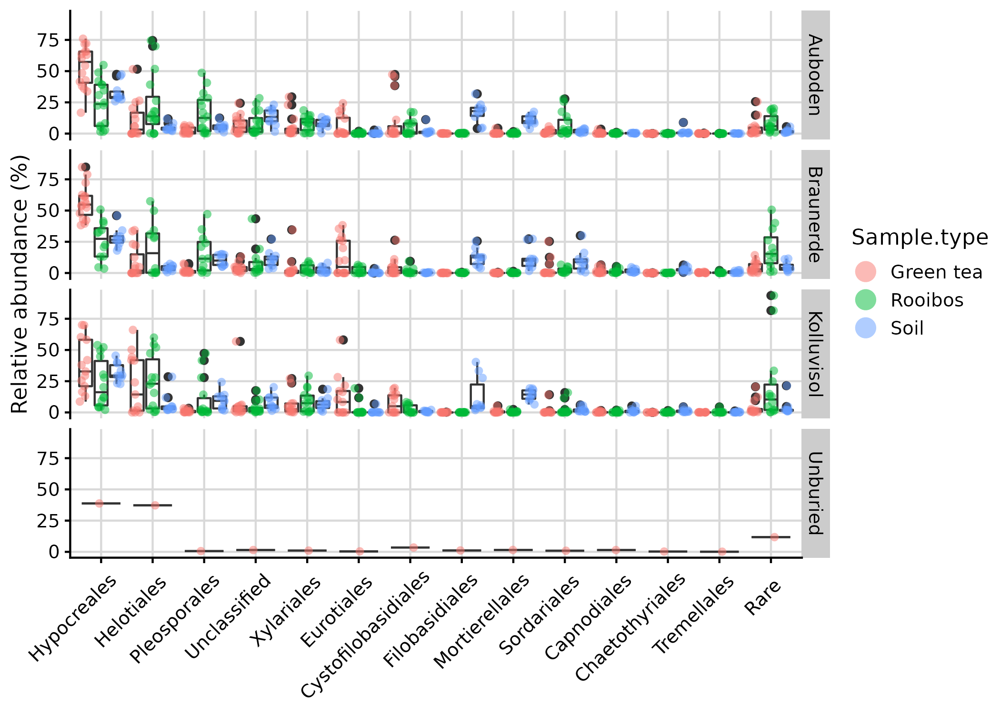

TeaTime4schools: joint analysis - fungi
================
Roey Angel
2021-05-21

-   [Taxonomical analysis](#taxonomical-analysis)
    -   [Setting general parameters:](#setting-general-parameters)
    -   [Reading in raw data](#reading-in-raw-data)
    -   [Exploring Ps\_obj dataset
        features](#exploring-ps_obj-dataset-features)
        -   [Taxa-based filtering](#taxa-based-filtering)
    -   [General taxonomic features](#general-taxonomic-features)
        -   [Explore abundance distribution of specific
            taxa](#explore-abundance-distribution-of-specific-taxa)
    -   [Taxa violin plots](#taxa-violin-plots)
    -   [Taxa box-plot](#taxa-box-plot)
        -   [Make Krona plots](#make-krona-plots)
        -   [Save filtered phyloseq
            object](#save-filtered-phyloseq-object)
-   [References](#references)

[roey.angel@bc.cas.cz](mailto:%20roey.angel@bc.cas.cz)

## Taxonomical analysis

This analysis explores the taxonomical ditribution patters in the
different samples, based on the DADA2-produced sequences. Large parts of
this script are based on [this
protocol](https://f1000research.com/articles/5-1492/v2) and the
accompanying publichation by Callahan and colleagues
([2016](#ref-callahan_bioconductor_2016)).

### Setting general parameters:

``` r
set.seed(1000)
min_lib_size <- 5000
metadata_path <- "./"
data_path <- "./DADA2_pseudo/"
Metadata_table <- "TeaTime_joint_Fungi_metadata.csv"
Seq_table <- "DADA2.seqtab_nochim.tsv"
Tax_table <- "DADA2.taxa_unite.tsv"
Proj_name <- "TeaTime4Schools"
```

### Reading in raw data

Read abundance table, taxonomic classification and metadata into a
phyloseq object. Also remove sequences detected as contaminants in
[04\_Decontamination.html](04_Decontamination.html).

``` r
# read OTU mat from data file
Raw_data <- read_tsv(paste0(data_path, Seq_table), 
                        trim_ws = TRUE)
contaminant_seqs <- read_csv(paste0(data_path, "decontam_contaminants.csv"), 
                        trim_ws = TRUE,
                        col_names = FALSE)

Raw_data %<>% # remove contaminant OTUs. 
  # .[, -grep("CTRL", colnames(.))] %>% # remove ext. cont. 
  .[!(Raw_data$`#OTU` %in% contaminant_seqs$X1), ] 

Raw_data[, 2:ncol(Raw_data)] %>% 
  t() %>% 
  as.data.frame() -> abundance_mat # convert to abundance matrix
colnames(abundance_mat) <- pull(Raw_data, "#OTU") # add sequence names

# Read metadata file
read_csv(paste0(metadata_path, Metadata_table),
         trim_ws = TRUE) %>%
  mutate_at(
    c(
      "Workshop",
      "Season",
      "Run",
      "Type",
      "Sample type",
      "Field",
      "Replicate",
      "Control",
      "Gene"
    ),
    ~factor(.)
  ) %>% 
  mutate_at(c("Extr. Date", "PCR products_ITS_send for seq"), ~as.Date(., "%d.%m.%Y")) ->
  Metadata
Metadata$Season %<>% fct_relevel("Winter", "Spring", "Summer", "Autumn")
Metadata$Read1_file <- str_replace(Metadata$Read1_file, "(.*)_L001_R1_001.fastq.gz|\\.1\\.fastq.gz", "\\1")
Metadata <- Metadata[Metadata$Read1_file %in% rownames(abundance_mat), ] # remove metadata rows if the samples did not go through qual processing

# Order abundance_mat samples according to the metadata
sample_order <- match(rownames(abundance_mat), Metadata$Read1_file)
# Order abundance_mat samples according to the metadata
sample_order <- match(rownames(abundance_mat), Metadata$Read1_file)
abundance_mat %<>% 
  rownames_to_column('sample_name') %>% 
  arrange(., sample_order) %>% 
  column_to_rownames('sample_name') # needed for phyloseq

Metadata$Library.size <- rowSums(abundance_mat)
Metadata <- data.frame(row.names = Metadata$Read1_file, Metadata)

# read taxonomy from data file
Raw_tax_data <- read_tsv(paste0(data_path, Tax_table), 
                        trim_ws = TRUE, col_names = TRUE)
Raw_tax_data %<>%
  .[!(Raw_tax_data$`Seq#` %in% contaminant_seqs$X1),] %>% # remove contaminant OTUs.
  mutate_all(funs(replace(., is.na(.), "Unclassified"))) # I think mutaute_all is unnecessary here because replace(., is.na(.), "Unclassified") alone should work

Raw_tax_data %>%
  select(.,
         Kingdom = V8,
         Phylum = V9,
         Class = V10,
         Order = V11,
         Family = V12,
         Genus = V13) %>%
  cbind(Name = colnames(abundance_mat),. ) ->
  Taxonomy.bs

Raw_tax_data %>%
  select(.,
         Kingdom,
         Phylum,
         Class,
         Order,
         Family,
         Genus)  %>% 
  map_dfr(~str_remove_all(., "^.__")) %>% # remove "k__" prefixes 
  add_column(Seq = colnames(abundance_mat)) %>% 
  column_to_rownames("Seq") %>% 
  set_colnames(c("Domain", "Phylum", "Class", "Order", "Family", "Genus")) %>% 
  as.matrix() -> # because tax_table() needs a matrix for retaining row.names
  Taxonomy

# generate phyloseq object
Ps_obj <- phyloseq(otu_table(abundance_mat, taxa_are_rows = FALSE),
                        tax_table(Taxonomy),
                        sample_data(Metadata)
                        )
Ps_obj <- filter_taxa(Ps_obj, function(x) sum(x) > 0, TRUE) # remove 0 abundance taxa
Ps_obj <- subset_samples(Ps_obj, sample_sums(Ps_obj) > 0) # remove 0 abundance samples
# Remove mock and control samples
Ps_obj <- subset_samples(Ps_obj, Type != "Control" & Type != "Mock")

# Create a grouping variable for merging
sample_data(Ps_obj) %<>% 
  as(., "data.frame") %>% 
  # get_variable(., c("Sample.type", "Field", "Season", "Replicate")) %>% 
  unite(., "Description", c("Sample.type", "Field", "Season", "Replicate"), remove = FALSE)
sample_data(Ps_obj)$Description %<>% as_factor(.)

# merged_Ps_obj <- merge_samples(Ps_obj, "Description")
# merged_SD <- merge_samples(sample_data(Ps_obj), "Description")
Ps_obj_merged <- MergeSamples(Ps_obj, grouping_name = "Description")
```

### Exploring Ps\_obj dataset features

#### Taxa-based filtering

First, let’s look at the taxonomic distribution

``` r
table(tax_table(Ps_obj_merged)[, "Domain"], exclude = NULL)
```

    ## 
    ## Fungi 
    ##  3620

``` r
table(tax_table(Ps_obj_merged)[, "Class"], exclude = NULL)
```

    ## 
    ##                     Agaricomycetes               Agaricostilbomycetes 
    ##                                289                                 17 
    ##                Archaeosporomycetes                 Basidiobolomycetes 
    ##                                  2                                  1 
    ##                Blastocladiomycetes                  Classiculomycetes 
    ##                                  3                                  1 
    ##                Cystobasidiomycetes                    Dothideomycetes 
    ##                                 10                                336 
    ##                     Eurotiomycetes               Geminibasidiomycetes 
    ##                                120                                  5 
    ##                     Glomeromycetes                   Kickxellomycetes 
    ##                                 97                                 13 
    ##                 Laboulbeniomycetes                    Lecanoromycetes 
    ##                                  9                                 17 
    ##                      Leotiomycetes                  Malasseziomycetes 
    ##                                153                                  1 
    ##                 Microbotryomycetes                 Mortierellomycetes 
    ##                                 62                                 67 
    ##                      Mucoromycetes                     Olpidiomycetes 
    ##                                  6                                 17 
    ##                     Orbiliomycetes                 Paraglomeromycetes 
    ##                                 29                                  1 
    ##                      Pezizomycetes                    Pucciniomycetes 
    ##                                 95                                  2 
    ##              Rhizophlyctidomycetes                 Rhizophydiomycetes 
    ##                                  9                                 15 
    ## Rozellomycotina_cls_Incertae_sedis                    Saccharomycetes 
    ##                                  7                                 25 
    ##                    Sordariomycetes                    Spizellomycetes 
    ##                                607                                 17 
    ##                    Taphrinomycetes                    Tremellomycetes 
    ##                                  6                                122 
    ##                       Unclassified                  Ustilaginomycetes 
    ##                               1441                                  1 
    ##                    Wallemiomycetes                     Zoopagomycetes 
    ##                                  1                                 16

``` r
# table(tax_table(Ps_obj_merged)[, "Family"], exclude = NULL)
```

Now let’s remove some taxa which are obvious artefacts
(e.g. unclassified domain)

``` r
domains2remove <- c("", "Bacteria", "Archaea", "Unclassified")
orders2remove <- c("")
families2remove <- c("")

Ps_obj_filt <- subset_taxa(Ps_obj_merged, !is.na(Phylum) &
                        !Domain %in% domains2remove &
                      !Order %in% orders2remove &
                      !Family %in% families2remove)


Taxonomy.bs %<>% 
  filter(Taxonomy.bs$Name %in% row.names(Ps_obj_filt@tax_table))
sample_data(Ps_obj_filt)$Lib.size <- rowSums(otu_table(Ps_obj_filt))
```

Now let’s explore the prevalence of different taxa in the database.
Prevalence is the number of samples in which a taxa appears at least
once. So “Mean prevalence” refers to in how many samples does a sequence
belonging to the phylum appears on average, and “Sum prevalence” is the
sum of all samples where any sequence from the phylum appears,

``` r
prevdf <- apply(X = otu_table(Ps_obj_filt),
                 MARGIN = ifelse(taxa_are_rows(Ps_obj_filt), yes = 1, no = 2),
                 FUN = function(x){sum(x > 0)})
# Add taxonomy and total read counts to this data.frame
prevdf <- data.frame(Prevalence = prevdf,
                      TotalAbundance = taxa_sums(Ps_obj_filt),
                      tax_table(Ps_obj_filt))

prevdf %>%
  group_by(Phylum) %>%
  summarise(`Mean prevalence` = mean(Prevalence),
            `Sum prevalence` = sum(Prevalence)) ->
  Prevalence_phylum_summary

Prevalence_phylum_summary %>% 
  kable(., digits = c(0, 1, 0)) %>%
  kable_styling(bootstrap_options = c("striped", "hover", "condensed", "responsive"), full_width = F)
```

<table class="table table-striped table-hover table-condensed table-responsive" style="width: auto !important; margin-left: auto; margin-right: auto;">
<thead>
<tr>
<th style="text-align:left;">
Phylum
</th>
<th style="text-align:right;">
Mean prevalence
</th>
<th style="text-align:right;">
Sum prevalence
</th>
</tr>
</thead>
<tbody>
<tr>
<td style="text-align:left;">
Ascomycota
</td>
<td style="text-align:right;">
6.5
</td>
<td style="text-align:right;">
13291
</td>
</tr>
<tr>
<td style="text-align:left;">
Basidiobolomycota
</td>
<td style="text-align:right;">
4.0
</td>
<td style="text-align:right;">
4
</td>
</tr>
<tr>
<td style="text-align:left;">
Basidiomycota
</td>
<td style="text-align:right;">
4.7
</td>
<td style="text-align:right;">
3050
</td>
</tr>
<tr>
<td style="text-align:left;">
Blastocladiomycota
</td>
<td style="text-align:right;">
3.7
</td>
<td style="text-align:right;">
11
</td>
</tr>
<tr>
<td style="text-align:left;">
Chytridiomycota
</td>
<td style="text-align:right;">
3.2
</td>
<td style="text-align:right;">
246
</td>
</tr>
<tr>
<td style="text-align:left;">
Glomeromycota
</td>
<td style="text-align:right;">
3.1
</td>
<td style="text-align:right;">
324
</td>
</tr>
<tr>
<td style="text-align:left;">
Kickxellomycota
</td>
<td style="text-align:right;">
1.2
</td>
<td style="text-align:right;">
16
</td>
</tr>
<tr>
<td style="text-align:left;">
Mortierellomycota
</td>
<td style="text-align:right;">
9.8
</td>
<td style="text-align:right;">
775
</td>
</tr>
<tr>
<td style="text-align:left;">
Mucoromycota
</td>
<td style="text-align:right;">
2.3
</td>
<td style="text-align:right;">
14
</td>
</tr>
<tr>
<td style="text-align:left;">
Olpidiomycota
</td>
<td style="text-align:right;">
8.2
</td>
<td style="text-align:right;">
140
</td>
</tr>
<tr>
<td style="text-align:left;">
Rozellomycota
</td>
<td style="text-align:right;">
4.2
</td>
<td style="text-align:right;">
101
</td>
</tr>
<tr>
<td style="text-align:left;">
Unclassified
</td>
<td style="text-align:right;">
2.6
</td>
<td style="text-align:right;">
1472
</td>
</tr>
<tr>
<td style="text-align:left;">
Zoopagomycota
</td>
<td style="text-align:right;">
4.0
</td>
<td style="text-align:right;">
89
</td>
</tr>
</tbody>
</table>

``` r
prevdf %>%
  group_by(Order) %>%
  summarise(`Mean prevalence` = mean(Prevalence),
            `Sum prevalence` = sum(Prevalence)) ->
  Prevalence_order_summary

Prevalence_order_summary %>% 
  kable(., digits = c(0, 1, 0)) %>%
  kable_styling(bootstrap_options = c("striped", "hover", "condensed", "responsive"), full_width = F)
```

<table class="table table-striped table-hover table-condensed table-responsive" style="width: auto !important; margin-left: auto; margin-right: auto;">
<thead>
<tr>
<th style="text-align:left;">
Order
</th>
<th style="text-align:right;">
Mean prevalence
</th>
<th style="text-align:right;">
Sum prevalence
</th>
</tr>
</thead>
<tbody>
<tr>
<td style="text-align:left;">
Agaricales
</td>
<td style="text-align:right;">
3.1
</td>
<td style="text-align:right;">
489
</td>
</tr>
<tr>
<td style="text-align:left;">
Agaricostilbales
</td>
<td style="text-align:right;">
5.7
</td>
<td style="text-align:right;">
97
</td>
</tr>
<tr>
<td style="text-align:left;">
Archaeosporales
</td>
<td style="text-align:right;">
1.0
</td>
<td style="text-align:right;">
2
</td>
</tr>
<tr>
<td style="text-align:left;">
Auriculariales
</td>
<td style="text-align:right;">
5.1
</td>
<td style="text-align:right;">
71
</td>
</tr>
<tr>
<td style="text-align:left;">
Basidiobolales
</td>
<td style="text-align:right;">
4.0
</td>
<td style="text-align:right;">
4
</td>
</tr>
<tr>
<td style="text-align:left;">
Blastocladiales
</td>
<td style="text-align:right;">
3.7
</td>
<td style="text-align:right;">
11
</td>
</tr>
<tr>
<td style="text-align:left;">
Botryosphaeriales
</td>
<td style="text-align:right;">
14.5
</td>
<td style="text-align:right;">
29
</td>
</tr>
<tr>
<td style="text-align:left;">
Branch06
</td>
<td style="text-align:right;">
3.2
</td>
<td style="text-align:right;">
26
</td>
</tr>
<tr>
<td style="text-align:left;">
Cantharellales
</td>
<td style="text-align:right;">
3.2
</td>
<td style="text-align:right;">
131
</td>
</tr>
<tr>
<td style="text-align:left;">
Capnodiales
</td>
<td style="text-align:right;">
15.6
</td>
<td style="text-align:right;">
219
</td>
</tr>
<tr>
<td style="text-align:left;">
Chaetosphaeriales
</td>
<td style="text-align:right;">
2.0
</td>
<td style="text-align:right;">
6
</td>
</tr>
<tr>
<td style="text-align:left;">
Chaetothyriales
</td>
<td style="text-align:right;">
5.1
</td>
<td style="text-align:right;">
318
</td>
</tr>
<tr>
<td style="text-align:left;">
Classiculales
</td>
<td style="text-align:right;">
1.0
</td>
<td style="text-align:right;">
1
</td>
</tr>
<tr>
<td style="text-align:left;">
Coniochaetales
</td>
<td style="text-align:right;">
1.7
</td>
<td style="text-align:right;">
5
</td>
</tr>
<tr>
<td style="text-align:left;">
Corticiales
</td>
<td style="text-align:right;">
2.8
</td>
<td style="text-align:right;">
25
</td>
</tr>
<tr>
<td style="text-align:left;">
Cystobasidiales
</td>
<td style="text-align:right;">
1.0
</td>
<td style="text-align:right;">
3
</td>
</tr>
<tr>
<td style="text-align:left;">
Cystobasidiomycetes\_ord\_Incertae\_sedis
</td>
<td style="text-align:right;">
4.3
</td>
<td style="text-align:right;">
13
</td>
</tr>
<tr>
<td style="text-align:left;">
Cystofilobasidiales
</td>
<td style="text-align:right;">
18.6
</td>
<td style="text-align:right;">
522
</td>
</tr>
<tr>
<td style="text-align:left;">
Diaporthales
</td>
<td style="text-align:right;">
1.0
</td>
<td style="text-align:right;">
3
</td>
</tr>
<tr>
<td style="text-align:left;">
Diversisporales
</td>
<td style="text-align:right;">
5.0
</td>
<td style="text-align:right;">
15
</td>
</tr>
<tr>
<td style="text-align:left;">
Dothideales
</td>
<td style="text-align:right;">
13.0
</td>
<td style="text-align:right;">
26
</td>
</tr>
<tr>
<td style="text-align:left;">
Dothideomycetes\_ord\_Incertae\_sedis
</td>
<td style="text-align:right;">
7.0
</td>
<td style="text-align:right;">
28
</td>
</tr>
<tr>
<td style="text-align:left;">
Erysiphales
</td>
<td style="text-align:right;">
4.0
</td>
<td style="text-align:right;">
12
</td>
</tr>
<tr>
<td style="text-align:left;">
Erythrobasidiales
</td>
<td style="text-align:right;">
1.0
</td>
<td style="text-align:right;">
2
</td>
</tr>
<tr>
<td style="text-align:left;">
Eurotiales
</td>
<td style="text-align:right;">
6.4
</td>
<td style="text-align:right;">
264
</td>
</tr>
<tr>
<td style="text-align:left;">
Filobasidiales
</td>
<td style="text-align:right;">
7.6
</td>
<td style="text-align:right;">
198
</td>
</tr>
<tr>
<td style="text-align:left;">
Geastrales
</td>
<td style="text-align:right;">
1.0
</td>
<td style="text-align:right;">
1
</td>
</tr>
<tr>
<td style="text-align:left;">
Geminibasidiales
</td>
<td style="text-align:right;">
2.0
</td>
<td style="text-align:right;">
10
</td>
</tr>
<tr>
<td style="text-align:left;">
Glomerales
</td>
<td style="text-align:right;">
3.0
</td>
<td style="text-align:right;">
285
</td>
</tr>
<tr>
<td style="text-align:left;">
Glomerellales
</td>
<td style="text-align:right;">
6.6
</td>
<td style="text-align:right;">
146
</td>
</tr>
<tr>
<td style="text-align:left;">
GS02
</td>
<td style="text-align:right;">
2.5
</td>
<td style="text-align:right;">
5
</td>
</tr>
<tr>
<td style="text-align:left;">
GS05
</td>
<td style="text-align:right;">
3.0
</td>
<td style="text-align:right;">
3
</td>
</tr>
<tr>
<td style="text-align:left;">
GS07
</td>
<td style="text-align:right;">
6.8
</td>
<td style="text-align:right;">
27
</td>
</tr>
<tr>
<td style="text-align:left;">
Helotiales
</td>
<td style="text-align:right;">
12.3
</td>
<td style="text-align:right;">
1667
</td>
</tr>
<tr>
<td style="text-align:left;">
Holtermanniales
</td>
<td style="text-align:right;">
13.5
</td>
<td style="text-align:right;">
81
</td>
</tr>
<tr>
<td style="text-align:left;">
Hymenochaetales
</td>
<td style="text-align:right;">
1.7
</td>
<td style="text-align:right;">
5
</td>
</tr>
<tr>
<td style="text-align:left;">
Hypocreales
</td>
<td style="text-align:right;">
12.7
</td>
<td style="text-align:right;">
2845
</td>
</tr>
<tr>
<td style="text-align:left;">
Kickxellales
</td>
<td style="text-align:right;">
1.2
</td>
<td style="text-align:right;">
16
</td>
</tr>
<tr>
<td style="text-align:left;">
Leucosporidiales
</td>
<td style="text-align:right;">
12.3
</td>
<td style="text-align:right;">
111
</td>
</tr>
<tr>
<td style="text-align:left;">
Magnaporthales
</td>
<td style="text-align:right;">
5.0
</td>
<td style="text-align:right;">
35
</td>
</tr>
<tr>
<td style="text-align:left;">
Malasseziales
</td>
<td style="text-align:right;">
1.0
</td>
<td style="text-align:right;">
1
</td>
</tr>
<tr>
<td style="text-align:left;">
Melanosporales
</td>
<td style="text-align:right;">
2.8
</td>
<td style="text-align:right;">
14
</td>
</tr>
<tr>
<td style="text-align:left;">
Microascales
</td>
<td style="text-align:right;">
3.6
</td>
<td style="text-align:right;">
64
</td>
</tr>
<tr>
<td style="text-align:left;">
Microbotryomycetes\_ord\_Incertae\_sedis
</td>
<td style="text-align:right;">
4.9
</td>
<td style="text-align:right;">
132
</td>
</tr>
<tr>
<td style="text-align:left;">
Mortierellales
</td>
<td style="text-align:right;">
11.1
</td>
<td style="text-align:right;">
744
</td>
</tr>
<tr>
<td style="text-align:left;">
Mucorales
</td>
<td style="text-align:right;">
2.3
</td>
<td style="text-align:right;">
14
</td>
</tr>
<tr>
<td style="text-align:left;">
Myrmecridiales
</td>
<td style="text-align:right;">
1.0
</td>
<td style="text-align:right;">
2
</td>
</tr>
<tr>
<td style="text-align:left;">
Olpidiales
</td>
<td style="text-align:right;">
8.2
</td>
<td style="text-align:right;">
140
</td>
</tr>
<tr>
<td style="text-align:left;">
Onygenales
</td>
<td style="text-align:right;">
2.1
</td>
<td style="text-align:right;">
35
</td>
</tr>
<tr>
<td style="text-align:left;">
Orbiliales
</td>
<td style="text-align:right;">
4.4
</td>
<td style="text-align:right;">
111
</td>
</tr>
<tr>
<td style="text-align:left;">
Paraglomerales
</td>
<td style="text-align:right;">
8.0
</td>
<td style="text-align:right;">
8
</td>
</tr>
<tr>
<td style="text-align:left;">
Pezizales
</td>
<td style="text-align:right;">
4.6
</td>
<td style="text-align:right;">
433
</td>
</tr>
<tr>
<td style="text-align:left;">
Phacidiales
</td>
<td style="text-align:right;">
9.0
</td>
<td style="text-align:right;">
9
</td>
</tr>
<tr>
<td style="text-align:left;">
Phomatosporales
</td>
<td style="text-align:right;">
7.0
</td>
<td style="text-align:right;">
7
</td>
</tr>
<tr>
<td style="text-align:left;">
Platygloeales
</td>
<td style="text-align:right;">
1.5
</td>
<td style="text-align:right;">
3
</td>
</tr>
<tr>
<td style="text-align:left;">
Pleosporales
</td>
<td style="text-align:right;">
7.1
</td>
<td style="text-align:right;">
2123
</td>
</tr>
<tr>
<td style="text-align:left;">
Pleurotheciales
</td>
<td style="text-align:right;">
4.4
</td>
<td style="text-align:right;">
31
</td>
</tr>
<tr>
<td style="text-align:left;">
Polyporales
</td>
<td style="text-align:right;">
2.0
</td>
<td style="text-align:right;">
20
</td>
</tr>
<tr>
<td style="text-align:left;">
Pyxidiophorales
</td>
<td style="text-align:right;">
11.6
</td>
<td style="text-align:right;">
104
</td>
</tr>
<tr>
<td style="text-align:left;">
Rhizophlyctidales
</td>
<td style="text-align:right;">
3.6
</td>
<td style="text-align:right;">
32
</td>
</tr>
<tr>
<td style="text-align:left;">
Rhizophydiales
</td>
<td style="text-align:right;">
3.3
</td>
<td style="text-align:right;">
49
</td>
</tr>
<tr>
<td style="text-align:left;">
Russulales
</td>
<td style="text-align:right;">
7.0
</td>
<td style="text-align:right;">
98
</td>
</tr>
<tr>
<td style="text-align:left;">
Saccharomycetales
</td>
<td style="text-align:right;">
3.6
</td>
<td style="text-align:right;">
89
</td>
</tr>
<tr>
<td style="text-align:left;">
Sebacinales
</td>
<td style="text-align:right;">
5.0
</td>
<td style="text-align:right;">
114
</td>
</tr>
<tr>
<td style="text-align:left;">
Sordariales
</td>
<td style="text-align:right;">
7.1
</td>
<td style="text-align:right;">
1285
</td>
</tr>
<tr>
<td style="text-align:left;">
Spizellomycetales
</td>
<td style="text-align:right;">
1.6
</td>
<td style="text-align:right;">
27
</td>
</tr>
<tr>
<td style="text-align:left;">
Sporidiobolales
</td>
<td style="text-align:right;">
5.0
</td>
<td style="text-align:right;">
109
</td>
</tr>
<tr>
<td style="text-align:left;">
Taphrinales
</td>
<td style="text-align:right;">
5.0
</td>
<td style="text-align:right;">
30
</td>
</tr>
<tr>
<td style="text-align:left;">
Thelebolales
</td>
<td style="text-align:right;">
3.4
</td>
<td style="text-align:right;">
31
</td>
</tr>
<tr>
<td style="text-align:left;">
Thelephorales
</td>
<td style="text-align:right;">
1.0
</td>
<td style="text-align:right;">
1
</td>
</tr>
<tr>
<td style="text-align:left;">
Togniniales
</td>
<td style="text-align:right;">
1.0
</td>
<td style="text-align:right;">
3
</td>
</tr>
<tr>
<td style="text-align:left;">
Trechisporales
</td>
<td style="text-align:right;">
2.3
</td>
<td style="text-align:right;">
7
</td>
</tr>
<tr>
<td style="text-align:left;">
Tremellales
</td>
<td style="text-align:right;">
7.5
</td>
<td style="text-align:right;">
414
</td>
</tr>
<tr>
<td style="text-align:left;">
Trichosphaeriales
</td>
<td style="text-align:right;">
1.0
</td>
<td style="text-align:right;">
2
</td>
</tr>
<tr>
<td style="text-align:left;">
Trichosporonales
</td>
<td style="text-align:right;">
8.8
</td>
<td style="text-align:right;">
35
</td>
</tr>
<tr>
<td style="text-align:left;">
Tubeufiales
</td>
<td style="text-align:right;">
9.3
</td>
<td style="text-align:right;">
28
</td>
</tr>
<tr>
<td style="text-align:left;">
Unclassified
</td>
<td style="text-align:right;">
3.1
</td>
<td style="text-align:right;">
4869
</td>
</tr>
<tr>
<td style="text-align:left;">
Ustilaginales
</td>
<td style="text-align:right;">
1.0
</td>
<td style="text-align:right;">
1
</td>
</tr>
<tr>
<td style="text-align:left;">
Venturiales
</td>
<td style="text-align:right;">
4.7
</td>
<td style="text-align:right;">
28
</td>
</tr>
<tr>
<td style="text-align:left;">
Wallemiales
</td>
<td style="text-align:right;">
1.0
</td>
<td style="text-align:right;">
1
</td>
</tr>
<tr>
<td style="text-align:left;">
Xylariales
</td>
<td style="text-align:right;">
8.1
</td>
<td style="text-align:right;">
459
</td>
</tr>
<tr>
<td style="text-align:left;">
Zoopagales
</td>
<td style="text-align:right;">
4.3
</td>
<td style="text-align:right;">
69
</td>
</tr>
</tbody>
</table>

Based on that I’ll remove all phyla with a prevalence of under 10

``` r
Prevalence_phylum_summary %>% 
  filter(`Sum prevalence` < 10) %>% 
  select(Phylum) %>% 
  map(as.character) %>% 
  unlist() ->
  filterPhyla

Ps_obj_filt2 <- subset_taxa(Ps_obj_filt, !Phylum %in% filterPhyla)
Taxonomy.bs %<>% 
  filter(Taxonomy.bs$Name %in% row.names(Ps_obj_filt2@tax_table))
sample_data(Ps_obj_filt2)$Lib.size <- rowSums(otu_table(Ps_obj_filt2))
print(Ps_obj_filt)
```

    ## phyloseq-class experiment-level object
    ## otu_table()   OTU Table:         [ 3620 taxa and 123 samples ]
    ## sample_data() Sample Data:       [ 123 samples by 26 sample variables ]
    ## tax_table()   Taxonomy Table:    [ 3620 taxa by 6 taxonomic ranks ]

``` r
print(Ps_obj_filt2)
```

    ## phyloseq-class experiment-level object
    ## otu_table()   OTU Table:         [ 3619 taxa and 123 samples ]
    ## sample_data() Sample Data:       [ 123 samples by 26 sample variables ]
    ## tax_table()   Taxonomy Table:    [ 3619 taxa by 6 taxonomic ranks ]

Plot general prevalence features of the phyla

``` r
# Subset to the remaining phyla
prevdf_phylum_filt <- subset(prevdf, Phylum %in% get_taxa_unique(Ps_obj_filt2, "Phylum"))
ggplot(prevdf_phylum_filt,
       aes(TotalAbundance, Prevalence / nsamples(Ps_obj_filt2), color = Phylum)) +
  # Include a guess for parameter
  geom_hline(yintercept = 0.05,
             alpha = 0.5,
             linetype = 2) + geom_point(size = 2, alpha = 0.7) +
  scale_x_log10() +  xlab("Total Abundance") + ylab("Prevalence [Frac. Samples]") +
  facet_wrap( ~ Phylum) + theme(legend.position = "none")
```

<!-- -->

Plot general prevalence features of the top 20 orders

``` r
# Subset to the remaining phyla
prevdf_order_filt <- subset(prevdf, Order %in% get_taxa_unique(Ps_obj_filt2, "Order"))

# grab the top 30 most abundant orders
prevdf_order_filt %>% 
  group_by(Order) %>%
  summarise(Combined.abundance = sum(TotalAbundance)) %>% 
  arrange(desc(Combined.abundance)) %>% 
  .[1:30, "Order"]  ->
  Orders2plot

prevdf_order_filt2 <- subset(prevdf, Order %in% Orders2plot$Order)

ggplot(prevdf_order_filt2,
       aes(TotalAbundance, Prevalence / nsamples(Ps_obj_filt2), color = Order)) +
  # Include a guess for parameter
  geom_hline(yintercept = 0.05,
             alpha = 0.5,
             linetype = 2) + geom_point(size = 2, alpha = 0.7) +
  scale_x_log10() +  xlab("Total Abundance") + ylab("Prevalence [Frac. Samples]") +
  facet_wrap( ~ Order) + theme(legend.position = "none")
```

<!-- -->

Plot general prevalence features of the phyla excluding soil samples

``` r
Ps_obj_filt_Teas <- subset_samples(Ps_obj_filt2, Type != "Soil")
prevdf_teas <- apply(X = otu_table(Ps_obj_filt_Teas),
                 MARGIN = ifelse(taxa_are_rows(Ps_obj_filt_Teas), yes = 1, no = 2),
                 FUN = function(x){sum(x > 0)})
# Add taxonomy and total read counts to this data.frame
prevdf_teas <- data.frame(Prevalence = prevdf_teas,
                      TotalAbundance = taxa_sums(Ps_obj_filt_Teas),
                      tax_table(Ps_obj_filt_Teas))

# Subset to the remaining phyla
prevdf_phylum_filt <- subset(prevdf_teas, Phylum %in% get_taxa_unique(Ps_obj_filt_Teas, "Phylum"))
ggplot(prevdf_phylum_filt,
       aes(TotalAbundance, Prevalence / nsamples(Ps_obj_filt_Teas), color = Phylum)) +
  # Include a guess for parameter
  geom_hline(yintercept = 0.05,
             alpha = 0.5,
             linetype = 2) + geom_point(size = 2, alpha = 0.7) +
  scale_x_log10() +  xlab("Total Abundance") + ylab("Prevalence [Frac. Samples]") +
  facet_wrap( ~ Phylum) + theme(legend.position = "none")
```

<!-- -->

Plot general prevalence features of the top 20 orders (teabag samples
only)

``` r
# Subset to the remaining phyla
prevdf_order_filt <- subset(prevdf_teas, Order %in% get_taxa_unique(Ps_obj_filt_Teas, "Order"))

# grab the top 30 most abundant orders
prevdf_order_filt %>% 
  group_by(Order) %>%
  summarise(Combined.abundance = sum(TotalAbundance)) %>% 
  arrange(desc(Combined.abundance)) %>% 
  .[1:30, "Order"]  ->
  Orders2plot

prevdf_order_filt2 <- subset(prevdf, Order %in% Orders2plot$Order)

ggplot(prevdf_order_filt2,
       aes(TotalAbundance, Prevalence / nsamples(Ps_obj_filt_Teas), color = Order)) +
  # Include a guess for parameter
  geom_hline(yintercept = 0.05,
             alpha = 0.5,
             linetype = 2) + geom_point(size = 2, alpha = 0.7) +
  scale_x_log10() +  xlab("Total Abundance") + ylab("Prevalence [Frac. Samples]") +
  facet_wrap( ~ Order) + theme(legend.position = "none")
```

<!-- -->
\#\#\#\# Unsupervised filtering by prevalence I’ll remove all sequences
which appear in less than 5% of the samples

``` r
# Define prevalence threshold as 5% of total samples
prevalenceThreshold <- 0.05 * nsamples(Ps_obj_filt)
prevalenceThreshold
```

    ## [1] 6.15

``` r
# Execute prevalence filter, using `prune_taxa()` function
keepTaxa <-
  row.names(prevdf_phylum_filt)[(prevdf_phylum_filt$Prevalence >= prevalenceThreshold)]
Ps_obj_filt3 <- prune_taxa(keepTaxa, Ps_obj_filt2)
Taxonomy.bs %<>% 
  filter(Taxonomy.bs$Name %in% row.names(Ps_obj_filt3@tax_table))
sample_data(Ps_obj_filt3)$Lib.size <- rowSums(otu_table(Ps_obj_filt3))
print(Ps_obj_filt2)
```

    ## phyloseq-class experiment-level object
    ## otu_table()   OTU Table:         [ 3619 taxa and 123 samples ]
    ## sample_data() Sample Data:       [ 123 samples by 26 sample variables ]
    ## tax_table()   Taxonomy Table:    [ 3619 taxa by 6 taxonomic ranks ]

``` r
print(Ps_obj_filt3)
```

    ## phyloseq-class experiment-level object
    ## otu_table()   OTU Table:         [ 402 taxa and 123 samples ]
    ## sample_data() Sample Data:       [ 123 samples by 26 sample variables ]
    ## tax_table()   Taxonomy Table:    [ 402 taxa by 6 taxonomic ranks ]

This removed 3217 or 89% of the ESVs!.

However all these removed ESVs accounted for only:

``` r
prevdf_phylum_filt %>% 
  arrange(., Prevalence) %>%  
  group_by(Prevalence > prevalenceThreshold) %>% 
  summarise(Abundance = sum(TotalAbundance)) %>%
  mutate(`Rel. Ab.` = percent(Abundance / sum(Abundance))) %>% 
  kable(., digits = c(0, 1, 0)) %>%
  kable_styling(bootstrap_options = c("striped", "hover", "condensed", "responsive"), full_width = F)
```

<table class="table table-striped table-hover table-condensed table-responsive" style="width: auto !important; margin-left: auto; margin-right: auto;">
<thead>
<tr>
<th style="text-align:left;">
Prevalence &gt; prevalenceThreshold
</th>
<th style="text-align:right;">
Abundance
</th>
<th style="text-align:left;">
Rel. Ab.
</th>
</tr>
</thead>
<tbody>
<tr>
<td style="text-align:left;">
FALSE
</td>
<td style="text-align:right;">
290789
</td>
<td style="text-align:left;">
11%
</td>
</tr>
<tr>
<td style="text-align:left;">
TRUE
</td>
<td style="text-align:right;">
2315738
</td>
<td style="text-align:left;">
89%
</td>
</tr>
</tbody>
</table>

So it’s fine to remove them.

Let’s make a fasta file after filtering the sequences:

``` r
Seq_file <- "DADA2.Seqs.fa"
readDNAStringSet(paste0(data_path, Seq_file)) %>% 
  .[taxa_names(Ps_obj_filt3)] %>%  
  writeXStringSet(., filepath = paste0(data_path, str_remove(Seq_file, ".fa*"), "_filtered.fa"), format = "fasta", width = 1000)
```

Plot general prevalence features of the phyla after filtering

``` r
# Subset to the remaining phyla
prevdf_phylum_filt <- subset(prevdf, Phylum %in% get_taxa_unique(Ps_obj_filt3, "Phylum"))
ggplot(prevdf_phylum_filt,
       aes(TotalAbundance, Prevalence / nsamples(Ps_obj_filt3), color = Phylum)) +
  # Include a guess for parameter
  geom_hline(yintercept = 0.05,
             alpha = 0.5,
             linetype = 2) + geom_point(size = 2, alpha = 0.7) +
  scale_x_log10() +  xlab("Total Abundance") + ylab("Prevalence [Frac. Samples]") +
  facet_wrap( ~ Phylum) + theme(legend.position = "none")
```

<!-- -->

Plot general prevalence features of the top 20 orders

``` r
# Subset to the remaining phyla
prevdf_order_filt <- subset(prevdf, Order %in% get_taxa_unique(Ps_obj_filt3, "Order"))

# grab the top 30 most abundant orders
prevdf_order_filt %>% 
  group_by(Order) %>%
  summarise(Combined.abundance = sum(TotalAbundance)) %>% 
  arrange(desc(Combined.abundance)) %>% 
  .[1:30, "Order"]  ->
  Orders2plot

prevdf_order_filt2 <- subset(prevdf, Order %in% Orders2plot$Order)

ggplot(prevdf_order_filt2,
       aes(TotalAbundance, Prevalence / nsamples(Ps_obj_filt3), color = Order)) +
  # Include a guess for parameter
  geom_hline(yintercept = 0.05,
             alpha = 0.5,
             linetype = 2) + geom_point(size = 2, alpha = 0.7) +
  scale_x_log10() +  xlab("Total Abundance") + ylab("Prevalence [Frac. Samples]") +
  facet_wrap( ~ Order) + theme(legend.position = "none")
```

<!-- -->

Plot general prevalence features of the phyla excluding soil samples

``` r
# Subset to the remaining phyla
prevdf_phylum_filt_teas <- subset(prevdf_teas, Phylum %in%  get_taxa_unique(Ps_obj_filt_Teas, "Phylum"))
ggplot(prevdf_phylum_filt,
       aes(TotalAbundance, Prevalence / nsamples(Ps_obj_filt_Teas), color = Phylum)) +
  # Include a guess for parameter
  geom_hline(yintercept = 0.05,
             alpha = 0.5,
             linetype = 2) + geom_point(size = 2, alpha = 0.7) +
  scale_x_log10() +  xlab("Total Abundance") + ylab("Prevalence [Frac. Samples]") +
  facet_wrap( ~ Phylum) + theme(legend.position = "none")
```

<!-- -->

Plot general prevalence features of the top 20 orders

``` r
# Subset to the remaining phyla
prevdf_order_filt <- subset(prevdf_teas, Order %in% get_taxa_unique(Ps_obj_filt_Teas, "Order"))

# grab the top 30 most abundant orders
prevdf_order_filt %>% 
  group_by(Order) %>%
  summarise(Combined.abundance = sum(TotalAbundance)) %>% 
  arrange(desc(Combined.abundance)) %>% 
  .[1:30, "Order"]  ->
  Orders2plot

prevdf_order_filt2 <- subset(prevdf, Order %in% Orders2plot$Order)

ggplot(prevdf_order_filt2,
       aes(TotalAbundance, Prevalence / nsamples(Ps_obj_filt_Teas), color = Order)) +
  # Include a guess for parameter
  geom_hline(yintercept = 0.05,
             alpha = 0.5,
             linetype = 2) + geom_point(size = 2, alpha = 0.7) +
  scale_x_log10() +  xlab("Total Abundance") + ylab("Prevalence [Frac. Samples]") +
  facet_wrap( ~ Order) + theme(legend.position = "none")
```

<!-- -->

### General taxonomic features

``` r
# remove samples with reads < min_lib_size
Ps_obj_filt3 %>%
  subset_samples(., sample_sums(Ps_obj_filt3) > min_lib_size) %>%
  filter_taxa(., function(x)
    sum(x) > 0, TRUE) ->
  # transform_sample_counts(., function(x)
    # x / sum(x) * 100) ->
  Ps_obj_filt3_subset

Ps_obj_filt3_subset %>% 
  get_variable() %>% 
  mutate_at(., "Sample.type", 
            ~fct_relevel(., levels = c("Soil", "Green tea", "Rooibos"))) %>% 
    mutate_at(., "Season", 
            ~fct_relevel(., levels = c("Winter", "Spring", "Summer", "Autumn"))) %>% 
  arrange(Field, Sample.type, Season, Replicate) %>% 
  pull(Description) %>% 
  as.character() ->
  Sample.order

Ps_obj_filt3_subset_ra <- transform_sample_counts(Ps_obj_filt3_subset, function(x){x / sum(x)} * 100)

# grabthe top 100 most abundant OTUs
Ps_obj_filt3_subset_100 <-
  prune_taxa(names(sort(taxa_sums(Ps_obj_filt3_subset_ra), TRUE)[1:100]), Ps_obj_filt3_subset_ra)
plot_heatmap(
  Ps_obj_filt3_subset_100,
  method = NULL,
  distance = NULL,
  sample.label = "Description",
  taxa.label = "Order",
  sample.order = Sample.order,
  low = "#000033",
  high = "#FF3300"
)
```

<!-- -->

``` r
Ps_obj_filt3_subset_ra %>% 
  subset_taxa(., Phylum == "Ascomycota") %>% 
  transform_sample_counts(., function(x) x / sum(x) * 100) ->
  Ps_obj_filt3_subset_asco
plot_heatmap(
  Ps_obj_filt3_subset_asco,
  method = NULL,
  distance = NULL,
  sample.label = "Description",
  sample.order = Sample.order,
  taxa.label = "Order",
  low = "#000033",
  high = "#FF3300"
)
```

<!-- -->

``` r
Ps_obj_filt3_subset_ra %>% 
  subset_taxa(., Phylum == "Basidiomycota") %>% 
  transform_sample_counts(., function(x) x / sum(x) * 100) ->
  Ps_obj_filt3_subset_basido
plot_heatmap(
  Ps_obj_filt3_subset_basido,
  method = NULL,
  distance = NULL,
  sample.label = "Description",
  sample.order = Sample.order,
  taxa.label = "Order",
  low = "#000033",
  high = "#FF3300"
)
```

<!-- -->

``` r
Ps_obj_filt3_subset_ra %>% 
  subset_taxa(., Phylum == "Chytridiomycota") %>% 
  transform_sample_counts(., function(x) x / sum(x) * 100) ->
  Ps_obj_filt3_subset_chytri
plot_heatmap(
  Ps_obj_filt3_subset_chytri,
  method = NULL,
  distance = NULL,
  sample.label = "Description",
  sample.order = Sample.order,
  taxa.label = "Order",
  low = "#000033",
  high = "#FF3300"
) 
```

<!-- -->

``` r
Ps_obj_filt3_subset_ra %>% 
  subset_taxa(., Phylum == "Mortierellomycota") %>% 
  transform_sample_counts(., function(x) x / sum(x) * 100) ->
  Ps_obj_filt3_subset_morti

plot_heatmap(
  Ps_obj_filt3_subset_morti,
  method = NULL,
  distance = NULL,
  sample.label = "Description",
  sample.order = Sample.order,
  taxa.label = "Phylum",
  low = "#000033",
  high = "#FF3300"
)
```

<!-- -->

``` r
Ps_obj_filt3_subset_ra %>% 
  subset_taxa(., Order == "Helotiales") %>% 
  transform_sample_counts(., function(x) x / sum(x) * 100) ->
  Ps_obj_filt3_subset_helo
plot_heatmap(
  Ps_obj_filt3_subset_helo,
  method = NULL,
  distance = NULL,
  sample.label = "Description",
  sample.order = Sample.order,
  taxa.label = "Order",
  low = "#000033",
  high = "#FF3300"
)
```

<!-- -->

``` r
Ps_obj_filt3_subset_ra %>% 
  subset_taxa(., Order == "Hypocreales") %>% 
  transform_sample_counts(., function(x) x / sum(x) * 100) ->
  Ps_obj_filt3_subset_hypo
plot_heatmap(
  Ps_obj_filt3_subset_hypo,
  method = NULL,
  distance = NULL,
  sample.label = "Description",
  sample.order = Sample.order,
  taxa.label = "Order",
  low = "#000033",
  high = "#FF3300"
)
```

<!-- -->

``` r
Ps_obj_filt3_subset_ra %>% 
  subset_taxa(., Order == "Pleosporales") %>% 
  transform_sample_counts(., function(x) x / sum(x) * 100) ->
  Ps_obj_filt3_subset_pleo
plot_heatmap(
  Ps_obj_filt3_subset_pleo,
  method = NULL,
  distance = NULL,
  sample.label = "Description",
  sample.order = Sample.order,
  taxa.label = "Order",
  low = "#000033",
  high = "#FF3300"
)
```

<!-- -->

Let’s look at the agglomerated taxa

``` r
Ps_obj_filt3_subset_ra %>% 
  tax_glom(., "Order", NArm = TRUE) ->
  Ps_obj_filt_glom

plot_heatmap(
  Ps_obj_filt_glom,
  # method = "NMDS",
  # distance = "bray",
  sample.order = Sample.order,
  sample.label = "Description",
  taxa.label = "Order",
  taxa.order = "Order",
  low = "#000033",
  high = "#FF3300"
) + theme_bw(base_size = 20) + theme(axis.text.x = element_text(hjust = 1.0, angle = 90.0))
```

<!-- -->

#### Explore abundance distribution of specific taxa

``` r
PlotAbundance(Ps_obj_filt3_subset_ra, phylum2plot = "Ascomycota")
```

<!-- -->

``` r
# plotBefore <- PlotAbundance(Ps_obj_filt3_subset, taxa = "Proteobacteria")
# plotAfter <- PlotAbundance(Ps_obj_filt3_subset_ra, taxa = "Proteobacteria")
# Combine each plot into one graphic.
# grid.arrange(nrow = 2, plotBefore, plotAfter)
```

``` r
Ps_obj_filt3_subset_ra_taxa <- subset_taxa(Ps_obj_filt3_subset_ra, Order == "Helotiales")
PlotAbundance(Ps_obj_filt3_subset_ra_taxa, phylum2plot = "Ascomycota", Facet = "Genus")
```

<!-- -->

### Taxa violin plots

``` r
Ps_obj_filt3_subset_df <- psmelt(Ps_obj_filt3_subset)

# Ps_obj_filt3_subset_df %>% 
#   filter(Species == "Epibolus pulchripes") ->
#   Ps_obj_filt3_subset_df_EP 
# PlotViolin(Ps_obj_filt3_subset_df_EP)

PlotViolin(Ps_obj_filt3_subset_df)
```

<!-- -->

### Taxa box-plot

``` r
Ps_obj_filt3_glom <- tax_glom(Ps_obj_filt3_subset_ra, 
                             "Order", 
                             NArm = TRUE)
Ps_obj_filt3_glom_DF <- psmelt(Ps_obj_filt3_glom)
Ps_obj_filt3_glom_DF$Order %<>% as.character()

# group dataframe by Phylum, calculate median rel. abundance
Ps_obj_filt3_glom_DF %>%
  group_by(Order) %>%
  summarise(median = median(Abundance)) ->
  medians

# find Phyla whose rel. abund. is less than 0.5%
Rare_phyla <- medians[medians$median <= 0.005, ]$Order

# change their name to "Rare"
Ps_obj_filt3_glom_DF[Ps_obj_filt3_glom_DF$Order %in% Rare_phyla, ]$Order <- 'Rare'
# re-group
Ps_obj_filt3_glom_DF %>%
  group_by(Sample, Sample.name, Order, Sample.type, Field) %>%
  summarise(Abundance = sum(Abundance)) ->
  Ps_obj_filt3_glom_DF_2plot

# ab.taxonomy$Freq <- sqrt(ab.taxonomy$Freq)
# Ps_obj_filt3_glom_rel_DF$Phylum %<>% sub("unclassified", "Unclassified", .)
# Ps_obj_filt3_glom_rel_DF$Phylum %<>% sub("uncultured", "Unclassified", .)

Ps_obj_filt3_glom_DF_2plot %>% 
  group_by(Sample) %>% 
  filter(Order == "Rare") %>% 
  summarise(`Rares (%)` = sum(Abundance * 100)) -> 
  Rares
# Percentage of reads classified as rare 
Rares %>%
  kable(., digits = c(2), caption = "Percentage of reads per sample classified as rare:") %>%
  kable_styling(bootstrap_options = c("striped", "hover", "condensed", "responsive"), full_width = F)
```

<table class="table table-striped table-hover table-condensed table-responsive" style="width: auto !important; margin-left: auto; margin-right: auto;">
<caption>
Percentage of reads per sample classified as rare:
</caption>
<thead>
<tr>
<th style="text-align:left;">
Sample
</th>
<th style="text-align:right;">
Rares (%)
</th>
</tr>
</thead>
<tbody>
<tr>
<td style="text-align:left;">
Green\_tea\_Auboden\_Autumn\_1
</td>
<td style="text-align:right;">
2556.79
</td>
</tr>
<tr>
<td style="text-align:left;">
Green\_tea\_Auboden\_Autumn\_2
</td>
<td style="text-align:right;">
1478.05
</td>
</tr>
<tr>
<td style="text-align:left;">
Green\_tea\_Auboden\_Autumn\_3
</td>
<td style="text-align:right;">
155.19
</td>
</tr>
<tr>
<td style="text-align:left;">
Green\_tea\_Auboden\_Autumn\_4
</td>
<td style="text-align:right;">
475.83
</td>
</tr>
<tr>
<td style="text-align:left;">
Green\_tea\_Auboden\_Spring\_1
</td>
<td style="text-align:right;">
47.91
</td>
</tr>
<tr>
<td style="text-align:left;">
Green\_tea\_Auboden\_Spring\_2
</td>
<td style="text-align:right;">
123.91
</td>
</tr>
<tr>
<td style="text-align:left;">
Green\_tea\_Auboden\_Spring\_3
</td>
<td style="text-align:right;">
45.19
</td>
</tr>
<tr>
<td style="text-align:left;">
Green\_tea\_Auboden\_Spring\_4
</td>
<td style="text-align:right;">
13.05
</td>
</tr>
<tr>
<td style="text-align:left;">
Green\_tea\_Auboden\_Summer\_1
</td>
<td style="text-align:right;">
101.25
</td>
</tr>
<tr>
<td style="text-align:left;">
Green\_tea\_Auboden\_Summer\_2
</td>
<td style="text-align:right;">
17.84
</td>
</tr>
<tr>
<td style="text-align:left;">
Green\_tea\_Auboden\_Summer\_3
</td>
<td style="text-align:right;">
229.51
</td>
</tr>
<tr>
<td style="text-align:left;">
Green\_tea\_Auboden\_Summer\_4
</td>
<td style="text-align:right;">
61.60
</td>
</tr>
<tr>
<td style="text-align:left;">
Green\_tea\_Auboden\_Winter\_1
</td>
<td style="text-align:right;">
190.33
</td>
</tr>
<tr>
<td style="text-align:left;">
Green\_tea\_Auboden\_Winter\_2
</td>
<td style="text-align:right;">
632.67
</td>
</tr>
<tr>
<td style="text-align:left;">
Green\_tea\_Auboden\_Winter\_3
</td>
<td style="text-align:right;">
378.26
</td>
</tr>
<tr>
<td style="text-align:left;">
Green\_tea\_Auboden\_Winter\_4
</td>
<td style="text-align:right;">
502.86
</td>
</tr>
<tr>
<td style="text-align:left;">
Green\_tea\_Braunerde\_Autumn\_1
</td>
<td style="text-align:right;">
115.76
</td>
</tr>
<tr>
<td style="text-align:left;">
Green\_tea\_Braunerde\_Autumn\_2
</td>
<td style="text-align:right;">
7.59
</td>
</tr>
<tr>
<td style="text-align:left;">
Green\_tea\_Braunerde\_Autumn\_3
</td>
<td style="text-align:right;">
26.60
</td>
</tr>
<tr>
<td style="text-align:left;">
Green\_tea\_Braunerde\_Autumn\_4
</td>
<td style="text-align:right;">
42.17
</td>
</tr>
<tr>
<td style="text-align:left;">
Green\_tea\_Braunerde\_Spring\_1
</td>
<td style="text-align:right;">
138.24
</td>
</tr>
<tr>
<td style="text-align:left;">
Green\_tea\_Braunerde\_Spring\_2
</td>
<td style="text-align:right;">
199.20
</td>
</tr>
<tr>
<td style="text-align:left;">
Green\_tea\_Braunerde\_Spring\_3
</td>
<td style="text-align:right;">
267.15
</td>
</tr>
<tr>
<td style="text-align:left;">
Green\_tea\_Braunerde\_Spring\_4
</td>
<td style="text-align:right;">
251.97
</td>
</tr>
<tr>
<td style="text-align:left;">
Green\_tea\_Braunerde\_Summer\_1
</td>
<td style="text-align:right;">
635.72
</td>
</tr>
<tr>
<td style="text-align:left;">
Green\_tea\_Braunerde\_Summer\_2
</td>
<td style="text-align:right;">
434.43
</td>
</tr>
<tr>
<td style="text-align:left;">
Green\_tea\_Braunerde\_Summer\_3
</td>
<td style="text-align:right;">
313.91
</td>
</tr>
<tr>
<td style="text-align:left;">
Green\_tea\_Braunerde\_Summer\_4
</td>
<td style="text-align:right;">
693.79
</td>
</tr>
<tr>
<td style="text-align:left;">
Green\_tea\_Braunerde\_Winter\_1
</td>
<td style="text-align:right;">
1428.98
</td>
</tr>
<tr>
<td style="text-align:left;">
Green\_tea\_Braunerde\_Winter\_2
</td>
<td style="text-align:right;">
827.83
</td>
</tr>
<tr>
<td style="text-align:left;">
Green\_tea\_Braunerde\_Winter\_3
</td>
<td style="text-align:right;">
779.16
</td>
</tr>
<tr>
<td style="text-align:left;">
Green\_tea\_Braunerde\_Winter\_4
</td>
<td style="text-align:right;">
1071.17
</td>
</tr>
<tr>
<td style="text-align:left;">
Green\_tea\_Kolluvisol\_Autumn\_1
</td>
<td style="text-align:right;">
130.20
</td>
</tr>
<tr>
<td style="text-align:left;">
Green\_tea\_Kolluvisol\_Autumn\_2
</td>
<td style="text-align:right;">
28.55
</td>
</tr>
<tr>
<td style="text-align:left;">
Green\_tea\_Kolluvisol\_Autumn\_3
</td>
<td style="text-align:right;">
25.35
</td>
</tr>
<tr>
<td style="text-align:left;">
Green\_tea\_Kolluvisol\_Autumn\_4
</td>
<td style="text-align:right;">
273.94
</td>
</tr>
<tr>
<td style="text-align:left;">
Green\_tea\_Kolluvisol\_Spring\_1
</td>
<td style="text-align:right;">
156.45
</td>
</tr>
<tr>
<td style="text-align:left;">
Green\_tea\_Kolluvisol\_Spring\_3
</td>
<td style="text-align:right;">
16.46
</td>
</tr>
<tr>
<td style="text-align:left;">
Green\_tea\_Kolluvisol\_Spring\_4
</td>
<td style="text-align:right;">
75.85
</td>
</tr>
<tr>
<td style="text-align:left;">
Green\_tea\_Kolluvisol\_Summer\_2
</td>
<td style="text-align:right;">
114.57
</td>
</tr>
<tr>
<td style="text-align:left;">
Green\_tea\_Kolluvisol\_Summer\_3
</td>
<td style="text-align:right;">
68.23
</td>
</tr>
<tr>
<td style="text-align:left;">
Green\_tea\_Kolluvisol\_Winter\_1
</td>
<td style="text-align:right;">
2052.51
</td>
</tr>
<tr>
<td style="text-align:left;">
Green\_tea\_Kolluvisol\_Winter\_2
</td>
<td style="text-align:right;">
946.75
</td>
</tr>
<tr>
<td style="text-align:left;">
Green\_tea\_Kolluvisol\_Winter\_3
</td>
<td style="text-align:right;">
1234.56
</td>
</tr>
<tr>
<td style="text-align:left;">
Green\_tea\_Kolluvisol\_Winter\_4
</td>
<td style="text-align:right;">
149.13
</td>
</tr>
<tr>
<td style="text-align:left;">
Green\_tea\_Unburied\_Winter\_1
</td>
<td style="text-align:right;">
1179.31
</td>
</tr>
<tr>
<td style="text-align:left;">
Rooibos\_Auboden\_Autumn\_1
</td>
<td style="text-align:right;">
1285.15
</td>
</tr>
<tr>
<td style="text-align:left;">
Rooibos\_Auboden\_Autumn\_2
</td>
<td style="text-align:right;">
1891.21
</td>
</tr>
<tr>
<td style="text-align:left;">
Rooibos\_Auboden\_Autumn\_3
</td>
<td style="text-align:right;">
806.06
</td>
</tr>
<tr>
<td style="text-align:left;">
Rooibos\_Auboden\_Autumn\_4
</td>
<td style="text-align:right;">
79.47
</td>
</tr>
<tr>
<td style="text-align:left;">
Rooibos\_Auboden\_Spring\_1
</td>
<td style="text-align:right;">
97.25
</td>
</tr>
<tr>
<td style="text-align:left;">
Rooibos\_Auboden\_Spring\_2
</td>
<td style="text-align:right;">
1720.92
</td>
</tr>
<tr>
<td style="text-align:left;">
Rooibos\_Auboden\_Spring\_3
</td>
<td style="text-align:right;">
167.17
</td>
</tr>
<tr>
<td style="text-align:left;">
Rooibos\_Auboden\_Spring\_4
</td>
<td style="text-align:right;">
2017.53
</td>
</tr>
<tr>
<td style="text-align:left;">
Rooibos\_Auboden\_Summer\_1
</td>
<td style="text-align:right;">
500.39
</td>
</tr>
<tr>
<td style="text-align:left;">
Rooibos\_Auboden\_Summer\_2
</td>
<td style="text-align:right;">
310.81
</td>
</tr>
<tr>
<td style="text-align:left;">
Rooibos\_Auboden\_Summer\_3
</td>
<td style="text-align:right;">
980.45
</td>
</tr>
<tr>
<td style="text-align:left;">
Rooibos\_Auboden\_Summer\_4
</td>
<td style="text-align:right;">
1973.63
</td>
</tr>
<tr>
<td style="text-align:left;">
Rooibos\_Auboden\_Winter\_1
</td>
<td style="text-align:right;">
613.94
</td>
</tr>
<tr>
<td style="text-align:left;">
Rooibos\_Auboden\_Winter\_2
</td>
<td style="text-align:right;">
297.24
</td>
</tr>
<tr>
<td style="text-align:left;">
Rooibos\_Auboden\_Winter\_3
</td>
<td style="text-align:right;">
579.50
</td>
</tr>
<tr>
<td style="text-align:left;">
Rooibos\_Auboden\_Winter\_4
</td>
<td style="text-align:right;">
503.64
</td>
</tr>
<tr>
<td style="text-align:left;">
Rooibos\_Braunerde\_Autumn\_1
</td>
<td style="text-align:right;">
1244.06
</td>
</tr>
<tr>
<td style="text-align:left;">
Rooibos\_Braunerde\_Autumn\_2
</td>
<td style="text-align:right;">
502.69
</td>
</tr>
<tr>
<td style="text-align:left;">
Rooibos\_Braunerde\_Autumn\_4
</td>
<td style="text-align:right;">
2624.33
</td>
</tr>
<tr>
<td style="text-align:left;">
Rooibos\_Braunerde\_Spring\_1
</td>
<td style="text-align:right;">
878.67
</td>
</tr>
<tr>
<td style="text-align:left;">
Rooibos\_Braunerde\_Spring\_3
</td>
<td style="text-align:right;">
4005.45
</td>
</tr>
<tr>
<td style="text-align:left;">
Rooibos\_Braunerde\_Summer\_1
</td>
<td style="text-align:right;">
120.75
</td>
</tr>
<tr>
<td style="text-align:left;">
Rooibos\_Braunerde\_Summer\_2
</td>
<td style="text-align:right;">
91.24
</td>
</tr>
<tr>
<td style="text-align:left;">
Rooibos\_Braunerde\_Summer\_4
</td>
<td style="text-align:right;">
1611.13
</td>
</tr>
<tr>
<td style="text-align:left;">
Rooibos\_Braunerde\_Winter\_1
</td>
<td style="text-align:right;">
3547.66
</td>
</tr>
<tr>
<td style="text-align:left;">
Rooibos\_Braunerde\_Winter\_2
</td>
<td style="text-align:right;">
1456.62
</td>
</tr>
<tr>
<td style="text-align:left;">
Rooibos\_Braunerde\_Winter\_3
</td>
<td style="text-align:right;">
2011.76
</td>
</tr>
<tr>
<td style="text-align:left;">
Rooibos\_Braunerde\_Winter\_4
</td>
<td style="text-align:right;">
5062.61
</td>
</tr>
<tr>
<td style="text-align:left;">
Rooibos\_Kolluvisol\_Autumn\_1
</td>
<td style="text-align:right;">
1287.79
</td>
</tr>
<tr>
<td style="text-align:left;">
Rooibos\_Kolluvisol\_Autumn\_2
</td>
<td style="text-align:right;">
8156.63
</td>
</tr>
<tr>
<td style="text-align:left;">
Rooibos\_Kolluvisol\_Autumn\_3
</td>
<td style="text-align:right;">
213.66
</td>
</tr>
<tr>
<td style="text-align:left;">
Rooibos\_Kolluvisol\_Autumn\_4
</td>
<td style="text-align:right;">
9357.24
</td>
</tr>
<tr>
<td style="text-align:left;">
Rooibos\_Kolluvisol\_Spring\_1
</td>
<td style="text-align:right;">
23.11
</td>
</tr>
<tr>
<td style="text-align:left;">
Rooibos\_Kolluvisol\_Spring\_3
</td>
<td style="text-align:right;">
471.42
</td>
</tr>
<tr>
<td style="text-align:left;">
Rooibos\_Kolluvisol\_Spring\_4
</td>
<td style="text-align:right;">
1293.25
</td>
</tr>
<tr>
<td style="text-align:left;">
Rooibos\_Kolluvisol\_Summer\_1
</td>
<td style="text-align:right;">
196.29
</td>
</tr>
<tr>
<td style="text-align:left;">
Rooibos\_Kolluvisol\_Summer\_2
</td>
<td style="text-align:right;">
97.66
</td>
</tr>
<tr>
<td style="text-align:left;">
Rooibos\_Kolluvisol\_Summer\_4
</td>
<td style="text-align:right;">
19.07
</td>
</tr>
<tr>
<td style="text-align:left;">
Rooibos\_Kolluvisol\_Winter\_1
</td>
<td style="text-align:right;">
3339.25
</td>
</tr>
<tr>
<td style="text-align:left;">
Rooibos\_Kolluvisol\_Winter\_2
</td>
<td style="text-align:right;">
2483.24
</td>
</tr>
<tr>
<td style="text-align:left;">
Rooibos\_Kolluvisol\_Winter\_3
</td>
<td style="text-align:right;">
1477.80
</td>
</tr>
<tr>
<td style="text-align:left;">
Rooibos\_Kolluvisol\_Winter\_4
</td>
<td style="text-align:right;">
782.97
</td>
</tr>
<tr>
<td style="text-align:left;">
Soil\_Auboden\_Autumn\_1
</td>
<td style="text-align:right;">
80.41
</td>
</tr>
<tr>
<td style="text-align:left;">
Soil\_Auboden\_Autumn\_2
</td>
<td style="text-align:right;">
146.12
</td>
</tr>
<tr>
<td style="text-align:left;">
Soil\_Auboden\_Autumn\_3
</td>
<td style="text-align:right;">
63.47
</td>
</tr>
<tr>
<td style="text-align:left;">
Soil\_Auboden\_Spring\_1
</td>
<td style="text-align:right;">
268.34
</td>
</tr>
<tr>
<td style="text-align:left;">
Soil\_Auboden\_Spring\_2
</td>
<td style="text-align:right;">
131.34
</td>
</tr>
<tr>
<td style="text-align:left;">
Soil\_Auboden\_Summer\_1
</td>
<td style="text-align:right;">
179.93
</td>
</tr>
<tr>
<td style="text-align:left;">
Soil\_Auboden\_Summer\_2
</td>
<td style="text-align:right;">
73.59
</td>
</tr>
<tr>
<td style="text-align:left;">
Soil\_Auboden\_Summer\_3
</td>
<td style="text-align:right;">
131.15
</td>
</tr>
<tr>
<td style="text-align:left;">
Soil\_Auboden\_Winter\_1
</td>
<td style="text-align:right;">
551.10
</td>
</tr>
<tr>
<td style="text-align:left;">
Soil\_Auboden\_Winter\_2
</td>
<td style="text-align:right;">
200.47
</td>
</tr>
<tr>
<td style="text-align:left;">
Soil\_Braunerde\_Autumn\_1
</td>
<td style="text-align:right;">
187.99
</td>
</tr>
<tr>
<td style="text-align:left;">
Soil\_Braunerde\_Autumn\_2
</td>
<td style="text-align:right;">
80.04
</td>
</tr>
<tr>
<td style="text-align:left;">
Soil\_Braunerde\_Autumn\_3
</td>
<td style="text-align:right;">
403.20
</td>
</tr>
<tr>
<td style="text-align:left;">
Soil\_Braunerde\_Spring\_1
</td>
<td style="text-align:right;">
246.67
</td>
</tr>
<tr>
<td style="text-align:left;">
Soil\_Braunerde\_Spring\_2
</td>
<td style="text-align:right;">
732.39
</td>
</tr>
<tr>
<td style="text-align:left;">
Soil\_Braunerde\_Summer\_1
</td>
<td style="text-align:right;">
438.11
</td>
</tr>
<tr>
<td style="text-align:left;">
Soil\_Braunerde\_Summer\_2
</td>
<td style="text-align:right;">
1104.98
</td>
</tr>
<tr>
<td style="text-align:left;">
Soil\_Braunerde\_Summer\_3
</td>
<td style="text-align:right;">
408.50
</td>
</tr>
<tr>
<td style="text-align:left;">
Soil\_Braunerde\_Winter\_1
</td>
<td style="text-align:right;">
1149.69
</td>
</tr>
<tr>
<td style="text-align:left;">
Soil\_Braunerde\_Winter\_2
</td>
<td style="text-align:right;">
322.34
</td>
</tr>
<tr>
<td style="text-align:left;">
Soil\_Kolluvisol\_Autumn\_1
</td>
<td style="text-align:right;">
139.00
</td>
</tr>
<tr>
<td style="text-align:left;">
Soil\_Kolluvisol\_Autumn\_2
</td>
<td style="text-align:right;">
133.71
</td>
</tr>
<tr>
<td style="text-align:left;">
Soil\_Kolluvisol\_Autumn\_3
</td>
<td style="text-align:right;">
469.74
</td>
</tr>
<tr>
<td style="text-align:left;">
Soil\_Kolluvisol\_Spring\_1
</td>
<td style="text-align:right;">
187.55
</td>
</tr>
<tr>
<td style="text-align:left;">
Soil\_Kolluvisol\_Spring\_2
</td>
<td style="text-align:right;">
82.36
</td>
</tr>
<tr>
<td style="text-align:left;">
Soil\_Kolluvisol\_Summer\_1
</td>
<td style="text-align:right;">
174.78
</td>
</tr>
<tr>
<td style="text-align:left;">
Soil\_Kolluvisol\_Summer\_2
</td>
<td style="text-align:right;">
136.28
</td>
</tr>
<tr>
<td style="text-align:left;">
Soil\_Kolluvisol\_Summer\_3
</td>
<td style="text-align:right;">
216.76
</td>
</tr>
<tr>
<td style="text-align:left;">
Soil\_Kolluvisol\_Winter\_1
</td>
<td style="text-align:right;">
2140.22
</td>
</tr>
<tr>
<td style="text-align:left;">
Soil\_Kolluvisol\_Winter\_2
</td>
<td style="text-align:right;">
189.77
</td>
</tr>
</tbody>
</table>

``` r
sample_order <- match(Rares$Sample, row.names(get_variable(Ps_obj_filt3_glom)))
Rares %<>% arrange(., sample_order)

Rares %>% 
  cbind(., get_variable(Ps_obj_filt3_glom)) %>% 
  group_by(Sample.type) %>% 
  summarise(`Rares (%)` = mean(`Rares (%)`)) -> 
  Rares_merged

# Percentage of reads classified as rare 
Rares_merged %>%
  kable(., digits = c(2), caption = "Percentage of reads per sample classified as rare:") %>%
  kable_styling(bootstrap_options = c("striped", "hover", "condensed", "responsive"), full_width = F)
```

<table class="table table-striped table-hover table-condensed table-responsive" style="width: auto !important; margin-left: auto; margin-right: auto;">
<caption>
Percentage of reads per sample classified as rare:
</caption>
<thead>
<tr>
<th style="text-align:left;">
Sample.type
</th>
<th style="text-align:right;">
Rares (%)
</th>
</tr>
</thead>
<tbody>
<tr>
<td style="text-align:left;">
Green tea
</td>
<td style="text-align:right;">
449.91
</td>
</tr>
<tr>
<td style="text-align:left;">
Rooibos
</td>
<td style="text-align:right;">
1575.73
</td>
</tr>
<tr>
<td style="text-align:left;">
Soil
</td>
<td style="text-align:right;">
359.00
</td>
</tr>
</tbody>
</table>

``` r
Ps_obj_filt3_glom_DF_2plot %>% 
  group_by(Order) %>% 
  summarise(sum.Taxa = sum(Abundance)) %>% 
  arrange(desc(sum.Taxa)) -> Taxa.rank
Ps_obj_filt3_glom_DF_2plot$Order %<>% 
  factor(., levels = Taxa.rank$Order) %>% 
  fct_relevel(., "Rare", after = Inf)
  
p_taxa_box <-
  ggplot(Ps_obj_filt3_glom_DF_2plot, aes(x = Order, y = (Abundance))) +
  geom_boxplot(aes(group = interaction(Order, Sample.type)), position = position_dodge(width = 0.9), fatten = 1) +
  geom_point(
    aes(colour = Sample.type),
    position = position_jitterdodge(dodge.width = 1),
    alpha = 1 / 2,
    stroke = 0,
    size = 2
  ) +
  # scale_colour_manual(values = pom4, name = "") +
  theme_cowplot(font_size = 11, font_family = f_name) +
  labs(x = NULL, y = "Relative abundance (%)") +
  guides(colour = guide_legend(override.aes = list(size = 5))) +
  facet_grid(Field ~ .) +
  background_grid(major = "xy",
                  minor = "none") +
  theme(axis.text.x = element_text(
    angle = 45,
    vjust = 0.9,
    hjust = 0.9
  ))
print(p_taxa_box)
```

<!-- -->

#### Make Krona plots

``` r
dir.create(paste0(data_path, "Krona/"))
for (i in seq(nsamples(Ps_obj_filt3_subset))) {
  sample_data <-
    data.frame(Abundance = get_taxa(Ps_obj_filt3_subset, i), as(tax_table(Ps_obj_filt3_subset), "matrix"))
  sample_data <- sample_data[sample_data[, 1] > 0, ]
  write_tsv(sample_data, paste0(data_path, "Krona/", sample_names(Ps_obj_filt3_subset)[i], ".tsv"))
}

sample_data(Ps_obj_filt3_subset)$Sample.type %<>% fct_recode(., Green_tea = "Green tea")

sample_data(Ps_obj_filt3_subset)$Sample.type_field_season <- paste0(
  get_variable(Ps_obj_filt3_subset, "Sample.type"),
  "_",
  get_variable(Ps_obj_filt3_subset, "Field"),
  "_",
  get_variable(Ps_obj_filt3_subset, "Season")
)

Ps_obj_filt3_subset %>%
  phyloseq::merge_samples(., "Sample.type_field_season", fun = mean) ->
  merged.Ps_obj

for (i in seq(nsamples(merged.Ps_obj))) {
  sample_data <-
    data.frame(Abundance = get_taxa(merged.Ps_obj, i), as(tax_table(merged.Ps_obj), "matrix"))
  sample_data <- sample_data[sample_data[, 1] > 0, ]
  write_tsv(sample_data, paste0(data_path, "Krona/", sample_names(merged.Ps_obj)[i], ".tsv"))
}

list.files(paste0(data_path, "Krona/"), full.names = TRUE) %>%
  paste(., collapse = " ") %>%
  paste0("/usr/local/bin/ktImportText ", .,
         " -o ",
         data_path,
         "Krona/TeaTime_Krona.html") %>%
  system()
```

#### Save filtered phyloseq object

``` r
saveRDS(Ps_obj_filt, file = paste0(data_path, Proj_name, "ITS_filt.RDS"))
saveRDS(Ps_obj_filt3, file = paste0(data_path, Proj_name, "ITS_filt3.RDS"))
```

``` r
sessioninfo::session_info() %>%
  details::details(
    summary = 'Current session info',
    open    = TRUE
 )
```

<details open>
<summary>
<span title="Click to Expand"> Current session info </span>
</summary>

``` r
─ Session info ─────────────────────────────────────────────────────────────────────────
 setting  value                       
 version  R version 4.0.3 (2020-10-10)
 os       Ubuntu 18.04.5 LTS          
 system   x86_64, linux-gnu           
 ui       X11                         
 language (EN)                        
 collate  en_US.UTF-8                 
 ctype    en_US.UTF-8                 
 tz       Europe/Prague               
 date     2021-05-21                  

─ Packages ─────────────────────────────────────────────────────────────────────────────
 package      * version date       lib source        
 ade4           1.7-16  2020-10-28 [1] CRAN (R 4.0.2)
 ape            5.5     2021-04-25 [1] CRAN (R 4.0.3)
 assertthat     0.2.1   2019-03-21 [1] CRAN (R 4.0.2)
 backports      1.2.1   2020-12-09 [1] CRAN (R 4.0.2)
 Biobase        2.50.0  2020-10-27 [1] Bioconductor  
 BiocGenerics * 0.36.1  2021-04-16 [1] Bioconductor  
 biomformat     1.18.0  2020-10-27 [1] Bioconductor  
 Biostrings   * 2.58.0  2020-10-27 [1] Bioconductor  
 broom        * 0.7.6   2021-04-05 [1] CRAN (R 4.0.3)
 cellranger     1.1.0   2016-07-27 [1] CRAN (R 4.0.2)
 cli            2.5.0   2021-04-26 [1] CRAN (R 4.0.3)
 clipr          0.7.1   2020-10-08 [1] CRAN (R 4.0.2)
 cluster        2.1.2   2021-04-17 [1] CRAN (R 4.0.3)
 codetools      0.2-18  2020-11-04 [1] CRAN (R 4.0.2)
 colorspace     2.0-1   2021-05-04 [1] CRAN (R 4.0.3)
 cowplot      * 1.1.1   2020-12-30 [1] CRAN (R 4.0.2)
 crayon         1.4.1   2021-02-08 [1] CRAN (R 4.0.3)
 data.table     1.14.0  2021-02-21 [1] CRAN (R 4.0.3)
 DBI            1.1.1   2021-01-15 [1] CRAN (R 4.0.3)
 dbplyr         2.1.1   2021-04-06 [1] CRAN (R 4.0.3)
 desc           1.3.0   2021-03-05 [1] CRAN (R 4.0.3)
 details        0.2.1   2020-01-12 [1] CRAN (R 4.0.2)
 digest         0.6.27  2020-10-24 [1] CRAN (R 4.0.2)
 doParallel   * 1.0.16  2020-10-16 [1] CRAN (R 4.0.2)
 dplyr        * 1.0.6   2021-05-05 [1] CRAN (R 4.0.3)
 ellipsis       0.3.2   2021-04-29 [1] CRAN (R 4.0.3)
 evaluate       0.14    2019-05-28 [1] CRAN (R 4.0.2)
 extrafont    * 0.17    2014-12-08 [1] CRAN (R 4.0.2)
 extrafontdb    1.0     2012-06-11 [1] CRAN (R 4.0.2)
 fansi          0.4.2   2021-01-15 [1] CRAN (R 4.0.3)
 farver         2.1.0   2021-02-28 [1] CRAN (R 4.0.3)
 forcats      * 0.5.1   2021-01-27 [1] CRAN (R 4.0.3)
 foreach      * 1.5.1   2020-10-15 [1] CRAN (R 4.0.2)
 fs             1.5.0   2020-07-31 [1] CRAN (R 4.0.2)
 generics       0.1.0   2020-10-31 [1] CRAN (R 4.0.2)
 ggplot2      * 3.3.3   2020-12-30 [1] CRAN (R 4.0.2)
 glue           1.4.2   2020-08-27 [1] CRAN (R 4.0.2)
 gridExtra    * 2.3     2017-09-09 [1] CRAN (R 4.0.2)
 gtable         0.3.0   2019-03-25 [1] CRAN (R 4.0.2)
 haven          2.4.1   2021-04-23 [1] CRAN (R 4.0.3)
 highr          0.9     2021-04-16 [1] CRAN (R 4.0.3)
 hms            1.1.0   2021-05-17 [1] CRAN (R 4.0.3)
 htmltools      0.5.1.1 2021-01-22 [1] CRAN (R 4.0.3)
 httr           1.4.2   2020-07-20 [1] CRAN (R 4.0.2)
 igraph         1.2.6   2020-10-06 [1] CRAN (R 4.0.2)
 IRanges      * 2.24.1  2020-12-12 [1] Bioconductor  
 iterators    * 1.0.13  2020-10-15 [1] CRAN (R 4.0.2)
 jsonlite       1.7.2   2020-12-09 [1] CRAN (R 4.0.2)
 kableExtra   * 1.3.4   2021-02-20 [1] CRAN (R 4.0.3)
 knitr        * 1.33    2021-04-24 [1] CRAN (R 4.0.3)
 labeling       0.4.2   2020-10-20 [1] CRAN (R 4.0.2)
 lattice      * 0.20-44 2021-05-02 [1] CRAN (R 4.0.3)
 lifecycle      1.0.0   2021-02-15 [1] CRAN (R 4.0.3)
 lubridate      1.7.10  2021-02-26 [1] CRAN (R 4.0.3)
 magrittr     * 2.0.1   2020-11-17 [1] CRAN (R 4.0.2)
 MASS           7.3-54  2021-05-03 [1] CRAN (R 4.0.3)
 Matrix         1.3-3   2021-05-04 [1] CRAN (R 4.0.3)
 mgcv           1.8-35  2021-04-18 [1] CRAN (R 4.0.3)
 modelr         0.1.8   2020-05-19 [1] CRAN (R 4.0.2)
 multtest       2.46.0  2020-10-27 [1] Bioconductor  
 munsell        0.5.0   2018-06-12 [1] CRAN (R 4.0.2)
 nlme           3.1-152 2021-02-04 [1] CRAN (R 4.0.3)
 permute      * 0.9-5   2019-03-12 [1] CRAN (R 4.0.2)
 phyloseq     * 1.34.0  2020-10-27 [1] Bioconductor  
 pillar         1.6.1   2021-05-16 [1] CRAN (R 4.0.3)
 pkgconfig      2.0.3   2019-09-22 [1] CRAN (R 4.0.2)
 plyr           1.8.6   2020-03-03 [1] CRAN (R 4.0.2)
 png            0.1-7   2013-12-03 [1] CRAN (R 4.0.2)
 prettyunits    1.1.1   2020-01-24 [1] CRAN (R 4.0.2)
 progress       1.2.2   2019-05-16 [1] CRAN (R 4.0.2)
 purrr        * 0.3.4   2020-04-17 [1] CRAN (R 4.0.2)
 R6             2.5.0   2020-10-28 [1] CRAN (R 4.0.2)
 ragg         * 1.1.2   2021-03-17 [1] CRAN (R 4.0.3)
 Rcpp           1.0.6   2021-01-15 [1] CRAN (R 4.0.3)
 readr        * 1.4.0   2020-10-05 [1] CRAN (R 4.0.2)
 readxl         1.3.1   2019-03-13 [1] CRAN (R 4.0.2)
 reprex         2.0.0   2021-04-02 [1] CRAN (R 4.0.3)
 reshape2       1.4.4   2020-04-09 [1] CRAN (R 4.0.2)
 rhdf5          2.34.0  2020-10-27 [1] Bioconductor  
 rhdf5filters   1.2.1   2021-05-03 [1] Bioconductor  
 Rhdf5lib       1.12.1  2021-01-26 [1] Bioconductor  
 rlang          0.4.11  2021-04-30 [1] CRAN (R 4.0.3)
 rmarkdown    * 2.8     2021-05-07 [1] CRAN (R 4.0.3)
 rprojroot      2.0.2   2020-11-15 [1] CRAN (R 4.0.2)
 rstudioapi     0.13    2020-11-12 [1] CRAN (R 4.0.2)
 Rttf2pt1       1.3.8   2020-01-10 [1] CRAN (R 4.0.2)
 rvest          1.0.0   2021-03-09 [1] CRAN (R 4.0.3)
 S4Vectors    * 0.28.1  2020-12-09 [1] Bioconductor  
 scales       * 1.1.1   2020-05-11 [1] CRAN (R 4.0.2)
 sessioninfo    1.1.1   2018-11-05 [1] CRAN (R 4.0.2)
 stringi        1.6.2   2021-05-17 [1] CRAN (R 4.0.3)
 stringr      * 1.4.0   2019-02-10 [1] CRAN (R 4.0.2)
 survival       3.2-11  2021-04-26 [1] CRAN (R 4.0.3)
 svglite      * 2.0.0   2021-02-20 [1] CRAN (R 4.0.3)
 systemfonts    1.0.2   2021-05-11 [1] CRAN (R 4.0.3)
 textshaping    0.3.4   2021-05-11 [1] CRAN (R 4.0.3)
 tibble       * 3.1.2   2021-05-16 [1] CRAN (R 4.0.3)
 tidyr        * 1.1.3   2021-03-03 [1] CRAN (R 4.0.3)
 tidyselect     1.1.1   2021-04-30 [1] CRAN (R 4.0.3)
 tidyverse    * 1.3.1   2021-04-15 [1] CRAN (R 4.0.3)
 utf8           1.2.1   2021-03-12 [1] CRAN (R 4.0.3)
 vctrs          0.3.8   2021-04-29 [1] CRAN (R 4.0.3)
 vegan        * 2.5-7   2020-11-28 [1] CRAN (R 4.0.3)
 viridisLite    0.4.0   2021-04-13 [1] CRAN (R 4.0.3)
 webshot        0.5.2   2019-11-22 [1] CRAN (R 4.0.2)
 withr          2.4.2   2021-04-18 [1] CRAN (R 4.0.3)
 xfun           0.23    2021-05-15 [1] CRAN (R 4.0.3)
 xml2           1.3.2   2020-04-23 [1] CRAN (R 4.0.2)
 XVector      * 0.30.0  2020-10-27 [1] Bioconductor  
 yaml           2.2.1   2020-02-01 [1] CRAN (R 4.0.2)
 zlibbioc       1.36.0  2020-10-27 [1] Bioconductor  

[1] /home/angel/R/library
[2] /usr/local/lib/R/site-library
[3] /usr/lib/R/site-library
[4] /usr/lib/R/library
```

</details>

<br>

## References

<div id="refs" class="references csl-bib-body hanging-indent">

<div id="ref-callahan_bioconductor_2016" class="csl-entry">

Callahan BJ, Sankaran K, Fukuyama JA *et al.* Bioconductor workflow for
microbiome data analysis: From raw reads to community analyses.
*F1000Research* 2016;**5**:1492.

</div>

</div>
