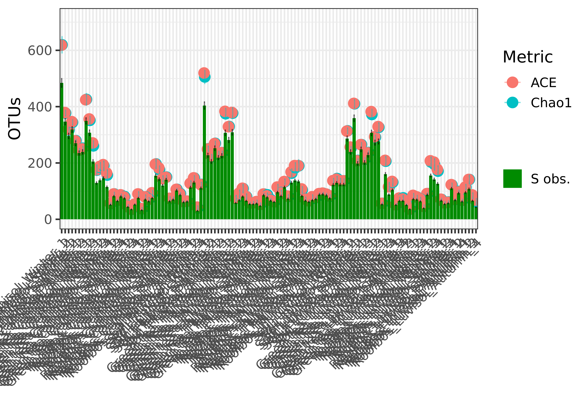
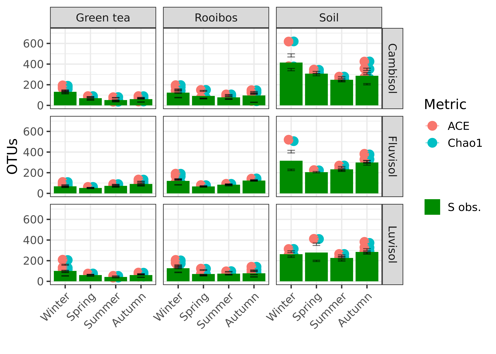
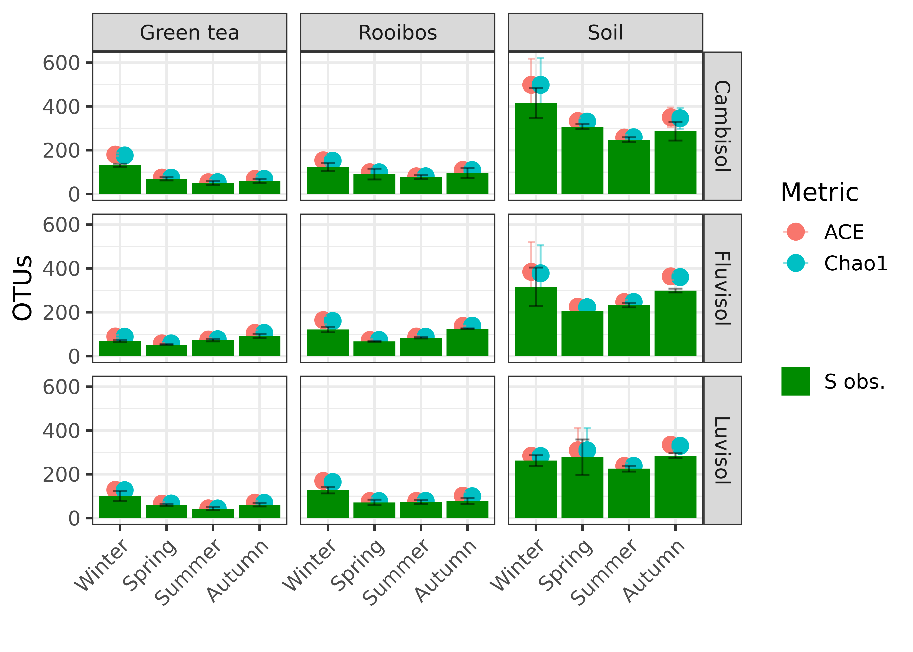
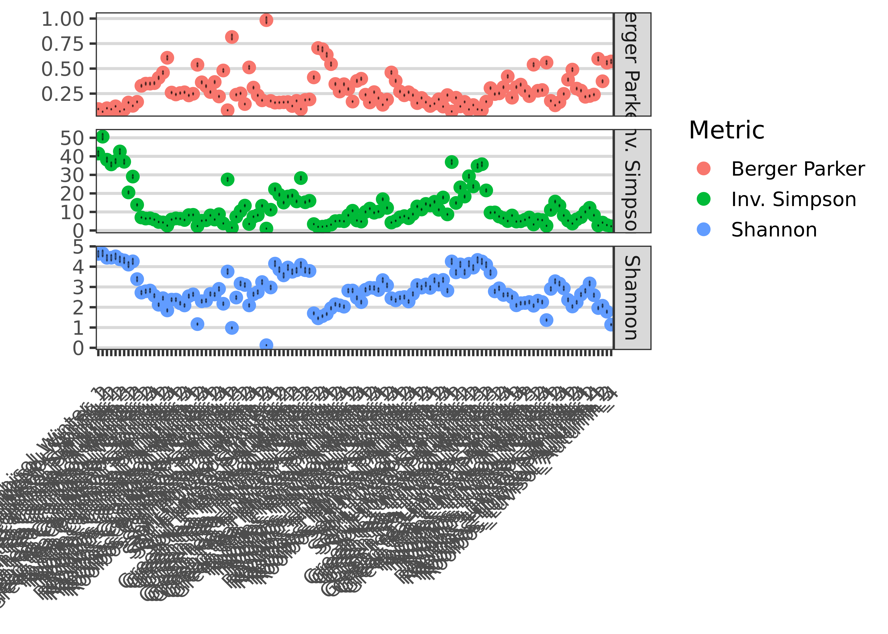
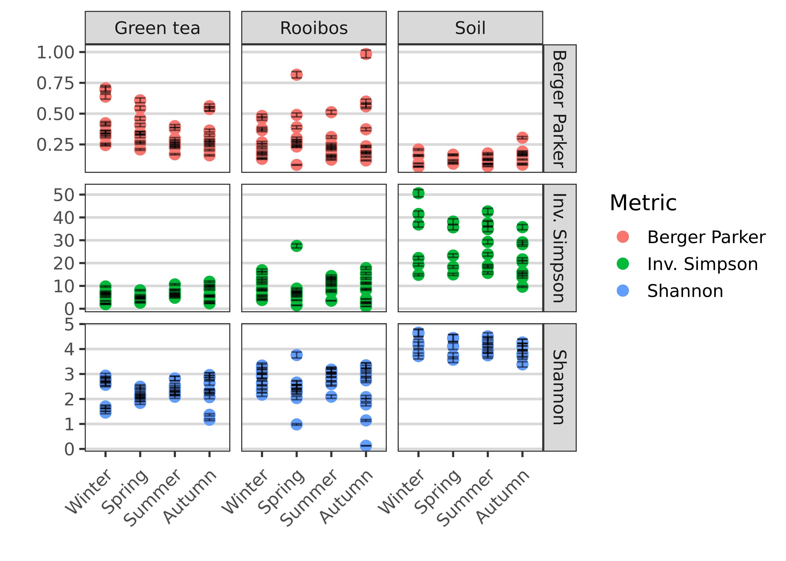
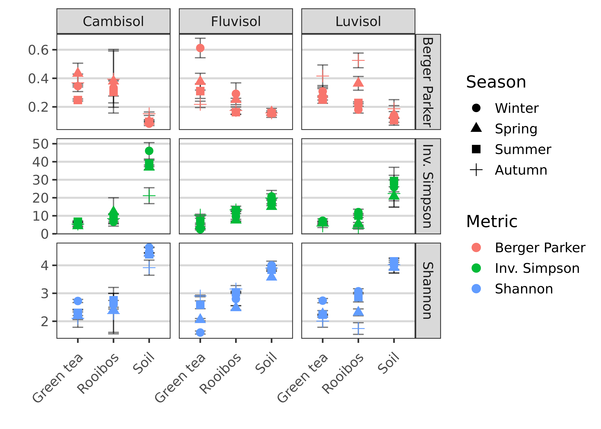

[roey.angel@bc.cas.cz](mailto: roey.angel@bc.cas.cz)  

## Alpha diversity analysis
This analysis explores the alpha-diversity ditribution patters in the different samples, based on the DADA2-produced sequences. 

### Setting general parameters:

```r
set.seed(1000)
subsamples <- 10
min_lib_size <- 5000
metadata_path <- "./"
data_path <- "./DADA2_pseudo/"
Ps_file <- "TeaTime4Schools_ITS_filt.RDS"
Proj_name <- "TeaTime4Schools"
```

### Load phyloseq object
This phyloseq object was created in [05_Taxonomical_analysis.html](05_Taxonomical_analysis.html). 
The Ps_obj_filt object excludes contaminants and all sequences classified as eukaryota, chloroplast, mitochondria or unknown but still includes taxa with low prevalence 

```r
Ps_obj_filt <- readRDS(file = paste0(data_path, Ps_file))
Ps_obj_filt %>%
  subset_samples(., sample_sums(Ps_obj_filt) > min_lib_size) %>% # drop samples below min_lib_size
  subset_samples(., Field != "Unburied") %>% # drop unburied samples
  filter_taxa(., function(x)
    sum(x) > 0, TRUE) -> # remove taxa with 0 abundance
  Ps_obj_filt_subset

Ps_obj_filt_subset %>% 
  sample_data() %>% 
  mutate_at(., "Sample.type", 
            ~fct_relevel(., levels = c("Soil", "Green tea", "Rooibos"))) %>% 
  mutate_at(., "Season", 
            ~fct_relevel(., levels = c("Winter", "Spring", "Summer", "Autumn"))) %>% 
  arrange(Field, Sample.type, Season, Replicate) %>% 
  pull(Description) %>% 
  as.character() ->
  Sample.order
```

### Richness

```r
# tic()
abundance_mat <- as(otu_table(Ps_obj_filt_subset), "matrix") # use Ps_obj_filt_subset - no contaminants, no euk, chloro, mito, unknowns
## Original data
Original <-
  data.frame(Reads = rowSums(abundance_mat),
             S = apply(abundance_mat, 1, function(x)
               sum(x > 0)))

# Assign rarefaction mat  
rarefaction_mat <- 
  matrix(0, nrow = nrow(abundance_mat), ncol = subsamples)
rownames(rarefaction_mat) <- rownames(abundance_mat)

# Declare richness est table
rich.ests <-
  list(
  S.obs = rarefaction_mat,
  S.chao1 = rarefaction_mat,
  se.chao1 = rarefaction_mat,
  S.ACE = rarefaction_mat,
  se.ACE = rarefaction_mat
  )

# Rarefy abundance_mat and calc estimates
for (i in seq(subsamples)) {
  sub.OTUmat <-
    rrarefy(abundance_mat, min(rowSums(abundance_mat)))
    # rrarefy(abundance_mat, quantile(rowSums(abundance_mat), probs = seq(0, 1, rare2quant))[2])
  for (j in seq(length(rich.ests))) {
    rich.ests[[j]][, i] <- t(estimateR(sub.OTUmat))[, j]
  }
}

# Calculate means and SEM of subsamples
Richness <- data.frame(row.names = row.names(rich.ests[[1]]))
for (i in c(1, seq(2, length(rich.ests), 2))) {
  S <- apply(rich.ests[[i]], 1, mean)
  if (i == 1) {
    se <-
      apply(rich.ests[[i]], 1, function(x)
        (mean(x) / sqrt(length(x))))
  } else
    se <- apply(rich.ests[[i + 1]], 1, mean)
  Richness <- cbind(Richness, S, se)
}
colnames(Richness) <-
  c("S.obs.Estimate",
    "S.obs.SE",
    "S.chao1.Estimate",
    "S.chao1.SE",
    "S.ACE.Estimate",
    "S.ACE.SE")

## Parametric richness estimates
## DOESN'T WORK WITH DADA2 SINCE SINGLETONS ARE REMOVED
# # convert to list
# abundance_mat_freqs <- apply(abundance_mat, 1, table)
# # declare results table
# parametric <-
#   data.frame(matrix(0, nrow = nrow(abundance_mat), ncol = 4),
#              row.names = rownames(abundance_mat))
# colnames(parametric) <-
#   c("bway.est", "bway.se", "bway_nof1.est", "bway_nof1.se")
# # calc parametric estimates
# for (i in seq(length(abundance_mat_freqs))) {
#   possibleError <-
#     tryCatch(
#       breakaway.mod <-
#         breakaway(
#           data.frame(abundance_mat_freqs[[i]])[-1, ],
#           print = FALSE,
#           plot = FALSE,
#           answers = TRUE
#         ),
#       error = function(e)
#         e
#     )
#   if (is.null(breakaway.mod)) {
#     parametric[i, 1] <- 0
#     parametric[i, 2] <- 0
#   } else {
#     parametric[i, 1] <- breakaway.mod$est
#     parametric[i, 2] <- breakaway.mod$seest
#   }
#   
#   possibleError <-
#     tryCatch(
#       breakaway_nof1.mod <-
#         breakaway_nof1(
#           data.frame(abundance_mat_freqs[[i]])[-c(1, 2), ],
#           print = FALSE,
#           plot = FALSE,
#           answers = TRUE
#         ),
#       error = function(e)
#         e
#     )
#   if (is.null(breakaway_nof1.mod)) {
#     parametric[i, 3] <- 0
#     parametric[i, 4] <- 0
#   } else {
#     parametric[i, 3] <- breakaway_nof1.mod$est
#     parametric[i, 4] <- breakaway_nof1.mod$seest
#   }
# }
```

Merge tables and save richness results

```r
# Richness.Table <- cbind(Richness, parametric)
# Richness.Table <- Richness # only
saveRDS(cbind(Original, Richness),
        file = paste0(Proj_name, "_Richness.RDS"))
write.csv(cbind(Original, Richness),
        file = paste0(Proj_name, "_Richness.csv"))
```

#### Plot richness estimates

```r
Richness %>% 
  rownames_to_column(var = "Sample") %>% # get sample names
  mutate_at(., "Sample", ~str_replace_all(., "Green_tea", "Green tea")) %>% #
  mutate_at(., "Sample", as.factor)  %>% 
  mutate_at(., "Sample", ~fct_relevel(., levels = Sample.order)) %>% 
  bind_cols(., get_variable(Ps_obj_filt_subset, 
                            c("Lib.size", "Field", "Sample.type", "Season", "Replicate"))) %>% # add metadata
  pivot_longer(cols = c(-"Sample", -"Lib.size", -"Field", -"Sample.type", -"Season", -"Replicate"), 
               names_to = c("Metric", ".value"), 
               values_to = c("Estimate", "SE"), 
               names_pattern = "(.*\\..*)\\.(.*)") %>% # gather all metrices to one column
  mutate_at(., "Metric", ~fct_recode(., `Observed S` = "S.obs", Chao1 = "S.chao1", ACE = "S.ACE")) %>% 
  mutate(Estimate, herr = Estimate + SE, lerr = Estimate - SE) ->
  Richness_long

PlotSummarySingle_overlay(Richness_long)
```

<!-- -->

```r
fit <- lm(Estimate ~ Lib.size, 
                        data = Richness_long[Richness_long$Metric == "Observed S", ])
fit$model$Sample <- str_replace(Richness_long[Richness_long$Metric == "Observed S", ]$Sample, "(.*)_[0-9]$", "\\1")

ggplot(fit$model, aes_string(x = names(fit$model)[2], y = names(fit$model)[1])) + 
  geom_point(aes(colour = fit$model$Sample)) +
  stat_smooth(method = "lm", col = "red") +
  labs(title = paste("Adj R2 = ",signif(summary(fit)$adj.r.squared, 5),
                     "; Intercept =",signif(fit$coef[[1]], 5),
                     "; Slope =",signif(fit$coef[[2]], 5),
                     "; P =",signif(summary(fit)$coef[2,4], 5))) +
  theme(plot.title = element_text(size = 8)) + 
  theme(legend.position = "none")
```

<!-- -->

```r
PlotSummarySingle_overlay(x = "Season", Richness_long) + 
  facet_grid(Field ~ Sample.type) 
```

<!-- -->

Combine replicates

```r
Richness_long %>%
  group_by(Field, Season, Sample.type, Metric) %>%
  summarise(
    Mean = mean(Estimate),
    lerr = Mean - (sd(Estimate)) / sqrt(length(Estimate)),
    herr = Mean + (sd(Estimate)) / sqrt(length(Estimate))
  ) ->
  Combined_Richness_long

# plot
PlotSummarySingle_overlay(x = "Season", y = "Mean", Combined_Richness_long) + 
  facet_grid(Field ~ Sample.type) 
```

<!-- -->

### Diversity

```r
# calculate diversity indices
# declare diversity indices table
diversity.inds <-
  list(Shannon = rarefaction_mat,
       inv.simpson = rarefaction_mat,
       BP = rarefaction_mat)
# rarefy abundance_mat and calc estimates
for (i in seq(subsamples)) {
  sub.OTUmat <-
    rrarefy(abundance_mat, min(rowSums(abundance_mat)))
    # rrarefy(abundance_mat, quantile(rowSums(abundance_mat), probs = seq(0, 1, rare2quant))[2])
  diversity.inds$Shannon[, i] <-
    diversityresult(sub.OTUmat,
                    index = 'Shannon' ,
                    method = 'each site',
                    digits = 3)[, 1]
  diversity.inds$inv.simpson[, i] <-
    diversityresult(sub.OTUmat,
                    index = 'inverseSimpson' ,
                    method = 'each site',
                    digits = 3)[, 1]
  diversity.inds$BP[, i] <-
    diversityresult(sub.OTUmat,
                    index = 'Berger' ,
                    method = 'each site',
                    digits = 3)[, 1]
}
# calculate means and SEM of subsamples
Diversity <-
  data.frame(row.names = row.names(diversity.inds[[1]]))
for (i in seq(length(diversity.inds))) {
  S <- apply(diversity.inds[[i]], 1, mean)
  se <-
    apply(diversity.inds[[i]], 1, function(x)
      (mean(x) / sqrt(length(x))))
  Diversity <- cbind(Diversity, S, se)
}
colnames(Diversity) <-
  c("Shannon.Estimate",
    "Shannon.SE",
    "InvSimpson.Estimate",
    "InvSimpson.SE",
    "BP.Estimate",
    "BP.SE")
```

Save diversity results

```r
saveRDS(Diversity, file = paste0(Proj_name, "_Diversity.RDS"))
write.csv(Diversity, file = paste0(Proj_name, "_Diversity.csv"))
```

Plot diversity indices

```r
Diversity %>% 
  rownames_to_column(var = "Sample") %>% # get sample names
  mutate_at(., "Sample", ~str_replace_all(., "Green_tea", "Green tea")) %>% #
  mutate_at(., "Sample", as.factor)  %>% 
  mutate_at(., "Sample", ~fct_relevel(., levels = Sample.order)) %>% 
  bind_cols(., get_variable(Ps_obj_filt_subset, 
                            c("Lib.size", "Field", "Sample.type", "Season", "Replicate"))) %>% # add metadata
  pivot_longer(cols = c(-"Sample", -"Lib.size", -"Field", -"Sample.type", -"Season", -"Replicate"), 
               names_to = c("Metric", ".value"), 
               values_to = c("Estimate", "SE"), 
               names_pattern = "(.*)\\.(.*)") %>% # gather all metrices to one column
  mutate_at(., "Metric", ~fct_recode(., "Inv. Simpson" = "InvSimpson", "Berger Parker" = "BP")) %>% 
  mutate(Estimate, herr = Estimate + SE, lerr = Estimate - SE) ->
  Diversity_long

PlotSummarySingle(Diversity_long, y = "Estimate", colour = "Metric") + 
  background_grid(major = "y", minor = "none", size.major = 0.8) 
```

<!-- -->

```r
PlotSummarySingle(Diversity_long, x = "Season", y = "Estimate", colour = "Metric") + 
  facet_grid(Metric ~ Sample.type, scale = "free") + 
  background_grid(major = "y", minor = "none", size.major = 0.8)
```

<!-- -->

Combine replicates

```r
Diversity_long %>%
  group_by(Field, Season, Sample.type, Metric) %>%
  summarise(
    Mean = mean(Estimate),
    lerr = Mean - (sd(Estimate)) / sqrt(length(Estimate)),
    herr = Mean + (sd(Estimate)) / sqrt(length(Estimate))
  ) ->
  Combined_Diversity_long

# plot
p <- PlotSummarySingle(Combined_Diversity_long, x = "Sample.type", y = "Mean", colour = "Metric") 
p$layers[[1]] <- NULL
p +
  geom_point(aes_string(colour = "Metric", shape = "Season"), size = 3) +
  facet_grid(Metric ~ Field, scales = "free") + 
  background_grid(major = "y", minor = "none", size.major = 0.8) 
```

<!-- -->


<!-- -->


```r
Richness_Diversity_long_sub <- Richness_Diversity_long[Richness_Diversity_long$Metric == "Observed S", ] 
TestAlphaV2(Richness_Diversity_long_sub)
```

```
## 
## DV:  Estimate 
## Observations:  121 
## D:  1 
## MS total:  1230 
## 
##                     Df Sum Sq    H p.value
## Sample.type          2  90300 73.4   0.000
## Season               3  16086 13.1   0.004
## Sample.type:Season   6   2175  1.8   0.940
## Residuals          109  39056
```

<div class="kable-table">

<table>
 <thead>
  <tr>
   <th style="text-align:left;">   </th>
   <th style="text-align:right;"> Df </th>
   <th style="text-align:right;"> Sum Sq </th>
   <th style="text-align:right;"> H </th>
   <th style="text-align:right;"> p.value </th>
  </tr>
 </thead>
<tbody>
  <tr>
   <td style="text-align:left;"> Sample.type </td>
   <td style="text-align:right;"> 2 </td>
   <td style="text-align:right;"> 90300 </td>
   <td style="text-align:right;"> 73.41 </td>
   <td style="text-align:right;"> 0.000 </td>
  </tr>
  <tr>
   <td style="text-align:left;"> Season </td>
   <td style="text-align:right;"> 3 </td>
   <td style="text-align:right;"> 16086 </td>
   <td style="text-align:right;"> 13.08 </td>
   <td style="text-align:right;"> 0.004 </td>
  </tr>
  <tr>
   <td style="text-align:left;"> Sample.type:Season </td>
   <td style="text-align:right;"> 6 </td>
   <td style="text-align:right;"> 2175 </td>
   <td style="text-align:right;"> 1.77 </td>
   <td style="text-align:right;"> 0.940 </td>
  </tr>
  <tr>
   <td style="text-align:left;"> Residuals </td>
   <td style="text-align:right;"> 109 </td>
   <td style="text-align:right;"> 39056 </td>
   <td style="text-align:right;"> NA </td>
   <td style="text-align:right;"> NA </td>
  </tr>
</tbody>
</table>

</div>

```r
Richness_Diversity_long_sub <- Richness_Diversity_long[Richness_Diversity_long$Metric == "Shannon", ] 
TestAlphaV2(Richness_Diversity_long_sub)
```

```
## Call:
##    aov(formula = as.formula(paste(response_name, paste(factor_names[1], 
##     factor_names[2], factor_names[3], sep = " * "), sep = " ~ ")), 
##     data = data2test)
## 
## Terms:
##                 Sample.type Season Field Sample.type:Season Sample.type:Field
## Sum of Squares         59.2    2.2   0.2                0.9               2.4
## Deg. of Freedom           2      3     2                  6                 4
##                 Season:Field Sample.type:Season:Field Residuals
## Sum of Squares           6.2                      3.4      16.8
## Deg. of Freedom            6                       12        85
## 
## Residual standard error: 0.444
## Estimated effects may be unbalanced
```

<!-- -->

```
## [1] "Unequal group sizes - showing SS type III"
## Anova Table (Type III tests)
## 
## Response: Estimate
##                          Sum Sq Df F value  Pr(>F)    
## (Intercept)                33.7  1  170.83 < 2e-16 ***
## Sample.type                 1.8  2    4.57 0.01309 *  
## Season                      4.0  3    6.76 0.00038 ***
## Field                       1.9  2    4.90 0.00969 ** 
## Sample.type:Season          2.0  6    1.70 0.13191    
## Sample.type:Field           2.1  4    2.70 0.03570 *  
## Season:Field                5.7  6    4.79 0.00030 ***
## Sample.type:Season:Field    3.4 12    1.45 0.16158    
## Residuals                  16.8 85                    
## ---
## Signif. codes:  0 '***' 0.001 '**' 0.01 '*' 0.05 '.' 0.1 ' ' 1
## Tables of means
## Grand mean
##      
## 2.86 
## 
##  Sample.type 
##     Green tea Rooibos  Soil
##          2.31    2.62  4.06
## rep     45.00   46.00 30.00
## 
##  Season 
##     Autumn Spring Summer Winter
##       2.76    2.7   3.01   2.99
## rep  33.00   28.0  30.00  30.00
## 
##  Field 
##     Auboden Braunerde Kolluvisol
##         2.9      2.89       2.81
## rep    42.0     41.00      38.00
## 
##  Sample.type:Season 
##            Season
## Sample.type Autumn Spring Summer Winter
##   Green tea  2.34   2.16   2.40   2.35 
##   rep       12.00  11.00  10.00  12.00 
##   Rooibos    2.39   2.40   2.88   2.82 
##   rep       12.00  11.00  11.00  12.00 
##   Soil       3.94   3.98   4.13   4.21 
##   rep        9.00   6.00   9.00   6.00 
## 
##  Sample.type:Field 
##            Field
## Sample.type Auboden Braunerde Kolluvisol
##   Green tea  2.29    2.33      2.33     
##   rep       16.00   16.00     13.00     
##   Rooibos    2.87    2.50      2.49     
##   rep       16.00   15.00     15.00     
##   Soil       3.85    4.31      4.02     
##   rep       10.00   10.00     10.00     
## 
##  Season:Field 
##         Field
## Season   Auboden Braunerde Kolluvisol
##   Autumn  3.24    2.62      2.41     
##   rep    11.00   11.00     11.00     
##   Spring  2.61    2.82      2.68     
##   rep    10.00    9.00      9.00     
##   Summer  3.06    2.99      2.96     
##   rep    11.00   11.00      8.00     
##   Winter  2.62    3.15      3.20     
##   rep    10.00   10.00     10.00     
## 
##  Sample.type:Season:Field 
## , , Field = Auboden
## 
##            Season
## Sample.type Autumn Spring Summer Winter
##   Green tea 2.90   2.06   2.59   1.60  
##   rep       4.00   4.00   4.00   4.00  
##   Rooibos   3.15   2.48   3.04   2.80  
##   rep       4.00   4.00   4.00   4.00  
##   Soil      3.90   3.64   3.84   4.00  
##   rep       3.00   2.00   3.00   2.00  
## 
## , , Field = Braunerde
## 
##            Season
## Sample.type Autumn Spring Summer Winter
##   Green tea 2.11   2.20   2.30   2.72  
##   rep       4.00   4.00   4.00   4.00  
##   Rooibos   2.27   2.41   2.75   2.59  
##   rep       4.00   3.00   4.00   4.00  
##   Soil      3.92   4.44   4.39   4.64  
##   rep       3.00   2.00   3.00   2.00  
## 
## , , Field = Kolluvisol
## 
##            Season
## Sample.type Autumn Spring Summer Winter
##   Green tea 2.00   2.27   2.23   2.74  
##   rep       4.00   3.00   2.00   4.00  
##   Rooibos   1.74   2.32   2.86   3.08  
##   rep       4.00   4.00   3.00   4.00  
##   Soil      4.02   3.88   4.14   3.99  
##   rep       3.00   2.00   3.00   2.00
```

```
## Call:
##    aov(formula = as.formula(paste(response_name, paste(factor_names[1], 
##     factor_names[2], factor_names[3], sep = " * "), sep = " ~ ")), 
##     data = data2test)
## 
## Terms:
##                 Sample.type Season Field Sample.type:Season Sample.type:Field
## Sum of Squares         59.2    2.2   0.2                0.9               2.4
## Deg. of Freedom           2      3     2                  6                 4
##                 Season:Field Sample.type:Season:Field Residuals
## Sum of Squares           6.2                      3.4      16.8
## Deg. of Freedom            6                       12        85
## 
## Residual standard error: 0.444
## Estimated effects may be unbalanced
```

```r
Richness_Diversity_long_sub <- Richness_Diversity_long[Richness_Diversity_long$Metric == "Inv. Simpson", ] 
TestAlphaV2(Richness_Diversity_long_sub)
```

```
## 
## DV:  Estimate 
## Observations:  121 
## D:  1 
## MS total:  1230 
## 
##                     Df Sum Sq    H p.value
## Sample.type          2  83741 68.1   0.000
## Season               3   4559  3.7   0.295
## Sample.type:Season   6   2390  1.9   0.925
## Residuals          109  56931
```

<div class="kable-table">

<table>
 <thead>
  <tr>
   <th style="text-align:left;">   </th>
   <th style="text-align:right;"> Df </th>
   <th style="text-align:right;"> Sum Sq </th>
   <th style="text-align:right;"> H </th>
   <th style="text-align:right;"> p.value </th>
  </tr>
 </thead>
<tbody>
  <tr>
   <td style="text-align:left;"> Sample.type </td>
   <td style="text-align:right;"> 2 </td>
   <td style="text-align:right;"> 83741 </td>
   <td style="text-align:right;"> 68.07 </td>
   <td style="text-align:right;"> 0.000 </td>
  </tr>
  <tr>
   <td style="text-align:left;"> Season </td>
   <td style="text-align:right;"> 3 </td>
   <td style="text-align:right;"> 4559 </td>
   <td style="text-align:right;"> 3.71 </td>
   <td style="text-align:right;"> 0.295 </td>
  </tr>
  <tr>
   <td style="text-align:left;"> Sample.type:Season </td>
   <td style="text-align:right;"> 6 </td>
   <td style="text-align:right;"> 2390 </td>
   <td style="text-align:right;"> 1.94 </td>
   <td style="text-align:right;"> 0.925 </td>
  </tr>
  <tr>
   <td style="text-align:left;"> Residuals </td>
   <td style="text-align:right;"> 109 </td>
   <td style="text-align:right;"> 56931 </td>
   <td style="text-align:right;"> NA </td>
   <td style="text-align:right;"> NA </td>
  </tr>
</tbody>
</table>

</div>

```r
Richness_Diversity_long_sub <- Richness_Diversity_long[Richness_Diversity_long$Metric == "Berger Parker", ] 
TestAlphaV2(Richness_Diversity_long_sub)
```

```
## Call:
##    aov(formula = as.formula(paste(response_name, paste(factor_names[1], 
##     factor_names[2], factor_names[3], sep = " * "), sep = " ~ ")), 
##     data = data2test)
## 
## Terms:
##                 Sample.type Season Field Sample.type:Season Sample.type:Field
## Sum of Squares        0.855  0.131 0.013              0.130             0.185
## Deg. of Freedom           2      3     2                  6                 4
##                 Season:Field Sample.type:Season:Field Residuals
## Sum of Squares         0.408                    0.146     1.421
## Deg. of Freedom            6                       12        85
## 
## Residual standard error: 0.129
## Estimated effects may be unbalanced
```

<!-- -->

```
## [1] "Unequal group sizes - showing SS type III"
## Anova Table (Type III tests)
## 
## Response: Estimate
##                          Sum Sq Df F value  Pr(>F)    
## (Intercept)                7.72  1  462.14 < 2e-16 ***
## Sample.type                0.79  2   23.72 6.5e-09 ***
## Season                     0.12  3    2.36  0.0775 .  
## Field                      0.00  2    0.13  0.8816    
## Sample.type:Season         0.13  6    1.32  0.2582    
## Sample.type:Field          0.19  4    2.78  0.0319 *  
## Season:Field               0.31  6    3.06  0.0092 ** 
## Sample.type:Season:Field   0.15 12    0.73  0.7202    
## Residuals                  1.42 85                    
## ---
## Signif. codes:  0 '***' 0.001 '**' 0.01 '*' 0.05 '.' 0.1 ' ' 1
## Tables of means
## Grand mean
##      
## 0.28 
## 
##  Sample.type 
##     Green tea Rooibos   Soil
##         0.354   0.299  0.139
## rep    45.000  46.000 30.000
## 
##  Season 
##     Autumn Spring Summer Winter
##      0.303  0.299  0.223  0.292
## rep 33.000 28.000 30.000 30.000
## 
##  Field 
##     Auboden Braunerde Kolluvisol
##       0.266     0.291      0.282
## rep  42.000    41.000     38.000
## 
##  Sample.type:Season 
##            Season
## Sample.type Autumn Spring Summer Winter
##   Green tea  0.33   0.37   0.27   0.42 
##   rep       12.00  11.00  10.00  12.00 
##   Rooibos    0.36   0.33   0.23   0.27 
##   rep       12.00  11.00  11.00  12.00 
##   Soil       0.17   0.14   0.12   0.13 
##   rep        9.00   6.00   9.00   6.00 
## 
##  Sample.type:Field 
##            Field
## Sample.type Auboden Braunerde Kolluvisol
##   Green tea  0.38    0.35      0.32     
##   rep       16.00   16.00     13.00     
##   Rooibos    0.22    0.35      0.33     
##   rep       16.00   15.00     15.00     
##   Soil       0.16    0.11      0.14     
##   rep       10.00   10.00     10.00     
## 
##  Season:Field 
##         Field
## Season   Auboden Braunerde Kolluvisol
##   Autumn  0.19    0.32      0.40     
##   rep    11.00   11.00     11.00     
##   Spring  0.28    0.33      0.28     
##   rep    10.00    9.00      9.00     
##   Summer  0.22    0.23      0.21     
##   rep    11.00   11.00      8.00     
##   Winter  0.39    0.27      0.22     
##   rep    10.00   10.00     10.00     
## 
##  Sample.type:Season:Field 
## , , Field = Auboden
## 
##            Season
## Sample.type Autumn Spring Summer Winter
##   Green tea 0.22   0.38   0.31   0.61  
##   rep       4.00   4.00   4.00   4.00  
##   Rooibos   0.17   0.25   0.16   0.29  
##   rep       4.00   4.00   4.00   4.00  
##   Soil      0.16   0.19   0.16   0.16  
##   rep       3.00   2.00   3.00   2.00  
## 
## , , Field = Braunerde
## 
##            Season
## Sample.type Autumn Spring Summer Winter
##   Green tea 0.37   0.43   0.25   0.35  
##   rep       4.00   4.00   4.00   4.00  
##   Rooibos   0.39   0.38   0.30   0.33  
##   rep       4.00   3.00   4.00   4.00  
##   Soil      0.15   0.10   0.10   0.08  
##   rep       3.00   2.00   3.00   2.00  
## 
## , , Field = Kolluvisol
## 
##            Season
## Sample.type Autumn Spring Summer Winter
##   Green tea 0.42   0.29   0.25   0.31  
##   rep       4.00   3.00   2.00   4.00  
##   Rooibos   0.53   0.36   0.23   0.18  
##   rep       4.00   4.00   3.00   4.00  
##   Soil      0.19   0.13   0.11   0.14  
##   rep       3.00   2.00   3.00   2.00
```

```
## Call:
##    aov(formula = as.formula(paste(response_name, paste(factor_names[1], 
##     factor_names[2], factor_names[3], sep = " * "), sep = " ~ ")), 
##     data = data2test)
## 
## Terms:
##                 Sample.type Season Field Sample.type:Season Sample.type:Field
## Sum of Squares        0.855  0.131 0.013              0.130             0.185
## Deg. of Freedom           2      3     2                  6                 4
##                 Season:Field Sample.type:Season:Field Residuals
## Sum of Squares         0.408                    0.146     1.421
## Deg. of Freedom            6                       12        85
## 
## Residual standard error: 0.129
## Estimated effects may be unbalanced
```
